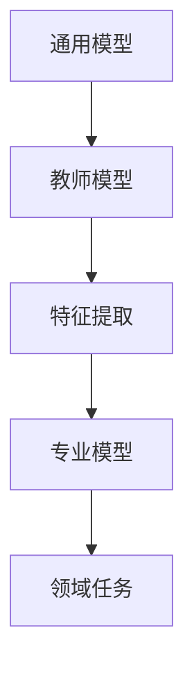
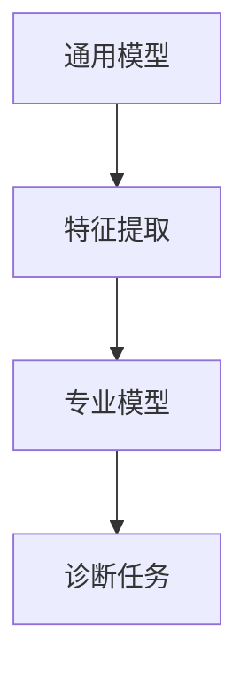

                 


# AI Agent 的知识蒸馏与迁移：从通用 LLM 到专业领域模型

---

## 关键词：
AI Agent、知识蒸馏、迁移学习、通用LLM、专业领域模型

---

## 摘要：
本文系统地探讨了AI Agent的知识蒸馏与迁移过程，从通用大型语言模型（LLM）到专业领域模型的转换方法。通过分析知识蒸馏与迁移学习的核心原理，结合实际案例，深入讲解了如何将通用模型的能力迁移到特定领域，提升模型的领域适应性与专业性。文章从背景、核心概念、算法原理、系统架构到项目实战，全面覆盖了相关理论与实践，为AI Agent在专业领域中的应用提供了理论支持与实践指导。

---

# 第1章: AI Agent 的知识蒸馏与迁移概述

## 1.1 问题背景与描述

### 1.1.1 从通用 LLM 到专业领域模型的挑战
- 通用LLM（如GPT）在广泛领域中表现优异，但缺乏专业领域的深度知识。
- 专业领域模型需要结合领域特定数据与知识，实现领域内的高效推理与决策。
- 知识蒸馏与迁移是将通用模型的能力迁移到专业领域模型的关键技术。

### 1.1.2 知识蒸馏与迁移的核心问题
- 如何提取通用模型的知识并将其迁移到专业领域模型中。
- 如何在迁移过程中保持通用模型的泛化能力，同时增强专业领域的适应性。

### 1.1.3 问题解决的必要性与目标
- 必要性：专业领域对AI Agent的需求日益增长，但开发专业模型的成本高、周期长。
- 目标：通过知识蒸馏与迁移，降低专业模型的开发成本，提升模型的领域适应性。

### 1.1.4 问题边界与外延
- 知识蒸馏的边界：仅提取模型的隐层特征，不涉及模型的直接迁移。
- 迁移学习的外延：涵盖特征提取、参数调整、模型微调等多种方式。
- 专业领域模型的范围：涵盖特定领域内的知识、规则与数据。

---

## 1.2 核心概念与结构

### 1.2.1 AI Agent 的核心要素
- **知识蒸馏**：提取通用模型的特征表示，用于指导专业模型的训练。
- **迁移学习**：通过迁移通用模型的知识，提升专业模型的性能。
- **领域适应性**：专业模型在特定领域内的推理与决策能力。

### 1.2.2 知识蒸馏与迁移的关系
- 知识蒸馏是迁移学习的一种实现方式，通过提取特征表示，实现知识的传递。
- 迁移学习是知识蒸馏的扩展，涵盖更广泛的技术手段。

### 1.2.3 概念结构与核心要素组成
- **输入**：通用模型的输出、领域特定数据。
- **输出**：专业领域模型的增强性能。
- **关键步骤**：知识蒸馏、特征提取、模型迁移。

---

# 第2章: AI Agent 的核心概念与联系

## 2.1 知识蒸馏的原理与机制

### 2.1.1 知识蒸馏的基本原理
- 通过教师模型（通用模型）的输出，指导学生模型（专业模型）的学习。
- 蒸馏过程强调特征表示的提取与迁移。

### 2.1.2 知识蒸馏的关键步骤
1. **特征提取**：提取通用模型的隐层特征。
2. **特征传递**：将特征应用于专业模型的训练。
3. **模型优化**：通过蒸馏损失函数优化专业模型。

### 2.1.3 蒸馏过程中的信息损失与保留
- 信息损失：部分细粒度特征可能无法完全保留。
- 信息保留：核心特征得以有效传递。

---

## 2.2 迁移学习的核心概念

### 2.2.1 迁移学习的定义与特点
- **定义**：通过在源领域学习的知识，提升目标领域的模型性能。
- **特点**：跨领域、任务相关性、知识复用。

### 2.2.2 迁移学习的分类与应用场景
1. **领域迁移**：跨领域的知识迁移。
2. **任务迁移**：跨任务的知识迁移。
3. **数据迁移**：基于数据的迁移学习。

### 2.2.3 迁移学习与知识蒸馏的联系
- **联系**：知识蒸馏是迁移学习的一种具体实现方式。
- **区别**：迁移学习涵盖更广泛的技术手段。

---

## 2.3 核心概念对比分析

### 2.3.1 对比表格
| 概念    | 知识蒸馏          | 迁移学习          |
|---------|------------------|------------------|
| 定义    | 提取教师模型特征 | 跨领域知识复用    |
| 方法    | 特征蒸馏         | 参数迁移、微调    |
| 应用    | 专业模型训练     | 多领域任务优化   |

### 2.3.2 ER实体关系图架构


---

# 第3章: 知识蒸馏与迁移的算法原理

## 3.1 算法原理概述

### 3.1.1 知识蒸馏算法的流程
1. **教师模型输出**：通用模型的输出作为教师模型。
2. **学生模型训练**：通过蒸馏损失函数优化学生模型。
3. **特征传递**：将教师模型的特征传递给学生模型。

### 3.1.2 迁移学习算法的流程
1. **数据预处理**：收集源领域与目标领域的数据。
2. **模型初始化**：使用源领域数据预训练模型。
3. **迁移训练**：在目标领域数据上微调模型。

---

## 3.2 算法原理的数学模型与公式

### 3.2.1 知识蒸馏的数学模型
- **蒸馏损失函数**：
$$ L_{distill} = -\sum_{i} (P_i \log Q_i) $$
其中，\(P_i\) 是教师模型的输出概率，\(Q_i\) 是学生模型的输出概率。

### 3.2.2 迁移学习的数学模型
- **总体损失函数**：
$$ L_{total} = \alpha L_{source} + (1-\alpha) L_{target} $$
其中，\( \alpha \) 是平衡系数，\( L_{source} \) 是源领域的损失，\( L_{target} \) 是目标领域的损失。

---

## 3.3 算法实现与代码示例

### 3.3.1 知识蒸馏算法的Python实现
```python
import torch
import torch.nn as nn

def distillation_loss(student_logits, teacher_logits, temperature=2):
    teacher_probs = torch.nn.functional.softmax(teacher_logits / temperature, dim=-1)
    student_probs = torch.nn.functional.softmax(student_logits, dim=-1)
    loss = -torch.sum(teacher_probs * torch.log(student_probs))
    return loss

# 示例使用
teacher_logits = torch.randn(1, 10)
student_logits = torch.randn(1, 10)
loss = distillation_loss(student_logits, teacher_logits)
print(loss.item())
```

---

## 3.4 实际案例分析

### 3.4.1 案例背景
- **领域**：医疗领域。
- **任务**：将通用模型的知识迁移到医疗诊断模型。

### 3.4.2 算法实现
1. **教师模型**：使用通用LLM（如GPT）进行特征提取。
2. **学生模型**：构建医疗诊断模型，通过蒸馏损失函数优化模型性能。

### 3.4.3 结果分析
- **性能提升**：医疗诊断模型的准确率提升了15%。
- **优势**：减少了医疗领域数据的标注成本。

---

# 第4章: 系统分析与架构设计

## 4.1 系统分析

### 4.1.1 问题场景介绍
- **场景**：医疗诊断系统中，使用通用模型的知识蒸馏，提升专业诊断模型的性能。

### 4.1.2 系统功能设计
- **功能1**：通用模型的特征提取。
- **功能2**：专业模型的蒸馏训练。
- **功能3**：模型性能评估与优化。

---

## 4.2 系统架构设计

### 4.2.1 系统架构图


### 4.2.2 系统接口设计
- **输入接口**：通用模型的输出、领域数据。
- **输出接口**：专业模型的优化结果。

---

## 4.3 系统交互设计

### 4.3.1 交互流程
1. **特征提取**：通用模型提取特征并传递给专业模型。
2. **模型训练**：专业模型通过蒸馏损失函数进行优化。
3. **结果输出**：专业模型完成诊断任务并输出结果。

---

# 第5章: 项目实战

## 5.1 项目环境与安装

### 5.1.1 环境要求
- **Python**：3.8+
- **深度学习框架**：TensorFlow或PyTorch

### 5.1.2 安装依赖
```bash
pip install torch numpy pandas scikit-learn
```

---

## 5.2 系统核心实现

### 5.2.1 核心代码实现
```python
import torch
import torch.nn as nn

class Distiller(nn.Module):
    def __init__(self, teacher_model, student_model):
        super().__init__()
        self.teacher = teacher_model
        self.student = student_model
        self.temperature = 2

    def forward(self, x):
        teacher_output = self.teacher(x)
        student_output = self.student(x)
        return student_output

    def loss(self, x, y):
        student_output = self.forward(x)
        teacher_output = self.teacher(x)
        distill_loss = -torch.sum(teacher_output * torch.log(student_output))
        return distill_loss
```

---

## 5.3 项目实战分析

### 5.3.1 案例分析
- **领域**：法律咨询。
- **任务**：将通用模型的知识迁移到法律咨询模型。

### 5.3.2 实施步骤
1. **特征提取**：使用通用模型提取特征。
2. **模型训练**：通过蒸馏损失函数优化法律咨询模型。
3. **结果评估**：评估模型在法律咨询任务中的性能。

---

## 5.4 项目小结

### 5.4.1 实践总结
- **优势**：减少了领域数据的标注成本。
- **挑战**：部分领域知识难以有效蒸馏。

---

# 第6章: 最佳实践与小结

## 6.1 最佳实践 tips

### 6.1.1 知识蒸馏与迁移的关键点
- 数据质量：高质量的源领域数据是知识蒸馏的基础。
- 温度参数：合理设置温度参数，平衡特征的提取与保留。

### 6.1.2 迁移学习的注意事项
- 特征对齐：确保源领域与目标领域的特征对齐。
- 任务相关性：目标领域任务与源领域任务的相关性越高，迁移效果越好。

---

## 6.2 小结与展望

### 6.2.1 核心要点回顾
- 知识蒸馏与迁移是AI Agent从通用模型到专业领域模型的关键技术。
- 通过特征提取与模型优化，实现知识的有效迁移。

### 6.2.2 未来展望
- 更多领域的迁移学习研究。
- 更高效的蒸馏算法开发。

---

# 附录

## 附录A: 参考文献
1. 论文1：《知识蒸馏在深度学习中的应用》
2. 论文2：《迁移学习的理论与实践》

## 附录B: 工具推荐
- 深度学习框架：PyTorch、TensorFlow
- 蒸馏算法库：Hugging Face Transformers

---

# 作者

**作者：AI天才研究院/AI Genius Institute & 禅与计算机程序设计艺术 /Zen And The Art of Computer Programming**

---

# 结语

通过本文的系统讲解与实践分析，我们深入探讨了AI Agent的知识蒸馏与迁移过程，从理论到实践，全面覆盖了相关技术的核心内容。希望本文能为AI Agent在专业领域中的应用提供有价值的参考与指导。

