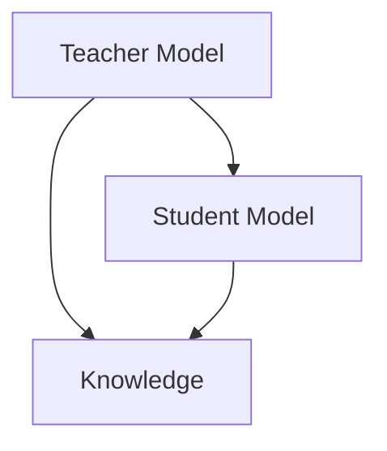
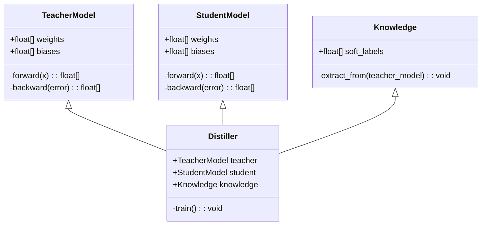
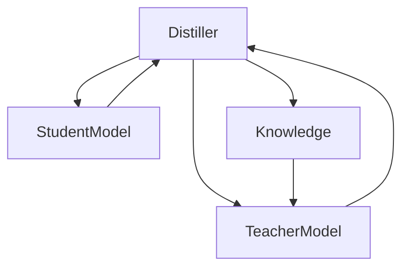

                 


# AI Agent 的知识蒸馏：从大型 LLM 到轻量级模型

> **关键词**：知识蒸馏，AI Agent，大型语言模型，轻量级模型，模型压缩，数学公式，系统架构设计

> **摘要**：知识蒸馏是一种将大型语言模型（LLM）的知识迁移到轻量级模型的技术，旨在在资源受限的环境中实现高性能AI推理。本文从AI Agent的角度出发，详细探讨了知识蒸馏的背景、核心概念、算法原理、系统架构设计以及项目实战。通过理论与实践结合，深入剖析了知识蒸馏的关键技术与实际应用，为读者提供了从大型模型到轻量级模型的迁移方案。

---

## 第1章: 知识蒸馏的背景与问题背景

### 1.1 知识蒸馏的概念与问题背景

#### 1.1.1 大型语言模型的现状与挑战
近年来，大型语言模型（LLM）如GPT-3、GPT-4等在自然语言处理领域取得了巨大成功，但其计算成本和资源消耗也日益增加。这些模型通常需要大量的计算资源和存储空间，难以在资源受限的环境中部署。

#### 1.1.2 知识蒸馏的定义与目标
知识蒸馏是一种通过将大型模型的知识迁移到小型模型的技术。其目标是通过蒸馏过程，使轻量级模型能够继承大型模型的性能，同时显著降低计算成本和资源消耗。

#### 1.1.3 AI Agent 的需求与应用场景
AI Agent需要在多种场景中运行，如移动设备、边缘计算等。这些场景通常对计算资源有限制，因此轻量级模型的需求日益迫切。

### 1.2 知识蒸馏的核心问题

#### 1.2.1 知识蒸馏的目标与挑战
知识蒸馏的目标是将大型模型的知识迁移到小型模型中，同时保持或接近原始模型的性能。其主要挑战包括如何高效提取知识、如何避免信息损失以及如何保证迁移后的模型性能。

#### 1.2.2 大型模型与轻量级模型的对比
- **大型模型**：性能强大，但资源消耗高。
- **轻量级模型**：资源消耗低，但性能有限。通过知识蒸馏，可以显著提升轻量级模型的性能。

#### 1.2.3 知识蒸馏的边界与外延
知识蒸馏的边界在于如何提取和迁移知识，外延则包括与其他技术（如模型压缩）的结合。

---

## 第2章: 知识蒸馏的核心概念与联系

### 2.1 知识蒸馏的核心概念

#### 2.1.1 教师模型与学生模型
- **教师模型**：大型模型，负责提供知识。
- **学生模型**：轻量级模型，负责学习教师模型的知识。

#### 2.1.2 知识蒸馏的关键步骤
1. 提取教师模型的知识。
2. 将知识迁移到学生模型。
3. 调整学生模型以适应特定任务。

#### 2.1.3 知识蒸馏的优缺点对比

| **特性**         | **大型模型**       | **轻量级模型（蒸馏后）** |
|------------------|-------------------|--------------------------|
| 计算资源         | 高                | 低                       |
| 部署成本         | 高                | 低                       |
| 响应速度         | 低                | 高                       |
| 适用场景         | 云端              | 边缘计算、移动端          |

### 2.2 知识蒸馏与模型压缩的关系

#### 2.2.1 模型压缩的定义与方法
模型压缩通过减少模型参数数量来降低模型大小，但可能会导致性能下降。知识蒸馏通过迁移知识来弥补这一缺陷。

#### 2.2.2 知识蒸馏与模型剪枝的对比
- **模型剪枝**：通过删除冗余参数来减少模型大小。
- **知识蒸馏**：通过迁移知识来提升轻量级模型的性能。

#### 2.2.3 知识蒸馏与模型量化的关系
模型量化通过将模型参数量化为较低精度（如INT8）来减少模型大小，而知识蒸馏通过迁移知识来提升量化后模型的性能。

### 2.3 知识蒸馏的ER实体关系图



---

## 第3章: 知识蒸馏的算法原理

### 3.1 知识蒸馏的算法流程

#### 3.1.1 知识蒸馏的步骤分解
1. 训练教师模型。
2. 提取教师模型的知识。
3. 初始化学生模型。
4. 进行知识蒸馏训练。
5. 调整学生模型以适应特定任务。

#### 3.1.2 知识蒸馏的输入与输出
- **输入**：教师模型、学生模型、训练数据。
- **输出**：经过蒸馏的学生模型。

#### 3.1.3 知识蒸馏的实现框架
$$
\text{框架：} \quad \text{蒸馏损失} = \lambda_1 \times \text{蒸馏损失} + \lambda_2 \times \text{分类损失}
$$

### 3.2 知识蒸馏的数学模型

#### 3.2.1 教师模型的输出概率
$$
P(y|x) = \text{softmax}(f_T(x))
$$

#### 3.2.2 学生模型的输出概率
$$
Q(y|x) = \text{softmax}(f_S(x))
$$

#### 3.2.3 知识蒸馏的损失函数
$$
L = -\sum_{i=1}^{n} P(y_i|x_i) \log Q(y_i|x_i)
$$

#### 3.2.4 示例
假设输入为$x$，教师模型输出$P(y|x) = [0.1, 0.3, 0.6]$，学生模型输出$Q(y|x) = [0.2, 0.2, 0.6]$。则蒸馏损失为：
$$
L = -\sum_{i=1}^{3} P(y_i|x_i) \log Q(y_i|x_i) = -[0.1 \log 0.2 + 0.3 \log 0.2 + 0.6 \log 0.6]
$$

---

## 第4章: 知识蒸馏的系统架构设计

### 4.1 系统功能设计

#### 4.1.1 系统功能模块划分
1. 教师模型训练模块。
2. 知识提取模块。
3. 学生模型初始化模块。
4. 知识蒸馏训练模块。
5. 模型部署模块。

#### 4.1.2 系统功能流程图

```mermaid
graph TD
    Start --> Input Data
    Input Data --> Teacher Model
    Teacher Model --> Soft Labels
    Soft Labels --> Student Model
    Student Model --> Output
    Output --> End
```

#### 4.1.3 系统功能的实现方式
- **教师模型训练**：使用大型数据集训练教师模型。
- **知识提取**：通过软标签提取教师模型的知识。
- **学生模型初始化**：使用随机初始化或预训练。
- **知识蒸馏训练**：在训练过程中结合蒸馏损失和分类损失。
- **模型部署**：将蒸馏后的学生模型部署到目标环境中。

### 4.2 系统架构设计

#### 4.2.1 系统架构的层次划分
1. 数据层：包括训练数据和教师模型的输出。
2. 模型层：包括教师模型和学生模型。
3. 损失函数层：包括蒸馏损失和分类损失。
4. 优化器层：负责优化损失函数。

#### 4.2.2 系统架构的类图



#### 4.2.3 系统架构的交互图



---

## 第5章: 知识蒸馏的项目实战

### 5.1 项目介绍

#### 5.1.1 项目背景
本项目旨在将GPT-2模型的知识蒸馏到一个小型Transformer模型中，以实现轻量级AI Agent。

#### 5.1.2 项目目标
通过知识蒸馏，使小型Transformer模型在保持低资源消耗的同时，具备与GPT-2相当的文本生成能力。

### 5.2 环境安装

#### 5.2.1 安装依赖
```bash
pip install torch transformers
```

#### 5.2.2 环境配置
```bash
export CUDA_VISIBLE_DEVICES=0
```

### 5.3 核心代码实现

#### 5.3.1 教师模型定义
```python
class TeacherModel(torch.nn.Module):
    def __init__(self, vocab_size, embedding_dim, hidden_dim):
        super().__init__()
        self.embedding = torch.nn.Embedding(vocab_size, embedding_dim)
        self.rnn = torch.nn.LSTM(embedding_dim, hidden_dim, batch_first=True)
        self.fc = torch.nn.Linear(hidden_dim, vocab_size)
    
    def forward(self, x):
        embed = self.embedding(x)
        output, _ = self.rnn(embed)
        output = self.fc(output)
        return output
```

#### 5.3.2 学生模型定义
```python
class StudentModel(torch.nn.Module):
    def __init__(self, vocab_size, embedding_dim, hidden_dim):
        super().__init__()
        self.embedding = torch.nn.Embedding(v

