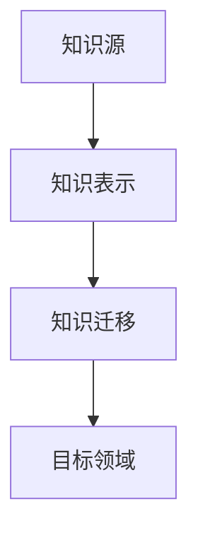
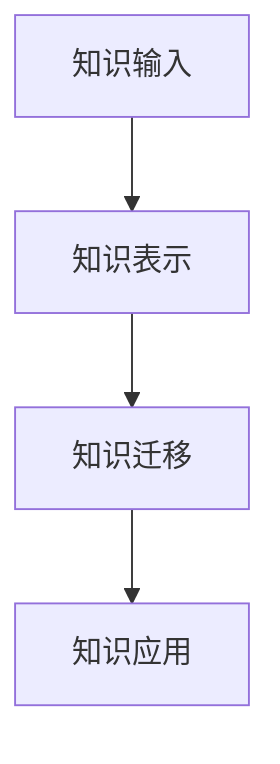

                 


# AI Agent 的知识迁移：跨领域应用 LLM 的能力

## 关键词：AI Agent、知识迁移、大语言模型、LLM、跨领域应用、能力迁移、技术应用

## 摘要：  
本文探讨了AI Agent 在跨领域应用大语言模型（LLM）能力的知识迁移方法。通过分析知识迁移的核心概念、算法原理、系统架构及实际案例，展示了如何利用LLM的能力在不同领域间实现高效的知识迁移，从而提升AI Agent 的跨领域应用能力。文章最后总结了最佳实践和未来研究方向。

---

# 第一部分: AI Agent 的知识迁移背景与概念

## 第1章: AI Agent 与知识迁移概述

### 1.1 AI Agent 的基本概念

#### 1.1.1 AI Agent 的定义与特点
AI Agent 是一种智能体，能够感知环境、自主决策并执行任务。其特点包括：  
1. **自主性**：无需外部干预，自主完成任务。  
2. **反应性**：实时感知环境并做出反应。  
3. **目标导向**：基于目标驱动行为。  
4. **学习能力**：通过学习提升性能。  

#### 1.1.2 AI Agent 的核心能力
1. **感知能力**：通过传感器或数据输入感知环境。  
2. **推理能力**：基于知识库或模型进行推理。  
3. **决策能力**：根据推理结果做出决策。  
4. **执行能力**：通过执行机构或API实现任务。  

#### 1.1.3 AI Agent 在跨领域应用中的优势
AI Agent 可以通过知识迁移，在不同领域间共享能力和经验，从而快速适应新场景。

---

### 1.2 大语言模型（LLM）的基本原理

#### 1.2.1 LLM 的定义与技术特点
大语言模型是一种基于深度学习的自然语言处理模型，具有以下特点：  
1. **大规模训练**：使用海量数据进行预训练。  
2. **上下文理解**：能够理解上下文关系。  
3. **生成能力**：可以生成自然语言文本。  

#### 1.2.2 LLM 的训练与推理机制
1. **预训练**：在大规模数据上优化模型参数。  
2. **微调**：针对特定任务进行 fine-tuning。  
3. **生成式推理**：通过生成式方法进行推理。  

#### 1.2.3 LLM 在不同领域中的应用潜力
1. **自然语言处理**：文本生成、翻译、问答。  
2. **领域知识**：通过知识库扩展领域知识。  
3. **跨领域应用**：将LLM能力迁移到不同领域任务。  

---

### 1.3 知识迁移的核心概念

#### 1.3.1 知识迁移的定义
知识迁移是指将已有的知识、技能或经验应用到新的领域或任务中。

#### 1.3.2 知识迁移的分类与特点
知识迁移可以分为以下几类：  
1. **正向迁移**：将知识从源领域迁移到目标领域。  
2. **反向迁移**：将知识从目标领域迁移到源领域。  
3. **双向迁移**：知识在两个领域之间相互迁移。  

---

## 第2章: AI Agent 知识迁移的背景与问题分析

### 2.1 知识迁移的背景与意义

#### 2.1.1 知识迁移的需求背景
随着AI Agent 的广泛应用，跨领域应用的需求日益增长。知识迁移能够帮助AI Agent 快速适应新领域，降低开发成本。

#### 2.1.2 知识迁移在 AI Agent 中的重要性
知识迁移能够提升AI Agent 的通用性和适应性，使其在不同领域中高效运作。

#### 2.1.3 知识迁移的现状与挑战
当前，知识迁移在AI Agent 中的应用还处于初级阶段，主要挑战包括：  
1. **知识表示**：如何有效表示知识。  
2. **迁移效率**：如何提高知识迁移的效率。  
3. **领域适配**：如何实现领域间的适配。  

---

### 2.2 知识迁移的核心问题

#### 2.2.1 知识表示与表达
知识表示是知识迁移的基础，常见的表示方法包括：  
1. **符号表示**：使用符号逻辑表示知识。  
2. **向量表示**：使用向量空间模型表示知识。  
3. **图表示**：使用知识图谱表示知识。  

#### 2.2.2 知识适应与调整
知识适应是将源领域的知识调整为目标领域的知识，常用方法包括：  
1. **特征映射**：通过特征映射实现知识调整。  
2. **领域适配**：通过领域适配实现知识调整。  

#### 2.2.3 知识应用与验证
知识应用是将迁移后的知识应用到目标领域中，并通过验证确保知识的正确性。

---

### 2.3 知识迁移的边界与外延

#### 2.3.1 知识迁移的适用范围
知识迁移适用于以下场景：  
1. **跨领域任务**：需要将知识从一个领域迁移到另一个领域。  
2. **新领域适应**：AI Agent 需要快速适应新领域。  
3. **知识复用**：复用已有知识解决新问题。  

#### 2.3.2 知识迁移的限制与不足
知识迁移的限制包括：  
1. **领域差异**：不同领域之间的差异可能导致知识迁移失败。  
2. **知识质量**：源领域的知识质量可能影响迁移效果。  
3. **计算资源**：知识迁移需要大量的计算资源。  

#### 2.3.3 知识迁移与其他技术的关系
知识迁移与其他技术如迁移学习、多任务学习等密切相关，能够通过结合这些技术提升迁移效果。

---

## 第3章: AI Agent 知识迁移的核心概念模型

### 3.1 知识迁移的模型结构

#### 3.1.1 知识表示模型
知识表示模型是知识迁移的核心，常用的模型包括：  
1. **符号逻辑模型**：基于符号逻辑表示知识。  
2. **向量空间模型**：基于向量空间表示知识。  
3. **知识图谱模型**：基于知识图谱表示知识。  

#### 3.1.2 知识迁移模型
知识迁移模型是实现知识迁移的关键，常用的模型包括：  
1. **特征映射模型**：通过特征映射实现知识迁移。  
2. **领域适配模型**：通过领域适配实现知识迁移。  

#### 3.1.3 知识应用模型
知识应用模型是将迁移后的知识应用到目标领域中的模型，常用的模型包括：  
1. **生成式模型**：基于生成式模型应用知识。  
2. **判别式模型**：基于判别式模型应用知识。  

---

### 3.2 知识迁移的实体关系图



---

### 3.3 知识迁移的流程图



---

# 第二部分: AI Agent 知识迁移的核心原理

## 第4章: 知识迁移的基本原理

### 4.1 知识迁移的理论基础

#### 4.1.1 知识迁移的理论框架
知识迁移的理论框架包括以下内容：  
1. **源领域知识**：知识迁移的起点。  
2. **目标领域知识**：知识迁移的终点。  
3. **知识映射**：将源领域知识映射到目标领域知识。  

#### 4.1.2 知识迁移的核心原理
知识迁移的核心原理是通过知识映射实现源领域知识到目标领域知识的转换。

#### 4.1.3 知识迁移的数学模型
知识迁移的数学模型可以表示为：  
$$ f_{source}(x) = f_{target}(g(x)) $$  
其中，$g(x)$ 是知识映射函数。

---

### 4.2 知识迁移的特征与对比

#### 4.2.1 知识迁移的特征对比表格

| 特征               | 正向迁移       | 反向迁移       | 双向迁移       |
|--------------------|----------------|----------------|----------------|
| 迁移方向           | 源→目标       | 目标→源       | 互为源→目标     |
| 迁移效率           | 高            | 低            | 中等           |
| 应用场景           | 新领域适应     | 知识复用       | 跨领域协作     |

---

## 第5章: AI Agent 知识迁移的核心算法

### 5.1 知识迁移的算法选择

#### 5.1.1 迁移学习算法
常用的迁移学习算法包括：  
1. **特征映射**：通过特征映射实现知识迁移。  
2. **领域适配**：通过领域适配实现知识迁移。  

---

## 第6章: AI Agent 知识迁移的系统架构设计

### 6.1 系统功能设计

#### 6.1.1 知识表示模块
知识表示模块负责将知识表示为可迁移的形式，常用的技术包括：  
1. **符号逻辑表示**：将知识表示为符号逻辑形式。  
2. **向量空间表示**：将知识表示为向量空间形式。  

---

### 6.1.2 知识迁移模块
知识迁移模块负责将知识从源领域迁移到目标领域，常用的技术包括：  
1. **特征映射**：通过特征映射实现知识迁移。  
2. **领域适配**：通过领域适配实现知识迁移。  

---

### 6.1.3 知识应用模块
知识应用模块负责将迁移后的知识应用到目标领域中，常用的技术包括：  
1. **生成式模型**：基于生成式模型应用知识。  
2. **判别式模型**：基于判别式模型应用知识。  

---

## 第7章: AI Agent 知识迁移的项目实战

### 7.1 项目环境与工具安装

#### 7.1.1 环境安装
1. **Python 3.8+**：确保安装了Python 3.8或更高版本。  
2. **TensorFlow 2.x**：安装TensorFlow 2.x版本。  
3. **Hugging Face Transformers**：安装Hugging Face Transformers库。  

#### 7.1.2 工具安装
1. **pip install transformers**：安装Transformers库。  
2. **pip install mermaid**：安装Mermaid图表工具。  

---

### 7.2 系统核心实现源代码

#### 7.2.1 知识表示模块
```python
from transformers import AutoTokenizer, AutoModel
import torch

class KnowledgeRepresentation:
    def __init__(self, model_name):
        self.tokenizer = AutoTokenizer.from_pretrained(model_name)
        self.model = AutoModel.from_pretrained(model_name)
    
    def encode(self, text):
        inputs = self.tokenizer.encode(text, return_tensors="pt")
        outputs = self.model(**inputs)
        return outputs.last_hidden_state.squeeze().numpy()
```

---

### 7.2.2 知识迁移模块
```python
class KnowledgeMigration:
    def __init__(self, source_repr, target_repr):
        self.source_repr = source_repr
        self.target_repr = target_repr
    
    def migrate(self, source Knowledge):
        # 这里需要具体实现知识迁移的逻辑
        pass
```

---

### 7.2.3 知识应用模块
```python
class KnowledgeApplication:
    def __init__(self, migrated_Knowledge):
        self.migrated_Knowledge = migrated_Knowledge
    
    def apply(self, task):
        # 这里需要具体实现知识应用的逻辑
        pass
```

---

## 第8章: AI Agent 知识迁移的最佳实践与总结

### 8.1 最佳实践 tips

#### 8.1.1 知识表示的选择
选择适合的知识表示方法，如符号逻辑、向量空间或知识图谱。

#### 8.1.2 知识迁移的策略
根据具体场景选择合适的知识迁移策略，如特征映射或领域适配。

#### 8.1.3 知识应用的验证
在目标领域中验证迁移后知识的正确性和有效性。

---

### 8.2 小结

通过本文的探讨，我们可以看到，AI Agent 的知识迁移在跨领域应用 LLM 的能力中具有重要的意义。通过合理选择知识表示方法、优化知识迁移策略并验证知识应用效果，可以显著提升AI Agent 的跨领域应用能力。

---

### 8.3 注意事项

1. **知识表示的准确性**：确保知识表示的准确性，避免因表示错误导致迁移失败。  
2. **知识迁移的效率**：优化知识迁移的效率，降低计算成本。  
3. **知识应用的安全性**：确保知识应用的安全性，避免因知识错误导致不良后果。  

---

### 8.4 拓展阅读

1. **迁移学习的经典论文**：了解迁移学习的最新研究成果。  
2. **知识图谱的应用案例**：学习知识图谱在不同领域的应用案例。  
3. **大语言模型的前沿研究**：关注大语言模型的前沿研究和未来发展方向。  

---

## 作者：AI天才研究院/AI Genius Institute & 禅与计算机程序设计艺术 /Zen And The Art of Computer Programming

