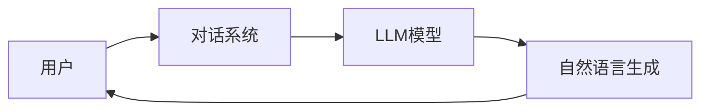
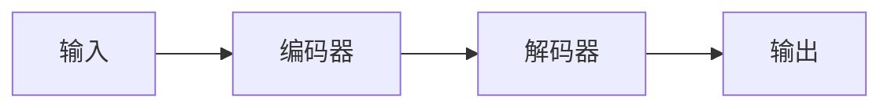

                 


# AI Agent 的自然语言交互：LLM 对话系统设计

**关键词**：AI Agent，自然语言交互，LLM，对话系统，大语言模型

**摘要**：本文深入探讨了AI Agent在自然语言交互中的应用，重点分析了基于大语言模型（LLM）的对话系统设计。从背景到原理，从算法到实战，系统地阐述了如何构建高效且智能的自然语言对话系统。文章结合理论与实践，通过丰富的案例和详细的代码实现，为读者提供全面的技术指导。

---

## 目录

# 第一部分: AI Agent与自然语言交互基础

# 第1章: AI Agent与自然语言交互概述

## 1.1 AI Agent的基本概念

### 1.1.1 AI Agent的定义与分类

人工智能代理（AI Agent）是指能够感知环境并采取行动以实现目标的智能实体。AI Agent可以分为简单反射型、基于模型的反射型、目标驱动型和效用驱动型四种类型。

$$
\text{AI Agent分类} = \{\text{简单反射型}, \text{基于模型的反射型}, \text{目标驱动型}, \text{效用驱动型}\}
$$

### 1.1.2 自然语言交互的定义与特点

自然语言交互（Natural Language Interaction, NLI）是指通过自然语言（如中文、英文）进行信息传递和交流的过程。其特点包括实时性、准确性、上下文依赖性和用户友好性。

### 1.1.3 LLM在AI Agent中的作用

大语言模型（Large Language Model, LLM）通过海量数据的训练，具备强大的自然语言理解和生成能力，能够为AI Agent提供智能化的交互支持。

---

## 1.2 LLM对话系统的背景与现状

### 1.2.1 大语言模型的发展历程

从早期的规则驱动对话系统，到基于统计模型的对话系统，再到当前基于深度学习的LLM对话系统，技术的进步推动了对话系统的智能化。

### 1.2.2 当前LLM对话系统的应用场景

LLM对话系统广泛应用于智能客服、智能助手、教育机器人、医疗咨询等领域。

### 1.2.3 LLM对话系统的挑战与未来方向

挑战包括数据质量、模型解释性、对话连贯性等问题。未来发展方向包括多模态对话、个性化对话、高效推理能力等。

---

## 1.3 本章小结

本章介绍了AI Agent和自然语言交互的基本概念，分析了LLM在对话系统中的重要性，并探讨了当前的发展现状和未来趋势。

---

# 第二部分: LLM对话系统的核心原理

# 第2章: LLM对话系统的核心概念与联系

## 2.1 LLM对话系统的原理

### 2.1.1 大语言模型的训练机制

LLM通过监督学习和无监督学习结合的方式进行训练，使用Transformer架构，通过自注意力机制捕捉上下文信息。

### 2.1.2 对话系统的输入输出机制

对话系统通过接收用户输入，生成符合上下文的回复。

### 2.1.3 自然语言理解与生成的结合

自然语言理解（NLU）和自然语言生成（NLG）是对话系统的核心模块，两者结合实现高效的交互。

---

## 2.2 LLM对话系统的实体关系图



---

## 2.3 本章小结

本章详细讲解了LLM对话系统的原理和核心模块，通过实体关系图展示了系统的整体架构。

---

# 第三部分: LLM对话系统的算法原理

# 第3章: LLM对话系统的算法原理

## 3.1 大语言模型的训练过程

### 3.1.1 前向传播过程

$$
\text{输入} \rightarrow \text{编码器} \rightarrow \text{解码器} \rightarrow \text{输出}
$$



### 3.1.2 反向传播与优化

$$
\text{损失函数} \rightarrow \text{梯度计算} \rightarrow \text{参数更新} \rightarrow \text{模型优化}
$$


## 3.2 对话系统的算法实现

### 3.2.1 基于LLM的对话生成算法

$$
\text{输入} \rightarrow \text{LLM} \rightarrow \text{生成回复}
$$

### 3.2.2 基于强化学习的对话优化算法

$$
\text{输入} \rightarrow \text{强化学习模型} \rightarrow \text{优化回复}
$$`

### 3.2.3 对话历史记忆机制

$$
\text{对话历史} \rightarrow \text{记忆模块} \rightarrow \text{上下文生成}
$$`

---

## 3.3 本章小结

本章详细讲解了LLM对话系统的算法原理，包括训练过程、生成算法和记忆机制。

---

# 第四部分: LLM对话系统的系统设计

# 第4章: LLM对话系统的系统设计

## 4.1 领域模型设计

### 4.1.1 领域模型的定义与作用

领域模型用于定义对话系统的功能模块和交互流程。

### 4.1.2 领域模型的实现

$$
\text{功能模块} \rightarrow \text{交互流程} \rightarrow \text{系统实现}
$$`

## 4.2 系统架构设计

### 4.2.1 系统架构的定义与作用

系统架构设计决定了系统的模块划分和接口设计。

### 4.2.2 系统架构的实现

$$
\text{模块划分} \rightarrow \text{接口设计} \rightarrow \text{系统集成}
$$`

## 4.3 系统交互设计

### 4.3.1 系统交互的定义与作用

系统交互设计决定了用户与系统之间的互动流程。

### 4.3.2 系统交互的实现

$$
\text{用户输入} \rightarrow \text{系统处理} \rightarrow \text{系统输出}
$$`

---

## 4.4 本章小结

本章详细讲解了LLM对话系统的系统设计，包括领域模型、架构设计和交互设计。

---

# 第五部分: LLM对话系统的项目实战

# 第5章: LLM对话系统的项目实战

## 5.1 环境安装与配置

### 5.1.1 安装Python环境

使用Anaconda或虚拟环境安装Python 3.8及以上版本。

### 5.1.2 安装必要的库

安装`transformers`、`torch`等库。

```bash
pip install transformers torch
```

## 5.2 系统核心功能实现

### 5.2.1 对话生成模块实现

```python
from transformers import AutoModelForCausalLM, AutoTokenizer

model_name = "gpt2"
tokenizer = AutoTokenizer.from_pretrained(model_name)
model = AutoModelForCausalLM.from_pretrained(model_name)

def generate_response(prompt):
    inputs = tokenizer.encode(prompt, return_tensors="pt")
    outputs = model.generate(inputs, max_length=50, do_sample=True)
    response = tokenizer.decode(outputs[0], skip_special_tokens=True)
    return response
```

### 5.2.2 对话历史记忆模块实现

```python
def add_to_memory(memory, response):
    memory.append(response)
    return memory
```

## 5.3 代码解读与分析

### 5.3.1 对话生成模块解读

上述代码实现了基于GPT-2模型的对话生成功能，通过设置最大长度和随机采样参数，生成符合要求的回复。

### 5.3.2 对话历史记忆模块解读

上述代码实现了对话历史记忆功能，通过将每次生成的回复添加到记忆列表中，实现上下文的记录和管理。

## 5.4 案例分析与详细讲解

### 5.4.1 案例分析

通过具体案例分析，展示对话系统的实际应用效果和优化方向。

### 5.4.2 详细讲解

从代码实现到系统运行，详细讲解每个步骤的技术细节和实现原理。

---

## 5.5 本章小结

本章通过具体的项目实战，展示了如何基于LLM构建对话系统，并通过代码实现和案例分析，帮助读者掌握实际应用技能。

---

# 第六部分: LLM对话系统的最佳实践

# 第6章: LLM对话系统的最佳实践

## 6.1 设计原则与注意事项

### 6.1.1 设计原则

- 简洁性
- 可扩展性
- 用户友好性

### 6.1.2 注意事项

- 数据质量
- 模型解释性
- 对话连贯性

## 6.2 优化技巧与经验分享

### 6.2.1 优化技巧

- 参数调优
- 模型微调
- 对话历史管理

### 6.2.2 经验分享

- 持续学习
- 用户反馈
- 性能监控

## 6.3 未来趋势与发展方向

### 6.3.1 未来趋势

- 多模态对话
- 个性化对话
- 高效推理能力

### 6.3.2 发展方向

- 智能化
- 个性化
- 多语言支持

---

## 6.4 本章小结

本章总结了LLM对话系统的最佳实践，包括设计原则、优化技巧和未来发展趋势。

---

# 附录: LLM对话系统开发工具与资源

## 附录A: 常用工具与资源

- Hugging Face
- OpenAI API
- TensorFlow
- PyTorch

## 附录B: 术语表

- LLM: 大语言模型
- NLU: 自然语言理解
- NLG: 自然语言生成
- Transformer: 一种深度学习模型架构

---

**作者：AI天才研究院 & 禅与计算机程序设计艺术**

---

以上为《AI Agent 的自然语言交互：LLM 对话系统设计》的完整目录大纲。

