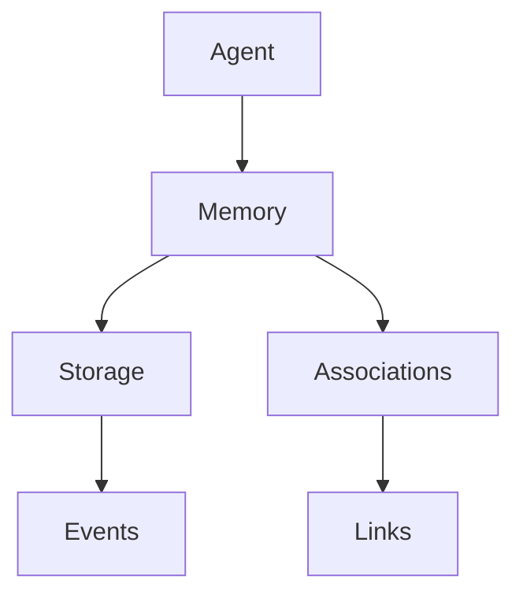
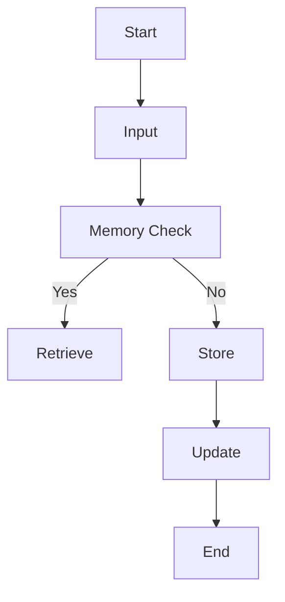
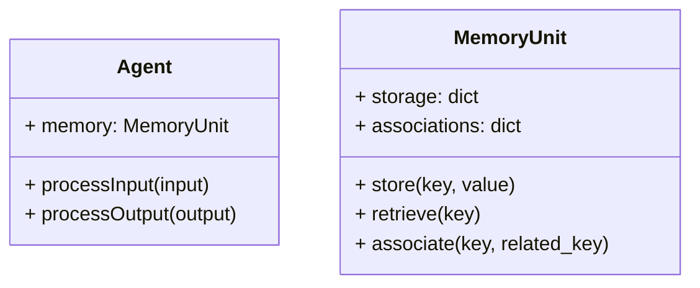
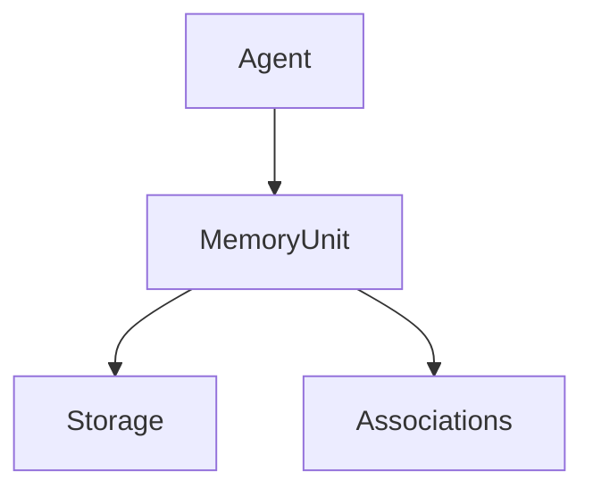

                 


# AI Agent 的记忆机制：让 LLM 具备长期记忆能力

> 关键词：AI Agent, LLM, 记忆机制, 长期记忆, 人工智能

> 摘要：本文深入探讨了AI Agent的记忆机制，特别是如何让大型语言模型（LLM）具备长期记忆能力。文章从背景介绍、核心概念、算法原理、系统架构、项目实战到小结，全面分析了记忆机制的实现方法和应用实践。

---

## 第一章：问题背景与核心概念

### 1.1 问题背景介绍

#### 1.1.1 AI Agent 的定义与特点
AI Agent（人工智能代理）是一种智能系统，能够感知环境并采取行动以实现特定目标。其特点包括自主性、反应性、目标导向和社交能力。

#### 1.1.2 LLM 的局限性与挑战
大型语言模型（LLM）在处理短期任务时表现出色，但缺乏长期记忆能力。这限制了其在需要持续交互或长期任务中的应用。

#### 1.1.3 长期记忆能力的重要性
长期记忆能力是AI Agent实现复杂任务的关键，如对话系统、智能助手和自动化流程管理。

### 1.2 核心概念与问题描述

#### 1.2.1 记忆机制的基本概念
记忆机制是AI Agent存储和检索信息的能力，包括外显记忆（显式存储）和内隐记忆（隐式学习）。

#### 1.2.2 问题的边界与外延
记忆机制的设计需要考虑存储容量、检索效率和数据持久性等边界条件。

#### 1.2.3 核心概念的结构与组成
记忆机制由存储单元、关联网络和检索算法组成，确保信息的有效存储和快速检索。

---

## 第二章：核心概念与联系

### 2.1 记忆机制的原理

#### 2.1.1 外显记忆与内隐记忆的对比
外显记忆基于存储单元，内隐记忆基于关联网络，两者结合提供全面的记忆能力。

#### 2.1.2 基于内容和基于关联的记忆机制
内容记忆直接存储信息，关联记忆通过关系网络进行推理。

### 2.2 核心概念的属性特征对比

| 特性 | 外显记忆 | 内隐记忆 |
|------|----------|----------|
| 存储方式 | 显式存储 | 隐式学习 |
| 检索方式 | 基于关键词 | 基于关联 |
| 适用场景 | 精确检索 | 关联推理 |

### 2.3 ER 实体关系图架构



---

## 第三章：算法原理讲解

### 3.1 记忆机制的算法流程



#### 3.1.2 算法实现的 Python 源代码

```python
class MemoryUnit:
    def __init__(self):
        self.storage = {}
        self.associations = {}

    def store(self, key, value):
        self.storage[key] = value

    def retrieve(self, key):
        return self.storage.get(key, None)

    def associate(self, key, related_key):
        if key in self.associations:
            self.associations[key].append(related_key)
        else:
            self.associations[key] = [related_key]
```

### 3.2 数学模型与公式

#### 3.2.1 记忆单元的更新公式
$$ \text{new\_value} = \text{value} + \Delta t $$

#### 3.2.2 关联权重的计算公式
$$ w_{ij} = \frac{1}{1 + e^{-\Delta t}} $$

---

## 第四章：系统分析与架构设计

### 4.1 问题场景介绍

#### 4.1.1 AI Agent 的应用场景
对话系统、智能助手和自动化流程管理。

### 4.2 系统功能设计



### 4.3 系统架构设计



---

## 第五章：项目实战

### 5.1 环境安装

安装必要的库：
```bash
pip install memory_unit
```

### 5.2 核心代码实现

```python
from memory_unit import MemoryUnit

agent = MemoryUnit()
agent.store("name", "Alice")
agent.associate("name", "age")
agent.retrieve("name")
```

### 5.3 代码解读与分析
代码实现了基本的存储和关联功能，展示了记忆机制的简单应用。

### 5.4 案例分析
通过对话系统案例，展示记忆机制的实际应用。

### 5.5 项目小结
总结项目实现的关键点和经验教训。

---

## 第六章：小结

### 6.1 最佳实践 tips
- 定期维护记忆单元
- 优化关联权重计算
- 使用混合记忆机制

### 6.2 小结
本文全面探讨了AI Agent的记忆机制，展示了如何让LLM具备长期记忆能力。

### 6.3 注意事项
- 数据安全
- 记忆单元的扩展性

### 6.4 拓展阅读
推荐相关书籍和论文，供进一步学习。

---

## 附录

### 附录 A：术语表
定义本文中使用的术语，如AI Agent、LLM等。

### 附录 B：参考文献
列出引用的文献和资源。

---

作者：AI天才研究院/AI Genius Institute & 禅与计算机程序设计艺术 /Zen And The Art of Computer Programming

