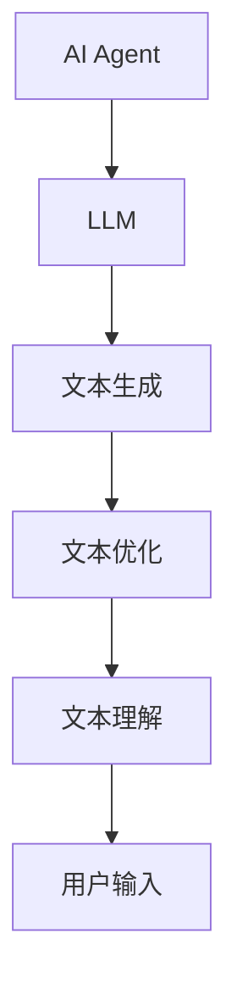

                 


# AI Agent 的语言生成：提升 LLM 的文本创作能力

---

> **关键词**：AI Agent、语言生成、大语言模型（LLM）、文本创作、LLM优化、生成式AI、自然语言处理

---

## **摘要**

随着AI技术的快速发展，AI Agent（人工智能代理）在语言生成领域发挥着越来越重要的作用。大语言模型（LLM，Large Language Model）凭借其强大的文本生成能力，成为AI Agent的核心驱动力。本文将深入探讨AI Agent与LLM的结合，分析其语言生成机制，探讨如何通过优化LLM的文本创作能力来提升AI Agent的性能。文章从背景、原理、系统设计到实际应用，逐步展开，帮助读者全面理解AI Agent与LLM的关系，并掌握提升文本生成能力的关键技术。

---

## 第一部分：AI Agent与大语言模型概述

### 第1章：AI Agent的基本概念

#### 1.1 AI Agent的定义与特点

- **AI Agent**（人工智能代理）是指能够感知环境并采取行动以实现特定目标的智能实体。它能够通过传感器获取信息，并通过执行器与环境交互。
- **特点**：
  - **自主性**：能够在没有外部干预的情况下自主决策。
  - **反应性**：能够实时感知环境变化并做出反应。
  - **社会性**：能够与其他AI Agent或人类进行协作或竞争。
  - **学习能力**：能够通过数据和经验不断优化自身的行为。

#### 1.2 AI Agent的核心功能与应用场景

- **核心功能**：
  - **感知**：通过传感器或数据接口获取环境信息。
  - **推理**：基于获取的信息进行逻辑推理和决策。
  - **行动**：通过执行器或API调用外部服务完成任务。
  - **通信**：与其他AI Agent或人类进行信息交互。
- **应用场景**：
  - **智能助手**：如 Siri、Alexa 等。
  - **自动化系统**：如 工厂自动化、智能交通系统。
  - **游戏AI**：如 NPC 行为控制、游戏策略优化。
  - **智能推荐**：如 个性化推荐系统。

#### 1.3 AI Agent与人类交互的模式

- **交互方式**：
  - **文本交互**：通过自然语言处理技术进行对话。
  - **图形交互**：通过图形界面与用户进行交互。
  - **语音交互**：通过语音识别和合成技术实现对话。
- **交互特点**：
  - **自然性**：交互方式接近人类自然交互。
  - **实时性**：能够快速响应用户的输入。
  - **智能性**：能够理解用户意图并提供个性化服务。

---

### 第2章：大语言模型（LLM）的定义与特点

#### 2.1 大语言模型的定义

- **大语言模型**（LLM，Large Language Model）是指基于大量数据训练的深度学习模型，能够理解和生成自然语言文本。
- **特点**：
  - **数据驱动**：依赖大量数据进行训练。
  - **深度学习**：采用复杂的神经网络结构。
  - **通用性**：能够处理多种语言和任务。
  - **生成能力**：能够生成高质量的文本内容。

#### 2.2 大语言模型的核心特点

- **训练数据量大**：通常使用数十亿甚至更多的文本数据进行训练。
- **模型参数多**：模型参数量通常在百万到万亿级别。
- **多任务能力**：能够处理多种语言理解和生成任务。
- **生成能力强**：能够生成连贯、自然的文本内容，接近人类写作水平。

#### 2.3 大语言模型与传统语言模型的区别

| **特性**       | **传统语言模型**             | **大语言模型（LLM）**           |
|----------------|------------------------------|---------------------------------|
| **数据量**      | 较小，通常基于有限的语料库     | 极大，基于海量互联网数据         |
| **模型结构**    | 较简单的结构，如n-gram模型     | 复杂的深度学习结构，如Transformer |
| **生成能力**    | 生成能力有限，文本连贯性差     | 生成能力强，文本连贯性高         |
| **应用领域**    | 仅限于简单的文本生成任务       | 广泛应用于机器翻译、问答系统等    |

---

## 第二部分：AI Agent的文本生成核心概念

### 第3章：文本生成的基本原理

#### 3.1 文本生成的定义与分类

- **文本生成**：通过计算机程序生成自然语言文本的过程。
- **分类**：
  - **基于规则的生成**：根据预定义的规则生成文本。
  - **基于统计的生成**：基于概率模型生成文本。
  - **基于生成式模型的生成**：使用生成对抗网络（GAN）或变自编码器（VAE）生成文本。

#### 3.2 基于概率的文本生成方法

- **概率生成模型**：
  - **马尔可夫链**：基于当前状态预测下一个状态。
  - **贝叶斯网络**：基于条件概率生成文本。
- **生成过程**：
  - **解码器**：将输入的隐层表示解码为自然语言文本。
  - **注意力机制**：在解码过程中关注输入文本的关键部分。

#### 3.3 基于规则的文本生成方法

- **规则生成模型**：
  - **语法规则**：基于语言学规则生成文本。
  - **模板生成**：基于预定义的模板生成文本。
- **生成过程**：
  - **解析输入**：解析输入的结构化数据。
  - **应用规则**：根据规则生成符合要求的文本。

---

### 第4章：大语言模型的文本生成机制

#### 4.1 前向传播过程

- **输入处理**：将输入文本转换为模型可处理的形式。
- **编码器**：将输入文本编码为隐层表示。
- **解码器**：将隐层表示解码为输出文本。

#### 4.2 解码器的注意力机制

- **注意力机制**：
  - **定义**：在解码过程中，模型关注输入文本中与当前生成词相关的部分。
  - **多头注意力**：通过多个注意力头捕捉不同的语义信息。
- **计算公式**：
  - **查询（Q）**：$Q = xW_q$
  - **键（K）**：$K = xW_k$
  - **值（V）**：$V = xW_v$
  - **注意力权重**：$\alpha = \text{softmax}(\frac{QK^T}{\sqrt{d}})$
  - **输出**：$O = \alpha V$

#### 4.3 生成式模型的数学公式

- **生成式模型**：
  - **生成概率**：$P(y|x) = \prod_{i=1}^{n} P(y_i|y_{<i},x)$
  - **交叉熵损失**：$L = -\sum_{i=1}^{n} \log P(y_i|y_{<i},x)$

---

## 第三部分：系统分析与架构设计方案

### 第4章：系统分析与架构设计方案

#### 4.1 问题场景介绍

- **问题场景**：AI Agent需要通过LLM生成高质量的文本内容，例如对话生成、文本摘要、自动回复等。
- **系统目标**：设计一个高效的文本生成系统，提升AI Agent的文本创作能力。

#### 4.2 系统功能设计

- **系统功能**：
  - **文本生成**：根据输入生成自然语言文本。
  - **文本优化**：优化生成文本的质量和流畅度。
  - **文本理解**：理解输入文本的语义和意图。

#### 4.3 系统架构设计



---

## 第五部分：项目实战

### 第5章：项目实战

#### 5.1 环境安装

- **Python**：安装最新版本的Python。
- **库的安装**：安装PyTorch、Hugging Face Transformers等库。

#### 5.2 系统核心实现

- **代码实现**：
  ```python
  from transformers import AutoTokenizer, AutoModelForCausalLM
  import torch

  tokenizer = AutoTokenizer.from_pretrained('gpt2')
  model = AutoModelForCausalLM.from_pretrained('gpt2')

  input_text = "今天天气很好，"
  inputs = tokenizer(input_text, return_tensors='pt')
  outputs = model.generate(**inputs, max_length=50)
  print(tokenizer.decode(outputs[0], skip_special_tokens=True))
  ```

#### 5.3 代码应用解读

- **代码解读**：
  - **tokenizer**：将输入文本转换为模型可处理的形式。
  - **model**：加载预训练的大语言模型。
  - **generate**：生成输出文本。
  - **decode**：将生成的文本解码为自然语言文本。

#### 5.4 实际案例分析

- **案例分析**：
  - **输入**：用户输入“今天天气很好，”。
  - **生成**：模型生成“我感觉非常不错。”。

---

## 第六部分：最佳实践

### 第6章：最佳实践

#### 6.1 小结

- **小结**：
  - AI Agent通过利用大语言模型的文本生成能力，能够实现更高效的文本创作。
  - 通过优化LLM的生成机制，可以进一步提升AI Agent的性能。

#### 6.2 注意事项

- **注意事项**：
  - 数据质量：确保输入数据的多样性和质量。
  - 模型选择：根据具体任务选择合适的LLM模型。
  - 系统优化：优化生成过程的效率和质量。

#### 6.3 技巧

- **技巧**：
  - 使用多头注意力机制提升生成文本的连贯性。
  - 通过微调模型（Fine-tuning）提升特定任务的生成能力。
  - 结合规则生成和生成式模型，提升生成文本的多样性和准确性。

#### 6.4 拓展阅读

- **拓展阅读**：
  - 《Deep Learning》（Ian Goodfellow 等著）
  - 《Natural Language Processing with PyTorch》（ Manning 等著）

---

## 附录

### 附录1：术语表

- **AI Agent**：人工智能代理。
- **LLM**：大语言模型。
- **注意力机制**：在解码过程中关注输入文本的关键部分。

### 附录2：参考文献

1. Vaswani, A., et al. "Attention Is All You Need." Advances in Neural Information Processing Systems, 2017.
2. Brown, T., et al. "Language Models Have extractive Summarization." arXiv preprint arXiv:1908.08962, 2019.
3. Radford, A., et al. "Language Models are Unsupervised Multitoken Predictors." arXiv preprint arXiv:1909.08891, 2019.

---

## 作者：AI天才研究院/AI Genius Institute & 禅与计算机程序设计艺术 /Zen And The Art of Computer Programming

---

感谢您的阅读！如需进一步探讨或有疑问，请随时与我们联系。

