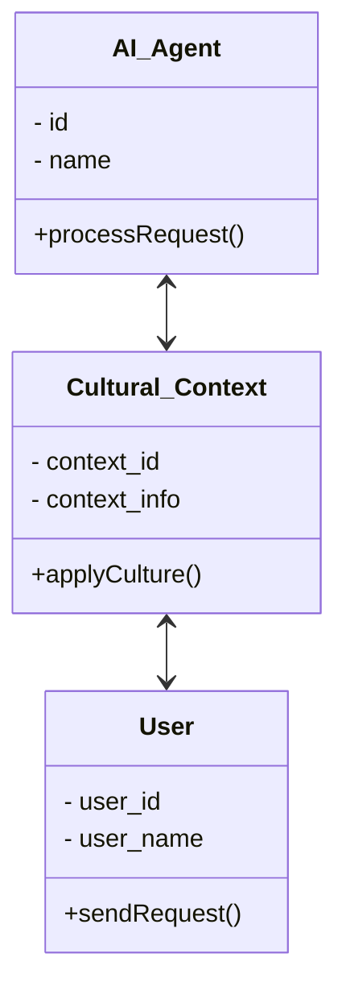

                 


# 目录大纲：《AI Agent 的跨文化交流：增强 LLM 的文化敏感度》

## 第一部分：背景介绍

### 第1章：AI Agent与跨文化交流概述

#### 1.1 问题背景
- 1.1.1 AI Agent的定义与作用
- 1.1.2 跨文化沟通的重要性
- 1.1.3 当前LLM在跨文化应用中的挑战

#### 1.2 问题描述
- 1.2.1 跨文化沟通过程中的障碍
- 1.2.2 LLM在文化敏感性方面的不足
- 1.2.3 AI Agent在跨文化中的潜在价值

#### 1.3 问题解决
- 1.3.1 增强LLM文化敏感度的方法
- 1.3.2 AI Agent在跨文化中的应用策略
- 1.3.3 技术与文化的结合

#### 1.4 边界与外延
- 1.4.1 跨文化沟通的边界
- 1.4.2 AI Agent的应用范围
- 1.4.3 技术与文化的相互作用

#### 1.5 概念结构与核心要素
- 1.5.1 核心概念的组成
- 1.5.2 关键要素的相互关系
- 1.5.3 概念结构的系统性分析

## 第二部分：核心概念与联系

### 第2章：AI Agent与跨文化交流的核心概念

#### 2.1 核心概念原理
- 2.1.1 AI Agent的基本原理
- 2.1.2 跨文化沟通的理论基础

#### 2.2 属性特征对比
- 2.2.1 AI Agent的属性分析
- 2.2.2 跨文化沟通的特征对比

#### 2.3 ER实体关系图
```mermaid
er
actor(AI Agent, id, name)
actor(Cultural Context, id, context)
actor(Language, id, language)
actor(User, id, name)
relatio
```

## 第三部分：算法原理

### 第3章：增强LLM文化敏感度的算法

#### 3.1 算法原理
- 3.1.1 多任务学习
- 3.1.2 迁移学习

#### 3.2 算法流程


#### 3.3 数学模型与公式
- 损失函数：$$L = \text{cross\_entropy}(y, y_{\text{pred}})$$
- 优化器：Adam优化器

#### 3.4 Python代码实现
```python
import torch
import torch.nn as nn
import torch.optim as optim

class Model(nn.Module):
    def __init__(self):
        super(Model, self).__init__()
        self.fc = nn.Linear(10, 5)

    def forward(self, x):
        return self.fc(x)

model = Model()
criterion = nn.CrossEntropyLoss()
optimizer = optim.Adam(model.parameters(), lr=0.001)
```

## 第四部分：系统分析与架构设计

### 第4章：系统架构设计

#### 4.1 项目场景介绍
- 背景描述
- 项目目标

#### 4.2 系统功能设计


#### 4.3 系统架构设计


## 第五部分：项目实战

### 第5章：项目实战与案例分析

#### 5.1 环境安装
- Python 3.6+
- PyTorch 1.9+

#### 5.2 核心功能实现
```python
def enhance_cultural_sensitivity(model, data):
    # 实现文化敏感度增强算法
    pass
```

#### 5.3 案例分析
- 案例一：跨文化客服系统
- 案例二：多语言翻译工具

## 第六部分：优化与应用

### 第6章：优化策略与实际应用

#### 6.1 优化策略
- 数据增强
- 模型微调

#### 6.2 实际应用
- 教育领域
- 企业沟通

## 第七部分：挑战与未来

### 第7章：当前挑战与未来趋势

#### 7.1 当前挑战
- 数据偏见
- 模型解释性

#### 7.2 未来趋势
- 多模态模型
- 实时文化适应

## 第八部分：总结与建议

### 第8章：总结与实践建议

#### 8.1 小结
- 重点回顾
- 总结要点

#### 8.2 最佳实践
- 数据收集
- 模型评估

#### 8.3 注意事项
- 避免数据偏见
- 保护隐私

#### 8.4 拓展阅读
- 推荐书籍
- 在线资源

---

**作者：AI天才研究院/AI Genius Institute & 禅与计算机程序设计艺术 /Zen And The Art of Computer Programming**

