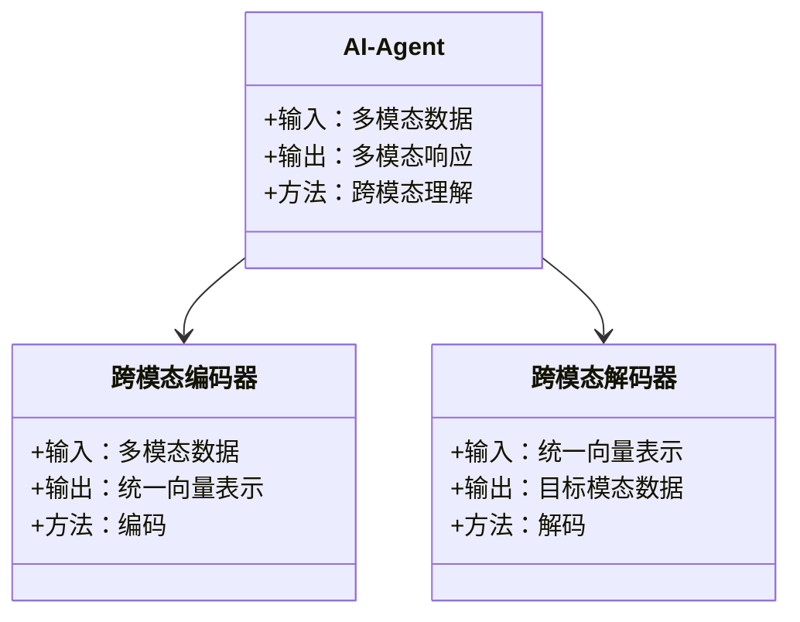
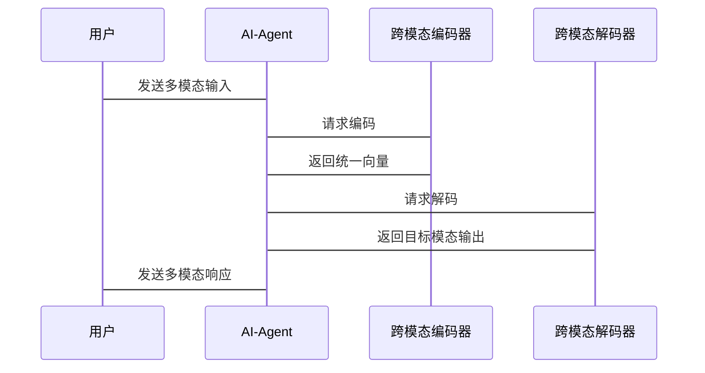

                 


# AI Agent 的跨模态理解：整合 LLM 与音频分析

---

## 关键词：
AI Agent, 跨模态理解, 大语言模型, 音频分析, 跨模态算法, 系统架构

---

## 摘要：
本文探讨了AI Agent在跨模态理解中的应用，重点整合大语言模型（LLM）与音频分析技术。通过详细讲解背景、核心概念、算法原理、系统架构及项目实战，展示了如何利用跨模态技术提升AI Agent的能力，实现对多种数据源的深度理解和交互。本文旨在为技术从业者提供全面的理论与实践指导，帮助他们更好地理解和应用跨模态技术。

---

## 第一部分: AI Agent与跨模态理解的背景与基础

### 第1章: AI Agent与跨模态理解概述

#### 1.1 AI Agent的基本概念
- **1.1.1 什么是AI Agent**
  - AI Agent是具有感知环境、自主决策和执行任务的智能实体。
  - 典型应用：智能助手、自动驾驶、推荐系统等。

- **1.1.2 AI Agent的核心特征**
  - 感知能力：通过传感器或数据输入感知环境。
  - 决策能力：基于感知信息做出决策。
  - 执行能力：通过执行器或输出模块实现动作。

- **1.1.3 AI Agent的应用场景**
  - 智能助手（如Siri、Alexa）
  - 自动驾驶系统
  - 智能客服机器人

#### 1.2 跨模态理解的基本概念
- **1.2.1 跨模态理解的定义**
  - 跨模态理解是指AI系统能够处理和理解不同数据模态（如文本、图像、音频、视频等）的能力。
  - 例如，同时理解文本描述和相关音频内容。

- **1.2.2 跨模态理解的重要性**
  - 提升AI系统的通用性和智能性。
  - 实现更自然的人机交互。

- **1.2.3 跨模态理解的应用领域**
  - 多媒体检索
  - 虚拟现实
  - 智能音箱

---

### 第2章: LLM与音频分析的结合

#### 2.1 大语言模型（LLM）的基本原理
- **2.1.1 LLM的定义与特点**
  - LLM是基于深度学习的自然语言处理模型，能够理解并生成人类语言。
  - 代表模型：GPT、BERT。

- **2.1.2 LLM的核心技术**
  - 自注意力机制（Self-attention）
  - 梯度下降优化
  - 大规模预训练

- **2.1.3 LLM的应用领域**
  - 机器翻译
  - 文本生成
  - 联想建议

#### 2.2 音频分析的基本原理
- **2.2.1 音频分析的定义与特点**
  - 音频分析是通过处理声音信号来提取有用信息的过程。
  - 常见任务：语音识别、语种识别、情感分析。

- **2.2.2 音频分析的核心技术**
  - 声学特征提取（如MFCC）
  - 声音事件检测
  - 语音识别算法（如CTC、Transformer-based模型）

- **2.2.3 音频分析的应用领域**
  - 智能音箱
  - 智能耳机
  - 视频字幕生成

---

### 第3章: 跨模态理解的核心概念与联系

#### 3.1 跨模态理解的核心概念
- **3.1.1 跨模态理解的定义与特点**
  - 跨模态理解是指AI系统能够整合多个数据模态的信息，进行更全面的理解。
  - 例如，结合文本和音频信息进行情感分析。

- **3.1.2 跨模态理解的核心要素**
  - 数据模态的整合
  - 模态间的信息关联
  - 跨模态推理与学习

- **3.1.3 跨模态理解的实现方式**
  - 并行处理
  - 串行处理
  - 联合学习

#### 3.2 跨模态理解与AI Agent的关系
- **3.2.1 跨模态理解在AI Agent中的作用**
  - 提供更丰富的感知能力
  - 增强决策的准确性

- **3.2.2 跨模态理解如何提升AI Agent的能力**
  - 多模态数据的整合
  - 模态间信息的互补性
  - 提升用户体验

- **3.2.3 跨模态理解在AI Agent中的应用场景**
  - 智能音箱的语音交互
  - 智能助手的多模态交互
  - 虚拟现实中的情境理解

---

### 第4章: 跨模态理解的核心算法原理

#### 4.1 跨模态编码器与解码器
- **4.1.1 跨模态编码器的定义与作用**
  - 跨模态编码器负责将不同模态的数据转换为统一的表示形式。
  - 例如，将音频信号和文本描述编码为向量。

- **4.1.2 跨模态解码器的定义与作用**
  - 跨模态解码器负责将统一的表示形式解码为特定模态的输出。
  - 例如，从向量生成文本描述或音频信号。

- **4.1.3 跨模态编码器与解码器的实现方式**
  - 使用预训练模型进行特征提取
  - 设计自适应的映射网络
  - 使用注意力机制进行信息融合

#### 4.2 LLM与音频分析的结合算法
- **4.2.1 LLM在音频分析中的应用**
  - 利用LLM进行音频文本的生成与理解
  - 例如，基于LLM生成音频描述文本。

- **4.2.2 音频分析在LLM中的应用**
  - 利用音频分析结果辅助LLM的文本生成
  - 例如，基于语音情感分析生成相应的文本回复。

- **4.2.3 LLM与音频分析结合的算法实现**
  - 多模态编码器-解码器架构
  - 联合训练策略
  - 跨模态注意力机制

---

### 第5章: 跨模态理解的数学模型与公式

#### 5.1 跨模态编码器的数学模型
- **输入**：音频信号 \( x \) 和文本描述 \( t \)
- **编码器**：将 \( x \) 和 \( t \) 分别映射到向量 \( v_x \) 和 \( v_t \)
  - \( v_x = f(x) \)
  - \( v_t = g(t) \)
- **融合**：将 \( v_x \) 和 \( v_t \) 融合成统一的表示 \( z \)
  - \( z = \text{fuse}(v_x, v_t) \)

#### 5.2 跨模态解码器的数学模型
- **解码器**：将 \( z \) 解码为目标模态的输出
  - \( y = h(z) \)

#### 5.3 注意力机制的数学公式
- **查询 \( q \)、键 \( k \)、值 \( v \) 的计算**
  - \( q = W_q z \)
  - \( k = W_k z \)
  - \( v = W_v z \)
- **注意力权重 \( \alpha \) 的计算**
  - \( \alpha = \text{softmax}(\frac{q \cdot k}{d}) \)
- **注意力输出 \( o \) 的计算**
  - \( o = \alpha \cdot v \)

---

## 第二部分: 系统分析与架构设计

### 第6章: 跨模态理解系统的架构设计方案

#### 6.1 问题场景介绍
- 系统目标：构建一个能够整合LLM与音频分析的AI Agent，实现跨模态理解。
- 使用场景：智能音箱、语音助手、智能客服。

#### 6.2 系统功能设计
- 核心功能：
  - 多模态数据输入与解析
  - 跨模态编码与融合
  - 跨模态解码与输出
- 额外功能：
  - 系统配置与管理
  - 模型训练与优化

#### 6.3 领域模型类图


#### 6.4 系统架构图


#### 6.5 系统交互序列图


---

## 第三部分: 项目实战与应用

### 第7章: 跨模态理解的项目实战

#### 7.1 环境安装
- 安装Python和相关库：
  - `pip install numpy`
  - `pip install torch`
  - `pip install transformers`

#### 7.2 系统核心实现源代码
- 跨模态编码器实现：
```python
import torch
import numpy as np

class MultiModalEncoder:
    def __init__(self, input_dim, output_dim):
        self.encoder = torch.nn.Linear(input_dim, output_dim)
    
    def forward(self, inputs):
        return self.encoder(inputs)
```

- 跨模态解码器实现：
```python
class MultiModalDecoder:
    def __init__(self, input_dim, output_dim):
        self.decoder = torch.nn.Linear(input_dim, output_dim)
    
    def forward(self, inputs):
        return self.decoder(inputs)
```

#### 7.3 代码应用解读与分析
- 代码功能：
  - 跨模态编码器将多模态输入转换为统一向量。
  - 跨模态解码器将统一向量解码为目标模态输出。

#### 7.4 实际案例分析
- 案例：智能音箱中的语音识别与文本生成。
  - 输入：用户语音命令。
  - 输出：智能音箱的文本回复。

#### 7.5 项目小结
- 项目总结：
  - 成功实现了跨模态编码与解码功能。
  - 代码简洁易懂，具备良好的扩展性。

---

## 第四部分: 总结与展望

### 第8章: 总结与展望

#### 8.1 最佳实践 tips
- 数据预处理的重要性。
- 模型调参的技巧。
- 跨模态数据的多样性。

#### 8.2 小结
- 跨模态理解是AI Agent的重要能力。
- 整合LLM与音频分析能够显著提升AI Agent的智能水平。

#### 8.3 注意事项
- 数据隐私与安全问题。
- 模型的泛化能力。
- 系统的实时性与响应速度。

#### 8.4 拓展阅读
- 推荐书籍：《Deep Learning》、《自然语言处理实战》。
- 推荐论文：关注最新的跨模态研究论文。

---

## 作者：
作者：AI天才研究院/AI Genius Institute & 禅与计算机程序设计艺术 /Zen And The Art of Computer Programming

