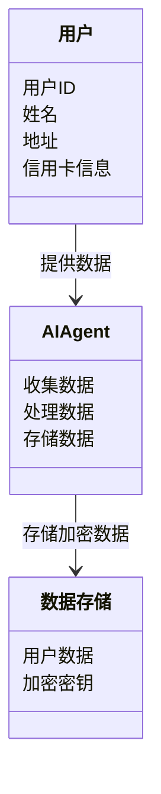
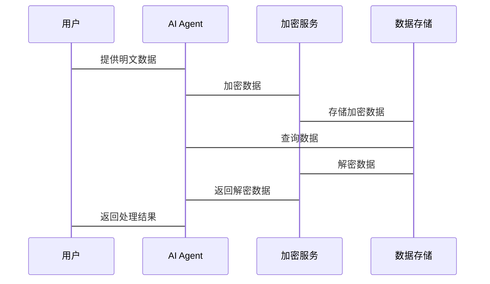

                 


# 第二部分: 隐私保护技术与系统实现

## 第4章: 数学模型与公式

### 4.1 差分隐私的数学模型
差分隐私通过在数据中添加噪声，使得相邻数据集的查询结果差异不超过一个可接受的范围。其概率隐私保证基于置信度参数ε和δ。

#### 4.1.1 差分隐私公式
对于任意两个相邻数据集D和D'，其中D'是D修改一个元素后的数据集，任意函数f，满足：
$$
\Pr[f(D) \in S] \leq \Pr[f(D') \in S] + \frac{1}{\epsilon} \ln\left(\frac{\delta}{\epsilon}\right)
$$

其中，ε是隐私预算，控制隐私泄露的概率，δ是可忽略的参数。

### 4.2 同态加密的数学基础
同态加密允许在加密数据上执行计算，而无需解密。核心是线性同态加密，支持加法和乘法操作。

#### 4.2.1 同态加密公式
假设加密函数为E，解密函数为D，加密密钥为pk，解密密钥为sk。对于明文m1和m2：
$$
E(pk, m1 + m2) = E(pk, m1) \oplus E(pk, m2)
$$
$$
D(sk, E(pk, m1 \times m2)) = m1 \times m2
$$

其中，⊕表示异或操作。

## 第5章: 系统分析与架构设计

### 5.1 项目场景介绍
考虑一个AI客服系统，该系统需要处理用户的敏感信息，如姓名、地址和信用卡信息。系统必须确保这些数据在传输和存储过程中得到保护。

### 5.2 系统功能设计

#### 5.2.1 领域模型


### 5.3 系统架构设计

#### 5.3.1 系统架构图


#### 5.3.2 系统接口设计
- 用户接口：处理用户输入和输出
- AI Agent接口：处理数据加密和解密
- 数据存储接口：管理数据存取

#### 5.3.3 系统交互流程图


## 第6章: 项目实战

### 6.1 环境安装

#### 6.1.1 安装必要的Python库
```bash
pip install numpy cryptography
```

### 6.2 核心代码实现

#### 6.2.1 数据加密模块
```python
import numpy as np
from cryptography.fernet import Fernet

def generate_key():
    key = Fernet.generate_key()
    return key

def encrypt_data(data, key):
    cipher = Fernet(key)
    encrypted_data = cipher.encrypt(data.encode())
    return encrypted_data

def decrypt_data(encrypted_data, key):
    cipher = Fernet(key)
    decrypted_data = cipher.decrypt(encrypted_data).decode()
    return decrypted_data

# 示例使用
key = generate_key()
plaintext = "用户信息"
encrypted = encrypt_data(plaintext, key)
decrypted = decrypt_data(encrypted, key)
print("明文:", plaintext)
print("密文:", encrypted)
print("解密文:", decrypted)
```

#### 6.2.2 隐私保护接口设计
```python
class PrivacyProtector:
    def __init__(self):
        self.key = generate_key()
    
    def protect(self, data):
        return encrypt_data(data, self.key)
    
    def unprotect(self, encrypted_data):
        return decrypt_data(encrypted_data, self.key)
```

### 6.3 实际案例分析

#### 6.3.1 数据加密案例
假设有一个AI客服系统，需要保护用户的信用卡信息。使用上述模块进行加密，确保数据在传输过程中不被泄露。

#### 6.3.2 差分隐私应用
在用户查询处理中，添加噪声以保护用户隐私。例如，用户数量查询时，添加拉普拉斯噪声：
```python
def add_noise(value, epsilon, delta):
    noise = np.random.laplace(0, 1/(epsilon))
    return int(value + noise)
```

## 第7章: 总结与最佳实践

### 7.1 总结
AI Agent和LLM的应用必须在隐私保护方面采取严格措施。通过数据最小化、加密存储、匿名化处理和隐私保护算法（如差分隐私和同态加密），可以有效保护用户数据。

### 7.2 最佳实践
- **数据最小化**：仅收集必要的数据，减少隐私泄露风险。
- **加密存储**：敏感数据必须加密存储，确保数据即使被截获也无法被解密。
- **访问控制**：实施严格的访问控制策略，确保只有授权人员可以访问敏感数据。
- **隐私保护算法**：选择适当的隐私保护技术，平衡隐私保护和数据可用性。
- **数据生命周期管理**：制定明确的数据保留和删除策略，避免长期存储带来的风险。

### 7.3 未来趋势
- **联邦学习**：在不共享原始数据的情况下，通过加密计算共同训练模型。
- **隐私计算框架**：发展新的计算框架，支持隐私保护下的数据协作。

### 7.4 注意事项
- **合规性**：确保所有数据处理符合相关法律法规，如GDPR。
- **透明性**：向用户明确说明数据收集和使用的范围，获得用户的信任。
- **持续监控**：建立数据泄露监控机制，及时发现和应对潜在威胁。

### 7.5 拓展阅读
- 《Data Privacy and Security: Principles and Challenges》
- 《Differential Privacy: A Tutorial》
- 《Homomorphic Encryption: Theory and Applications》

## 作者
作者：AI天才研究院 & 禅与计算机程序设计艺术

