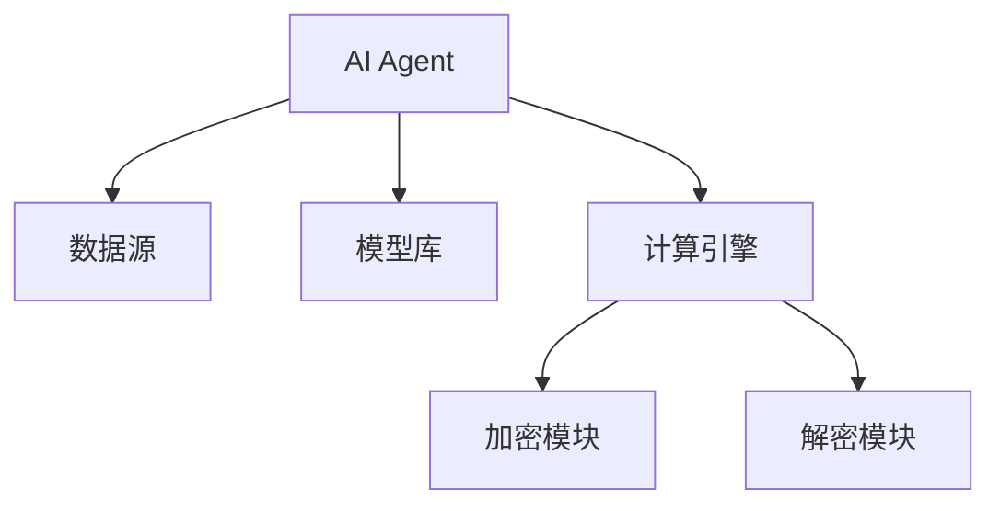

                 


# AI Agent 的隐私计算：在保护数据隐私的同时应用 LLM

> 关键词：AI Agent，隐私计算，数据隐私，LLM，同态加密，差分隐私，系统架构

> 摘要：随着人工智能和大数据技术的快速发展，数据隐私保护成为一个重要问题。AI Agent作为智能系统的核心，如何在保护数据隐私的前提下应用大型语言模型（LLM）是一个具有挑战性的课题。本文将详细探讨AI Agent中的隐私计算技术，包括核心概念、算法原理、系统架构、项目实战以及最佳实践，帮助读者理解如何在保护数据隐私的同时有效应用LLM技术。

---

## 第一部分: 引言

### 1. AI Agent的基本概念

#### 1.1 AI Agent的定义与特点
AI Agent（人工智能代理）是一种智能实体，能够感知环境、自主决策并执行任务。其特点包括：
- **自主性**：能够在没有外部干预的情况下自主运行。
- **反应性**：能够根据环境变化调整行为。
- **目标导向性**：基于目标驱动决策和行动。
- **学习能力**：通过数据和经验不断优化自身性能。

#### 1.2 AI Agent的核心功能与应用场景
AI Agent的核心功能包括：
- 数据采集与处理
- 任务规划与执行
- 决策与推理
- 交互与通信

应用场景包括智能助手、自动驾驶、智能客服、智能推荐系统等。

#### 1.3 AI Agent与传统AI的区别
传统AI通常是指静态的算法和模型，而AI Agent具有动态性、自主性和目标导向性，能够在复杂环境中实时响应和调整。

---

### 2. 隐私计算的基本概念

#### 2.1 隐私计算的定义与特点
隐私计算是一种在保护数据隐私的前提下，对数据进行处理和分析的技术。其特点包括：
- **数据不可见性**：数据在计算过程中保持加密或匿名状态。
- **计算可验证性**：计算结果可以通过验证确保正确性。
- **多方协作性**：支持多方数据源的协作计算。

#### 2.2 隐私计算的核心技术与方法
隐私计算的主要技术包括：
- 同态加密
- 秘密分享
- 差分隐私

#### 2.3 隐私计算的应用场景与优势
应用场景包括金融、医疗、电商等领域，优势在于保护数据隐私的同时实现数据价值的最大化。

---

### 3. AI Agent与隐私计算的结合

#### 3.1 AI Agent在隐私保护中的作用
AI Agent可以通过数据加密、访问控制等手段保护数据隐私。

#### 3.2 隐私计算对AI Agent的支撑
隐私计算为AI Agent提供了安全的数据处理环境，使其能够在保护隐私的前提下完成任务。

#### 3.3 两者的结合与发展趋势
随着数据隐私的重要性不断提升，AI Agent与隐私计算的结合将越来越紧密，成为未来智能系统的核心技术之一。

---

## 第二部分: 核心概念与联系

### 4. 隐私计算的核心技术与实现原理

#### 4.1 同态加密

##### 4.1.1 同态加密的基本原理
同态加密是一种允许在加密数据上进行计算的技术，结果解密后与直接在明文上计算的结果相同。

##### 4.1.2 同态加密的数学基础
同态加密的数学模型如下：
$$
f(m_1, m_2) = c_1 \oplus c_2
$$
其中，$m_1$和$m_2$是明文，$c_1$和$c_2$是对应的密文，$\oplus$是同态操作。

##### 4.1.3 同态加密的实现步骤
- 数据加密
- 计算操作
- 结果解密

#### 4.2 秘密分享

##### 4.2.1 秘密分享的定义与特点
秘密分享是一种将秘密信息分割成多个部分的技术，需要所有部分联合才能恢复秘密。

##### 4.2.2 秘密分享的实现原理
秘密分享的数学模型如下：
$$
S = S_1 \oplus S_2 \oplus \cdots \oplus S_n
$$
其中，$S$是秘密，$S_1, S_2, \cdots, S_n$是分割后的秘密部分。

##### 4.2.3 秘密分享的应用场景
秘密分享常用于数据备份、密钥管理等领域。

#### 4.3 差分隐私

##### 4.3.1 差分隐私的定义与特点
差分隐私是一种通过添加噪声来保护数据隐私的技术，确保单个数据对结果的影响可以被忽略。

##### 4.3.2 差分隐私的数学模型
差分隐私的数学模型如下：
$$
P(y | D) \leq P(y | D') \cdot \epsilon
$$
其中，$D$和$D'$是相邻数据集，$y$是计算结果，$\epsilon$是隐私参数。

##### 4.3.3 差分隐私的实现方法
- 数据处理
- 噪声添加
- 隐私预算管理

---

## 第三部分: 算法原理

### 5. AI Agent中的隐私保护机制

#### 5.1 数据隐私保护

##### 5.1.1 数据加密与解密
数据加密过程：
$$
c = E(m, k)
$$
数据解密过程：
$$
m = D(c, k)
$$
其中，$m$是明文，$c$是密文，$k$是密钥。

##### 5.1.2 数据匿名化处理
数据匿名化是指通过去除或模糊化处理敏感信息，使数据无法被关联到具体个人。

##### 5.1.3 数据访问控制
数据访问控制通过权限管理确保只有授权用户才能访问敏感数据。

#### 5.2 模型隐私保护

##### 5.2.1 模型加密与解密
模型加密过程：
$$
E(w, k) = w \cdot k
$$
模型解密过程：
$$
w = E(w, k) \cdot k^{-1}
$$
其中，$w$是模型参数，$k$是密钥。

##### 5.2.2 模型匿名化处理
模型匿名化是指通过修改模型参数或结构，使模型无法被逆向工程出原始数据。

##### 5.2.3 模型访问控制
模型访问控制通过权限管理确保只有授权用户才能使用敏感模型。

---

## 第四部分: 系统分析与架构设计

### 6. AI Agent的系统架构

#### 6.1 系统功能设计
系统功能模块包括：
- 数据采集模块
- 数据处理模块
- 模型训练模块
- 任务执行模块
- 结果输出模块

#### 6.2 系统架构设计
系统架构设计如图所示：



---

## 第五部分: 项目实战

### 7. 隐私计算在AI Agent中的应用

#### 7.1 环境安装
安装必要的库：
```
pip install --upgrade privacy-toolkit
```

#### 7.2 核心实现源代码
```python
from privacy_toolkit import HomomorphicEncryption

def encrypt_data(data):
    he = HomomorphicEncryption()
    return he.encrypt(data)

def decrypt_data(ciphertext):
    he = HomomorphicEncryption()
    return he.decrypt(ciphertext)

def main():
    plaintext = "Hello, World!"
    ciphertext = encrypt_data(plaintext)
    result = decrypt_data(ciphertext)
    print(f"Plaintext: {plaintext}")
    print(f"Ciphertext: {ciphertext}")
    print(f"Decrypted text: {result}")

if __name__ == "__main__":
    main()
```

---

## 第六部分: 最佳实践与小结

### 8. 最佳实践

#### 8.1 隐私保护注意事项
- 定期审计数据访问日志
- 使用多因素身份验证
- 定期更新加密算法

#### 8.2 小结
本文详细探讨了AI Agent中的隐私计算技术，包括核心概念、算法原理、系统架构和项目实战。通过合理应用隐私计算技术，可以在保护数据隐私的前提下，充分发挥AI Agent的强大能力。

---

## 作者：AI天才研究院/AI Genius Institute & 禅与计算机程序设计艺术 /Zen And The Art of Computer Programming

