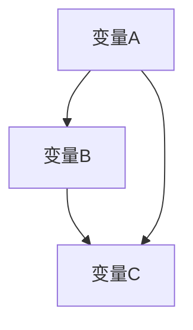
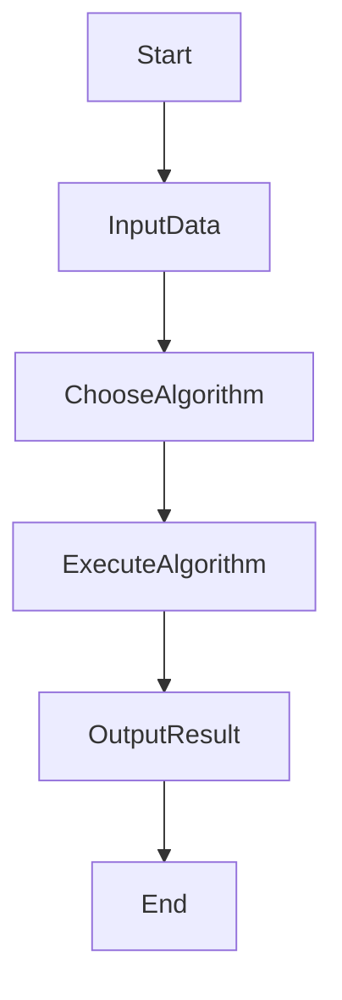
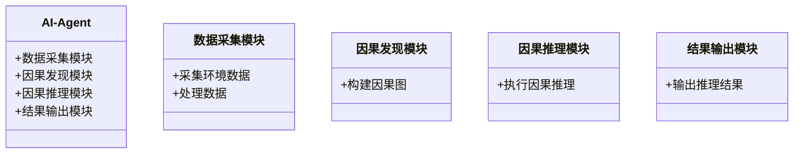
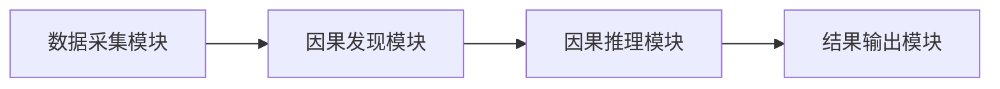

                 


# AI Agent中的因果发现与推理技术

> 关键词：AI Agent，因果发现，因果推理，因果图模型，独立性，条件独立性，干预推理

> 摘要：本文深入探讨了AI Agent中因果发现与推理技术的核心原理、算法实现、系统架构及实际应用。通过详细分析因果关系的定义、因果图模型的构建、因果推理算法的实现，结合实际案例，展示了如何在AI Agent中实现高效的因果发现与推理。本文旨在为AI Agent的开发者和研究人员提供理论支持和实践指导。

---

## 正文

### 第一部分: 背景介绍

#### 第1章: 问题背景

##### 1.1 AI Agent的基本概念
AI Agent（人工智能代理）是指在计算机系统中，能够感知环境并采取行动以实现目标的实体。AI Agent的核心能力包括感知、决策、规划和执行。在复杂环境中，AI Agent需要通过因果推理来理解和预测行动的结果。

##### 1.2 因果发现与推理的必要性
因果发现是指识别变量之间的因果关系，而因果推理则是基于因果关系进行推断的能力。在AI Agent中，因果发现与推理是实现智能决策的关键技术。例如，在医疗领域，AI Agent需要通过因果推理来判断不同治疗方案的效果。

##### 1.3 当前技术的挑战与机遇
当前，因果发现与推理技术在AI Agent中的应用面临以下挑战：
1. **数据稀缺性**：因果关系的发现需要大量的高质量数据。
2. **计算复杂性**：因果推理涉及复杂的数学计算。
3. **动态环境**：AI Agent需要在动态环境中实时进行因果推理。

#### 第2章: 问题描述

##### 2.1 因果关系在AI Agent中的重要性
因果关系是理解变量间相互作用的核心。在AI Agent中，因果推理能够帮助代理预测行动的结果，并优化决策过程。

##### 2.2 现有技术的局限性
现有的因果推理方法主要集中在静态数据的分析，难以应对动态环境中的实时推理需求。

##### 2.3 问题解决的目标与边界
本文旨在通过结合因果发现与推理技术，构建一种高效、可扩展的AI Agent架构，能够在动态环境中实现因果推理。

---

### 第二部分: 核心概念与联系

#### 第3章: 核心概念

##### 3.1 因果关系的定义与特征
因果关系是指一个事件（原因）导致另一个事件（结果）发生的必然联系。因果关系具有**方向性**和**可传递性**。

##### 3.2 因果图模型的基本概念
因果图模型是一种用于表示因果关系的图形化工具。节点代表变量，边代表因果关系。

##### 3.3 独立性与条件独立性的关系
独立性是指两个变量在没有任何条件的情况下互不影响；条件独立性是指在给定其他变量的情况下，两个变量互不影响。

#### 第4章: 实体关系图

##### 4.1 实体关系图的构建
通过Mermaid图展示变量之间的因果关系。



---

### 第三部分: 算法原理讲解

#### 第5章: 因果发现算法

##### 5.1 基于条件独立性的因果发现算法
基于条件独立性的算法通过测试变量之间的条件独立性来构建因果图。

##### 5.2 基于评分的因果发现算法
基于评分的算法通过评分函数对不同因果图进行排序。

##### 5.3 基于约束的因果发现算法
基于约束的算法通过发现变量之间的约束关系来构建因果图。

#### 第6章: 因果推理算法

##### 6.1 反事实推理
反事实推理是一种通过假设相反事实来推断因果关系的方法。

##### 6.2 干预推理
干预推理是通过模拟对变量的干预来预测结果的变化。

##### 6.3 因果路径推理
因果路径推理是通过分析因果路径来确定变量之间的因果关系。

#### 第7章: 算法流程图

##### 7.1 算法流程图的绘制
通过Mermaid图展示算法的执行流程。



---

### 第四部分: 数学模型与公式

#### 第8章: 因果关系的数学表示

##### 8.1 独立性公式
$$P(A,B|C) = P(A|C) \cdot P(B|C)$$

##### 8.2 条件独立性公式
$$P(A|B,C) = P(A|C)$$

##### 8.3 因果关系的数学表达
$$P(Y|do(X)) = \sum_{x} P(Y|x, X=x) P(X=x)$$

---

### 第五部分: 系统分析与架构设计方案

#### 第9章: 系统分析

##### 9.1 问题场景介绍
在医疗领域，AI Agent需要通过因果推理来预测不同治疗方案的效果。

##### 9.2 系统功能设计
系统功能包括数据采集、因果发现、因果推理和结果输出。

##### 9.3 领域模型设计
通过Mermaid类图展示领域模型。



#### 第10章: 系统架构设计

##### 10.1 系统架构图
通过Mermaid图展示系统架构。



---

### 第六部分: 项目实战

#### 第11章: 项目实现

##### 11.1 环境安装
安装Python和相关库（如`scipy`、`networkx`）。

##### 11.2 核心代码实现
```python
import networkx as nx
from causallearn causal discovery algorithms import *
# 示例代码：构建因果图
G = nx.DiGraph()
G.add_edges_from([('A', 'B'), ('B', 'C'), ('A', 'C')])
print(G.edges())
```

##### 11.3 案例分析
通过实际案例分析因果发现与推理的过程。

---

### 第七部分: 最佳实践与总结

#### 第12章: 最佳实践

##### 12.1 小结
本文通过理论分析和实践案例，展示了AI Agent中因果发现与推理技术的核心原理和实现方法。

##### 12.2 注意事项
在实际应用中，需注意数据的质量和算法的可扩展性。

##### 12.3 拓展阅读
推荐相关领域的书籍和论文，进一步深入学习。

---

### 结语

因果发现与推理技术是AI Agent实现智能决策的核心技术。通过本文的深入分析，读者可以更好地理解因果关系的定义、因果图模型的构建、因果推理算法的实现，以及在实际项目中的应用。未来，随着技术的发展，因果发现与推理技术将在更多领域发挥重要作用。

---

### 作者

作者：AI天才研究院/AI Genius Institute & 禅与计算机程序设计艺术 /Zen And The Art of Computer Programming

