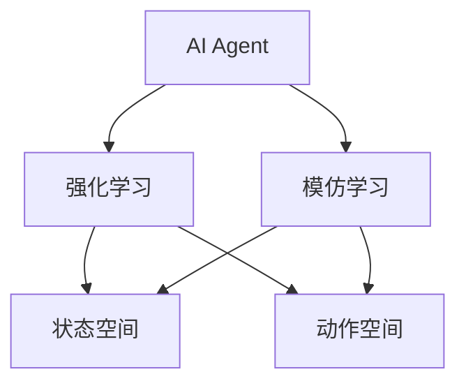
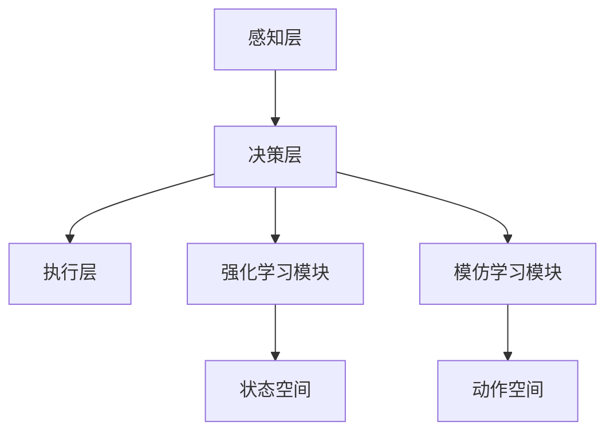

                 


# AI Agent中的强化学习与模仿学习结合

## 关键词
- AI Agent
- 强化学习
- 模仿学习
- 算法结合
- 系统设计

## 摘要
本文探讨了在AI Agent中结合强化学习和模仿学习的方法，详细分析了两种学习方式的核心原理及其在AI Agent中的应用，通过数学模型和算法流程图展示了结合的过程，并通过实际案例分析了结合后的效果和优势。

---

## 第一部分：AI Agent中的强化学习与模仿学习基础

### 第1章：AI Agent的基本概念与学习背景

#### 1.1 AI Agent的定义与特点
- AI Agent的定义：AI Agent是一种智能实体，能够感知环境并采取行动以实现目标。
- 特点：自主性、反应性、目标导向、学习能力。

#### 1.2 强化学习与模仿学习的背景
- 强化学习的起源与发展：从马尔可夫决策过程到深度强化学习。
- 模仿学习的理论基础：从监督学习到逆向强化学习。
- 两种学习方法在AI Agent中的应用：强化学习用于自主决策，模仿学习用于行为规范。

### 第2章：强化学习与模仿学习的核心概念与联系

#### 2.1 强化学习的核心原理
- 状态、动作、奖励的定义与关系：状态是环境的描述，动作是AI Agent的选择，奖励是环境的反馈。
- Q-learning算法：$$ Q(s, a) = Q(s, a) + \alpha [r + \max_{a'} Q(s', a') - Q(s, a)] $$
- 策略梯度方法：通过梯度上升优化策略。

#### 2.2 模仿学习的核心原理
- 最大似然估计：通过监督学习模仿专家行为。
- 逆向强化学习：从专家行为中推导奖励函数。

#### 2.3 强化学习与模仿学习的结合
- 表2.1：强化学习与模仿学习的核心概念对比

| **概念**       | **强化学习**                          | **模仿学习**                          |
|----------------|-------------------------------------|---------------------------------------|
| **目标**       | 最大化累积奖励                        | 拟合专家行为或策略                      |
| **数据来源**    | 环境反馈                             | 专家演示或标注数据                      |
| **学习方式**    | 奖励驱动的试错                        | 监督学习或逆向强化学习                  |
| **应用场景**    | 需要自主决策的环境                    | 需要行为规范的环境                      |

- ER实体关系图：


### 第3章：强化学习与模仿学习的数学模型与算法原理

#### 3.1 强化学习的数学模型
- Q-learning算法：通过状态-动作值函数更新，公式如前所述。
- 策略梯度方法：使用梯度上升优化策略，公式：
$$ \nabla \theta \leftarrow \nabla J(\theta) $$

#### 3.2 模仿学习的数学模型
- 最大似然估计：目标函数为：
$$ \arg \max_{\theta} \sum_{i=1}^{N} \log P(y_i|x_i;\theta) $$
- 逆向强化学习：通过模仿专家行为推导奖励函数。

#### 3.3 强化学习与模仿学习的结合算法
- 使用模仿学习初始化策略，然后通过强化学习优化。
- 示例代码：
```python
def combined_learning(env, expert_policy):
    # 初始化Q值和策略
    Q = np.zeros((state_space, action_space))
    policy = expert_policy  # 使用模仿学习初始化策略
    for episode in range(epochs):
        state = env.reset()
        while not done:
            action = policy.predict(state)
            next_state, reward, done = env.step(action)
            Q[state][action] = Q[state][action] + alpha * (reward + gamma * max(Q[next_state]) - Q[state][action])
            policy.update(Q)
    return Q, policy
```

### 第4章：系统分析与架构设计

#### 4.1 应用场景分析
- AI Agent在游戏、机器人、自动驾驶中的应用。

#### 4.2 系统功能设计
- 感知层：处理输入数据。
- 决策层：执行强化学习和模仿学习算法。
- 执行层：输出行动。

#### 4.3 系统架构图：


### 第5章：项目实战

#### 5.1 环境安装
- 安装Python、深度学习库（如TensorFlow、PyTorch）和强化学习库（如OpenAI Gym）。

#### 5.2 核心代码实现
- 使用强化学习和模仿学习结合的算法实现一个简单的AI Agent。

#### 5.3 案例分析
- 分析在迷宫导航问题中的应用，展示算法的效果。

### 第6章：总结与展望

#### 6.1 最佳实践
- 合理选择学习策略和算法参数。
- 结合实际场景优化系统架构。

#### 6.2 小结
- 强化学习与模仿学习的结合提高了AI Agent的学习效率和行为规范性。

#### 6.3 注意事项
- 确保数据质量和算法的收敛性。
- 注意算法的计算复杂度和实际应用中的效率问题。

#### 6.4 拓展阅读
- 推荐相关书籍和论文，深入学习强化学习和模仿学习的理论与应用。

---

# 作者：AI天才研究院 & 禅与计算机程序设计艺术

---

**本文内容来源于AI技术研究与实践，结合了强化学习与模仿学习在AI Agent中的应用，通过详细分析和实例展示了如何有效地将两者结合，以提升AI系统的智能性和适应性。**

