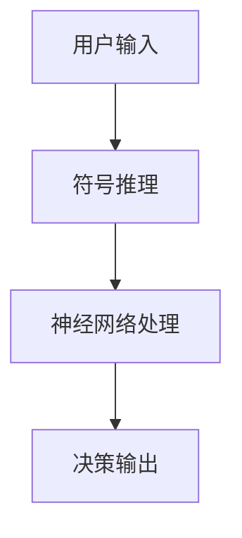

                 


# AI Agent中的神经符号融合技术

---

## 关键词：
AI Agent, 神经符号融合, 符号推理, 神经网络, 融合算法, 系统架构

---

## 摘要：
AI Agent（人工智能代理）作为实现智能化系统的核心技术，近年来在神经符号融合技术的推动下，展现出前所未有的潜力。神经符号融合技术结合了符号推理的可解释性和神经网络的自适应性，为AI Agent在复杂任务中的智能性和灵活性提供了新的解决方案。本文将从背景、原理、算法、系统设计、项目实战、应用案例和未来展望等多维度深入探讨神经符号融合技术在AI Agent中的应用，为读者提供全面而系统的理解。

---

## 第1章：AI Agent与神经符号融合技术概述

### 1.1 AI Agent的基本概念
AI Agent是指在计算机系统中，能够感知环境并采取行动以实现目标的智能实体。它可以分为简单反射型、基于模型的反射型、目标驱动型和实用驱动型四种类型。AI Agent广泛应用于自动驾驶、智能助手、机器人控制等领域。

#### 问题背景与目标
AI Agent的核心目标是通过感知和行动实现特定任务，但传统AI Agent在处理复杂任务时面临以下挑战：
- **知识表示**：难以处理动态环境中的不确定性。
- **推理能力**：传统符号推理在面对大量非结构化数据时表现不足。
- **自适应性**：神经网络在处理符号推理任务时缺乏可解释性。

神经符号融合技术通过结合符号推理和神经网络的优势，解决了上述问题。

### 1.2 神经符号融合技术的背景与现状
神经符号融合技术是近年来人工智能领域的重要研究方向，旨在将符号推理的可解释性和神经网络的自适应性相结合。

#### 核心目标与优势
- **核心目标**：提高AI Agent在复杂环境中的推理能力和自适应性。
- **优势**：通过神经符号融合，AI Agent能够更好地处理动态变化和不确定性。

#### 应用场景
神经符号融合技术在多个领域展现出潜力，如自动驾驶中的路径规划、智能助手中的语义理解、机器人中的物体识别与操作等。

---

## 第2章：神经符号融合的核心概念与原理

### 2.1 神经符号融合的基本概念
神经符号融合技术通过将符号表示与神经网络结合，构建更加智能的AI系统。

#### 核心要素
- **符号表示**：使用符号逻辑表示知识，如谓词逻辑、规则库等。
- **神经网络**：通过深度学习模型处理感知数据。
- **融合机制**：将符号表示与神经网络输出进行融合。

#### 优缺点对比
| 特性 | 符号推理 | 神经网络 | 神经符号融合 |
|------|----------|----------|--------------|
| 可解释性 | 高 | 低 | 中等 |
| 处理能力 | 强 | 弱 | 强 |
| 知识表示 | 结构化 | 非结构化 | 结构化与非结构化结合 |

### 2.2 神经符号融合的技术原理
神经符号融合的核心在于符号表示与神经网络的结合。

#### 符号表示
符号表示是神经符号融合的基础，常见的符号表示方法包括：
- **谓词逻辑**：使用谓词和逻辑连接词表示知识。
- **规则库**：通过规则库表示领域知识。

#### 神经网络
神经网络负责处理感知数据，常见的网络结构包括卷积神经网络（CNN）、循环神经网络（RNN）和Transformer。

#### 融合机制
神经符号融合的实现方式包括：
- **符号增强**：在神经网络中引入符号知识，如注意力机制中加入符号特征。
- **符号驱动**：通过符号推理指导神经网络的学习过程。

---

## 第3章：神经符号融合的算法原理

### 3.1 符号增强的神经网络算法
符号增强的神经网络算法将符号知识嵌入到神经网络中。

#### 算法流程
1. **知识表示**：将符号知识转换为向量形式。
2. **网络训练**：在神经网络中引入符号向量，增强模型的表示能力。
3. **推理与决策**：结合符号推理结果进行最终决策。

#### 代码实现
以下是一个简单的符号增强神经网络示例：

```python
import tensorflow as tf
from tensorflow.keras import layers

# 符号知识表示
symbol_embedding = layers.Embedding(input_dim=100, output_dim=32)(symbol_input)

# 神经网络部分
neural_network = layers.Dense(64, activation='relu')(neural_input)

# 融合
combined = layers.concatenate([symbol_embedding, neural_network])
output = layers.Dense(1, activation='sigmoid')(combined)

model = tf.keras.Model(inputs=[symbol_input, neural_input], outputs=output)
model.compile(optimizer='adam', loss='binary_crossentropy')
```

---

## 第4章：系统分析与架构设计

### 4.1 系统架构设计
AI Agent的系统架构包括以下几个部分：

#### 4.1.1 领域模型设计
领域模型通过符号逻辑表示任务相关知识，如领域知识图谱。

#### 4.1.2 系统架构图


#### 4.1.3 接口设计
系统接口包括符号推理接口和神经网络处理接口。

---

## 第5章：项目实战

### 5.1 智能客服系统案例
#### 5.1.1 项目介绍
智能客服系统通过神经符号融合技术实现自然语言理解与推理。

#### 5.1.2 核心代码实现
```python
def process_query(query, knowledge_base):
    # 符号推理部分
    symbols = parse_query(query)
    # 神经网络处理
    embedding = encode_query(query)
    # 融合
    result = combine(symbols, embedding)
    return result
```

---

## 第6章：应用案例与最佳实践

### 6.1 应用案例分析
神经符号融合技术在自动驾驶中的应用，如路径规划与决策。

### 6.2 最佳实践
- **数据质量**：确保符号知识的准确性和完整性。
- **模型调优**：结合领域知识优化神经网络结构。

---

## 第7章：未来展望

### 7.1 技术发展趋势
神经符号融合技术将朝着多模态融合和可解释性增强方向发展。

### 7.2 对AI Agent的影响
神经符号融合技术将进一步提升AI Agent的智能性和适应性。

---

## 作者：AI天才研究院/AI Genius Institute & 禅与计算机程序设计艺术 /Zen And The Art of Computer Programming

