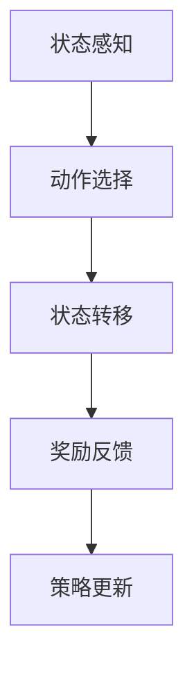
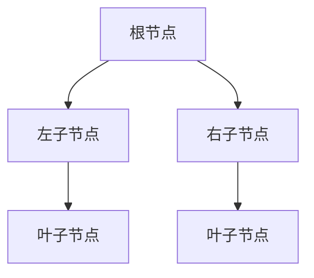
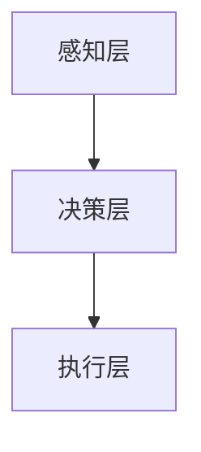
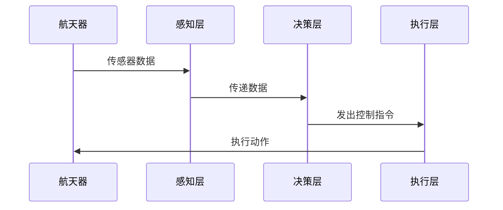

                 


# AI Agent在太空探索中的自主决策系统

## 关键词
AI Agent, 自主决策系统, 太空探索, 算法原理, 系统架构

## 摘要
本文深入探讨了AI Agent在太空探索中的应用，特别是其在自主决策系统中的重要性。通过分析AI Agent的核心概念、算法原理、系统架构，以及实际项目案例，展示了AI Agent如何帮助航天器在复杂环境中做出高效决策。文章还提供了系统设计和实现的最佳实践，为读者提供了全面的技术指导。

---

## 第1章: AI Agent与太空探索背景

### 1.1 AI Agent的基本概念
AI Agent是一种智能实体，能够感知环境并自主决策。它具备以下特点：
- **自主性**：无需外部干预，自主完成任务。
- **反应性**：实时感知环境变化并做出反应。
- **学习能力**：通过数据和经验优化决策能力。

AI Agent与传统自动化的区别在于其智能性和适应性。传统自动化基于预设规则，而AI Agent能够根据环境动态调整行为。

### 1.2 太空探索的背景与挑战
太空探索涉及多个复杂任务，如火星探测、卫星部署等。这些任务面临以下挑战：
- **极端环境**：极寒、辐射等严酷条件。
- **通信延迟**：地球与太空设备之间的通信存在延迟，无法实时控制。
- **任务复杂性**：任务目标多样，需要快速决策。

AI Agent在太空探索中的作用包括：
- **自主导航**：无需地面指令，自主规划路径。
- **故障处理**：在通信中断时，自主修复问题。
- **数据处理**：实时分析数据，优化任务执行。

### 1.3 AI Agent在太空探索中的应用前景
AI Agent在太空探索中的应用前景广阔，包括：
- **深空探测**：如火星车的自主导航。
- **卫星维护**：卫星自我诊断和修复。
- **任务优化**：通过AI优化能源使用和任务调度。

---

## 第2章: AI Agent的核心概念与原理

### 2.1 AI Agent的核心概念
AI Agent的核心概念包括：
- **感知**：通过传感器获取环境信息。
- **推理**：基于感知信息进行逻辑推理。
- **决策**：根据推理结果做出最优决策。

AI Agent的工作原理是一个循环过程：
1. 感知环境。
2. 分析信息。
3. 制定决策。
4. 执行动作。

### 2.2 AI Agent的原理与算法
AI Agent的决策过程涉及多种算法，如强化学习和决策树。强化学习通过试错优化策略，决策树则基于规则进行决策。

#### 强化学习算法
强化学习通过奖励机制优化策略。其流程如下：
1. 状态感知。
2. 动作选择。
3. 状态转移。
4. 奖励反馈。
5. 策略更新。

图1展示了强化学习的流程：



#### 决策树算法
决策树基于规则进行决策，适用于任务明确的场景。图2展示了决策树的结构：



### 2.3 AI Agent的数学模型
AI Agent的决策过程涉及数学模型，如马尔可夫决策过程（MDP）。其数学表达如下：

$$
\pi(a|s) = \max_{a} Q(s,a)
$$

其中，$$\pi(a|s)$$表示在状态$$s$$下选择动作$$a$$的概率，$$Q(s,a)$$表示Q值。

---

## 第3章: AI Agent在太空探索中的系统架构

### 3.1 系统功能设计
AI Agent在太空探索中的系统功能包括：
- **环境感知**：通过传感器获取数据。
- **任务规划**：制定任务执行计划。
- **决策执行**：根据规划执行动作。
- **反馈优化**：根据结果优化决策。

### 3.2 系统架构设计
系统的架构分为感知层、决策层和执行层。图3展示了系统的架构：



### 3.3 系统接口设计
系统接口包括：
- **输入接口**：接收传感器数据。
- **输出接口**：控制执行机构。
- **通信接口**：与地面站通信。

### 3.4 系统交互流程
系统交互流程如下：



---

## 第4章: AI Agent在太空探索中的项目实战

### 4.1 环境安装
项目实战需要安装以下环境：
- **编程语言**：Python 3.8+
- **框架**：TensorFlow、PyTorch
- **依赖库**：numpy、scipy

### 4.2 核心代码实现
以下是强化学习算法的核心代码示例：

```python
import numpy as np

class AIAgent:
    def __init__(self, state_space, action_space):
        self.state_space = state_space
        self.action_space = action_space
        self.q_table = np.zeros((state_space, action_space))

    def感知环境(self, state):
        return state

    def 决策(self, state):
        if np.random.random() < 0.1:
            return np.random.randint(self.action_space)
        else:
            return np.argmax(self.q_table[state])

    def 更新策略(self, state, action, reward):
        self.q_table[state, action] += reward

    def 执行动作(self, action):
        return action
```

### 4.3 代码应用解读与分析
代码解读：
- **初始化**：初始化Q表，记录状态-动作对的奖励值。
- **感知环境**：接收当前状态。
- **决策**：基于当前状态选择动作。
- **更新策略**：根据奖励更新Q表。
- **执行动作**：执行选择的动作。

### 4.4 实际案例分析
以火星探测车为例，AI Agent可以根据地形数据自主规划路径，避开障碍物。

### 4.5 项目小结
通过项目实战，展示了AI Agent在太空探索中的实际应用，验证了其有效性。

---

## 第5章: 总结与展望

### 5.1 总结
本文详细介绍了AI Agent在太空探索中的应用，从核心概念到系统架构，再到项目实战，全面展示了其在自主决策系统中的重要性。

### 5.2 最佳实践 tips
- **数据质量**：确保感知数据的准确性。
- **算法选择**：根据任务需求选择合适算法。
- **系统优化**：持续优化系统性能。

### 5.3 注意事项
- **安全性**：确保系统在极端环境下的稳定性。
- **可解释性**：保证决策过程的可解释性。

### 5.4 拓展阅读
- 推荐阅读《强化学习入门》和《自主系统设计》。

---

## 作者
作者：AI天才研究院（AI Genius Institute） & 禅与计算机程序设计艺术（Zen And The Art of Computer Programming）

