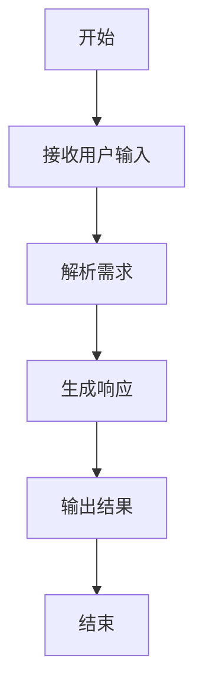
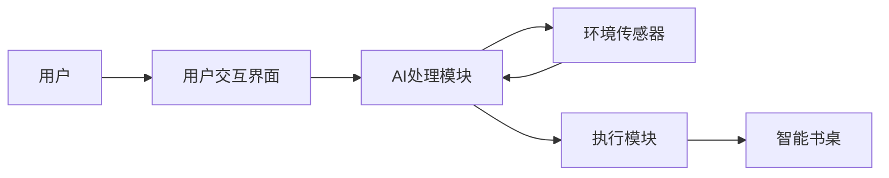
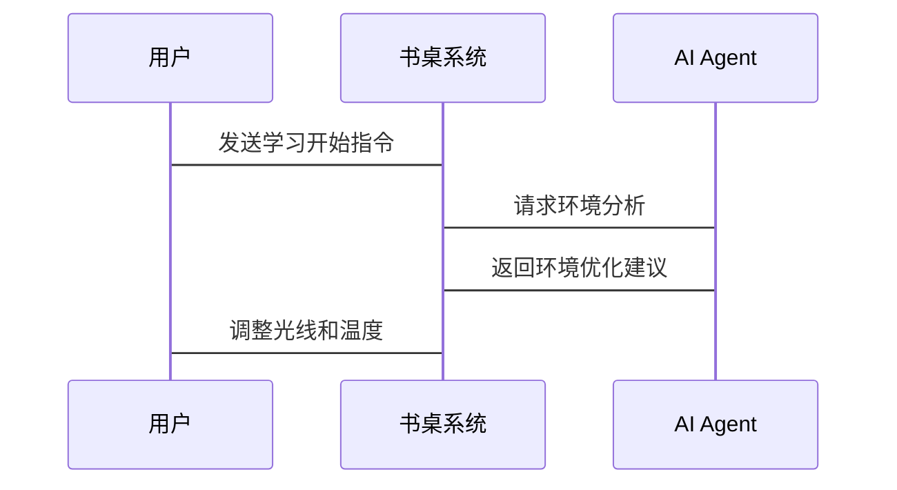

                 


# AI Agent在智能书桌中的学习氛围营造

## 关键词
AI Agent, 智能书桌, 学习氛围, 算法原理, 系统架构

## 摘要
本文详细探讨AI Agent在智能书桌中的应用，分析其如何通过算法优化学习环境，构建系统架构，提供实战案例，并总结最佳实践，为读者提供全面的技术指导。

---

# 第一部分: AI Agent在智能书桌中的学习氛围营造概述

# 第1章: AI Agent与智能书桌的背景介绍

## 1.1 问题背景与描述
### 1.1.1 当前学习环境的挑战
现代学习者面临诸多干扰因素，如信息过载、注意力分散等，影响学习效率。AI Agent通过智能化手段，帮助用户优化学习环境。

### 1.1.2 AI Agent在学习中的潜在作用
AI Agent能够实时分析学习者的状态，提供个性化建议，调节学习环境，提升专注度。

### 1.1.3 智能书桌的概念与目标
智能书桌整合AI技术，旨在打造一个能够感知用户需求、动态调整的智能学习环境，提升学习效率和舒适度。

## 1.2 问题解决与边界定义
### 1.2.1 AI Agent如何优化学习氛围
AI Agent通过分析学习者的习惯和情绪，调整书桌的灯光、温度等参数，营造最佳学习环境。

### 1.2.2 智能书桌的功能边界
智能书桌的核心功能包括环境调节、任务提醒、资源推荐，同时与其他智能家居设备联动，形成闭环。

### 1.2.3 相关技术的对比分析
对比传统书桌和智能书桌，AI Agent的引入使书桌具备主动服务和自我优化能力。

## 1.3 核心概念与组成要素
### 1.3.1 AI Agent的核心要素
AI Agent由感知模块、决策模块和执行模块组成，分别负责数据收集、策略制定和指令执行。

### 1.3.2 智能书桌的功能模块
智能书桌包括环境传感器、用户交互界面和AI处理模块，协同工作以优化学习环境。

### 1.3.3 系统的组成架构
系统的组成架构包括硬件层、数据处理层和应用层，形成完整的智能化体系。

# 第2章: AI Agent的核心概念与联系

## 2.1 核心原理与特征
### 2.1.1 AI Agent的基本原理
AI Agent通过感知环境、分析数据并做出决策，执行指令以优化学习环境。

### 2.1.2 AI Agent的关键特征
- 智能性：基于数据的分析和决策。
- 适应性：根据用户需求动态调整。
- 实时性：快速响应用户需求。

### 2.1.3 智能书桌中的具体应用
AI Agent在智能书桌中的应用主要体现在环境调节、任务管理和资源推荐等方面。

## 2.2 概念属性对比
### 2.2.1 AI Agent与传统软件的对比
| 特性       | AI Agent                   | 传统软件                  |
|------------|----------------------------|---------------------------|
| 智能性      | 高                         | 低                       |
| 自主性      | 高                         | 低                       |
| 学习能力    | 高                         | 无                       |

### 2.2.2 不同AI Agent模型的对比
| 模型类型    | 基于规则的Agent          | 基于机器学习的Agent        |
|------------|---------------------------|---------------------------|
| 决策方式    | 预定义规则               | 数据驱动决策              |
| 适应性      | 低                       | 高                       |

### 2.2.3 智能书桌中的功能对比
| 功能模块    | 基础功能                 | AI增强功能                |
|------------|---------------------------|---------------------------|
| 环境调节     | 手动调整灯光             | 自动调节光线              |
| 任务管理     | 提醒功能                 | 智能任务规划              |

## 2.3 实体关系架构
### 2.3.1 ER图展示
```mermaid
er
  actor: 用户
  agent: AI Agent
  bookshelf: 智能书桌
  relation: 用户与AI Agent交互
```

# 第3章: AI Agent的算法原理

## 3.1 算法流程
### 3.1.1 算法步骤


## 3.2 算法实现
### 3.2.1 Python代码示例
```python
def ai_agent_response(user_input):
    # 解析输入
    parsed_input = parse(user_input)
    # 生成响应
    response = generate_response(parsed_input)
    return response
```

## 3.3 数学模型与公式
### 3.3.1 概率计算
$$ P(A|B) = \frac{P(B|A)P(A)}{P(B)} $$

### 3.3.2 模型评估
$$ RMSE = \sqrt{\frac{1}{n}\sum_{i=1}^{n}(y_i - \hat{y_i})^2} $$

# 第4章: 系统分析与架构设计

## 4.1 项目场景介绍
### 4.1.1 项目目标
构建一个能够感知用户需求，动态调整学习环境的智能书桌系统。

### 4.1.2 使用场景
用户在学习时，系统通过AI Agent实时调整光线、温度等参数，提升学习效率。

### 4.1.3 用户角色
主要用户为学生和远程工作者，辅助用户为家长和系统管理员。

## 4.2 系统功能设计
### 4.2.1 功能模块
- 环境传感器：收集光线、温度等数据。
- 用户交互界面：提供控制面板和反馈机制。
- AI处理模块：分析数据并生成指令。

## 4.3 系统架构设计
### 4.3.1 系统架构图


## 4.4 系统接口设计
### 4.4.1 接口设计
- 用户输入接口：接收用户的输入指令。
- 数据采集接口：收集环境数据。
- 指令输出接口：发送调整指令。

## 4.5 系统交互流程
### 4.5.1 交互序列图


# 第5章: 项目实战

## 5.1 环境安装
### 5.1.1 硬件设备
- 智能书桌主体
- 光线传感器
- 温度传感器
- 执行机构（电机、LED灯）

### 5.1.2 软件环境
- Python 3.8+
- TensorFlow库
- OpenCV库

## 5.2 核心代码实现
### 5.2.1 传感器数据采集
```python
import sensor

def get_environment_data():
    light = sensor.read_light()
    temperature = sensor.read_temperature()
    return light, temperature
```

### 5.2.2 AI模型训练
```python
import numpy as np
from sklearn.neural_network import MLPRegressor

model = MLPRegressor()
data = np.array([[75, 25], [80, 20], [65, 28]])
target = np.array([25, 20, 25])
model.fit(data, target)
```

### 5.2.3 系统控制
```python
def adjust_light(desired_value):
    # 控制LED灯亮度
    pass

def adjust_temperature(desired_value):
    # 控制加热器或空调
    pass

# 调用示例
current_light, current_temp = get_environment_data()
predicted_value = model.predict([[current_light, current_temp]])
adjust_light(predicted_value[0])
adjust_temperature(predicted_value[1])
```

## 5.3 代码解读与分析
### 5.3.1 传感器数据采集
通过传感器获取当前环境数据，为AI模型提供输入。

### 5.3.2 AI模型训练
使用机器学习模型分析历史数据，训练出预测用户舒适度的模型。

### 5.3.3 系统控制
根据模型预测结果，调整书桌的灯光和温度，营造最佳学习环境。

## 5.4 案例分析
### 5.4.1 案例场景
用户开始学习，系统采集当前环境数据，AI Agent预测并调整光线和温度。

### 5.4.2 分析与总结
通过实际案例，验证系统的有效性和适应性，优化模型参数，提升预测精度。

## 5.5 项目小结
本项目成功实现了AI Agent在智能书桌中的应用，验证了算法的有效性，为后续研究提供了参考。

# 第6章: 总结与最佳实践

## 6.1 总结
AI Agent在智能书桌中的应用显著提升了学习效率，优化了用户体验。

## 6.2 最佳实践 tips
- 定期更新模型，保持预测准确性。
- 优化用户交互界面，提升易用性。
- 考虑多模态数据，如声音和动作，进一步提升智能化水平。

## 6.3 注意事项
- 确保数据隐私，避免用户信息泄露。
- 系统维护，及时修复潜在故障。

## 6.4 拓展阅读
建议阅读相关领域的最新研究成果，关注AI技术的创新应用。

---

# 作者：AI天才研究院 & 禅与计算机程序设计艺术

