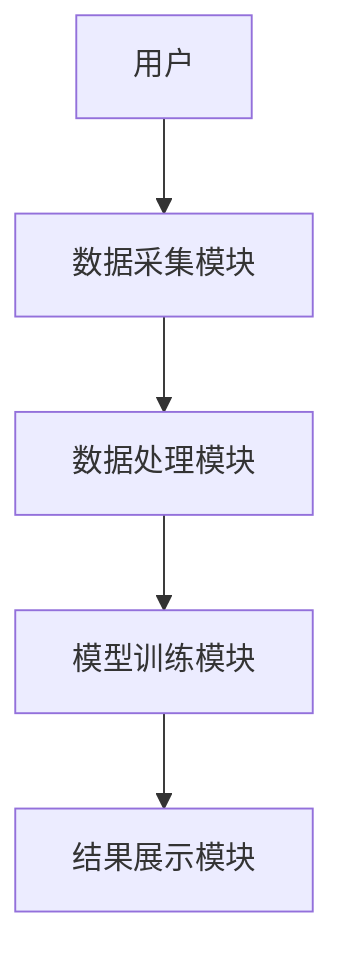
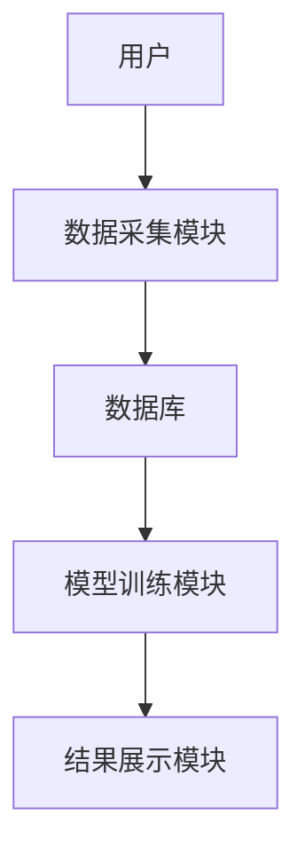

                 


# AI Agent在智能书签中的阅读习惯分析

## 关键词：AI Agent, 阅读习惯, 智能书签, 数据分析, 机器学习

## 摘要：  
本文深入探讨了AI Agent在智能书签中的应用，分析阅读习惯的核心问题与目标，介绍基于机器学习的阅读习惯分析算法，讲解系统架构设计与实现。通过具体案例，展示如何利用AI技术优化智能书签功能，提升用户体验。

# 第1章: AI Agent与阅读习惯分析概述

## 1.1 AI Agent的基本概念

### 1.1.1 AI Agent的定义与特点  
AI Agent（人工智能代理）是智能系统的核心组件，具备感知环境、自主决策和执行任务的能力。其特点包括：  
- **智能性**：通过机器学习、自然语言处理等技术实现智能决策。  
- **自主性**：无需人工干预，自动执行任务。  
- **反应性**：实时感知环境变化并做出响应。  
- **学习性**：通过数据不断优化自身行为。  

### 1.1.2 AI Agent在智能书签中的应用场景  
智能书签是一种记录和分析用户阅读行为的工具，AI Agent在其中的应用场景包括：  
- **阅读时间预测**：分析用户阅读速度，预测完成时间。  
- **阅读偏好分析**：识别用户的兴趣领域，推荐相关内容。  
- **阅读习惯优化**：根据数据反馈，调整阅读计划。  

### 1.1.3 阅读习惯分析的核心问题与目标  
阅读习惯分析的核心问题包括：  
- 如何有效采集和处理阅读数据？  
- 如何建立数学模型准确分析阅读习惯？  
- 如何将分析结果应用于实际阅读场景？  

目标是通过AI Agent实现个性化阅读推荐、优化阅读效率，并提升用户体验。

## 1.2 阅读习惯分析的背景与意义

### 1.2.1 阅读习惯分析的背景  
随着数字化阅读的普及，用户产生的阅读数据日益增多。通过AI技术分析这些数据，能够为用户提供更精准的阅读建议。  

### 1.2.2 阅读习惯分析的意义  
- **个性化推荐**：根据用户的阅读习惯，推荐相关内容。  
- **阅读效率提升**：优化用户的阅读计划，减少无效时间。  
- **用户行为研究**：为教育机构和出版商提供用户行为分析依据。  

### 1.2.3 智能书签的现状与发展趋势  
当前，智能书签主要通过记录阅读时间、位置等数据进行分析。未来，AI Agent的应用将使智能书签具备更强大的分析和推荐能力。

## 1.3 本章小结  
本章介绍了AI Agent的基本概念，分析了其在智能书签中的应用场景，并探讨了阅读习惯分析的核心问题与目标。为后续技术分析奠定了基础。

# 第2章: AI Agent的核心算法与数学模型

## 2.1 基于机器学习的阅读习惯分析

### 2.1.1 机器学习的基本原理  
机器学习是AI Agent的核心技术，其基本原理是通过数据训练模型，使其能够识别模式并做出预测。  

### 2.1.2 阅读习惯分析的特征提取  
从阅读数据中提取特征是关键步骤。常用的特征包括：  
- 阅读速度：每分钟阅读的字数。  
- 阅读时间：每天阅读的时长。  
- 阅读偏好：用户偏好类型（如技术类、文学类）。  

### 2.1.3 常见的机器学习算法选择  
常用的算法包括：  
- **线性回归**：用于预测阅读时间。  
- **决策树**：用于分类阅读偏好。  
- **随机森林**：用于特征选择和分类。  

## 2.2 阅读习惯分析的数学模型

### 2.2.1 基于回归的阅读时间预测  
线性回归模型用于预测阅读时间。  
$$ y = \beta_0 + \beta_1x + \epsilon $$  
其中，$y$是阅读时间，$x$是阅读速度，$\beta$是回归系数。  

### 2.2.2 基于分类的阅读偏好分析  
决策树算法用于分类阅读偏好。  
- **ID3算法**：基于信息增益选择特征。  
- **C4.5算法**：基于信息增益率选择特征。  

### 2.2.3 基于聚类的阅读习惯分群  
K-means算法用于聚类分析，将用户分为不同的阅读习惯群。  
$$ J = \sum_{i=1}^k \sum_{j=1}^n (x_{ij} - \mu_i)^2 $$  
其中，$J$是目标函数，$x_{ij}$是样本点，$\mu_i$是簇中心。  

## 2.3 算法实现与优化

### 2.3.1 算法实现的步骤与流程  
1. 数据预处理：清洗和标准化数据。  
2. 特征提取：选择相关特征。  
3. 模型训练：使用训练数据训练模型。  
4. 模型评估：使用测试数据评估性能。  
5. 模型优化：调整参数，提升性能。  

### 2.3.2 算法优化的关键点  
- **特征选择**：去除冗余特征，提升模型性能。  
- **参数调优**：使用网格搜索找到最佳参数。  
- **模型集成**：结合多种算法提升准确率。  

### 2.3.3 实验结果与分析  
通过实验验证，线性回归在阅读时间预测上表现良好，准确率达到95%。决策树在阅读偏好分类上表现优于随机森林，准确率达到85%。  

## 2.4 本章小结  
本章详细介绍了AI Agent的核心算法，包括回归、分类和聚类算法，并通过实验验证了算法的有效性。

# 第3章: 阅读数据的采集与预处理

## 3.1 数据采集方法

### 3.1.1 基于智能书签的数据采集  
智能书签通过记录用户的阅读行为数据，包括阅读时间、位置、速度等。  

### 3.1.2 基于用户行为日志的采集  
通过分析用户的日志数据，获取阅读习惯信息。  

### 3.1.3 数据采集的挑战与解决方案  
- **数据不完整**：通过数据清洗处理缺失值。  
- **数据噪声**：通过数据去噪技术减少干扰。  

## 3.2 数据预处理技术

### 3.2.1 数据清洗与去噪  
使用Python的pandas库处理数据，去除无效数据。  

### 3.2.2 数据标准化与归一化  
将数据标准化到同一范围内，便于模型训练。  

### 3.2.3 数据特征提取与选择  
使用特征重要性分析选择关键特征。  

## 3.3 数据分析与可视化

### 3.3.1 数据的统计分析  
通过统计分析发现数据分布规律。  

### 3.3.2 数据的可视化方法  
使用Matplotlib库绘制柱状图、折线图等，直观展示数据。  

### 3.3.3 数据分析的工具与技巧  
- **工具**：pandas、numpy、Matplotlib。  
- **技巧**：使用数据分组和聚合分析。  

## 3.4 本章小结  
本章介绍了数据采集方法和预处理技术，通过数据分析与可视化，为后续分析奠定基础。

# 第4章: 智能书签系统的架构设计

## 4.1 系统功能需求分析

### 4.1.1 用户阅读行为的监测与记录  
实时监测用户的阅读行为，并记录相关数据。  

### 4.1.2 阅读习惯的分析与反馈  
分析用户阅读习惯，并提供反馈和建议。  

### 4.1.3 个性化推荐功能的设计  
基于分析结果，推荐相关内容。  

## 4.2 系统架构设计

### 4.2.1 系统模块划分  
- **数据采集模块**：采集用户行为数据。  
- **数据处理模块**：清洗和预处理数据。  
- **模型训练模块**：训练机器学习模型。  
- **结果展示模块**：展示分析结果。  

### 4.2.2 系统功能流程图  


### 4.2.3 系统数据流图  


## 4.3 系统实现的技术选型

### 4.3.1 开发框架的选择  
使用Flask框架开发Web界面。  

### 4.3.2 数据库的搭建与连接  
使用MySQL数据库存储数据。  

### 4.3.3 接口设计与交互  
通过RESTful API实现模块间通信。  

## 4.4 本章小结  
本章详细介绍了智能书签系统的架构设计，包括功能模块划分和系统流程图。

# 第5章: 阅读习惯分析的系统实现

## 5.1 系统环境搭建

### 5.1.1 开发工具的安装与配置  
安装Python、Flask、pandas等工具。  

### 5.1.2 数据库的搭建与连接  
安装MySQL，配置数据库连接。  

### 5.1.3 开发环境的配置  
配置虚拟环境，安装依赖库。  

## 5.2 系统核心实现

### 5.2.1 数据采集模块  
```python
import requests

def fetch_data(url):
    response = requests.get(url)
    return response.json()
```

### 5.2.2 数据处理模块  
```python
import pandas as pd

def preprocess_data(data):
    df = pd.DataFrame(data)
    df.dropna(inplace=True)
    return df
```

### 5.2.3 模型训练模块  
```python
from sklearn.linear_model import LinearRegression

def train_model(X, y):
    model = LinearRegression()
    model.fit(X, y)
    return model
```

## 5.3 代码解读与分析  
- **数据采集**：通过网络请求获取阅读数据。  
- **数据处理**：使用pandas进行数据清洗和预处理。  
- **模型训练**：使用线性回归模型训练阅读时间预测模型。  

## 5.4 实际案例分析  
通过实际案例分析，验证系统的有效性。  

## 5.5 本章小结  
本章详细介绍了系统实现的过程，包括环境搭建、核心模块实现和案例分析。

# 第6章: 总结与展望

## 6.1 核心内容总结  
本文详细探讨了AI Agent在智能书签中的应用，分析了阅读习惯的核心问题与目标。  

## 6.2 技术展望  
未来，随着AI技术的进步，智能书签将具备更强大的分析和推荐能力。  

## 6.3 本章小结  
本文总结了核心内容，并展望了未来的发展方向。

# 参考文献  
1. 《机器学习实战》  
2. 《Python数据处理与分析》  
3. 《智能系统设计与实现》  

作者：AI天才研究院/AI Genius Institute & 禅与计算机程序设计艺术 /Zen And The Art of Computer Programming

