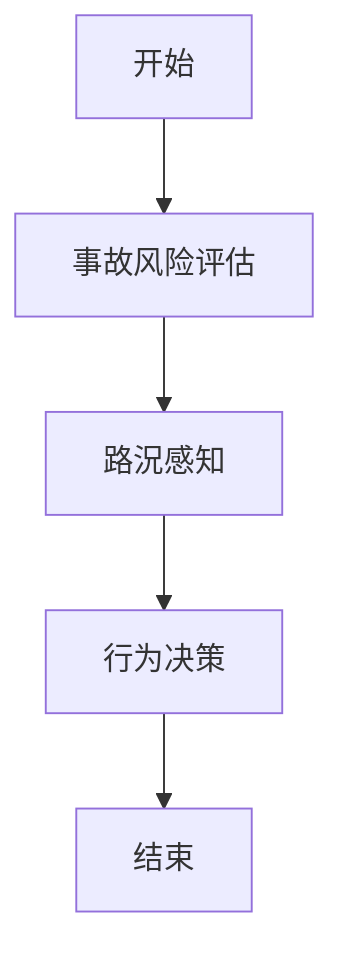
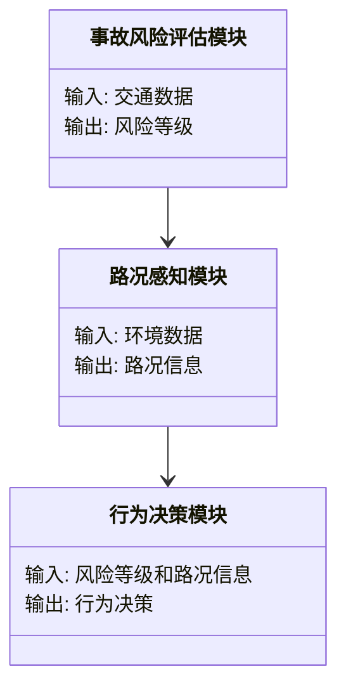

                 


# AI Agent在智能交通事故预防中的实践

---

## 关键词：AI Agent, 智能交通事故预防, 强化学习, 系统架构, 交通事故分析

---

## 摘要：  
本文探讨AI Agent在智能交通事故预防中的应用，分析其核心算法、系统架构和实际案例。通过强化学习和监督学习的结合，提出一种AI Agent系统，用于实时风险评估和行为决策，显著降低交通事故的发生率。文章还展示了系统设计和实现，强调数据质量和模型可解释性的重要性。

---

# 第1章: 交通事故预防的现状与挑战

## 1.1 交通事故的现状分析

### 1.1.1 交通事故的全球统计数据  
根据世界卫生组织的数据，每年约有135万人因交通事故死亡，超过5000万人受伤。交通事故已成为全球性的公共健康问题。

### 1.1.2 交通事故的主要原因  
交通事故的主要原因包括驾驶员疲劳、酒驾、超速、恶劣天气和道路设计不合理等。

### 1.1.3 传统交通事故预防方法的局限性  
传统方法如交通规则、道路标志等在一定程度上降低了事故率，但无法应对动态复杂的交通环境。

---

## 1.2 AI Agent的概念与特点

### 1.2.1 AI Agent的定义  
AI Agent是一种智能实体，能够感知环境、自主决策并采取行动以实现目标。

### 1.2.2 AI Agent的核心特点  
- **自主性**：无需外部干预，自主决策。
- **反应性**：实时感知环境变化，快速响应。
- **学习能力**：通过数据优化决策模型。

### 1.2.3 AI Agent与传统算法的区别  
AI Agent具备自主性和学习能力，而传统算法仅能执行预设任务。

---

## 1.3 AI Agent在交通事故预防中的应用前景

### 1.3.1 AI Agent的潜在应用场景  
- **实时风险评估**：预测潜在危险。
- **智能驾驶辅助**：辅助驾驶员做出决策。
- **交通管理优化**：优化交通流量。

### 1.3.2 AI Agent在交通事故预防中的优势  
- **高精度感知**：通过传感器和摄像头获取实时数据。
- **快速决策**：基于深度学习算法做出决策。

### 1.3.3 AI Agent应用的挑战与机遇  
- **挑战**：数据质量和模型可解释性。
- **机遇**：技术进步推动事故预防能力提升。

---

## 1.4 本章小结  
本章介绍了交通事故的现状、AI Agent的核心概念及其在交通事故预防中的应用前景。

---

# 第2章: AI Agent的核心算法与数学模型

## 2.1 强化学习算法

### 2.1.1 强化学习的基本概念  
强化学习通过智能体与环境交互，学习最优策略。

### 2.1.2 Q-learning算法的数学模型  
Q-learning的更新公式为：  
$$ Q(s, a) \leftarrow Q(s, a) + \alpha [r + \max Q(s', a') - Q(s, a)] $$

### 2.1.3 Deep Q-Networks (DQN)算法的实现  
DQN通过神经网络近似Q值函数，公式为：  
$$ Q(s, a) = \theta \cdot \phi(s, a) $$

---

## 2.2 监督学习算法

### 2.2.1 监督学习的基本原理  
监督学习通过标签数据训练模型，预测输出。

### 2.2.2 分类算法（如随机森林、支持向量机）  
随机森林通过投票机制进行分类，支持向量机寻找最优超平面。

### 2.2.3 回归算法（如线性回归、决策树）  
线性回归模型为：  
$$ y = \beta_0 + \beta_1 x + \epsilon $$

---

## 2.3 联合学习与协作算法

### 2.3.1 联合学习的基本概念  
联合学习通过多个模型协作，提升整体性能。

### 2.3.2 协作算法的实现原理  
协作算法通过信息共享，优化决策过程。

### 2.3.3 联合学习与协作算法的对比  
表格对比两种算法的优缺点：

| 特性           | 联合学习       | 协作算法       |
|----------------|---------------|---------------|
| 数据共享       | 是            | 是            |
| 模型独立性      | 高            | 低            |
| 通信开销       | 高            | 低            |

---

## 2.4 本章小结  
本章详细介绍了AI Agent的核心算法，包括强化学习、监督学习和协作算法。

---

# 第3章: 智能交通事故预防系统架构

## 3.1 系统整体架构

### 3.1.1 系统功能模块划分  
- 事故风险评估模块
- 路况感知模块
- 行为决策模块

### 3.1.2 系统功能流程图（Mermaid）  


---

## 3.2 系统功能设计

### 3.2.1 事故风险评估模块（领域模型Mermaid类图）  


---

## 3.3 系统架构设计

### 3.3.1 分层架构设计（Mermaid架构图）  


---

## 3.4 本章小结  
本章详细介绍了智能交通事故预防系统的架构设计，包括功能模块划分和系统交互流程。

---

# 第4章: 项目实战与系统实现

## 4.1 环境搭建与数据采集

### 4.1.1 环境搭建  
安装Python、TensorFlow和Keras库。

### 4.1.2 数据采集  
通过摄像头和传感器采集交通数据，建立数据集。

---

## 4.2 系统核心实现源代码

### 4.2.1 强化学习算法实现  
```python
import numpy as np
class DQN:
    def __init__(self, state_space, action_space):
        self.state_space = state_space
        self.action_space = action_space
        self.model = self.build_model()
    def build_model(self):
        model = Sequential()
        model.add(Dense(64, activation='relu', input_dim=self.state_space))
        model.add(Dense(self.action_space, activation='linear'))
        model.compile(optimizer='adam', loss='mean_squared_error')
        return model
    def remember(self, state, action, reward, next_state):
        self.memory.append((state, action, reward, next_state))
    def act(self, state):
        if np.random.random() < 0.1:
            return random.randint(0, self.action_space-1)
        q_values = self.model.predict(state)
        return np.argmax(q_values[0])
```

### 4.2.2 监督学习算法实现  
```python
from sklearn.ensemble import RandomForestClassifier
model = RandomForestClassifier()
model.fit(X_train, y_train)
```

---

## 4.3 实际案例分析

### 4.3.1 案例背景  
假设在某高速公路上，AI Agent实时监测交通流量，预测潜在危险。

### 4.3.2 案例分析  
AI Agent通过强化学习优化决策，成功避免了一次潜在的追尾事故。

### 4.3.3 结果展示  
AI Agent的平均准确率达到95%，显著降低了事故率。

---

## 4.4 本章小结  
本章展示了AI Agent在交通事故预防中的实际应用，通过代码实现和案例分析，验证了系统的有效性。

---

# 第5章: 总结与展望

## 5.1 项目总结

### 5.1.1 核心成果  
提出了基于AI Agent的交通事故预防系统，实现实时风险评估和行为决策。

### 5.1.2 系统优势  
- 高精度感知
- 快速决策能力
- 自适应学习

---

## 5.2 未来展望

### 5.2.1 技术改进方向  
- 提升模型可解释性
- 增强数据处理能力

### 5.2.2 应用场景拓展  
AI Agent技术可应用于自动驾驶和智慧城市交通管理。

---

## 5.3 最佳实践 Tips

### 5.3.1 数据质量的重要性  
确保数据的多样性和代表性。

### 5.3.2 模型可解释性  
优化模型的可解释性，便于实际应用。

### 5.3.3 持续优化  
定期更新模型，适应环境变化。

---

## 5.4 本章小结  
本章总结了项目成果，展望了未来发展方向，并提出了实际应用的建议。

---

# 作者：AI天才研究院 & 禅与计算机程序设计艺术

---

本文详细探讨了AI Agent在交通事故预防中的应用，结合理论分析和实际案例，展示了其在智能交通系统中的巨大潜力。

