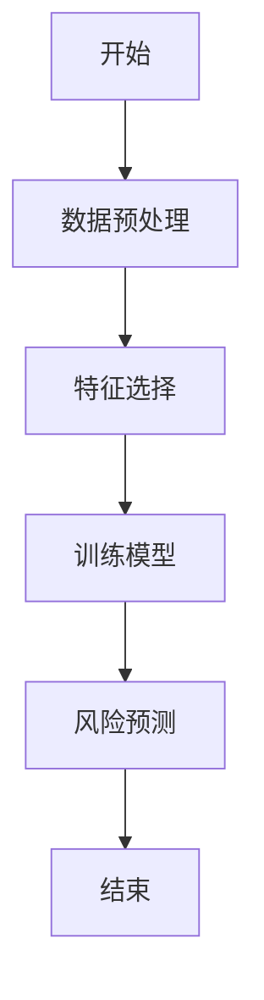
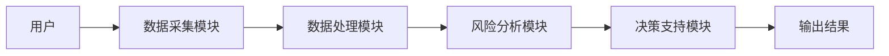
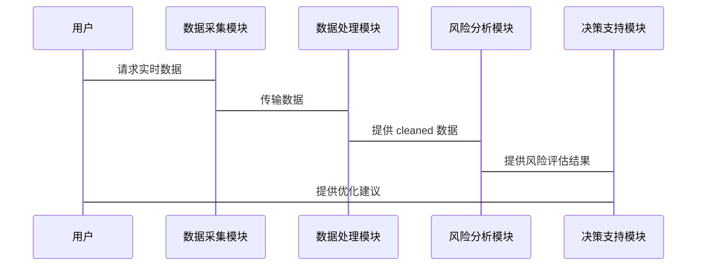

                 


# AI Agent在智能供应链风险管理中的应用

## 关键词：AI Agent, 供应链风险管理, 智能供应链, 风险管理, 人工智能, 供应链优化

## 摘要：  
随着全球供应链的复杂化和不确定性增加，传统供应链管理方法在风险预测和应对方面面临巨大挑战。AI Agent（人工智能代理）作为一种能够自主感知、学习和决策的智能体，正在成为供应链风险管理领域的革命性技术。本文将深入探讨AI Agent在供应链风险管理中的应用，从理论基础到实际案例，详细分析其在风险预测、实时监控和决策优化等方面的优势，并结合具体算法和系统架构，展示如何通过AI Agent实现更高效、更可靠的智能供应链管理。

---

# 第一部分: AI Agent与智能供应链风险管理基础

## 第1章: AI Agent的基本概念与特点

### 1.1 AI Agent的定义与核心要素  
AI Agent（人工智能代理）是一种能够感知环境、自主决策并采取行动的智能实体。与传统软件不同，AI Agent具备以下核心要素：  
- **自主性**：能够在没有外部干预的情况下独立运行。  
- **反应性**：能够实时感知环境变化并做出响应。  
- **学习能力**：通过数据和经验不断优化自身行为。  
- **社交能力**：能够与其他AI Agent或人类进行交互和协作。  

### 1.2 AI Agent的分类与应用场景  
AI Agent可以根据智能水平和应用场景分为以下几类：  
1. **反应式AI Agent**：基于当前输入做出实时反应，适用于简单的任务执行。  
2. **认知式AI Agent**：具备复杂问题解决能力，能够进行推理和规划。  
3. **协作式AI Agent**：能够与其他Agent或人类协作完成任务。  

在供应链管理中的应用场景包括：  
- **库存监控**：实时监测库存水平，预测需求并优化库存管理。  
- **风险预警**：通过数据分析预测潜在风险，如供应链中断或供应商延迟。  
- **决策优化**：基于实时数据和历史数据，优化采购、生产和物流决策。  

---

## 第2章: 供应链风险管理的传统方法与挑战  

### 2.1 供应链风险管理的传统方法  
传统的供应链风险管理方法主要包括以下步骤：  
1. **风险识别**：通过历史数据分析和专家经验识别潜在风险。  
2. **风险评估**：评估风险的严重性和可能性，确定优先级。  
3. **风险应对**：制定应对策略，如增加库存、更换供应商或调整生产计划。  

### 2.2 供应链风险管理的挑战  
尽管传统方法在一定程度上能够应对供应链风险，但仍面临以下挑战：  
1. **数据孤岛**：不同部门和系统之间的数据分散，难以实现全局优化。  
2. **响应延迟**：传统方法依赖于人工分析，无法快速应对突发事件。  
3. **预测精度**：基于历史数据的预测模型在面对复杂多变的市场环境时，精度有限。  

---

# 第二部分: AI Agent在供应链风险管理中的核心原理  

## 第3章: AI Agent的风险预测与评估  

### 3.1 基于机器学习的风险预测模型  
AI Agent可以通过机器学习算法对供应链中的潜在风险进行预测。常用的算法包括：  
1. **随机森林**：通过树状结构进行分类和回归分析，适合处理非线性关系。  
2. **神经网络**：利用深度学习模型捕捉数据中的复杂模式。  
3. **支持向量机（SVM）**：适用于小样本数据的分类问题。  

#### 3.1.1 风险预测的数学模型  
以下是基于随机森林的供应链风险预测模型：  
$$ \text{风险概率} = \sum_{i=1}^{n} w_i \cdot f(x_i) $$  
其中，$w_i$ 是特征$x_i$的权重，$f(x_i)$是特征对风险概率的贡献。  

#### 3.1.2 风险预测的流程图（mermaid）  


### 3.2 基于实时数据的风险评估  

#### 3.2.1 风险评估的算法实现  
AI Agent可以通过实时数据流进行风险评估，以下是基于时间序列分析的算法流程：  

1. 数据采集：从供应链各环节（如供应商、物流节点）采集实时数据。  
2. 数据清洗：去除噪声数据，确保数据质量。  
3. 特征提取：提取关键特征，如交货延迟、供应商信用评分等。  
4. 风险评分：基于机器学习模型计算风险评分，分数范围为0（低风险）到1（高风险）。  

#### 3.2.2 风险评估的数学公式  
风险评分公式如下：  
$$ \text{风险评分} = \alpha \cdot \text{交货延迟} + \beta \cdot \text{供应商信用评分} + \gamma \cdot \text{历史风险数据} $$  
其中，$\alpha$、$\beta$、$\gamma$是各特征的权重系数，可通过训练数据优化得到。  

---

# 第三部分: 系统架构与实现方案  

## 第4章: 智能供应链风险管理系统的架构设计  

### 4.1 系统功能模块划分  
智能供应链风险管理系统的功能模块包括：  
1. **数据采集模块**：从供应链各环节采集实时数据。  
2. **数据处理模块**：清洗、转换和存储数据。  
3. **风险分析模块**：基于机器学习模型进行风险预测和评估。  
4. **决策支持模块**：为供应链管理者提供优化建议和应对策略。  

### 4.2 系统架构设计（mermaid）  


### 4.3 系统交互流程（mermaid）  


---

## 第5章: 项目实战与案例分析  

### 5.1 项目背景与需求分析  
假设某制造企业希望优化其供应链风险管理流程，减少因供应商延迟或物流中断导致的损失。以下是项目需求：  
- 实时监测供应链各环节的状态。  
- 预测潜在风险并提供应对策略。  

### 5.2 系统核心实现  

#### 5.2.1 环境安装  
需要以下工具和库：  
- Python 3.8+  
- Scikit-learn、XGBoost、TensorFlow  
- Pandas、NumPy  
- Flask（用于Web接口）  

#### 5.2.2 核心代码实现  

##### 数据采集与处理  
```python
import pandas as pd
import requests

def fetch_data(api_url):
    response = requests.get(api_url)
    data = response.json()
    df = pd.DataFrame(data)
    return df

# 示例API接口
api_url = "https://api.supplychain.com/riskdata"
df = fetch_data(api_url)
```

##### 风险预测模型  
```python
from sklearn.ensemble import RandomForestClassifier

# 数据预处理
X = df.drop('risk_label', axis=1)
y = df['risk_label']

# 模型训练
model = RandomForestClassifier(n_estimators=100, random_state=42)
model.fit(X, y)

# 预测风险
new_data = X.iloc[[-1]]  # 取最后一行数据进行预测
prediction = model.predict(new_data)
print(f"风险预测结果：{int(prediction[0])}")
```

---

## 第6章: 总结与展望  

### 6.1 总结  
本文详细探讨了AI Agent在供应链风险管理中的应用，从理论基础到系统实现，展示了AI Agent如何通过机器学习算法和实时数据处理优化供应链管理。通过实际案例分析，验证了AI Agent在风险预测和决策支持方面的优势。  

### 6.2 展望  
未来，随着AI技术的不断发展，AI Agent在供应链风险管理中的应用将更加广泛和深入。以下是几点展望：  
1. **更强大的预测能力**：通过深度学习模型（如Transformer）提高风险预测的精度。  
2. **多模态数据融合**：结合文本、图像等多种数据源，提升风险识别的全面性。  
3. **自动化决策系统**：AI Agent将具备更强的自主决策能力，进一步减少人工干预。  

---

# 作者：AI天才研究院 & 禅与计算机程序设计艺术

