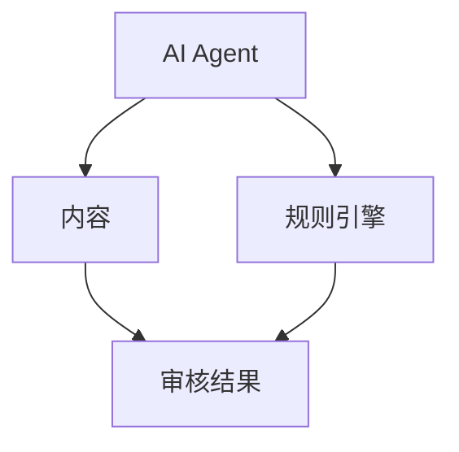
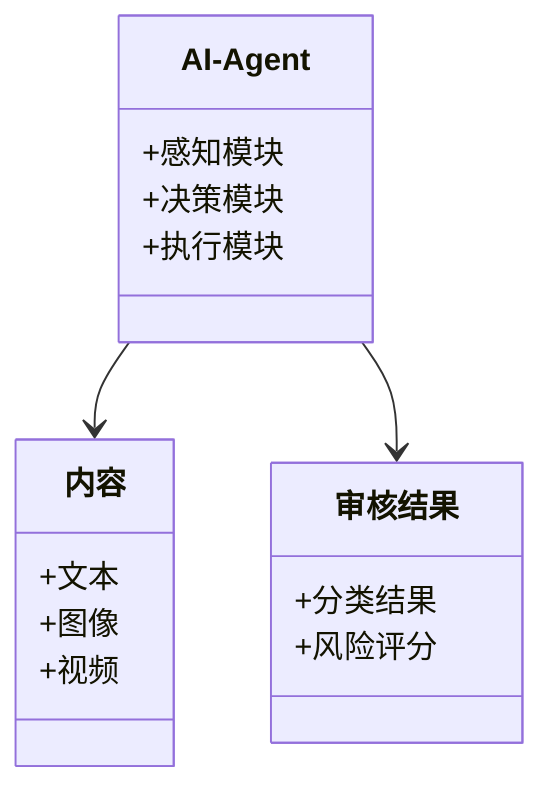
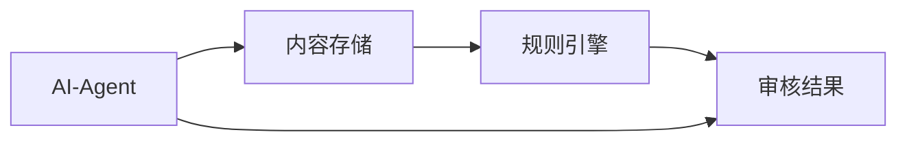
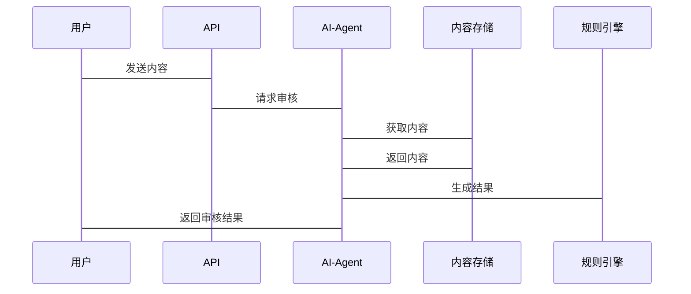

                 


# AI Agent在智能内容审核中的应用

---

## 关键词：
AI Agent, 智能内容审核, 机器学习, 自然语言处理, 图像识别, 系统架构设计

---

## 摘要：
本文深入探讨了AI Agent在智能内容审核中的应用，从核心概念、算法原理、系统架构设计到项目实战，全面解析了AI Agent如何优化内容审核流程。通过具体案例分析和代码实现，展示了AI Agent在文本、图像和视频审核中的强大能力，并提出了实际应用中的注意事项和未来发展方向。

---

## 第一部分：背景介绍

### 第1章：AI Agent与智能内容审核的背景

#### 1.1 问题背景
内容审核是保障网络信息质量的重要环节，传统方法依赖人工审核，存在效率低、成本高、主观性强等问题。AI Agent通过自动化处理，显著提升了审核效率和准确性。

#### 1.2 问题描述
内容审核涉及文本、图像、视频等多种形式，审核标准复杂多样。AI Agent需要具备多模态分析能力，能够处理不同类型的数据，并根据预设规则进行分类和判断。

#### 1.3 问题解决
AI Agent通过机器学习和自然语言处理技术，实现内容的自动化分类、违规内容检测等功能，大幅降低了人工审核的工作量。

#### 1.4 边界与外延
AI Agent在内容审核中的边界主要在于其技术能力的限制，例如对某些复杂场景的判断可能需要人工干预。外延领域包括智能化推荐、用户行为分析等。

#### 1.5 核心概念与组成
AI Agent由感知模块、决策模块和执行模块组成，能够根据输入内容自动生成审核结果，并提供反馈优化。

---

## 第二部分：核心概念与联系

### 第2章：AI Agent的核心原理

#### 2.1 AI Agent的原理
AI Agent通过信息感知、决策和执行三个阶段完成内容审核任务，具备自适应学习能力，能够不断优化审核效果。

#### 2.2 智能内容审核的原理
智能内容审核利用机器学习模型对内容进行分类和识别，结合规则引擎进行风险评估，最终生成审核结果。

#### 2.3 核心概念对比
| 对比维度 | AI Agent | 传统方法 |
|----------|-----------|-----------|
| 处理效率 | 高         | 低         |
| 准确性   | 高         | 中         |
| 可扩展性 | 高         | 低         |

#### 2.4 ER实体关系图


---

## 第三部分：算法原理讲解

### 第3章：AI Agent的算法原理

#### 3.1 分类算法
AI Agent在内容审核中常用分类算法，如朴素贝叶斯、支持向量机（SVM）等。

##### 3.1.1 朴素贝叶斯分类器
- **算法步骤**：
  1. 数据预处理：清洗和归一化。
  2. 训练模型：计算条件概率。
  3. 预测分类：计算后验概率，选择最大概率类别。
- **数学公式**：
  $$ P(y|x) = \frac{P(x|y)P(y)}{P(x)} $$
  其中，$P(x|y)$是类别$y$下特征$x$的概率，$P(y)$是类别$y$的先验概率。

##### 3.1.2 支持向量机（SVM）
- **算法步骤**：
  1. 数据映射：将数据映射到高维空间。
  2. 线性分割：找到最佳分割超平面。
  3. 回归计算：计算支持向量和权重。
- **数学公式**：
  $$ \text{目标函数} = \min_{w, b} \frac{1}{2}||w||^2 + C \sum_{i=1}^n \xi_i $$
  约束条件：
  $$ y_i(w \cdot x_i + b) \geq 1 - \xi_i $$
  $$ \xi_i \geq 0 $$

##### 3.1.3 聚类算法
- **算法步骤**：
  1. 数据预处理：标准化和降维。
  2. 聚类：使用K-means进行聚类。
  3. 结果分析：分配标签。
- **数学公式**：
  $$ \text{目标函数} = \sum_{i=1}^k \sum_{j=1}^n w_{i,j}^2 $$
  其中，$w_{i,j}$是第$i$个聚类中心与第$j$个数据点的权重。

---

## 第四部分：系统分析与架构设计方案

### 第4章：系统架构设计

#### 4.1 项目场景介绍
项目旨在构建一个基于AI Agent的智能内容审核系统，支持多模态数据处理，包括文本、图像和视频。

#### 4.2 系统功能设计
- 文本审核：关键词检测、语义理解。
- 图像审核：图像分类、物体检测。
- 视频审核：内容摘要、行为识别。

#### 4.3 领域模型类图


#### 4.4 系统架构图


#### 4.5 系统接口设计
- API接口：RESTful API，支持POST请求。
- 数据格式：JSON格式，包含内容类型和数据。

#### 4.6 系统交互序列图


---

## 第五部分：项目实战

### 第5章：项目实战

#### 5.1 环境安装
安装Python、TensorFlow、Pillow等库：
```bash
pip install python python-tensorflow pillow
```

#### 5.2 核心代码实现

##### 5.2.1 文本分类代码
```python
import tensorflow as tf
from tensorflow import keras

# 加载预训练模型
model = keras.models.load_model('text_classifier.h5')

# 文本预处理
def preprocess(text):
    # 分词和向量化
    pass

# 预测函数
def predict_class(text):
    preprocessed = preprocess(text)
    prediction = model.predict(preprocessed)
    return prediction.argmax(axis=1)
```

##### 5.2.2 图像分类代码
```python
import cv2
import numpy as np

# 加载预训练模型
model = keras.models.load_model('image_classifier.h5')

# 图像预处理
def preprocess_image(image_path):
    img = cv2.imread(image_path)
    img = cv2.resize(img, (224, 224))
    img = img / 255.0
    return img[np.newaxis, ...]

# 预测函数
def predict_image(image_path):
    preprocessed = preprocess_image(image_path)
    prediction = model.predict(preprocessed)
    return prediction.argmax(axis=1)
```

#### 5.3 代码应用解读
- 文本分类代码利用预训练的神经网络模型进行分类，实现关键词检测和语义理解。
- 图像分类代码使用卷积神经网络（CNN）对图像进行分类，检测敏感内容。

#### 5.4 实际案例分析
- 文本审核案例：检测网络言论中的违规内容。
- 图像审核案例：识别色情图像。
- 视频审核案例：检测暴力行为。

---

## 第六部分：最佳实践、小结、注意事项和拓展阅读

### 第6章：总结与展望

#### 6.1 最佳实践
- 数据质量：确保训练数据的多样性和代表性。
- 模型优化：定期更新模型，适应新出现的违规内容。
- 人机结合：AI Agent与人工审核相结合，提升审核效率和准确性。

#### 6.2 小结
本文系统介绍了AI Agent在智能内容审核中的应用，从核心原理到系统设计，再到项目实战，全面展示了其在实际中的巨大潜力。

#### 6.3 注意事项
- 数据隐私：确保用户数据的安全和隐私。
- 算法透明：保持审核过程的透明，避免黑箱操作。
- 法律合规：遵守相关法律法规，确保审核内容的合法性。

#### 6.4 拓展阅读
- 《深度学习》——Ian Goodfellow
- 《机器学习实战》——Aurélien Géron

---

## 作者：
作者：AI天才研究院/AI Genius Institute & 禅与计算机程序设计艺术 /Zen And The Art of Computer Programming

---

通过本文的系统介绍，读者可以全面了解AI Agent在智能内容审核中的应用，掌握其核心原理和实际实现方法，为未来的研究和实践奠定基础。

