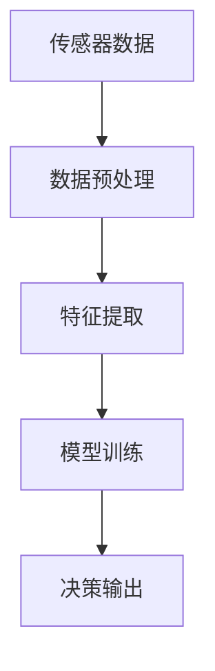
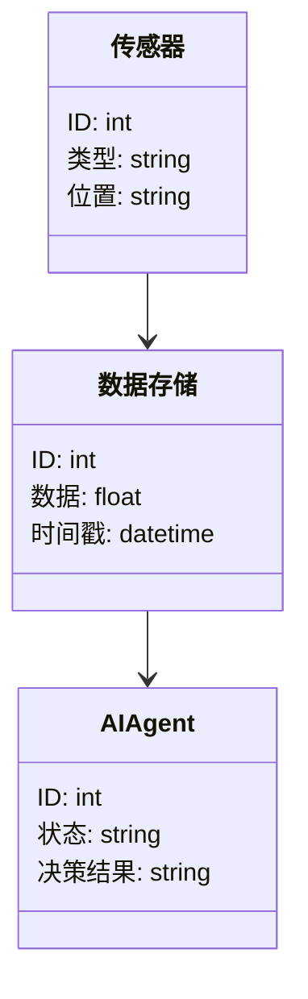
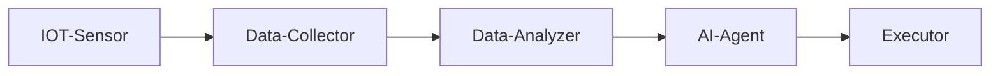
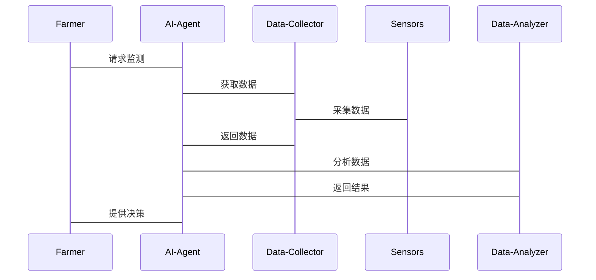

                 


# AI Agent在智能农作物生长监测中的实践

## 关键词：AI Agent, 智能监测, 农作物生长, 物联网, 机器学习, 数据采集

## 摘要：  
本文探讨了AI Agent在智能农作物生长监测中的应用实践。通过背景介绍、核心概念分析、算法原理、系统架构设计、项目实战等部分，详细阐述了AI Agent在农业监测中的核心作用、技术实现和实际应用价值。文章旨在为农业智能化提供技术参考和实践指导。

---

# 第1章: 背景介绍

## 1.1 问题背景

### 1.1.1 农作物生长监测的重要性  
农作物生长监测是确保粮食安全的重要环节。通过实时监测作物的生长状态，农民可以及时发现并解决问题，如病虫害、水分不足等，从而提高产量和质量。

### 1.1.2 传统监测方法的局限性  
传统监测方法依赖人工观察，存在效率低、成本高、覆盖面小等问题。此外，传统方法难以处理大规模农田的数据采集和分析。

### 1.1.3 AI Agent在农业中的潜力  
AI Agent（人工智能代理）能够实时采集、分析数据，并自动执行决策，为农作物生长监测提供了智能化的解决方案。

## 1.2 问题描述

### 1.2.1 农作物生长监测的核心问题  
如何高效、准确地监测作物的生长状态，并实时提供决策支持。

### 1.2.2 数据采集与处理的挑战  
传感器数据的多样性和复杂性，以及如何高效处理这些数据是关键挑战。

### 1.2.3 AI Agent在实时监测中的作用  
AI Agent能够实时分析数据，快速做出决策，帮助农民优化管理。

## 1.3 问题解决

### 1.3.1 AI Agent的定义与特点  
AI Agent是一种能够感知环境、自主决策并执行任务的智能系统。

### 1.3.2 AI Agent在农作物监测中的应用场景  
AI Agent可以用于实时监测作物健康状况、预测病虫害、优化灌溉等。

### 1.3.3 AI Agent与传统农业技术的结合  
AI Agent与物联网、机器学习等技术结合，形成了智能化的农业监测系统。

## 1.4 边界与外延

### 1.4.1 AI Agent在农业中的边界  
AI Agent的应用范围主要集中在数据采集、分析和决策，不涉及具体的农业操作。

### 1.4.2 相关技术的外延  
AI Agent可以与其他技术如物联网、云计算结合，形成更复杂的农业生态系统。

### 1.4.3 实际应用中的限制  
AI Agent的应用受到数据质量、传感器精度和网络环境等因素的限制。

## 1.5 概念结构与核心要素

### 1.5.1 AI Agent的核心要素  
- 传感器：数据采集  
- 数据处理：分析和存储  
- AI模型：决策支持  
- 执行单元：自动操作  

### 1.5.2 农作物生长监测的系统架构  
- 数据采集层  
- 数据分析层  
- 决策执行层  

### 1.5.3 核心概念的对比分析  
| 概念 | 特征 | 描述 |  
|------|------|------|  
| AI Agent | 智能性 | 能够自主决策 |  
| 传感器 | 数据采集 | 实时采集环境数据 |  
| 决策模型 | 分析能力 | 基于数据做出决策 |  

---

# 第2章: 核心概念与联系

## 2.1 AI Agent的原理

### 2.1.1 传感器数据的采集与处理  
AI Agent通过传感器获取环境数据，如温度、湿度、光照等。

### 2.1.2 数据分析与决策模型  
AI Agent利用机器学习算法分析数据，生成决策。

### 2.1.3 AI Agent的执行与反馈  
AI Agent根据决策执行操作，并实时反馈结果。

## 2.2 核心概念对比

### 2.2.1 AI Agent与传统自动化系统的对比  
| 对比维度 | AI Agent | 传统自动化系统 |  
|----------|----------|----------------|  
| 智能性 | 高 | 低 |  
| 自适应性 | 强 | 弱 |  

### 2.2.2 不同AI模型的特征对比  
| 模型 | 特征 | 描述 |  
|------|------|------|  
| 支持向量机 | 分类 | 用于分类作物健康状态 |  
| 神经网络 | 预测 | 用于预测病虫害风险 |  

### 2.2.3 农作物生长监测中的关键指标对比  
| 指标 | 重要性 | 描述 |  
|------|--------|------|  
| 温度 | 高 | 影响作物生长速度 |  

## 2.3 ER实体关系图

```mermaid
er
    entity 农作物 {
        key: ID
        attribute: 类型, 生长阶段, 健康状况
    }
    entity 传感器 {
        key: ID
        attribute: 类型, 位置, 数据类型
    }
    entity AI Agent {
        key: ID
        attribute: 监测目标,
    }
    relationship 监测 {
        农作物 -< AI Agent
        传感器 -> AI Agent
    }
```

---

# 第3章: 算法原理

## 3.1 数据流处理流程



## 3.2 核心算法实现

```python
class AI-Agent:
    def __init__(self, sensors):
        self.sensors = sensors

    def collect_data(self):
        return [s.read() for s in self.sensors]

    def analyze(self, data):
        # 机器学习模型
        model = self.train_model(data)
        return model.predict(data)

    def actuate(self, decision):
        # 执行决策
        pass

    def train_model(self, data):
        # 示例：线性回归模型
        import numpy as np
        X = np.array([x for x in range(len(data))]).reshape(-1, 1)
        y = np.array(data)
        from sklearn.linear_model import LinearRegression
        model = LinearRegression()
        model.fit(X, y)
        return model

    def predict(self, new_data):
        return self.model.predict(new_data)
```

## 3.3 算法原理公式

### 3.3.1 传感器数据处理公式  
$$ y = ax + b $$  

### 3.3.2 机器学习模型的损失函数  
$$ L = \frac{1}{2n} \sum_{i=1}^{n} (y_i - \hat{y}_i)^2 $$  

---

# 第4章: 系统分析与架构设计

## 4.1 问题场景介绍

### 4.1.1 系统需求  
实时监测、数据存储、智能决策。

## 4.2 系统功能设计

### 4.2.1 领域模型设计  


## 4.3 系统架构设计

### 4.3.1 系统架构图  


## 4.4 系统接口设计

### 4.4.1 数据接口  
- 数据采集接口：`GET /api/sensor/data`  
- 数据存储接口：`POST /api/data`

### 4.4.2 AI Agent接口  
- 分析接口：`POST /api/analyze`  
- 决策接口：`GET /api/decision`

## 4.5 系统交互流程图



---

# 第5章: 项目实战

## 5.1 环境安装

### 5.1.1 Python环境安装  
安装Python 3.8及以上版本。

### 5.1.2 依赖库安装  
```bash
pip install numpy pandas scikit-learn
```

## 5.2 系统核心实现

### 5.2.1 数据采集模块  
```python
class Sensor:
    def __init__(self, type, location):
        self.type = type
        self.location = location

    def read(self):
        return random.uniform(0, 1)
```

### 5.2.2 数据分析模块  
```python
from sklearn.linear_model import LinearRegression

class DataAnalyzer:
    def __init__(self):
        self.model = LinearRegression()

    def train(self, X, y):
        self.model.fit(X, y)

    def predict(self, X):
        return self.model.predict(X)
```

### 5.2.3 AI Agent实现  
```python
class AI-Agent:
    def __init__(self, sensors):
        self.sensors = sensors
        self.data_analyzer = DataAnalyzer()

    def collect_data(self):
        data = [s.read() for s in self.sensors]
        return data

    def analyze(self, data):
        X = np.array([i for i in range(len(data))]).reshape(-1, 1)
        self.data_analyzer.train(X, data)
        return self.data_analyzer.predict(X)
```

## 5.3 实际案例分析

### 5.3.1 案例背景  
监测小麦生长，使用温度和湿度传感器。

### 5.3.2 数据分析  
数据采集：每隔1小时采集一次温度和湿度。  
数据分析：使用线性回归模型预测未来7天的温度变化。

### 5.3.3 决策结果  
根据预测结果，调整灌溉和施肥计划。

---

# 第6章: 总结与展望

## 6.1 最佳实践

### 6.1.1 数据质量管理  
确保传感器数据的准确性和完整性。

### 6.1.2 模型优化  
定期更新模型，提高预测精度。

## 6.2 小结

AI Agent在农作物生长监测中的应用显著提高了农业生产的智能化水平。

## 6.3 注意事项

- 数据隐私保护  
- 系统稳定性保障  
- 成本控制  

## 6.4 拓展阅读

- 《机器学习在农业中的应用》  
- 《物联网技术与现代农业》  

---

作者：AI天才研究院 & 禅与计算机程序设计艺术

