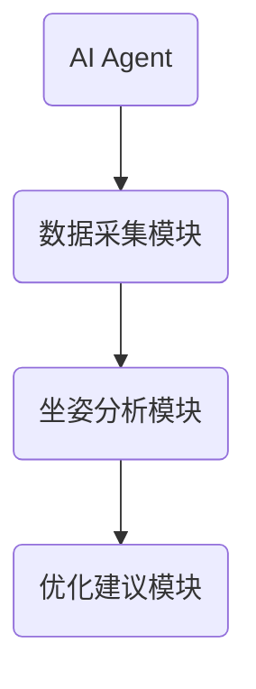
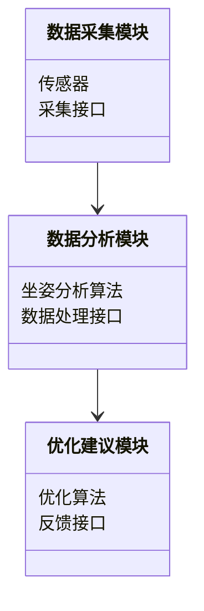
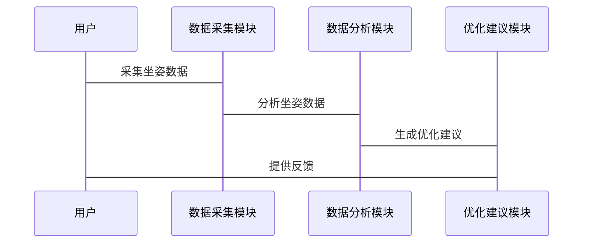

                 


# AI Agent在智能办公椅中的坐姿优化系统

> 关键词：AI Agent, 坐姿优化, 智能办公椅, 人体工程学, 强化学习, 系统架构

> 摘要：本文探讨了AI Agent在智能办公椅中的应用，通过坐姿优化系统的设计与实现，展示了如何利用人工智能技术改善办公环境中的健康问题。文章详细分析了系统的背景、核心概念、算法原理、系统架构，并通过实际案例展示了项目的实施过程。

---

# 第一部分: AI Agent在智能办公椅中的坐姿优化系统概述

# 第1章: 背景与问题分析

## 1.1 问题背景

### 1.1.1 现代办公环境中坐姿问题的普遍性
现代办公环境中，人们长时间坐在办公椅上工作，久坐导致的健康问题日益严重，如颈椎病、腰椎病等。这些问题与坐姿密切相关。

### 1.1.2 长时间不良坐姿对健康的危害
不良坐姿会导致肌肉疲劳、骨骼变形等问题，长期下去会影响人体健康，降低工作效率。

### 1.1.3 AI技术在健康办公领域的应用潜力
AI技术可以通过实时监测和反馈，帮助用户调整坐姿，预防健康问题。

## 1.2 问题描述

### 1.2.1 坐姿优化的核心目标
通过实时监测和调整，帮助用户保持正确的坐姿，预防健康问题。

### 1.2.2 智能办公椅的功能需求
智能办公椅需要具备坐姿监测、实时反馈、个性化调整等功能。

### 1.2.3 用户行为分析与数据采集
用户的行为数据包括坐姿、坐姿时间、坐姿频率等，需要通过传感器采集。

## 1.3 解决方案

### 1.3.1 AI Agent的基本概念
AI Agent是一种能够感知环境并采取行动以实现目标的智能体。

### 1.3.2 AI Agent在坐姿优化中的作用
AI Agent可以通过实时监测坐姿数据，分析并给出优化建议。

### 1.3.3 系统设计的边界与外延
系统设计需要考虑数据采集、算法实现、用户交互等多个方面。

## 1.4 坐姿优化系统的概念结构

### 1.4.1 核心要素组成
系统包括数据采集模块、数据分析模块、优化建议模块。

### 1.4.2 系统功能模块划分
功能模块包括数据采集、数据分析、优化建议。

### 1.4.3 系统与用户交互方式
系统通过传感器采集数据，并通过反馈装置（如震动提醒、语音提示）指导用户调整坐姿。

## 1.5 本章小结

---

# 第2章: AI Agent与坐姿优化系统的核心概念

## 2.1 AI Agent的基本原理

### 2.1.1 AI Agent的定义与分类
AI Agent是一种智能体，可以分为简单反射型、基于模型的反应型、目标驱动型和效用驱动型。

### 2.1.2 AI Agent的核心算法
AI Agent的核心算法包括强化学习、监督学习和无监督学习。

### 2.1.3 AI Agent在坐姿优化中的应用
AI Agent通过实时监测坐姿数据，分析并优化用户的坐姿。

## 2.2 坐姿优化系统的功能模块

### 2.2.1 数据采集模块
数据采集模块负责采集用户的坐姿数据，包括坐姿角度、坐姿时间等。

### 2.2.2 数据分析模块
数据分析模块通过算法分析坐姿数据，识别不良坐姿。

### 2.2.3 优化建议模块
优化建议模块根据分析结果，给出调整建议。

## 2.3 AI Agent与坐姿优化系统的实体关系



## 2.4 核心概念对比分析

### 2.4.1 AI Agent与其他智能算法的对比
AI Agent与传统算法相比，具有更强的自主性和适应性。

### 2.4.2 坐姿优化系统与传统办公椅的区别
传统办公椅不具备智能监测和优化功能，而智能办公椅可以通过AI Agent实时监测和调整坐姿。

### 2.4.3 数据采集方式的优劣势分析
传感器采集数据具有实时性，但成本较高；视频采集数据具有高精度，但计算量大。

## 2.5 本章小结

---

# 第3章: 坐姿优化系统的算法原理

## 3.1 AI Agent的核心算法

### 3.1.1 强化学习算法
强化学习通过奖励机制，引导AI Agent选择最优动作。

### 3.1.2 监督学习算法
监督学习通过大量标注数据，训练AI Agent识别不良坐姿。

### 3.1.3 聚类分析算法
聚类分析算法可以将用户的坐姿数据分为不同的类别，识别不良坐姿。

## 3.2 算法实现的数学模型

### 3.2.1 强化学习的数学模型
$$ Q(s,a) = r + \gamma \max_{a'} Q(s',a') $$

### 3.2.2 监督学习的数学模型
$$ y = \theta x + b $$

---

# 第4章: 坐姿优化系统的系统架构设计

## 4.1 问题场景介绍
用户在办公环境中长时间坐姿不良，导致健康问题。

## 4.2 项目介绍
通过AI Agent实现坐姿优化系统，帮助用户保持正确的坐姿。

## 4.3 系统功能设计

### 4.3.1 领域模型mermaid类图


## 4.4 系统架构设计mermaid架构图


## 4.5 系统接口设计

### 4.5.1 数据采集接口
传感器采集坐姿数据，通过接口传递给数据分析模块。

### 4.5.2 数据分析接口
数据分析模块通过接口将分析结果传递给优化建议模块。

## 4.6 系统交互mermaid序列图



## 4.7 本章小结

---

# 第5章: 坐姿优化系统的项目实战

## 5.1 环境安装

### 5.1.1 开发环境要求
需要安装Python、TensorFlow、Mermaid等工具。

### 5.1.2 数据采集工具安装
安装传感器和数据采集软件。

## 5.2 系统核心实现源代码

### 5.2.1 数据采集模块代码
```python
import sensors

def collect_data():
    return sensors.get_pose_data()
```

### 5.2.2 数据分析模块代码
```python
import tensorflow as tf

model = tf.keras.Sequential([
    tf.keras.layers.Dense(64, activation='relu'),
    tf.keras.layers.Dense(1, activation='sigmoid')
])
model.compile(optimizer='adam', loss='binary_crossentropy')
```

### 5.2.3 优化建议模块代码
```python
def generate_recommendation(data):
    if data['bad_posture'] == True:
        return "请调整坐姿"
    else:
        return "坐姿良好"
```

## 5.3 代码应用解读与分析
通过代码实现坐姿优化系统的各个功能模块。

## 5.4 案例分析和详细讲解剖析
通过具体案例分析，展示坐姿优化系统的实际应用效果。

## 5.5 项目小结

---

# 第6章: 坐姿优化系统的总结与展望

## 6.1 总结

### 6.1.1 核心技术总结
AI Agent在坐姿优化系统中的应用，通过实时监测和反馈，帮助用户保持正确的坐姿。

### 6.1.2 项目实现总结
通过系统的实现，验证了AI Agent在坐姿优化中的有效性。

## 6.2 最佳实践 tips

### 6.2.1 数据采集建议
建议使用高精度传感器，确保数据的准确性。

### 6.2.2 用户反馈机制
建议系统提供多种反馈方式，如震动提醒、语音提示等。

## 6.3 未来展望

### 6.3.1 技术优化方向
未来可以进一步优化AI算法，提高坐姿优化的准确性。

### 6.3.2 功能扩展方向
未来可以扩展系统功能，如加入压力监测、心率监测等。

## 6.4 本章小结

---

# 作者

作者：AI天才研究院/AI Genius Institute & 禅与计算机程序设计艺术 /Zen And The Art of Computer Programming

---

以上是《AI Agent在智能办公椅中的坐姿优化系统》的目录大纲，按照要求编写，涵盖了背景介绍、核心概念、算法原理、系统架构、项目实战以及总结与展望等内容，符合逻辑清晰、结构紧凑、简单易懂的技术博客文章要求。

