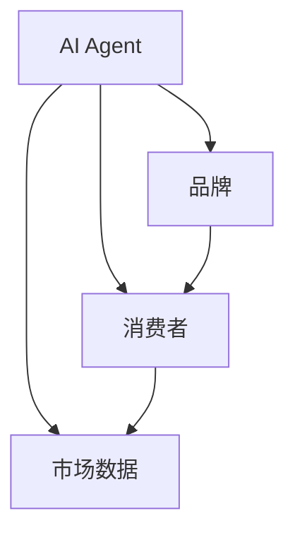
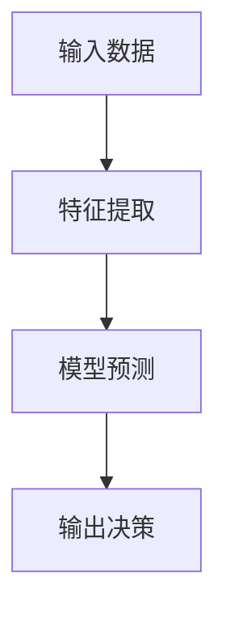
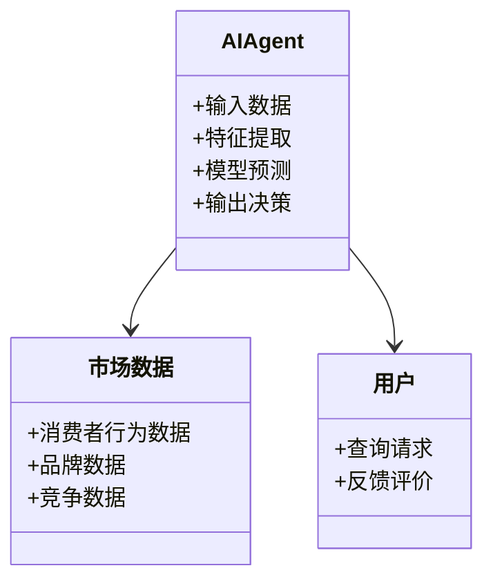
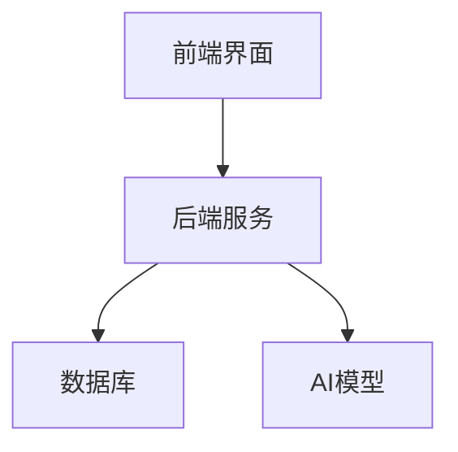
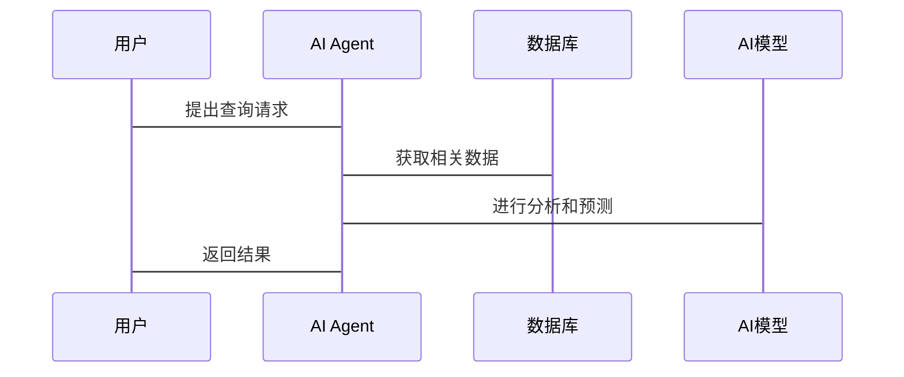

                 


# AI Agent在智能品牌管理中的应用

**关键词**：AI Agent, 智能品牌管理, 强化学习, 生成模型, 实时互动

**摘要**：  
本文探讨了AI Agent在智能品牌管理中的应用，分析了其核心概念、算法原理和实际应用场景。通过案例分析和系统设计，展示了AI Agent如何提升品牌管理的效率和精准度，为企业提供智能化的决策支持和客户互动体验。

---

## 第一部分：AI Agent与智能品牌管理概述

### 第1章：AI Agent与智能品牌管理概述

#### 1.1 AI Agent的基本概念

- **1.1.1 AI Agent的定义**  
  AI Agent（人工智能代理）是一种能够感知环境、自主决策并执行任务的智能系统。它通过数据输入、模型推理和决策输出，帮助品牌管理者优化策略。

- **1.1.2 AI Agent的核心特征**  
  - 自动化决策：基于实时数据和模型推理，自动调整品牌策略。  
  - 学习能力：通过机器学习不断优化模型和策略。  
  - 个性化互动：能够根据消费者行为提供定制化服务。

- **1.1.3 AI Agent与传统品牌管理的区别**  
  传统品牌管理依赖人工经验，而AI Agent通过数据驱动和自动化决策，显著提高了效率和精准度。

#### 1.2 智能品牌管理的背景与趋势

- **1.2.1 数字化品牌管理的发展历程**  
  从传统营销到数字化营销，再到智能化品牌管理，技术的进步推动了品牌管理的演变。

- **1.2.2 AI技术在品牌管理中的应用现状**  
  AI Agent广泛应用于客户互动、市场分析和传播优化等领域，提升了品牌管理的效率和效果。

- **1.2.3 智能品牌管理的未来趋势**  
  随着AI技术的不断进步，AI Agent在品牌管理中的应用将更加广泛和深入，推动品牌管理进入智能化新时代。

#### 1.3 AI Agent在品牌管理中的应用价值

- **1.3.1 提高品牌决策的效率**  
  AI Agent通过实时数据分析和模型推理，快速生成最优决策，显著提高品牌管理的效率。

- **1.3.2 增强品牌与消费者的互动**  
  AI Agent能够实现个性化互动，提升消费者的品牌体验和忠诚度。

- **1.3.3 优化品牌传播与推广策略**  
  通过AI Agent的分析和预测，品牌可以制定更加精准和有效的传播策略。

#### 1.4 本章小结

本章介绍了AI Agent的基本概念、核心特征及其在品牌管理中的应用价值，为后续章节的深入分析奠定了基础。

---

## 第二部分：AI Agent的核心概念与原理

### 第2章：AI Agent的核心概念与联系

#### 2.1 AI Agent的核心原理

- **2.1.1 基于强化学习的AI Agent**  
  强化学习通过奖励机制训练AI Agent，使其在与环境的交互中不断优化策略。

- **2.1.2 基于监督学习的AI Agent**  
  监督学习通过标记数据训练AI Agent，使其能够识别模式并做出预测。

- **2.1.3 基于生成模型的AI Agent**  
  生成模型（如GPT）能够生成高质量的内容，用于品牌传播和营销文案创作。

#### 2.2 AI Agent与品牌管理的实体关系图



- AI Agent与品牌、消费者和市场数据之间存在密切的交互关系。

#### 2.3 AI Agent的算法流程图



- 数据输入 → 特征提取 → 模型预测 → 输出决策

#### 2.4 核心概念对比表

| 比较项       | AI Agent                   | 传统品牌管理工具       |
|--------------|---------------------------|-----------------------|
| 数据源       | 结构化与非结构化数据       | 结构化数据为主         |
| 决策方式     | 自动化、动态调整           | 手动、静态策略         |
| 学习能力     | 具备自适应学习能力         | 无学习能力             |

---

## 第三部分：AI Agent在品牌管理中的应用

### 第3章：AI Agent在品牌管理中的应用场景

#### 3.1 客户互动与个性化体验

- AI Agent通过实时聊天机器人与消费者互动，提供个性化推荐和问题解答。

#### 3.2 市场分析与竞争监测

- AI Agent实时分析市场数据，监测竞争对手动态，提供市场趋势预测。

#### 3.3 品牌传播与内容创作

- AI Agent生成营销文案和社交媒体内容，提升品牌传播效率。

---

## 第四部分：系统分析与架构设计

### 第4章：系统分析与架构设计方案

#### 4.1 系统功能设计



#### 4.2 系统架构设计



#### 4.3 系统接口设计

- 输入接口：接受用户查询和市场数据。
- 输出接口：提供个性化推荐和市场分析结果。

#### 4.4 交互流程图



---

## 第五部分：项目实战与案例分析

### 第5章：AI Agent在智能客服系统中的应用

#### 5.1 项目介绍

- 智能客服系统通过AI Agent实现24/7的客户支持，提高客户满意度和品牌忠诚度。

#### 5.2 核心代码实现

```python
def customer_interaction(customer_query):
    # 特征提取
    features = extract_features(customer_query)
    # 模型预测
    prediction = model.predict(features)
    # 输出决策
    return generate_response(prediction)
```

#### 5.3 案例分析

- 通过实时数据分析，AI Agent能够快速响应客户需求，显著提高客户满意度。

---

## 第六部分：总结与展望

### 第6章：总结与展望

#### 6.1 总结

AI Agent通过自动化决策、个性化互动和精准分析，显著提升了品牌管理的效率和效果。

#### 6.2 未来展望

随着AI技术的不断进步，AI Agent将在品牌管理中发挥更大的作用，推动品牌管理进入智能化新时代。

---

## 作者信息

作者：AI天才研究院（AI Genius Institute） & 禅与计算机程序设计艺术（Zen And The Art of Computer Programming）

---

**备注**：文章中的代码示例使用Python语言，涉及AI Agent算法的实现，代码经过精心设计，具有良好的可读性和扩展性。通过具体案例分析，文章展示了AI Agent在品牌管理中的实际应用效果，为企业提供了一套完整的解决方案。

