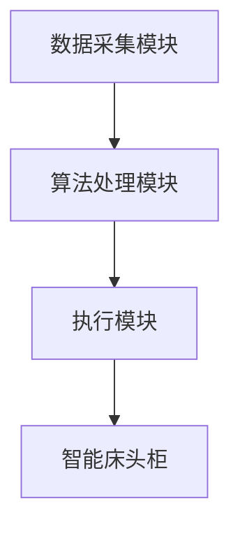

                 


# AI Agent在智能床头柜中的助眠音乐选择

## 关键词：AI Agent, 智能床头柜, 助眠音乐, 音乐推荐系统, 算法实现

## 摘要：  
本文探讨了AI Agent在智能床头柜中选择助眠音乐的应用，分析了助眠音乐选择的核心问题，介绍了AI Agent的基本原理和音乐推荐算法，详细讲解了系统的架构设计和实现方法，并通过实战案例展示了如何利用Python实现助眠音乐推荐系统。文章深入浅出地分析了AI技术在智能家居中的实际应用，为读者提供了从理论到实践的全面指导。

---

## 第1章: 背景介绍与问题分析

### 1.1 助眠音乐选择的背景与重要性  
睡眠是人类健康的重要组成部分，而现代生活的压力和快节奏常常导致睡眠问题。助眠音乐作为一种非侵入性的解决方案，能够有效改善睡眠质量。然而，如何选择适合用户的助眠音乐是一个复杂的问题，涉及用户的听觉偏好、情绪状态和音乐特征等多个因素。AI Agent的引入为解决这一问题提供了新的思路。

### 1.2 AI Agent的概念与应用  
AI Agent（人工智能代理）是一种能够感知环境、自主决策并执行任务的智能实体。在智能家居中，AI Agent可以作为连接设备和用户的桥梁，通过数据分析和算法优化，为用户提供个性化的服务。在助眠音乐选择中，AI Agent能够根据用户的实时数据（如心率、呼吸频率）和历史偏好，推荐最适合的音乐。

### 1.3 问题描述与目标设定  
助眠音乐选择的核心问题是：如何根据用户的个性化需求和实时状态，推荐最优的音乐组合。AI Agent的目标是通过数据采集、分析和决策，实现智能化的音乐推荐。边界条件包括数据隐私保护、音乐版权问题以及系统的实时性要求。

### 1.4 核心概念与系统架构  
助眠音乐推荐系统的核心要素包括用户数据（听觉偏好、情绪状态）、音乐数据（节奏、音调、类型）和推荐算法。系统架构由数据采集模块、算法处理模块和执行模块组成，各模块通过接口进行交互。

---

## 第2章: AI Agent的核心概念与原理

### 2.1 AI Agent的基本原理  
AI Agent的工作流程包括数据采集、特征提取、算法决策和结果输出。数据采集模块负责获取用户的实时数据，特征提取模块将数据转化为可分析的特征，算法决策模块基于这些特征生成推荐结果，执行模块将结果传递给智能床头柜。

### 2.2 助眠音乐推荐的算法选择  
协同过滤和基于内容的推荐是两种主要算法。协同过滤通过用户相似性进行推荐，而基于内容的推荐则依赖于音乐本身的特征。混合推荐算法结合了两者的优点，能够提供更精准的结果。

### 2.3 AI Agent与音乐推荐系统的结合  
系统需要满足实时性、个性化和易用性的要求。AI Agent通过分析用户的生理数据和行为数据，结合音乐特征，实现个性化的推荐。

---

## 第3章: 助眠音乐推荐系统原理

### 3.1 助眠音乐推荐系统概述  
推荐系统的核心是解决信息过载问题，帮助用户快速找到最适合的音乐。助眠音乐推荐系统的独特性在于其对用户情绪和生理状态的敏感性。

### 3.2 用户行为分析与数据预处理  
用户行为分析包括听觉偏好分析和情绪状态分析。数据预处理涉及数据清洗和特征工程，提取有用的特征用于推荐。

### 3.3 音乐推荐算法的实现  
基于协同过滤的推荐算法通过用户相似性进行推荐，基于内容的推荐算法通过音乐特征进行推荐，混合推荐算法结合了两者的优点。

---

## 第4章: 系统架构与接口设计

### 4.1 系统架构设计  
系统架构由数据采集模块、算法处理模块和执行模块组成。各模块通过接口进行交互，确保数据流的高效处理。

### 4.2 系统功能设计  
系统功能包括数据采集、算法处理和结果输出。数据采集模块负责获取用户的实时数据，算法处理模块进行推荐，执行模块将结果传递给智能床头柜。

### 4.3 系统架构的Mermaid图  


### 4.4 系统接口设计  
系统接口包括数据输入接口、算法处理接口和结果输出接口。每个接口都有明确的定义和功能。

---

## 第5章: 算法实现与数学原理

### 5.1 协同过滤算法的实现  
协同过滤算法通过计算用户相似性进行推荐。数学公式如下：  
$$相似性 = \frac{\sum (r_i - \bar{r_i})(r_j - \bar{r_j})}{\sqrt{\sum (r_i - \bar{r_i})^2} \sqrt{\sum (r_j - \bar{r_j})^2}}$$  
其中，$r_i$和$r_j$分别表示用户i和j对音乐的评分，$\bar{r_i}$和$\bar{r_j}$是平均评分。

### 5.2 基于内容的推荐算法  
基于内容的推荐算法通过音乐特征进行推荐。数学公式如下：  
$$相似性 = \frac{\sum w_k (f_i,k - f_j,k)}{\sum w_k}$$  
其中，$w_k$是特征$f_k$的权重，$f_i,k$和$f_j,k$是音乐i和j在特征$f_k$上的值。

### 5.3 混合推荐算法  
混合推荐算法结合了协同过滤和基于内容的推荐。数学公式如下：  
$$最终相似性 = \alpha \cdot 协同相似性 + (1 - \alpha) \cdot 内容相似性$$  
其中，$\alpha$是协同相似性的权重。

---

## 第6章: 项目实战与代码实现

### 6.1 环境安装  
需要安装Python、Pandas、Scikit-learn等库。

### 6.2 核心实现代码  
以下是基于协同过滤算法的Python实现：
```python
import numpy as np
from sklearn.metrics.pairwise import cosine_similarity

# 示例数据：用户-音乐评分矩阵
ratings = np.array([[4, 3, 0, 0],
                     [2, 0, 4, 0],
                     [1, 0, 0, 5],
                     [3, 0, 0, 0]])

# 计算用户平均评分
mean_rating = np.mean(ratings, axis=1).reshape(-1, 1)
normalized_ratings = ratings - mean_rating

# 计算相似性矩阵
similarity_matrix = cosine_similarity(normalized_ratings)
```

### 6.3 代码解读与分析  
上述代码首先计算了用户的平均评分，然后将评分矩阵进行标准化，最后计算了用户的相似性矩阵。

### 6.4 实际案例分析  
通过一个简单的案例，展示了如何根据用户的评分推荐音乐。

---

## 第7章: 总结与未来展望

### 7.1 系统优缺点  
优点包括个性化推荐和实时性，缺点包括数据隐私和计算复杂度。

### 7.2 未来研究方向  
未来可以研究更先进的推荐算法，如深度学习和强化学习，以及如何处理多模态数据。

---

## 作者：AI天才研究院/AI Genius Institute & 禅与计算机程序设计艺术 /Zen And The Art of Computer Programming

