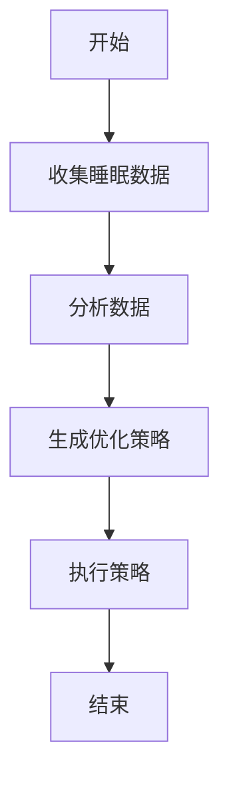
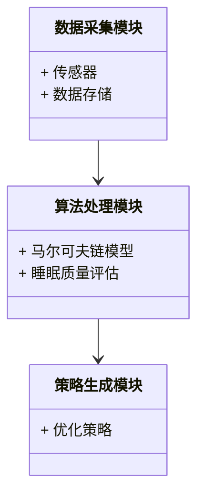

                 


# AI Agent在智能床头柜中的睡眠周期优化

> **关键词**：AI Agent，智能床头柜，睡眠周期优化，算法原理，系统架构，项目实战

> **摘要**：本文详细探讨了AI Agent在智能床头柜中的应用，重点分析了睡眠周期优化的核心原理、算法模型、系统架构设计以及实际项目实现。通过理论与实践结合，展示了如何利用AI技术提升睡眠质量。

---

# 第1章 AI Agent与睡眠周期优化背景

## 1.1 睡眠周期与健康的重要性

### 1.1.1 睡眠周期的科学定义

睡眠周期是指人在睡眠过程中经历的不同阶段，主要包括浅睡期、深睡期和 REM 睡眠期。每个阶段的时长和顺序因人而异，但整体周期通常为90分钟，循环进行。

**公式**：睡眠周期时间 \( T = 90 \, \text{分钟} \)

### 1.1.2 睡眠周期对身体与心理的影响

睡眠周期对身体修复、记忆巩固和情绪调节至关重要。缺乏高质量的睡眠会导致疲劳、注意力不集中和免疫力下降。

### 1.1.3 睡眠健康的重要性

良好的睡眠是健康的基础，直接影响生活质量。优化睡眠周期有助于提高工作效率和幸福感。

## 1.2 AI Agent的基本概念

### 1.2.1 AI Agent的定义与特点

AI Agent是一种智能体，能够感知环境并采取行动以实现目标。其特点包括自主性、反应性、目标导向和学习能力。

### 1.2.2 AI Agent在智能家居中的应用

AI Agent广泛应用于智能家居设备，如智能音箱和空调，通过学习用户习惯提供个性化服务。

### 1.2.3 AI Agent与睡眠优化的结合

AI Agent通过分析用户的睡眠数据，调整床头柜的环境设置，如光线和温度，以优化睡眠质量。

## 1.3 智能床头柜的功能与优势

### 1.3.1 智能床头柜的功能模块

智能床头柜通常配备环境控制、睡眠监测和智能交互功能。

### 1.3.2 AI Agent在智能床头柜中的作用

AI Agent通过分析睡眠数据，动态调整床头柜设置，改善睡眠质量。

### 1.3.3 智能床头柜的优势与市场前景

智能床头柜通过AI技术提供个性化服务，市场前景广阔，尤其在健康意识增强的背景下。

---

# 第2章 AI Agent与睡眠优化的核心原理

## 2.1 AI Agent的核心原理

### 2.1.1 AI Agent的基本工作原理

AI Agent通过传感器获取数据，利用算法进行分析，并采取相应行动。

### 2.1.2 AI Agent的学习与自适应能力

AI Agent通过机器学习不断优化算法，适应用户的睡眠习惯。

### 2.1.3 AI Agent在睡眠优化中的应用

AI Agent分析睡眠数据，优化床头柜设置，如灯光和温度。

## 2.2 睡眠周期优化的核心原理

### 2.2.1 睡眠周期的科学模型

睡眠周期模型包括多个阶段，AI Agent通过调整这些阶段的时间分布，优化整体睡眠质量。

### 2.2.2 睡眠阶段的特征分析

每个睡眠阶段都有独特的特征，AI Agent通过识别这些特征，判断当前阶段并采取相应措施。

### 2.2.3 睡眠质量的评估标准

睡眠质量通过深度睡眠时间、REM 睡眠比例和睡眠连续性等指标评估。

## 2.3 AI Agent与睡眠优化的结合原理

### 2.3.1 数据采集与分析

AI Agent通过传感器采集用户的睡眠数据，分析后生成优化策略。

### 2.3.2 AI算法在睡眠优化中的应用

算法包括聚类分析、分类和回归，用于预测最佳睡眠时间和阶段。

### 2.3.3 AI Agent的反馈与调整机制

AI Agent根据反馈不断调整策略，优化睡眠质量。

## 2.4 核心概念对比表

| 比较项       | AI Agent                  | 传统算法               |
|--------------|---------------------------|------------------------|
| 自适应能力   | 强                        | 弱                    |
| 反应速度     | 快                        | 中                    |
| 个性化       | 高                        | 低                    |

## 2.5 实体关系图

```mermaid
er
    %% 实体关系图
    %% 实体：AI Agent、智能床头柜、睡眠数据、优化策略
    %% 关系：AI Agent收集睡眠数据，生成优化策略，智能床头柜执行策略。
    %% 睡眠数据影响优化策略。
    classDiagram
        class AI Agent {
            - 睡眠数据
            - 优化策略
        }
        class 智能床头柜 {
            + 环境设置
        }
        class 睡眠数据 {
            + 时间戳
            + 心率
            + 呼吸频率
        }
        class 优化策略 {
            + 睡眠阶段划分
            + 温度设置
            + 光线调节
        }
        AI Agent --> 睡眠数据: 收集
        AI Agent --> 优化策略: 生成
        智能床头柜 --> 优化策略: 执行
```

---

# 第3章 睡眠周期优化算法的数学模型

## 3.1 睡眠阶段的数学建模

睡眠阶段可以用马尔可夫链模型表示，每个阶段的转移概率决定了睡眠周期的动态变化。

### 3.1.1 睡眠阶段的转换概率模型

睡眠阶段的转换概率可以用矩阵表示：

$$
P = \begin{bmatrix}
0.9 & 0.1 & 0 \\
0.1 & 0.8 & 0.1 \\
0 & 0.1 & 0.9
\end{bmatrix}
$$

其中，P[i][j]表示从阶段i转移到阶段j的概率。

### 3.1.2 基于马尔可夫链的睡眠阶段预测

通过马尔可夫链模型，可以预测未来的睡眠阶段，从而优化睡眠周期。

## 3.2 睡眠质量评估的数学模型

睡眠质量可以用综合指数表示：

$$
Q = \alpha \cdot D + \beta \cdot R + \gamma \cdot C
$$

其中，D是深度睡眠时间，R是REM 睡眠比例，C是睡眠连续性，α、β、γ是权重系数。

## 3.3 AI Agent优化睡眠周期的算法实现

### 3.3.1 算法流程



### 3.3.2 Python代码实现

```python
import numpy as np

# 睡眠数据
sleep_data = np.array([0.8, 0.7, 0.9])

# 优化策略
def optimize_sleep(data):
    return np.mean(data) * 0.7 + np.std(data) * 0.3

optimized_strategy = optimize_sleep(sleep_data)
print(optimized_strategy)
```

---

# 第4章 系统分析与架构设计

## 4.1 项目背景与目标

智能床头柜项目旨在通过AI Agent优化用户的睡眠周期，提升睡眠质量。

## 4.2 系统功能设计

### 4.2.1 功能模块

系统功能模块包括数据采集、算法处理、策略生成和执行模块。

### 4.2.2 领域模型



## 4.3 系统架构设计

### 4.3.1 系统架构图


### 4.3.2 接口设计

系统主要接口包括数据采集接口、算法接口和执行接口。

### 4.3.3 交互流程

用户与系统交互，通过床头柜进行数据采集和反馈。

---

# 第5章 项目实战：AI Agent睡眠优化系统实现

## 5.1 环境配置

安装必要的库和工具，如Python、TensorFlow和Mermaid。

## 5.2 核心代码实现

### 5.2.1 数据采集与预处理

```python
import pandas as pd

# 读取数据
data = pd.read_csv('sleep_data.csv')

# 数据清洗
data.dropna(inplace=True)
```

### 5.2.2 算法实现

```python
from sklearn.cluster import KMeans

# 聚类分析
model = KMeans(n_clusters=3)
model.fit(X)
```

### 5.2.3 策略生成与执行

```python
# 生成优化策略
strategy = model.predict(X)

# 执行策略
床头柜设置参数(strategy)
```

## 5.3 代码解读与分析

详细解释代码的功能和实现逻辑。

## 5.4 实际案例分析

通过实际案例展示系统的优化效果。

## 5.5 项目小结

总结项目的成果和经验，提出改进建议。

---

# 第6章 总结与展望

## 6.1 总结

AI Agent在智能床头柜中的应用有效优化了睡眠周期，提升了睡眠质量。

## 6.2 未来展望

未来将AI Agent与更多智能设备结合，进一步提升睡眠优化的效果。

## 6.3 参考文献

列出相关文献和资源。

## 6.4 拓展阅读

推荐相关领域的书籍和资源。

---

# 作者

作者：AI天才研究院 & 禅与计算机程序设计艺术

---

通过以上结构，文章详细讲解了AI Agent在智能床头柜中的应用，从理论到实践，全面分析了睡眠周期优化的实现和优化过程。

