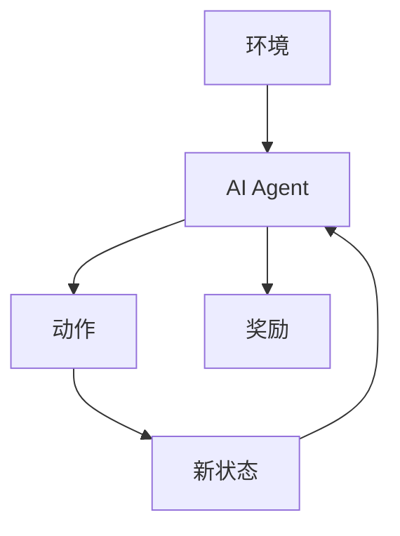
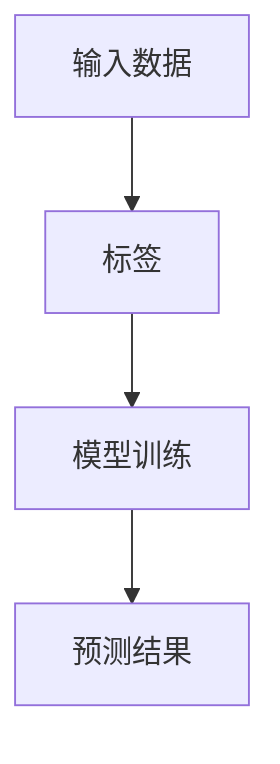
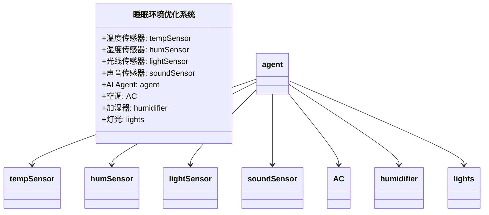
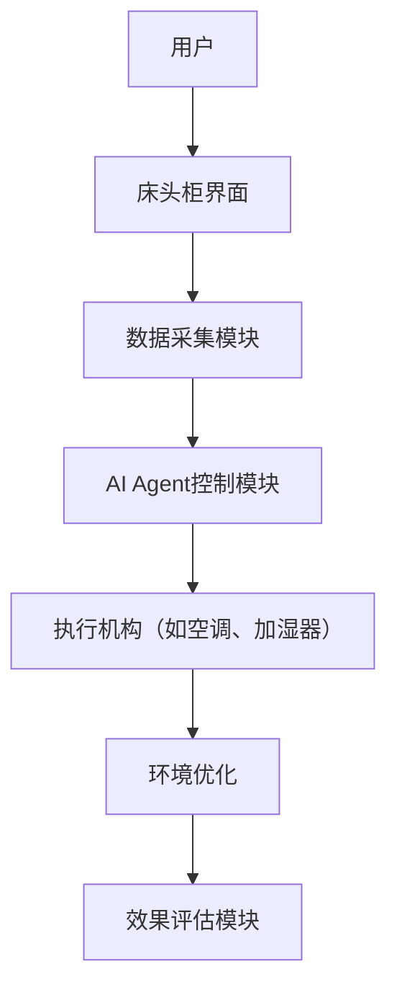
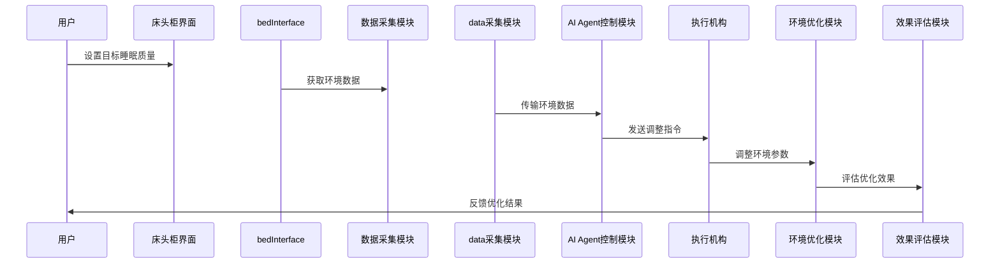

                 


# AI Agent在智能床头柜中的睡眠环境优化

> 关键词：AI Agent，智能床头柜，睡眠环境优化，强化学习，智能家居，健康睡眠

> 摘要：本文将详细介绍AI Agent在智能床头柜中的应用，探讨如何通过AI技术优化睡眠环境，改善人们的睡眠质量。从AI Agent的基本概念到其在智能床头柜中的具体实现，从算法原理到系统架构设计，从项目实战到最佳实践，本文将全面解析AI Agent在睡眠环境优化中的应用与实现。

---

# 第一部分: AI Agent与智能床头柜概述

## 第1章: AI Agent的基本概念

### 1.1 AI Agent的定义与特点

#### 1.1.1 AI Agent的定义
AI Agent（人工智能代理）是指能够感知环境、做出决策并采取行动以实现目标的智能实体。它能够通过传感器获取环境信息，利用算法进行分析和推理，并根据结果执行相应的动作。

#### 1.1.2 AI Agent的核心特点
- **自主性**：能够在没有外部干预的情况下自主运行。
- **反应性**：能够实时感知环境变化并做出反应。
- **学习能力**：通过数据和经验不断优化自身的决策能力。
- **目标导向**：所有行为都以实现特定目标为导向。

#### 1.1.3 AI Agent与传统智能设备的区别
| 特性             | AI Agent                 | 传统智能设备           |
|------------------|--------------------------|-----------------------|
| 感知能力         | 强，能实时感知环境       | 弱，依赖预设传感器     |
| 决策能力         | 强，能自主决策           | 弱，依赖预设逻辑       |
| 学习能力         | 强，能通过数据优化策略   | 无，无法优化策略       |
| 适应能力         | 强，能适应环境变化       | 弱，适应性有限         |

### 1.2 睡眠健康的重要性

#### 1.2.1 睡眠对健康的影响
睡眠是人体健康的重要组成部分，直接影响人的精力、情绪和免疫力。良好的睡眠有助于身体恢复、记忆巩固和情绪调节。

#### 1.2.2 现代人睡眠问题的现状
现代社会节奏快、压力大，许多人面临失眠、睡眠质量差等问题。根据统计，约30%的人存在睡眠障碍，这对健康和生活品质造成了严重影响。

#### 1.2.3 智能床头柜在睡眠优化中的作用
智能床头柜通过集成AI Agent，能够实时监测睡眠环境（如温度、湿度、光照、噪音等），并根据数据动态调整环境参数，优化睡眠质量。

### 1.3 智能床头柜的发展趋势

#### 1.3.1 智能家居的发展背景
随着物联网和人工智能技术的快速发展，智能家居设备逐渐普及。床头柜作为卧室中重要的家具，也逐渐智能化。

#### 1.3.2 智能床头柜的市场现状
目前市场上的智能床头柜主要具备基础的智能控制功能，如USB充电、LED照明等。但随着AI技术的发展，床头柜的功能将更加智能化和个性化。

#### 1.3.3 AI Agent在智能床头柜中的应用前景
AI Agent的引入将使智能床头柜具备更强的环境感知和自主决策能力，能够为用户提供更个性化的睡眠优化方案。

## 第2章: AI Agent的核心原理

### 2.1 AI Agent的基本原理

#### 2.1.1 AI Agent的感知机制
AI Agent通过多种传感器（如温度传感器、光线传感器、声音传感器等）感知环境信息。这些信息经过数据预处理后，输入到算法模型中进行分析。

#### 2.1.2 AI Agent的学习与推理
AI Agent通过机器学习算法（如强化学习、监督学习等）进行模型训练，学习环境特征与睡眠质量之间的关系。推理过程基于训练好的模型，对当前环境状态进行分析，并生成优化建议。

#### 2.1.3 AI Agent的决策与执行
AI Agent根据推理结果生成决策，并通过执行机构（如空调、加湿器、灯光等）调整环境参数，以优化睡眠质量。

### 2.2 AI Agent的核心算法

#### 2.2.1 强化学习算法
强化学习是一种通过试错机制优化决策的算法。AI Agent通过与环境的交互，不断优化自己的策略，以获得最大的奖励。

**强化学习流程图（Mermaid）：**



#### 2.2.2 监督学习算法
监督学习是一种基于标签数据的训练方法。AI Agent通过监督学习算法，学习输入特征与目标输出之间的关系。

**监督学习流程图（Mermaid）：**



#### 2.2.3 聚类分析算法
聚类分析是一种无监督学习方法，用于将相似的数据点分组。AI Agent可以通过聚类分析，识别不同睡眠状态下的环境特征。

### 2.3 AI Agent的数学模型

#### 2.3.1 状态空间模型
状态空间模型描述了环境的所有可能状态。每个状态可以用一个向量表示，向量的每个元素对应一个环境特征（如温度、湿度等）。

#### 2.3.2 动作空间模型
动作空间模型描述了AI Agent在不同状态下可以执行的所有动作。每个动作对应一个环境调整指令（如调节空调温度、开启加湿器等）。

#### 2.3.3 奖励函数模型
奖励函数模型定义了AI Agent在执行动作后的奖励值。奖励值反映了动作对睡眠质量的贡献程度。

---

# 第三部分: 智能床头柜的系统架构

## 第3章: 智能床头柜的功能模块

### 3.1 数据采集模块

#### 3.1.1 传感器类型
- **温度传感器**：用于监测环境温度。
- **湿度传感器**：用于监测环境湿度。
- **光线传感器**：用于监测环境光照强度。
- **声音传感器**：用于监测环境噪音。

#### 3.1.2 数据采集流程
1. 传感器采集环境数据。
2. 数据预处理（如去噪、归一化）。
3. 数据存储或传输到AI Agent进行分析。

### 3.2 AI Agent控制模块

#### 3.2.1 算法选择
根据具体需求选择合适的算法（如强化学习、监督学习等）。

#### 3.2.2 模型训练
使用训练数据对AI Agent进行模型训练，生成优化策略。

#### 3.2.3 动作执行
根据推理结果生成动作指令，通过执行机构调整环境参数。

### 3.3 效果评估模块

#### 3.3.1 评估指标
- **睡眠质量评分**：基于睡眠深度、持续时间等指标。
- **环境优化效果**：基于环境参数调整后的改善程度。

#### 3.3.2 评估流程
1. 收集优化前后的环境数据。
2. 计算优化效果。
3. 更新AI Agent的优化策略。

## 第4章: 系统架构设计

### 4.1 系统功能设计

#### 4.1.1 领域模型（Mermaid类图）


#### 4.1.2 系统架构图（Mermaid架构图）


#### 4.1.3 系统接口设计
- **输入接口**：传感器数据输入接口。
- **输出接口**：环境调整指令输出接口。
- **用户交互接口**：用户设置和查看优化结果的界面。

### 4.2 系统交互设计

#### 4.2.1 交互流程图（Mermaid序列图）


---

# 第四部分: 项目实战

## 第5章: 项目实战——AI Agent在智能床头柜中的实现

### 5.1 项目背景与目标

#### 5.1.1 项目背景
随着智能家居的普及，优化睡眠环境成为提高生活品质的重要手段。通过引入AI Agent，智能床头柜能够实现个性化的睡眠优化。

#### 5.1.2 项目目标
实现一个基于AI Agent的智能床头柜系统，能够实时监测睡眠环境并动态调整环境参数，以优化睡眠质量。

### 5.2 项目环境与工具安装

#### 5.2.1 系统环境要求
- 操作系统：Windows/Mac/Linux
- Python版本：3.8以上
- 硬件要求： Raspberry Pi或其他单片机用于控制传感器和执行机构。

#### 5.2.2 开发工具安装
- Python库：numpy、pandas、scikit-learn、tensorflow
- 传感器开发库：如Raspberry Pi的GPIO库

### 5.3 系统核心功能实现

#### 5.3.1 数据采集与处理

**代码示例：数据采集模块**

```python
import numpy as np
import pandas as pd

# 读取传感器数据
data = pd.read_csv('environment_data.csv')
# 数据预处理
data_processed = data.dropna()
data_processed['temperature'] = data_processed['temperature'].astype(float)
```

#### 5.3.2 AI Agent算法实现

**代码示例：强化学习算法**

```python
import numpy as np
import tensorflow as tf

# 定义神经网络模型
model = tf.keras.Sequential([
    tf.keras.layers.Dense(32, activation='relu', input_shape=(input_dim,)),
    tf.keras.layers.Dense(1, activation='linear')
])

# 定义损失函数和优化器
model.compile(loss='mean_squared_error', optimizer='adam')

# 训练模型
model.fit(X_train, y_train, epochs=100, batch_size=32)
```

### 5.4 系统优化与测试

#### 5.4.1 优化策略
- 基于强化学习的动态调整策略。
- 根据用户反馈不断优化模型。

#### 5.4.2 测试方法
- 离线测试：模拟不同环境条件下的优化效果。
- 在线测试：实际部署后收集数据，验证优化效果。

---

# 第五部分: 最佳实践与总结

## 第6章: 最佳实践与总结

### 6.1 项目小结
通过本项目，我们实现了基于AI Agent的智能床头柜系统，能够实时监测睡眠环境并动态调整环境参数，有效提升了睡眠质量。

### 6.2 注意事项
- 数据采集的准确性直接影响优化效果，需确保传感器的校准和数据预处理。
- 模型训练需要大量的数据支持，数据质量对优化效果至关重要。
- 系统的安全性和稳定性需要重点关注，避免因设备故障影响睡眠。

### 6.3 拓展阅读
- 《强化学习入门》
- 《机器学习实战》
- 《智能家居系统设计》

---

# 作者：AI天才研究院/AI Genius Institute & 禅与计算机程序设计艺术 /Zen And The Art of Computer Programming

---

通过以上目录和内容设计，我们可以看到，AI Agent在智能床头柜中的应用不仅涉及复杂的算法实现，还需要系统的架构设计和实际的项目部署。通过本文的详细介绍，读者可以全面掌握AI Agent在睡眠环境优化中的应用与实现方法。

