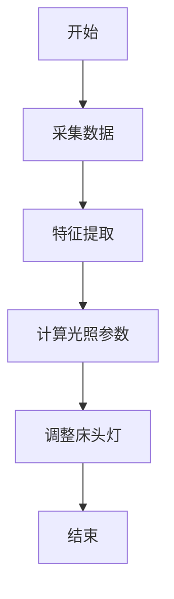
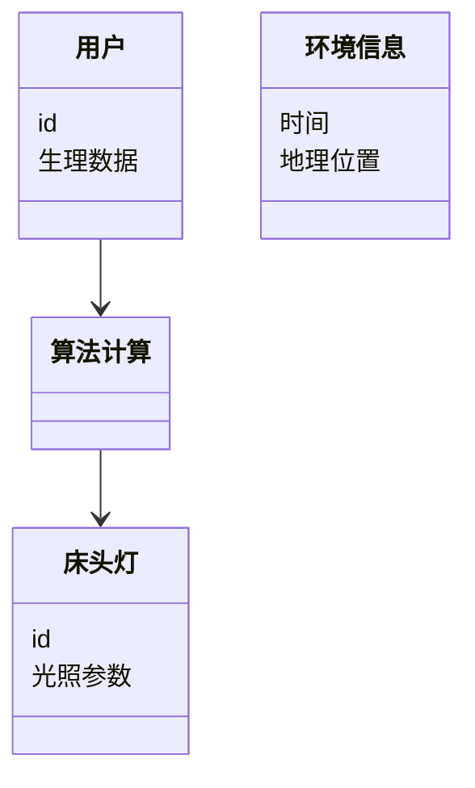

                 


# AI Agent在智能床头灯中的生理节律调节

> 关键词：AI Agent, 智能床头灯, 生理节律调节, 生物钟, 光照调节, 健康科技

> 摘要：本文探讨AI Agent在智能床头灯中的应用，重点分析其如何通过调节光照帮助用户改善生理节律。文章涵盖背景介绍、核心概念、算法原理、系统架构、项目实战等内容，旨在为技术爱好者和健康科技领域的读者提供深度解析。

---

## 第1章 AI Agent与生理节律调节的背景

### 1.1 AI Agent的基本概念

#### 1.1.1 AI Agent的定义
AI Agent（人工智能代理）是指能够感知环境、自主决策并执行任务的智能实体。它通过传感器获取信息，利用算法进行分析和推理，最终做出决策并执行动作。

#### 1.1.2 AI Agent的核心特征
- **自主性**：能够在没有外部干预的情况下独立运作。
- **反应性**：能够实时感知环境变化并做出反应。
- **目标导向**：基于设定的目标优化行为。
- **学习能力**：通过数据和经验不断优化自身算法。

#### 1.1.3 AI Agent在智能设备中的应用
AI Agent广泛应用于智能家居、医疗设备、自动驾驶等领域。在智能床头灯中，AI Agent负责根据用户的生理数据和环境信息调节光照，以改善用户的睡眠质量。

---

### 1.2 生理节律调节的背景

#### 1.2.1 生理节律的基本概念
生理节律是指生物体内一系列周期性变化的现象，最常见的是24小时的昼夜节律。这种节律由生物钟控制，主要受光照、温度、饮食等因素的影响。

#### 1.2.2 生理节律紊乱的常见原因
现代生活方式的改变，如不规律的作息时间、频繁的时差变化、过度使用电子设备等，都可能导致生理节律紊乱，引发失眠、疲劳等症状。

#### 1.2.3 智能床头灯调节生理节律的潜力
智能床头灯可以通过调节光照强度、色温和照射时间，帮助用户重新建立健康的生理节律。AI Agent的引入使得床头灯能够根据用户的实时数据动态调整光照参数，提供个性化的调节方案。

---

### 1.3 AI Agent在智能床头灯中的应用前景

#### 1.3.1 智能床头灯的功能与现状
目前的智能床头灯主要具备定时开关、调节亮度和色温等功能，但缺乏智能化的生理节律调节能力。AI Agent的引入将使床头灯能够根据用户的生理数据和环境信息，提供更精准的光照调节。

#### 1.3.2 AI Agent的创新应用
AI Agent可以通过分析用户的睡眠数据、光照需求和环境信息，动态调整床头灯的光照参数，帮助用户改善睡眠质量。例如，在用户进入深度睡眠阶段时，床头灯会逐渐降低亮度，避免干扰用户的睡眠。

#### 1.3.3 用户需求分析
- **个性化需求**：不同用户有不同的生理节律和光照需求。
- **实时调节需求**：用户希望床头灯能够根据实时数据动态调整。
- **便捷性需求**：用户希望床头灯操作简单，无需手动调节。

---

## 第2章 生理节律调节的核心概念

### 2.1 生理节律调节的原理

#### 2.1.1 生理节律的生物钟模型
生物钟是一种内在的计时系统，主要由视交叉上核（SCN）控制。光照是生物钟的主要外部同步信号，尤其是蓝光对生物钟的影响最为显著。

#### 2.1.2 光照对生理节律的影响
光照强度、色温和照射时间都会影响生理节律。例如，蓝光可以抑制褪黑激素的分泌，从而推迟生物钟；而暖光则有助于促进褪黑激素的分泌，帮助入睡。

#### 2.1.3 睡眠周期的数学模型
睡眠周期包括入睡期、浅睡期、深睡期和REM期。数学模型可以通过周期性函数描述睡眠状态的变化。例如：
$$
f(t) = A \sin(Bt + C) + D
$$
其中，$A$是振幅，$B$是频率，$C$是相位，$D$是偏移量。

---

### 2.2 AI Agent在生理节律调节中的角色

#### 2.2.1 AI Agent作为调节器的功能
AI Agent负责接收用户的生理数据（如心率、体温、光照环境）和环境信息（如时间、地理位置），并根据这些数据动态调整床头灯的光照参数。

#### 2.2.2 AI Agent与床头灯的交互机制
- **数据采集**：通过传感器获取用户的生理数据和环境信息。
- **决策算法**：基于数据和预设的调节规则，计算出最佳的光照参数。
- **执行命令**：向床头灯发送调节指令，实时调整光照。

#### 2.2.3 生理节律调节的闭环反馈系统
闭环系统通过不断采集数据、调整参数和反馈结果，确保生理节律调节的准确性。例如，当检测到用户睡眠质量改善时，系统会调整参数以维持良好的调节效果。

---

### 2.3 核心概念对比与ER实体关系图

#### 2.3.1 核心概念对比表
| 概念       | 描述                                   |
|------------|----------------------------------------|
| 生理节律    | 生物体内周期性变化的现象               |
| AI Agent   | 具备自主性和目标导向的智能实体         |
| 光照调节    | 通过调节光照参数改善生理节律           |

#### 2.3.2 ER实体关系图（Mermaid格式）
```mermaid
erd
    entity 用户 {
        id
        生理数据
    }
    entity 床头灯 {
        id
        光照参数
    }
    entity 环境信息 {
        时间
        地理位置
    }
    用户 --> 生理数据
    床头灯 --> 光照参数
    环境信息 --> 时间
    环境信息 --> 地理位置
```

---

## 第3章 AI Agent的算法原理

### 3.1 数据采集与特征提取

#### 3.1.1 数据采集方式
- **生理数据**：心率、体温、光照环境等。
- **环境数据**：时间、地理位置、光照强度等。

#### 3.1.2 特征提取的关键步骤
- **数据清洗**：去除异常值和噪声。
- **特征选择**：提取对生理节律影响最大的特征，如光照强度、色温等。

---

### 3.2 算法流程与数学模型

#### 3.2.1 算法流程图（Mermaid格式）


#### 3.2.2 数学模型与公式
- **光照强度计算公式**：
  $$
  I(t) = I_0 + K \cdot \sin(2\pi t / T + \phi)
  $$
  其中，$I_0$是基础光照强度，$K$是幅度，$T$是周期，$\phi$是相位。

---

### 3.3 算法实现与优化

#### 3.3.1 算法实现的步骤
1. 采集用户生理数据和环境信息。
2. 提取相关特征，如光照强度、色温等。
3. 基于特征计算最佳光照参数。
4. 调整床头灯的光照参数，实时反馈调节效果。

#### 3.3.2 算法优化的策略
- **动态调整**：根据用户反馈实时优化参数。
- **个性化设置**：根据用户的生理数据定制调节方案。

---

## 第4章 系统分析与架构设计方案

### 4.1 问题场景介绍

#### 4.1.1 用户需求分析
用户希望床头灯能够根据自己的生理需求动态调整光照，改善睡眠质量。

#### 4.1.2 系统功能概述
- **数据采集**：采集用户的生理数据和环境信息。
- **算法计算**：根据数据计算最佳光照参数。
- **执行调节**：调整床头灯的光照参数。

---

### 4.2 系统功能设计

#### 4.2.1 领域模型（Mermaid类图）


---

## 第5章 项目实战

### 5.1 环境安装

#### 5.1.1 系统环境
- 操作系统：Windows/Mac/Linux
- 开发工具：Python、TensorFlow、Mermaid

#### 5.1.2 安装依赖
```bash
pip install mermaid matplotlib numpy
```

---

### 5.2 系统核心实现源代码

#### 5.2.1 数据采集代码
```python
import numpy as np

def collect_data():
    # 模拟数据采集
    time = np.arange(0, 24, 0.5)
    light_intensity = np.sin(2 * np.pi * time / 24) * 100 + 50
    return time, light_intensity
```

#### 5.2.2 算法计算代码
```python
def calculate_light_parameters(time, light_intensity):
    # 计算最佳光照参数
    period = 24
    frequency = 2 * np.pi / period
    phase = np.arctan2(np.mean(light_intensity), frequency)
    return frequency, phase
```

---

### 5.3 案例分析与详细解读

#### 5.3.1 应用场景
用户A经常熬夜，希望改善睡眠质量。系统采集用户的生理数据和环境信息，计算出最佳的光照参数，并动态调整床头灯的光照，帮助用户逐步建立健康的生理节律。

---

## 第6章 总结与注意事项

### 6.1 总结
本文详细介绍了AI Agent在智能床头灯中的应用，从生理节律调节的背景、核心概念、算法原理到系统架构和项目实战，为读者提供了全面的解析。

### 6.2 注意事项
- **数据隐私**：用户生理数据需加密存储，防止泄露。
- **算法优化**：持续优化算法，提高调节效果。
- **用户体验**：确保床头灯操作简单，用户易用。

---

## 第7章 最佳实践与拓展阅读

### 7.1 最佳实践
- **定期更新算法**：根据用户反馈和新数据不断优化调节方案。
- **多设备联动**：与其他智能家居设备联动，提供更全面的健康解决方案。

### 7.2 小结
AI Agent在智能床头灯中的应用前景广阔，未来可以通过进一步研究和实践，开发出更智能、更高效的生理节律调节方案。

---

## 作者信息

作者：AI天才研究院/AI Genius Institute & 禅与计算机程序设计艺术 /Zen And The Art of Computer Programming

