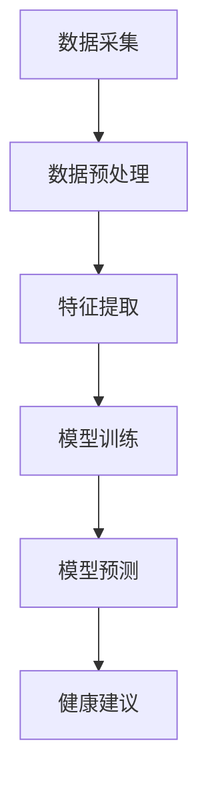

                 


# AI Agent在智能手机中的数字健康管理系统

> 关键词：AI Agent，数字健康管理，智能手机，机器学习，健康数据分析  
> 摘要：本文探讨AI Agent在智能手机中的数字健康管理系统的应用，涵盖AI Agent的基本原理、算法实现、系统架构设计以及实际案例分析，旨在提供深入的技术洞察。

---

# 第1章: AI Agent与数字健康管理概述

## 1.1 AI Agent的基本概念

### 1.1.1 AI Agent的定义与特点
AI Agent（人工智能代理）是能够感知环境、自主决策并执行任务的智能实体。其特点包括：
- **自主性**：无需外部干预，自主完成任务。
- **反应性**：能实时感知环境变化并做出反应。
- **学习能力**：通过数据不断优化决策能力。
- **协作性**：能与其他系统或用户协同工作。

### 1.1.2 AI Agent在智能手机中的应用背景
智能手机作为个人数据的重要载体，承载着用户的健康数据，如心率、步数、睡眠质量等。AI Agent在这些数据的基础上，提供个性化的健康建议，优化用户体验。

### 1.1.3 数字健康管理的核心概念
数字健康管理通过收集、分析和反馈健康数据，帮助用户改善生活习惯，预防疾病。AI Agent在其中起到关键作用，通过数据驱动的决策，提供实时健康建议。

---

## 1.2 智能手机中的数字健康管理发展

### 1.2.1 数字健康管理的历史演变
从传统的纸质记录到电子健康档案，再到现在的AI驱动的健康管理，数字健康管理经历了数据采集、简单分析到智能决策的阶段。

### 1.2.2 AI技术在健康管理中的作用
AI技术的应用使得健康管理从被动转向主动，通过预测模型提前发现健康风险，提供个性化建议。

### 1.2.3 智能手机健康管理的优势与挑战
优势包括便捷性、实时性和个性化；挑战则涉及数据隐私、算法准确性和用户接受度。

---

## 1.3 本章小结
本章介绍了AI Agent的基本概念、数字健康管理的发展历程及其在智能手机中的应用背景，为后续技术分析奠定了基础。

---

# 第2章: AI Agent在数字健康管理中的核心原理

## 2.1 AI Agent的基本原理

### 2.1.1 AI Agent的感知与决策机制
AI Agent通过传感器数据（如心率、步数）感知环境，利用机器学习模型进行分析和决策。

### 2.1.2 基于机器学习的AI Agent模型
AI Agent的核心是机器学习模型，用于分类、回归和预测任务。

### 2.1.3 AI Agent的推理与规划算法
基于逻辑推理和路径规划算法，AI Agent能够制定最优的健康干预策略。

---

## 2.2 数字健康管理的核心技术

### 2.2.1 数据采集与处理技术
通过传感器采集健康数据，进行预处理和特征提取。

### 2.2.2 健康数据分析与建模
利用机器学习模型分析数据，构建健康风险预测模型。

### 2.2.3 AI驱动的健康建议生成
根据分析结果，生成个性化的健康建议，如饮食和运动计划。

---

## 2.3 AI Agent与数字健康管理的结合

### 2.3.1 AI Agent在健康数据中的应用
AI Agent通过分析健康数据，识别潜在的健康风险。

### 2.3.2 基于AI的健康风险预测
利用机器学习模型预测慢性病风险，提前采取干预措施。

### 2.3.3 AI Agent在健康干预中的作用
AI Agent根据用户习惯和健康数据，制定个性化的健康干预计划。

---

## 2.4 本章小结
本章详细介绍了AI Agent的核心原理及其在数字健康管理中的应用，为后续的算法实现和系统设计提供了理论基础。

---

# 第3章: 基于机器学习的AI Agent算法

## 3.1 机器学习在AI Agent中的应用

### 3.1.1 监督学习在健康数据分类中的应用
监督学习用于分类健康状态，例如分类健康数据为正常、异常状态。

### 3.1.2 无监督学习在健康数据聚类中的应用
无监督学习用于发现健康数据中的潜在模式和群组。

### 3.1.3 强化学习在健康干预中的应用
强化学习用于制定最优的健康干预策略。

---

## 3.2 健康数据分析算法实现

### 3.2.1 健康数据分类算法
使用随机森林分类器进行健康数据分类，代码如下：

```python
from sklearn.ensemble import RandomForestClassifier
# 假设X是特征矩阵，y是标签
model = RandomForestClassifier()
model.fit(X, y)
```

### 3.2.2 健康风险预测模型
构建线性回归模型预测健康风险，公式如下：
$$ y = \beta_0 + \beta_1 x_1 + \beta_2 x_2 + ... + \beta_n x_n $$

### 3.2.3 算法流程图


---

## 3.3 本章小结
本章详细讲解了机器学习在AI Agent中的应用，包括算法实现和流程设计。

---

# 第4章: 系统分析与架构设计

## 4.1 系统功能设计

### 4.1.1 数据采集模块
负责收集用户的健康数据，如心率、步数等。

### 4.1.2 数据分析模块
对数据进行分析，识别健康风险。

### 4.1.3 健康建议模块
根据分析结果，生成个性化的健康建议。

---

## 4.2 系统架构设计

### 4.2.1 系统架构图


### 4.2.2 接口设计
定义API接口，实现数据采集、分析和建议生成。

---

## 4.3 本章小结
本章详细分析了系统的功能模块和架构设计，为后续的项目实现奠定了基础。

---

# 第5章: 项目实战

## 5.1 环境安装

### 5.1.1 安装Python与库
安装Python和必要的库，如TensorFlow、Pandas等。

### 5.1.2 安装智能手机开发环境
安装Android Studio或Xcode，配置开发环境。

---

## 5.2 系统核心实现

### 5.2.1 核心代码实现
实现AI Agent的核心算法，如健康数据分类和风险预测。

### 5.2.2 代码解读
解读关键代码，说明实现逻辑。

---

## 5.3 项目小结
总结项目实现的经验和教训，提出改进建议。

---

# 第6章: 最佳实践与小结

## 6.1 最佳实践
提供数据隐私保护、算法优化等方面的建议。

## 6.2 小结
总结全文内容，强调AI Agent在数字健康管理中的重要性。

## 6.3 未来展望
展望AI Agent在数字健康管理中的未来发展方向。

---

# 作者：AI天才研究院 & 禅与计算机程序设计艺术

---

通过以上章节的详细展开，本文系统地探讨了AI Agent在智能手机中的数字健康管理系统的应用，涵盖了技术背景、核心原理、算法实现、系统设计以及项目实战，为读者提供了全面的技术洞察。

