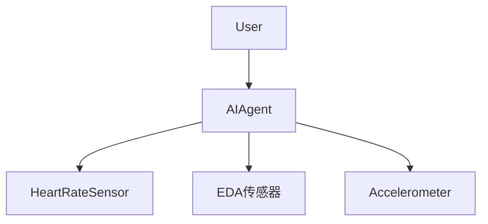
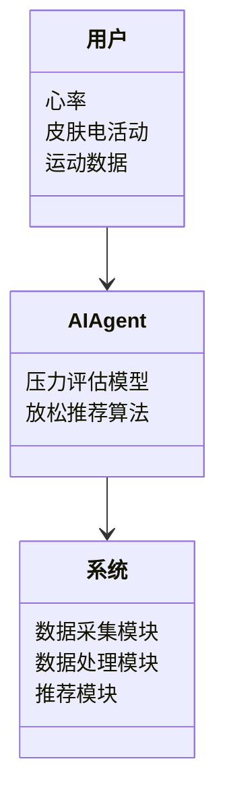
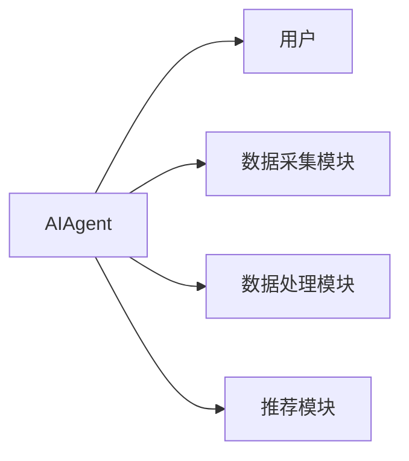
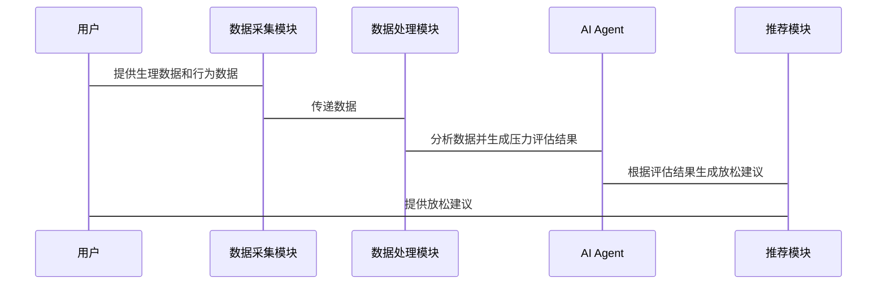

                 


# AI Agent在智能手表中的压力管理与放松指导

## 关键词：AI Agent，智能手表，压力管理，放松指导，心理健康，多模态数据

## 摘要：  
随着现代生活的节奏加快，压力问题日益严重，尤其是在工作和学习压力巨大的人群中。智能手表作为贴身的健康监测设备，具备采集心率、皮肤电活动、运动数据等多种生理和行为数据的能力，结合AI Agent（人工智能代理），可以在实时监测用户压力水平的基础上，提供个性化的放松指导。本文将详细探讨AI Agent在智能手表中的压力管理与放松指导的应用，从背景、核心概念、算法原理到系统架构和项目实战，全面解析如何利用AI技术帮助用户有效管理压力，提升心理健康水平。

---

# 第一部分: AI Agent在智能手表中的压力管理与放松指导背景介绍

# 第1章: 压力管理与AI Agent概述

## 1.1 压力管理的现状与挑战

现代社会节奏加快，人们面临的压力来源多样，包括工作压力、学习压力、家庭压力等。长期的压力可能导致焦虑、失眠、免疫力下降等健康问题。根据世界卫生组织的报告，压力相关疾病已经成为全球范围内致病率最高的问题之一。因此，压力管理的重要性不言而喻。

智能手表作为一种可穿戴设备，具备实时监测用户生理数据的能力，例如心率、皮肤电活动（EDA）、运动数据等。通过结合AI Agent技术，智能手表可以在实时监测的基础上，分析用户的压力水平，并提供个性化的放松指导。

---

## 1.2 AI Agent的基本概念

AI Agent（人工智能代理）是一种能够感知环境并采取行动以实现目标的智能实体。它可以通过传感器、用户输入等获取数据，利用算法进行分析和决策，并通过执行器或界面与用户交互。

在智能手表中，AI Agent可以实时监测用户的生理数据和行为数据，分析压力水平，并根据用户的需求提供个性化的放松建议，例如推荐冥想、深呼吸练习、音乐放松等。

---

## 1.3 本章小结

本章主要介绍了压力管理的重要性以及AI Agent在智能手表中的应用背景。压力问题的普遍性和严重性为AI Agent的应用提供了现实需求，而智能手表的生理数据采集能力则为AI Agent提供了技术基础。

---

# 第二部分: AI Agent的核心概念与联系

# 第2章: AI Agent的核心原理与技术

## 2.1 多模态数据融合

AI Agent在智能手表中的压力管理需要结合多种数据源，例如心率、皮肤电活动、运动数据、环境数据等。通过多模态数据的融合，可以更全面地评估用户的压力水平。

### 2.1.1 心率数据

心率是衡量压力水平的重要指标之一。在压力状态下，交感神经兴奋会导致心率加快，而副交感神经兴奋则会降低心率。通过分析心率变异性（HRV）可以评估压力水平。

### 2.1.2 皮肤电活动（EDA）

皮肤电活动是衡量自主神经系统的指标之一。在压力状态下，交感神经兴奋会导致皮肤电活动增加。

### 2.1.3 用户行为数据

用户的运动量、睡眠质量、日常活动等行为数据也可以反映压力水平。例如，长期缺乏运动和睡眠不足可能与高压力水平相关。

---

## 2.2 个性化压力评估模型

个性化压力评估模型是基于多模态数据，利用机器学习算法对用户的压力水平进行评估。

### 2.2.1 基于机器学习的压力评估

通过收集和分析用户的生理数据和行为数据，可以训练一个机器学习模型来预测用户的压力水平。例如，使用支持向量机（SVM）或随机森林（Random Forest）进行分类。

### 2.2.2 基于规则的简单评估方法

对于某些简单场景，可以采用基于规则的方法进行压力评估。例如，如果心率变异性低于某个阈值，且皮肤电活动高于某个阈值，则判断为压力水平较高。

### 2.2.3 混合模型的优势

混合模型结合了机器学习和规则的方法，可以在复杂场景下提供更准确的压力评估。

---

## 2.3 个性化放松推荐算法

个性化放松推荐算法是基于用户的压力评估结果，推荐适合用户的放松方式。

### 2.3.1 基于用户偏好的推荐

通过分析用户的偏好，例如喜欢听音乐还是喜欢进行冥想，推荐相应的放松方式。

### 2.3.2 基于实时数据的动态推荐

根据用户的实时压力水平和环境数据，动态调整推荐的放松方式。例如，如果用户当前压力水平较高，且环境噪音较大，可以推荐使用白噪音放松。

### 2.3.3 基于反馈的自适应推荐

通过收集用户的反馈，不断优化推荐算法，提高推荐的准确性和效果。

---

## 2.4 核心概念对比表

以下表格对比了不同的压力评估技术和推荐算法的特点：

| **技术**         | **特性**                   | **优势**                       | **局限性**                   |
|-------------------|---------------------------|-------------------------------|-----------------------------|
| 单模态数据         | 数据来源单一               | 实时性强                       | 信息片面                   |
| 多模态数据         | 数据来源多样               | 信息全面                       | 复杂度高                   |
| 基于规则的推荐     | 实现简单                   | 稳定性好                       | 灵活性低                   |
| 基于机器学习的推荐 | 精准度高                   | 灵活性高                       | 需大量数据                 |

---

## 2.5 ER实体关系图

以下是一个简单的实体关系图，展示了AI Agent、用户和数据源之间的关系：



---

# 第三部分: 算法原理与数学模型

# 第3章: 压力评估模型

## 3.1 压力评估的层次分析模型

层次分析法（AHP）是一种常用的决策分析方法，可以将复杂的决策问题分解为多个层次，通过比较判断矩阵来确定各因素的权重。

### 3.1.1 层次分析法的定义

层次分析法是一种定性与定量相结合的决策分析方法，适用于多因素决策问题。

### 3.1.2 层次分析法的步骤

1. 构建层次结构图。
2. 建立比较判断矩阵。
3. 计算各因素的权重。
4. 进行一致性检验。
5. 确定最终决策。

### 3.1.3 层次分析法的数学模型

层次分析法的核心是构建比较判断矩阵，例如：

$$
A = \begin{bmatrix}
1 & a_{12} & a_{13} \\
a_{21} & 1 & a_{23} \\
a_{31} & a_{32} & 1
\end{bmatrix}
$$

其中，$a_{ij}$表示第$i$个因素相对于第$j$个因素的重要性。

---

## 3.2 基于机器学习的压力评估模型

### 3.2.1 算法选择

常用的机器学习算法包括支持向量机（SVM）、随机森林（Random Forest）和神经网络（NN）。

### 3.2.2 数据预处理

数据预处理包括数据归一化、缺失值处理和特征选择。

### 3.2.3 模型训练

以随机森林为例，训练过程如下：

1. 从训练集中随机抽取部分样本，构建决策树。
2. 对决策树进行剪枝，防止过拟合。
3. 重复上述步骤，构建随机森林。

### 3.2.4 模型评估

通过准确率、召回率和F1值对模型进行评估。

---

# 第四部分: 系统分析与架构设计

# 第4章: 系统功能设计

## 4.1 系统应用场景

智能手表中的AI Agent可以通过以下方式帮助用户管理压力：

1. 实时监测用户的生理数据和行为数据。
2. 基于数据进行压力评估。
3. 根据评估结果推荐放松方式。

## 4.2 领域模型设计

以下是一个简单的领域模型类图：



---

## 4.3 系统架构设计

### 4.3.1 系统架构图



---

## 4.4 系统接口设计

系统接口设计包括：

1. 数据采集接口：获取用户的生理数据和行为数据。
2. 数据处理接口：对数据进行预处理和特征提取。
3. 推荐接口：根据用户压力评估结果推荐放松方式。

---

## 4.5 系统交互流程图



---

# 第五部分: 项目实战

# 第5章: 项目实现

## 5.1 环境搭建

### 5.1.1 安装必要的库和工具

```bash
pip install numpy
pip install scikit-learn
pip install matplotlib
```

## 5.2 核心代码实现

### 5.2.1 数据预处理

```python
import numpy as np
import pandas as pd

# 读取数据
data = pd.read_csv('stress_data.csv')

# 数据归一化
from sklearn.preprocessing import StandardScaler

scaler = StandardScaler()
data_normalized = scaler.fit_transform(data)
```

### 5.2.2 模型训练

```python
from sklearn.ensemble import RandomForestClassifier
from sklearn.metrics import accuracy_score

# 训练模型
model = RandomForestClassifier()
model.fit(data_normalized, labels)

# 模型预测
预测结果 = model.predict(new_data)
```

### 5.2.3 放松推荐

```python
def generate_recommendations(stress_level):
    if stress_level > 0.8:
        return "推荐冥想练习"
    elif stress_level > 0.6:
        return "推荐深呼吸练习"
    else:
        return "无需特别放松"
```

---

## 5.3 代码解读与分析

### 5.3.1 数据预处理

数据预处理是机器学习模型训练的重要步骤，包括数据归一化、缺失值处理和特征选择。归一化处理可以消除不同特征之间的量纲差异，提高模型的训练效果。

### 5.3.2 模型训练

随机森林是一种基于树的集成算法，具有高准确性和良好的抗过拟合能力。通过训练随机森林模型，可以实现对用户压力水平的分类。

### 5.3.3 放松推荐

根据用户的压力水平，推荐相应的放松方式。例如，压力水平较高时推荐冥想练习，压力水平中等时推荐深呼吸练习。

---

## 5.4 实际案例分析

假设用户A的生理数据和行为数据如下：

- 心率变异性（HRV）：低于正常值
- 皮肤电活动（EDA）：高于正常值
- 睡眠质量：较差

AI Agent通过分析这些数据，判断用户的压力水平较高，并推荐进行冥想练习。

---

## 5.5 项目小结

本章通过实际案例分析，展示了如何利用AI Agent在智能手表中实现压力管理与放松指导。通过数据预处理、模型训练和放松推荐，可以有效地帮助用户缓解压力，提升心理健康水平。

---

# 第六部分: 总结与展望

## 6.1 总结

本文详细探讨了AI Agent在智能手表中的压力管理与放松指导的应用。通过多模态数据融合、个性化压力评估模型和放松推荐算法，可以实现对用户压力水平的实时监测和个性化指导。

## 6.2 最佳实践 tips

1. 数据隐私保护：在处理用户数据时，必须遵守相关法律法规，确保数据的安全性和隐私性。
2. 算法优化方向：未来可以尝试引入深度学习算法，进一步提高压力评估的准确性和推荐的精准度。
3. 用户体验优化：通过优化用户界面和交互流程，提高用户的使用体验。

## 6.3 小结

AI Agent在智能手表中的应用为压力管理提供了新的可能性。通过结合多模态数据和人工智能技术，可以实现对用户压力水平的精准评估和个性化指导，帮助用户更好地管理压力，提升心理健康水平。

---

作者：AI天才研究院/AI Genius Institute & 禅与计算机程序设计艺术 /Zen And The Art of Computer Programming

