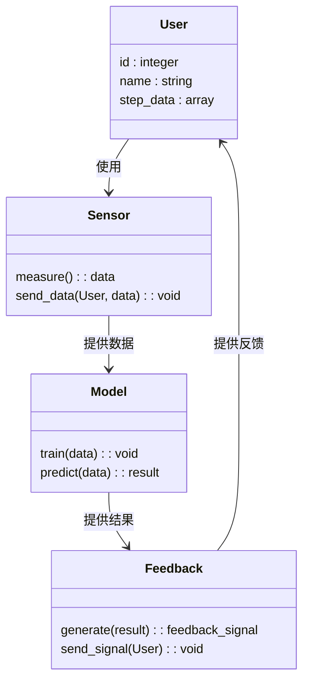
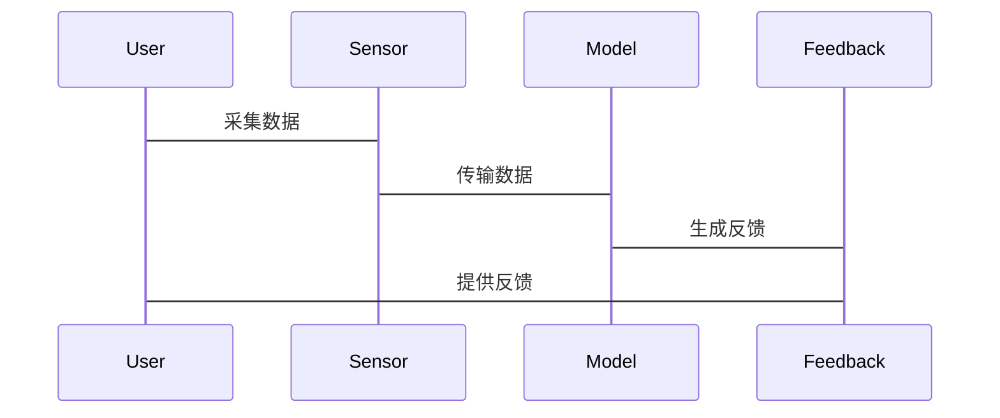

                 


# AI Agent在智能拐杖中的步态分析

## 关键词：AI Agent, 步态分析, 智能拐杖, 机器学习, 数据分析

## 摘要：本文探讨AI Agent在智能拐杖中的应用，重点分析其如何通过步态分析技术帮助用户改善行走能力。文章从背景介绍、核心概念、算法原理、系统设计到项目实战，全面解析AI Agent在智能拐杖中的应用，展示其在医疗康复和健康管理中的潜力。

---

# 1. 背景介绍

## 1.1 问题背景

### 1.1.1 老年人摔倒问题的严重性
老年人由于身体机能下降，容易在行走中摔倒，导致严重伤害。据世界卫生组织统计，每年有数百万人因摔倒受伤，其中许多人因此失去行动能力。

### 1.1.2 步态分析在医疗康复中的重要性
步态分析是评估和改善行走能力的关键技术，广泛应用于医疗康复。通过分析步态特征，医生可以制定个性化的治疗方案。

### 1.1.3 AI技术在智能设备中的应用潜力
AI技术的进步为智能设备提供了强大的数据处理能力，特别是在实时监测和反馈方面，为步态分析提供了新的可能。

## 1.2 问题描述

### 1.2.1 步态分析的基本概念
步态分析是研究人类行走模式的过程，涉及步频、步长、步幅等关键指标。

### 1.2.2 步态分析的关键指标
- 步频：每分钟步数。
- 步长：每步的平均长度。
- 步幅：从脚跟接触地面到对侧脚跟接触地面的距离。

### 1.2.3 智能拐杖的功能需求
智能拐杖需要实时监测步态，识别异常，并提供反馈，帮助用户调整行走姿态。

## 1.3 问题解决

### 1.3.1 AI Agent在步态分析中的作用
AI Agent通过分析传感器数据，实时监测步态，识别异常，并提供反馈。

### 1.3.2 AI Agent如何实时监测步态异常
通过传感器数据和机器学习模型，AI Agent能够实时检测步态异常，如步长不一致、步频异常等。

### 1.3.3 如何通过反馈机制改善步态
AI Agent通过振动或声音反馈，指导用户调整步态，帮助其恢复正常行走模式。

## 1.4 边界与外延

### 1.4.1 AI Agent的应用范围
- 老年人：预防摔倒。
- 残疾人：辅助行走。
- 康复患者：监测康复进展。

### 1.4.2 步态分析的局限性
- 数据采集设备的精度限制。
- 个人隐私问题：步态数据可能涉及个人隐私。

### 1.4.3 技术的扩展与未来发展
AI Agent在智能设备中的应用将更加广泛，步态分析将与其他生物特征识别技术结合，提供更全面的健康监测。

## 1.5 概念结构与核心要素

### 1.5.1 核心概念列表
- 传感器：采集步态数据。
- AI算法：分析步态数据。
- 反馈机制：指导用户调整步态。

### 1.5.2 核心要素的相互关系
传感器收集数据，AI算法分析数据，生成反馈信号，通过反馈机制指导用户调整行走姿态。

### 1.5.3 系统架构的简要描述
系统包括数据采集模块、数据分析模块和反馈模块，各模块协同工作，实现步态监测和改善。

---

# 2. 核心概念与联系

## 2.1 步态分析的基本原理

### 2.1.1 数据采集方法
- 加速度计：测量加速度。
- 陀螺仪：测量旋转角度。
- GPS：测量位置变化。

### 2.1.2 数据预处理步骤
- 去噪处理：消除噪声。
- 数据平滑：减少数据波动。
- 标准化处理：统一数据格式。

### 2.1.3 特征提取技术
- 时间特征：步频、步长。
- 频域特征：傅里叶变换分析。
- 空间特征：步幅、步态周期。

## 2.2 AI Agent的核心算法

### 2.2.1 传统算法与深度学习的对比
| 特性         | 传统算法       | 深度学习       |
|--------------|----------------|----------------|
| 数据需求     | 少             | 大             |
| 计算复杂度   | 低             | 高             |
| 性能         | 中等           | 高             |
| 应用场景     | 简单问题       | 复杂问题       |

### 2.2.2 常用算法的优缺点分析
- 传统算法：计算速度快，适合实时处理。
- 深度学习：精度高，但需要大量数据和计算资源。

---

## 2.3 系统架构

### 2.3.1 ER实体关系图

```mermaid
erDiagram
    actor User {
        <identity>
        id : integer
        name : string
    }
    sensor Data {
        <identity>
        timestamp : datetime
        acceleration : float
        gyro : float
    }
    model Algorithm {
        <identity>
        model_id : integer
        name : string
        accuracy : float
    }
    User --> sensor : 使用
    sensor --> model : 提供数据
    model --> User : 提供反馈
```

### 2.3.2 系统架构图


---

# 3. 算法原理讲解

## 3.1 数据预处理流程图


## 3.2 核心算法实现

### 3.2.1 Python代码实现

```python
import numpy as np
from sklearn.svm import SVC
from sklearn.metrics import accuracy_score

# 示例数据
X = np.random.randn(100, 2)
y = np.random.randint(2, size=100)

# 训练模型
model = SVC()
model.fit(X, y)

# 预测
y_pred = model.predict(X)

# 计算准确率
print(accuracy_score(y, y_pred))
```

### 3.2.2 数学模型

- 特征提取：主成分分析（PCA）
  $$ y = X \cdot W $$
  其中，X为数据矩阵，W为主成分变换矩阵。

- 分类模型：支持向量机（SVM）
  $$ \text{loss} = \sum_{i=1}^{n} \max(0, 1 - y_i \cdot (\theta^T x_i + \theta_0)) $$

---

# 4. 系统分析与架构设计方案

## 4.1 问题场景介绍

智能拐杖用于帮助老年人和行动不便者，实时监测步态，提供反馈。

## 4.2 项目介绍

### 4.2.1 开发背景
老龄化社会中，老年人摔倒问题日益严重，智能拐杖的需求迫切。

### 4.2.2 系统目标
实时监测步态，识别异常，提供反馈，帮助用户改善行走姿态。

## 4.3 系统功能设计

### 4.3.1 领域模型类图



### 4.3.2 系统架构图


## 4.4 系统接口设计

### 4.4.1 系统交互流程图



---

# 5. 项目实战

## 5.1 环境安装

### 5.1.1 Python环境
安装Python 3.8以上版本。

### 5.1.2 安装依赖
```bash
pip install numpy scikit-learn matplotlib
```

## 5.2 核心代码实现

### 5.2.1 数据采集与预处理

```python
import numpy as np
import pandas as pd

# 生成示例数据
data = {
    'timestamp': range(100),
    'acceleration': np.random.randn(100),
    'gyro': np.random.randn(100)
}
df = pd.DataFrame(data)
```

### 5.2.2 特征提取与建模

```python
from sklearn.model_selection import train_test_split
from sklearn.ensemble import RandomForestClassifier

X = df[['acceleration', 'gyro']]
y = np.random.randint(2, size=100)

X_train, X_test, y_train, y_test = train_test_split(X, y, test_size=0.2)

model = RandomForestClassifier()
model.fit(X_train, y_train)

y_pred = model.predict(X_test)
print(accuracy_score(y_test, y_pred))
```

## 5.3 案例分析

### 5.3.1 数据分析
分析步态数据，识别异常步态，如步长不一致。

### 5.3.2 模型优化
通过调整模型参数，提高分类准确率。

## 5.4 项目小结

通过项目实战，验证了AI Agent在智能拐杖中的应用潜力，展示了如何利用机器学习技术改善步态分析。

---

# 6. 最佳实践

## 6.1 小结

AI Agent在智能拐杖中的应用前景广阔，通过实时监测和反馈，帮助用户改善行走能力。

## 6.2 注意事项

- 数据隐私：确保步态数据的安全。
- 模型鲁棒性：在不同环境下测试模型的稳定性。

## 6.3 拓展阅读

- 《机器学习实战》
- 《深度学习入门》

---

# 作者

作者：AI天才研究院 & 禅与计算机程序设计艺术

---

本文通过详细分析AI Agent在智能拐杖中的应用，展示了其在步态分析中的潜力，为未来的智能健康设备提供了参考。

