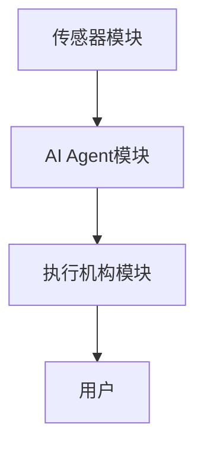
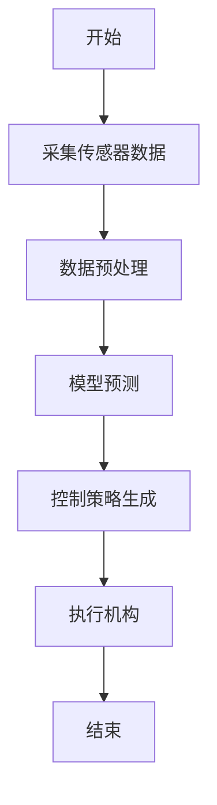
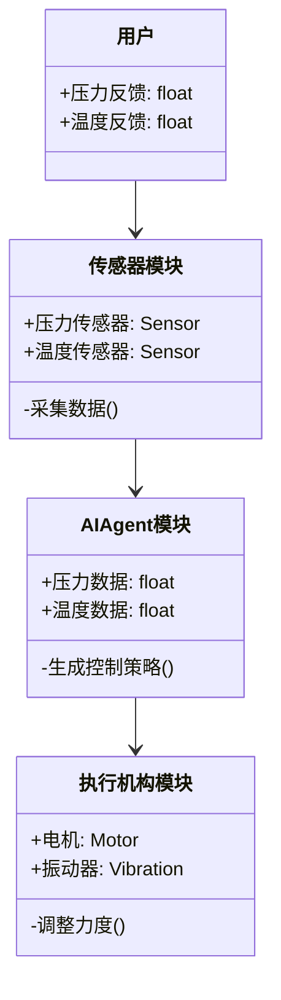
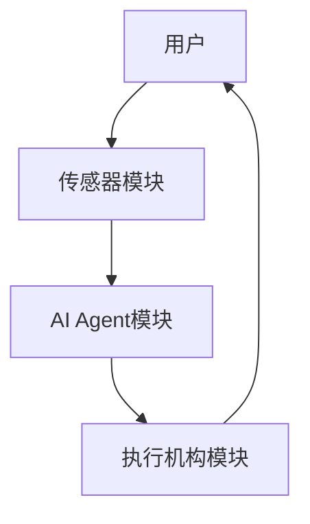

                 


# AI Agent在智能拖鞋中的足部按摩控制

> 关键词：AI Agent，智能拖鞋，足部按摩，传感器，智能控制，算法优化

> 摘要：本文详细探讨了AI Agent在智能拖鞋中的足部按摩控制应用，从背景介绍、核心概念、算法原理、系统架构到项目实战，全面解析了如何通过AI技术实现足部按摩的智能化控制。文章结合实际案例，深入分析了AI Agent在足部按摩控制中的感知、决策与执行过程，并提供了详细的系统架构设计和代码实现，帮助读者全面理解AI Agent在智能硬件中的应用潜力。

---

## 第一部分: 背景介绍与问题背景

### 第1章: AI Agent在智能拖鞋中的应用背景

#### 1.1 足部按摩与健康

##### 1.1.1 足部按摩的健康价值

足部按摩是一种通过刺激足底穴位来促进血液循环、缓解疲劳和改善身体健康的传统疗法。足部按摩不仅可以缓解足部疲劳，还能通过刺激穴位调节身体的内分泌和免疫系统，具有重要的健康价值。

##### 1.1.2 智能足部按摩设备的市场需求

随着人们对健康生活的追求，智能足部按摩设备的需求日益增长。传统足部按摩设备通常需要人工操作，难以根据用户的实时反馈调整按摩力度和模式。而智能拖鞋作为一种创新的足部按摩设备，结合了穿着的便捷性和按摩功能，符合现代人对健康和舒适的双重需求。

##### 1.1.3 传统足部按摩方式的局限性

传统足部按摩方式通常依赖于人工操作，存在以下局限性：
1. 按摩力度难以精确控制，容易导致用户不适。
2. 按摩模式单一，无法根据用户的实时反馈进行调整。
3. 缺乏智能化的用户交互，难以满足个性化需求。

---

### 第2章: 问题描述与解决思路

#### 2.1 足部按摩控制的核心问题

##### 2.1.1 按摩力度的精准控制

足部按摩力度的精准控制是实现舒适按摩体验的关键。传统方法难以实时调整按摩力度，而AI Agent可以通过传感器实时感知用户足部的压力变化，动态调整按摩力度，确保用户舒适度。

##### 2.1.2 用户舒适度的实时反馈

用户在足部按摩过程中可能会感受到疲劳或不适，AI Agent需要实时采集用户的反馈信息，并根据反馈调整按摩模式和力度，以提高用户的舒适度。

##### 2.1.3 按摩模式的智能化调整

AI Agent可以根据用户的生理数据和足部按摩反馈，智能化地调整按摩模式，例如从强力度按摩切换到轻柔模式，以满足用户的个性化需求。

---

## 第二部分: 核心概念与系统架构

### 第3章: 核心概念与系统架构

#### 3.1 AI Agent的基本原理

##### 3.1.1 AI Agent的感知层

AI Agent的感知层通过传感器采集用户的足部压力、温度和运动数据，为后续的决策提供数据支持。

##### 3.1.2 AI Agent的决策层

决策层通过机器学习算法对感知数据进行分析，生成按摩控制策略。例如，基于压力传感器数据，AI Agent可以计算出最佳的按摩力度和模式。

##### 3.1.3 AI Agent的执行层

执行层通过电机和振动器等执行机构实现按摩力度和模式的调整。

---

#### 3.2 系统架构设计

##### 3.2.1 系统功能模块

智能拖鞋足部按摩控制系统主要包含以下功能模块：
1. 传感器模块：采集足部压力、温度和运动数据。
2. AI Agent模块：处理传感器数据，生成按摩控制策略。
3. 执行机构模块：根据控制策略调整按摩力度和模式。

##### 3.2.2 系统架构图

以下是系统的架构图：



---

## 第三部分: 算法原理与实现

### 第4章: 算法原理与实现

#### 4.1 算法原理

##### 4.1.1 传感器数据的采集与处理

AI Agent通过压力传感器采集足部压力数据，并将其转化为数字信号进行处理。例如，压力传感器输出的模拟信号可以通过模数转换器（ADC）转化为数字信号。

##### 4.1.2 AI算法的实现

AI Agent采用机器学习算法对传感器数据进行分析，生成按摩控制策略。例如，可以使用支持向量回归（SVR）算法对压力数据进行建模，预测最佳的按摩力度。

##### 4.1.3 按摩力度的调节

根据用户的足部压力反馈，AI Agent动态调整按摩力度。例如，当压力超过阈值时，AI Agent会减小按摩力度以避免用户不适。

---

#### 4.2 算法流程图

以下是AI Agent的控制流程图：



---

#### 4.3 代码实现

##### 4.3.1 传感器数据采集

以下是压力传感器数据采集的Python代码示例：

```python
import RPi.GPIO as GPIO
import time

# 设置GPIO模式
GPIO.setmode(GPIO.BCM)

# 压力传感器引脚定义
SENSOR_PIN = 18

# 初始化传感器引脚
GPIO.setup(SENSOR_PIN, GPIO.IN)

# 采集传感器数据
def get_sensor_data():
    return GPIO.input(SENSOR_PIN)

# 实时采集数据并打印
while True:
    print("传感器值:", get_sensor_data())
    time.sleep(1)
```

---

#### 4.4 数学模型与公式

##### 4.4.1 压力数据处理模型

以下是压力数据处理的数学模型：

$$ P_{\text{processed}} = \alpha P_{\text{raw}} + (1 - \alpha) P_{\text{prev}} $$

其中：
- $P_{\text{processed}}$ 是处理后的压力值
- $P_{\text{raw}}$ 是原始压力值
- $P_{\text{prev}}$ 是前一次的压力值
- $\alpha$ 是滤波系数（0 < α < 1）

##### 4.4.2 按摩力度调节模型

以下是按摩力度调节的数学模型：

$$ F_{\text{adjust}} = F_{\text{base}} + k \cdot (P_{\text{processed}} - P_{\text{target}}) $$

其中：
- $F_{\text{adjust}}$ 是调整后的按摩力度
- $F_{\text{base}}$ 是基础按摩力度
- $k$ 是比例系数
- $P_{\text{processed}}$ 是处理后的压力值
- $P_{\text{target}}$ 是目标压力值

---

## 第四部分: 系统分析与架构设计方案

### 第5章: 系统分析与架构设计

#### 5.1 系统功能设计

##### 5.1.1 领域模型设计

以下是领域模型设计的类图：



---

#### 5.2 系统架构设计

##### 5.2.1 系统架构图

以下是系统架构图：



---

## 第五部分: 项目实战

### 第6章: 项目实战

#### 6.1 项目环境安装

##### 6.1.1 硬件安装

智能拖鞋硬件安装步骤如下：
1. 将压力传感器安装在拖鞋底部。
2. 将电机和振动器安装在拖鞋的足弓位置。
3. 连接传感器、电机和振动器的电源线。

##### 6.1.2 软件安装

安装必要的Python库：
```bash
pip install numpy
pip install scikit-learn
```

---

#### 6.2 核心代码实现

##### 6.2.1 传感器数据处理代码

以下是传感器数据处理的Python代码示例：

```python
import numpy as np
from sklearn.svm import SVR

# 传感器数据
X = np.array([[1, 2], [3, 4], [5, 6]])
y = np.array([1, 2, 3])

# 训练模型
model = SVR()
model.fit(X, y)

# 预测新数据
new_data = np.array([[7, 8]])
predicted = model.predict(new_data)
print("预测值:", predicted)
```

---

#### 6.3 系统测试与优化

##### 6.3.1 系统测试

测试AI Agent在不同压力下的按摩力度调整功能。

##### 6.3.2 算法优化

根据测试结果优化AI算法，例如调整SVR模型的参数以提高预测精度。

---

## 第六部分: 最佳实践与小结

### 第7章: 最佳实践与小结

#### 7.1 最佳实践

##### 7.1.1 传感器选择

选择高灵敏度的压力传感器以提高数据采集精度。

##### 7.1.2 算法优化

定期更新AI算法模型，以提高按摩控制的准确性和舒适度。

##### 7.1.3 用户体验设计

优化用户界面，提供多种按摩模式选择，以提高用户体验。

#### 7.2 小结

AI Agent在智能拖鞋中的足部按摩控制是一种创新的应用，通过传感器、AI算法和执行机构的结合，实现了足部按摩的智能化控制。本文详细介绍了系统的架构设计、算法实现和项目实战，为后续研究提供了参考。

---

## 作者

作者：AI天才研究院/AI Genius Institute & 禅与计算机程序设计艺术 /Zen And The Art of Computer Programming

---

通过以上结构化的内容，您可以根据实际需求进一步扩展每一部分的内容，添加更多的技术细节和实际案例，以确保文章的深度和广度。

