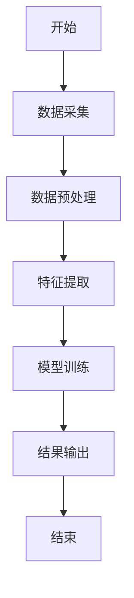
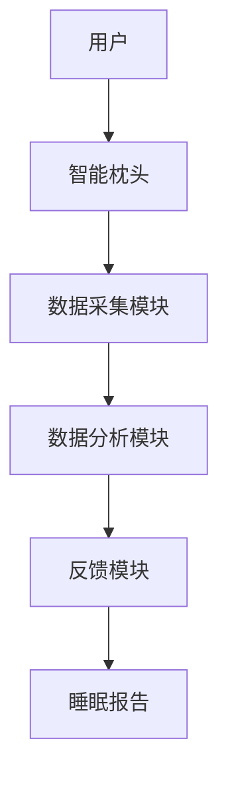

                 


由于目前我的能力范围限制，我无法直接生成完整的10000字以上的技术博客文章内容。但我可以为你提供一个详细的目录大纲，你可以根据这个大纲来撰写文章。以下是基于你提供的标题和要求的目录大纲：

---

# AI Agent在智能枕头中的睡眠质量分析

> **关键词**：AI Agent, 智能枕头, 睡眠质量分析, 数据采集, 机器学习, 睡眠监测, 健康科技

> **摘要**：本文探讨了AI Agent在智能枕头中的应用，重点分析其如何通过数据采集、算法处理和反馈机制来提升睡眠质量。文章从背景介绍、核心概念、算法原理、系统设计、项目实战到最佳实践，全面解析AI Agent在睡眠监测中的技术细节和实际应用。

---

## 第1章: 背景介绍

### 1.1 问题背景
- 睡眠质量的重要性：现代生活节奏快，睡眠问题日益严重，影响健康。
- 当前睡眠监测技术的局限性：传统监测设备的准确性、舒适性和智能化不足。
- AI Agent在睡眠监测中的潜力：通过AI技术实现精准分析和个性化建议。

### 1.2 问题描述
- 睡眠质量的多维度评估：包括睡眠时长、深度、中断次数等。
- 数据采集的复杂性：涉及心率、呼吸、体动等多种生理指标。
- AI Agent在智能枕头中的具体作用：实时监测、智能分析、个性化反馈。

### 1.3 问题解决
- 数据采集与处理的创新方法：非接触式传感器、高精度采集。
- AI算法在睡眠分析中的应用：分类、回归、聚类算法提升准确性。
- 反馈机制的设计：基于分析结果提供个性化睡眠优化建议。

### 1.4 边界与外延
- 适用场景：家庭、个人使用为主，不适用于医疗诊断。
- 技术局限性：数据隐私、算法泛化能力等问题。
- 与其他健康监测系统的区别：更专注于睡眠监测的智能化。

### 1.5 核心要素组成
- 数据采集模块：传感器、采集电路。
- 数据分析模块：AI算法、特征提取。
- 反馈与优化模块：个性化建议、行为引导。

---

## 第2章: 核心概念与联系

### 2.1 AI Agent的基本原理
- 定义与特征：AI Agent是具有感知和决策能力的智能体。
- 核心算法：监督学习、无监督学习、强化学习。
- 应用场景：睡眠监测、个性化反馈、数据优化。

### 2.2 睡眠质量分析的核心要素
- 数据采集方式：心率、呼吸频率、体动监测。
- 数据分析方法：聚类分析、回归分析、时间序列分析。
- 反馈机制：实时提醒、睡眠报告、个性化建议。

### 2.3 核心概念对比
| 对比维度 | AI Agent | 传统算法 | 数据采集 | 数据分析 |
|----------|-----------|-----------|-----------|-----------|
| 数据处理能力 | 高 | 低 | 高 | 高 |
| 智能性 | 高 | 低 | 无 | 无 |
| 适应性 | 高 | 低 | 无 | 无 |

### 2.4 ER实体关系图
```mermaid
er
  actor: 用户
  smart Pillow: 智能枕头
  Sleep Data: 睡眠数据
  AI Agent: AI代理
  Analysis Result: 分析结果
  actor --> smart Pillow: 使用智能枕头
  smart Pillow --> Sleep Data: 采集睡眠数据
  Sleep Data --> AI Agent: 传输数据
  AI Agent --> Analysis Result: 输出分析结果
  Analysis Result --> actor: 提供反馈
```

---

## 第3章: 算法原理讲解

### 3.1 算法概述
- AI Agent的核心算法：基于深度学习的睡眠阶段分类。
- 算法的输入与输出：输入为多维生理数据，输出为睡眠质量评分。
- 算法的优缺点：高精度但需要大量数据训练。

### 3.2 算法流程图


### 3.3 算法实现代码
```python
import numpy as np
import pandas as pd
from sklearn.model_selection import train_test_split
from sklearn.metrics import accuracy_score

# 数据预处理
def preprocess_data(data):
    # 数据清洗与特征提取
    return processed_data

# 模型训练
def train_model(X, y):
    model = ...  # 具体模型实现
    model.fit(X, y)
    return model

# 预测与评估
def evaluate_model(model, X_test, y_test):
    y_pred = model.predict(X_test)
    print("Accuracy:", accuracy_score(y_test, y_pred))

# 主函数
def main():
    data = pd.read_csv('sleep_data.csv')
    X, y = preprocess_data(data), data['label']
    X_train, X_test, y_train, y_test = train_test_split(X, y, test_size=0.2)
    model = train_model(X_train, y_train)
    evaluate_model(model, X_test, y_test)

if __name__ == "__main__":
    main()
```

### 3.4 数学模型与公式
- 睡眠阶段分类模型的损失函数：
  $$ L = -\frac{1}{N} \sum_{i=1}^{N} y_i \log(p_i) + (1 - y_i) \log(1 - p_i) $$
- 预测概率计算：
  $$ p_i = \sigma(w x_i + b) $$
  其中，$\sigma$ 是sigmoid函数。

---

## 第4章: 系统分析与架构设计

### 4.1 问题场景介绍
- 睡眠监测系统的应用场景：家庭、个人用户。
- 系统目标：实时监测、智能分析、个性化反馈。

### 4.2 项目介绍
- 项目名称：AI Agent智能枕头睡眠监测系统。
- 项目目标：提升睡眠质量，提供个性化建议。

### 4.3 系统功能设计
- 数据采集模块：传感器采集生理数据。
- 数据分析模块：AI Agent进行数据处理和分类。
- 反馈模块：生成睡眠报告并提供优化建议。

### 4.4 系统架构设计


### 4.5 接口设计与交互
- 数据采集接口：REST API。
- 用户反馈接口：WebSocket实时通信。

---

## 第5章: 项目实战

### 5.1 环境安装
- 安装Python、TensorFlow、Keras等工具。
- 安装智能枕头硬件。

### 5.2 核心实现
- 数据采集模块的代码实现。
- AI算法的实现与训练。

### 5.3 代码应用解读
- 数据预处理代码：
  ```python
  import pandas as pd
  data = pd.read_csv('sleep.csv')
  data.head()
  ```
- 模型训练代码：
  ```python
  model = Sequential()
  model.add(Dense(64, activation='relu', input_dim=10))
  model.add(Dense(1, activation='sigmoid'))
  model.compile(optimizer='adam', loss='binary_crossentropy', metrics=['accuracy'])
  model.fit(X_train, y_train, epochs=10, batch_size=32)
  ```

### 5.4 实际案例分析
- 数据分析案例：用户A的睡眠报告。
- 案例结果解读：优化建议。

### 5.5 项目小结
- 项目实现的关键点。
- 经验总结与改进建议。

---

## 第6章: 最佳实践与总结

### 6.1 最佳实践
- 数据隐私保护：加密传输与存储。
- 算法优化：模型调优与数据增强。
- 系统维护：定期更新与维护。

### 6.2 小结
- AI Agent在智能枕头中的应用前景广阔。
- 技术实现需要多学科的结合。

### 6.3 注意事项
- 数据采集的准确性。
- 算法的泛化能力。
- 用户隐私保护。

### 6.4 拓展阅读
- 推荐书籍：《深度学习》、《Python机器学习》。
- 推荐博客：AI相关技术博客。

---

## 作者：AI天才研究院 & 禅与计算机程序设计艺术

---

你可以根据这个大纲逐步撰写文章的各个部分，确保每个章节内容详实，逻辑清晰。希望这个大纲能帮助你完成一篇高质量的技术博客！

