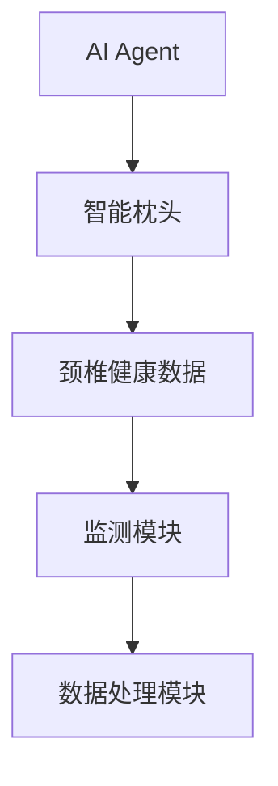
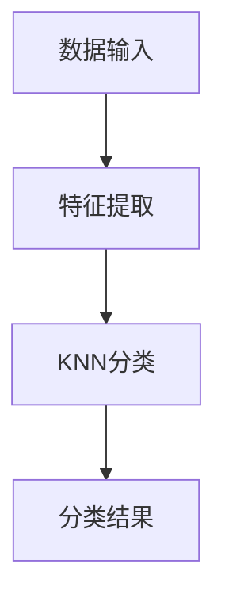
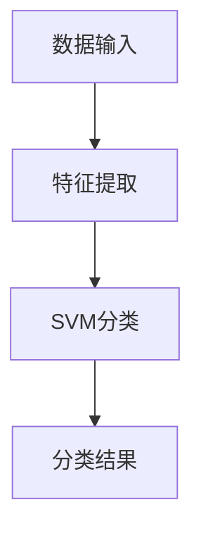
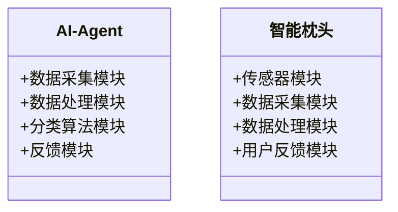
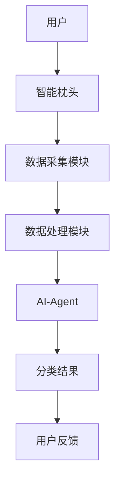

                 


# AI Agent在智能枕头中的颈椎健康监测

> 关键词：AI Agent，颈椎健康，智能枕头，数据监测，健康管理系统

> 摘要：本文探讨了AI Agent在智能枕头中的颈椎健康监测应用，分析了智能枕头的设计原理、数据采集与处理、AI算法实现等核心内容，并通过实际案例展示了AI Agent在颈椎健康监测中的优势和潜力。

---

## 第1章: 背景介绍

### 1.1 问题背景

#### 1.1.1 颈椎健康问题的现状
颈椎健康问题日益严重，尤其是在现代生活方式下，长时间低头使用电子设备导致颈椎病发病率上升。传统的颈椎健康监测方法依赖于医疗设备，存在成本高、操作复杂等问题。

#### 1.1.2 智能枕头的发展趋势
智能枕头作为一种新兴的健康监测工具，通过集成传感器和AI技术，能够实时监测用户的颈椎健康状况。AI Agent的引入使得智能枕头能够主动分析数据并提供健康建议。

#### 1.1.3 AI Agent在健康监测中的作用
AI Agent能够实时分析颈椎健康数据，提供个性化的健康建议，帮助用户预防和改善颈椎问题。

### 1.2 问题描述

#### 1.2.1 颈椎健康监测的核心问题
如何实时、准确地监测颈椎健康状况，并提供有效的健康建议。

#### 1.2.2 智能枕头的功能需求
智能枕头需要集成传感器，采集颈椎健康相关数据，并通过AI Agent进行分析。

#### 1.2.3 AI Agent的监测目标
AI Agent的目标是实时分析颈椎健康数据，识别潜在健康风险，并提供个性化的健康建议。

### 1.3 问题解决思路

#### 1.3.1 数据采集与处理方案
通过传感器采集颈椎健康相关数据，如颈部姿势、压力、温度等，并进行数据清洗和特征提取。

#### 1.3.2 AI Agent的设计理念
AI Agent需要具备数据分析、决策和反馈功能，能够实时处理颈椎健康数据并提供健康建议。

#### 1.3.3 系统实现的总体框架
智能枕头系统包括数据采集模块、数据处理模块、AI Agent模块和用户反馈模块。

### 1.4 概念模型与核心要素

#### 1.4.1 AI Agent的定义与属性
AI Agent是一种能够感知环境、分析数据并做出决策的智能体，具有实时性、准确性、个性化等特点。

#### 1.4.2 智能枕头的系统架构
智能枕头系统包括硬件和软件两部分，硬件负责数据采集，软件负责数据处理和分析。

#### 1.4.3 核心概念的实体关系图


---

## 第2章: 核心概念与联系

### 2.1 AI Agent的核心原理

#### 2.1.1 智能监测的基本原理
AI Agent通过传感器采集数据，利用机器学习算法进行分析，识别颈椎健康问题。

#### 2.1.2 数据分析的关键技术
数据预处理、特征提取、分类算法等技术是AI Agent分析颈椎健康数据的核心。

#### 2.1.3 AI Agent的决策机制
AI Agent基于分析结果，提供健康建议或触发预警机制。

### 2.2 智能枕头的系统架构

#### 2.2.1 数据采集模块的功能
数据采集模块负责采集颈椎健康相关数据，如颈部压力、姿势等。

#### 2.2.2 数据处理模块的实现
数据处理模块对采集的数据进行清洗、特征提取和标准化处理。

#### 2.2.3 AI Agent的算法实现
AI Agent通过机器学习算法对数据进行分析，识别颈椎健康问题。

### 2.3 核心概念的对比分析

#### 2.3.1 AI Agent与传统传感器的对比
AI Agent能够主动分析数据并提供健康建议，而传统传感器仅能采集数据。

#### 2.3.2 智能枕头与普通枕头的功能对比
智能枕头具有健康监测功能，而普通枕头不具备。

#### 2.3.3 数据分析的特征对比
颈椎健康数据具有实时性、连续性和个体化等特点。

### 2.4 实体关系图


---

## 第3章: 算法原理讲解

### 3.1 数据预处理算法

#### 3.1.1 数据采集与清洗
通过传感器采集颈椎健康数据，去除噪声和异常值。

#### 3.1.2 数据特征提取
提取数据中的关键特征，如颈部压力、姿势等。

#### 3.1.3 数据标准化方法
将数据标准化，使其适合机器学习算法的输入要求。

### 3.2 AI Agent的核心算法

#### 3.2.1 基于K近邻算法的分类


K近邻算法是一种常用的分类算法，适用于数据量较小的场景。以下是K近邻算法的数学公式：
$$
y = \text{多数}(y_i, i \in N_k(x))
$$
其中，$y$ 是预测类别，$N_k(x)$ 是距离 $x$ 最近的 $k$ 个样本。

#### 3.2.2 支持向量机的实现


支持向量机是一种常用的分类算法，适用于数据量较大的场景。以下是支持向量机的数学公式：
$$
y = \text{sign}(\sum_{i=1}^{n} \alpha_i y_i x_i \cdot x + b)
$$
其中，$\alpha_i$ 是拉格朗日乘子，$y_i$ 是样本标签，$x_i$ 是支持向量，$b$ 是偏置项。

### 3.3 算法实现的代码示例

#### 3.3.1 K近邻算法的Python实现
```python
from sklearn.neighbors import KNeighborsClassifier
import numpy as np

# 数据预处理
X = np.array([[1, 2], [2, 3], [3, 4], [4, 5], [5, 6]])
y = np.array([0, 0, 1, 1, 1])

# 训练模型
knn = KNeighborsClassifier(n_neighbors=3)
knn.fit(X, y)

# 预测
test_data = np.array([[2, 3]])
print(knn.predict(test_data))
```

#### 3.3.2 支持向量机的Python实现
```python
from sklearn import svm
import numpy as np

# 数据预处理
X = np.array([[1, 2], [2, 3], [3, 4], [4, 5], [5, 6]])
y = np.array([0, 0, 1, 1, 1])

# 训练模型
svm_model = svm.SVC()
svm_model.fit(X, y)

# 预测
test_data = np.array([[2, 3]])
print(svm_model.predict(test_data))
```

---

## 第4章: 系统分析与架构设计

### 4.1 系统功能设计

#### 4.1.1 领域模型


#### 4.1.2 系统架构设计


### 4.2 系统接口设计

#### 4.2.1 数据采集接口
传感器模块通过蓝牙或Wi-Fi与智能枕头连接，采集颈椎健康数据。

#### 4.2.2 数据处理接口
数据处理模块接收传感器数据，进行清洗和特征提取。

### 4.3 系统交互设计

#### 4.3.1 用户与智能枕头的交互
用户通过智能枕头设置健康监测参数，系统实时采集并分析数据。

#### 4.3.2 AI-Agent与数据处理模块的交互
AI-Agent接收数据处理模块的特征数据，进行分类和决策。

---

## 第5章: 项目实战

### 5.1 环境安装

#### 5.1.1 Python环境
安装Python 3.8及以上版本，安装必要的库，如scikit-learn、numpy、mermaid。

#### 5.1.2 硬件设备
需要智能枕头硬件，集成传感器模块。

### 5.2 核心实现

#### 5.2.1 数据采集模块
```python
import serial

# 连接传感器模块
ser = serial.Serial('COM3', 9600)

# 读取数据
data = ser.readline().decode().strip()
print(data)
```

#### 5.2.2 数据处理模块
```python
import numpy as np

# 数据清洗
data_cleaned = np.array([float(x) for x in data.split(',')])

# 特征提取
features = data_cleaned[:, :2]
```

#### 5.2.3 AI-Agent模块
```python
from sklearn.neighbors import KNeighborsClassifier

# 训练模型
model = KNeighborsClassifier(n_neighbors=3)
model.fit(features, labels)

# 预测
test_features = np.array([[2, 3]])
print(model.predict(test_features))
```

### 5.3 案例分析

#### 5.3.1 数据分析
通过对实际数据的分析，验证AI-Agent的分类准确率。

#### 5.3.2 系统优化
根据实际运行情况，优化算法参数和系统架构。

---

## 第6章: 最佳实践

### 6.1 小结

本文详细介绍了AI Agent在智能枕头中的颈椎健康监测应用，分析了系统的各个组成部分，并通过实际案例展示了系统的实现和优化。

### 6.2 注意事项

在实际应用中，需要注意数据隐私保护，确保用户数据的安全性。

### 6.3 拓展阅读

进一步研究AI在健康监测中的其他应用，如心率监测、睡眠质量分析等。

---

## 作者：AI天才研究院/AI Genius Institute & 禅与计算机程序设计艺术 /Zen And The Art of Computer Programming

---

以上是《AI Agent在智能枕头中的颈椎健康监测》的完整文章大纲和内容，希望对您有所帮助！

