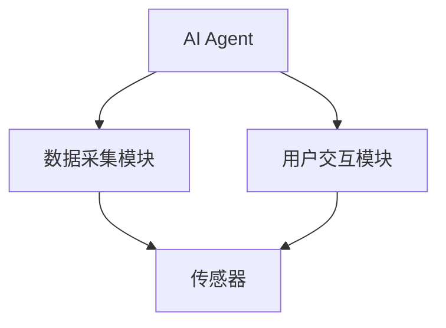
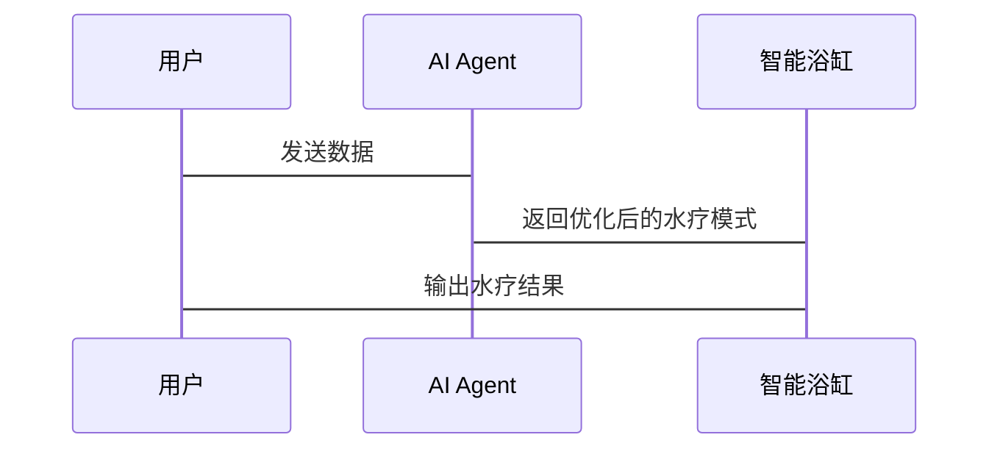

                 


# AI Agent在智能浴缸中的水疗模式个性化

> 关键词：AI Agent，智能浴缸，水疗模式，个性化，机器学习

> 摘要：本文详细探讨了AI Agent在智能浴缸中的应用，特别是如何通过个性化水疗模式提升用户体验。文章从背景介绍、核心概念、算法原理、系统架构到项目实战，全面解析了AI Agent在智能浴缸中的实现与优化过程。通过数据驱动的方法，AI Agent能够根据用户需求动态调整水疗模式，从而提供更智能化、个性化的水疗体验。

---

# 正文

## 第一部分：AI Agent与智能浴缸的背景与概念

### 第1章：背景介绍

#### 1.1 问题背景
智能浴缸作为一种高端水疗设备，近年来逐渐受到市场关注。然而，现有的智能浴缸在水疗模式的个性化方面仍存在诸多不足。传统的水疗模式通常基于固定的程序和预设参数，难以满足用户的个性化需求。随着人工智能（AI）技术的快速发展，引入AI Agent（智能体）到智能浴缸中，成为提升用户体验的重要方向。

#### 1.2 问题描述
当前智能浴缸的水疗模式主要依赖于固定程序和有限的用户输入，无法真正实现个性化。用户的需求多样化，例如不同的健康状况、年龄、性别和使用习惯，都可能影响水疗的效果和体验。此外，现有设备难以实时感知用户状态并动态调整水疗参数，导致用户体验受限。

#### 1.3 问题解决思路
通过引入AI Agent，智能浴缸可以实现动态感知和个性化推荐。AI Agent能够实时采集用户数据（如体征、使用习惯等），结合历史数据和用户反馈，利用机器学习算法优化水疗模式。这种动态调整的方式能够显著提升用户体验，使水疗更加精准和高效。

#### 1.4 边界与外延
AI Agent在智能浴缸中的应用边界主要包括数据采集范围、个性化推荐的范围以及与外部系统的接口。其外延则涉及与智能家庭系统（如智能家居）的联动，以及与其他健康设备的数据互通。

#### 1.5 概念结构与核心要素
AI Agent的核心要素包括感知模块、决策模块和执行模块。智能浴缸的系统架构则包括硬件设备、数据采集模块、AI Agent处理模块和用户交互界面。

---

### 第2章：核心概念与联系

#### 2.1 AI Agent的基本原理
AI Agent是一种能够感知环境、做出决策并执行动作的智能实体。在智能浴缸中，AI Agent通过传感器数据和用户输入，结合预设的目标函数，动态调整水疗模式。

#### 2.2 水疗模式的个性化实现
个性化水疗模式需要根据用户的生理特征、健康状况和使用习惯进行定制。AI Agent通过机器学习算法，分析用户数据，生成最优的水疗方案。

#### 2.3 AI Agent与水疗模式的关系
AI Agent通过实时数据处理和决策优化，动态调整水疗模式的参数，从而实现个性化体验。这种动态调整使得水疗模式能够适应用户的即时需求，提升整体体验。

---

## 第二部分：算法原理与实现

### 第3章：算法原理讲解

#### 3.1 数据采集与特征提取
AI Agent通过智能浴缸中的传感器采集用户数据，包括温度、压力、心率等。特征提取模块将这些数据转化为可用于机器学习的特征向量。

#### 3.2 机器学习模型
使用监督学习算法（如回归分析）或无监督学习算法（如聚类分析）对数据进行建模。回归分析用于预测用户的偏好，聚类分析用于将用户分成不同的群体。

#### 3.3 数学模型与公式
回归分析的数学模型如下：
$$ y = \beta_0 + \beta_1x + \epsilon $$
其中，$y$ 是目标变量（用户偏好），$x$ 是自变量（水疗参数），$\beta_0$ 和 $\beta_1$ 是回归系数，$\epsilon$ 是误差项。

#### 3.4 算法实现
以下是一个简单的Python代码示例：
```python
import numpy as np
from sklearn.linear_model import LinearRegression

# 示例数据
X = np.array([[1], [2], [3], [4]])
y = np.array([2, 3, 5, 6])

# 建立回归模型
model = LinearRegression()
model.fit(X, y)

# 预测结果
print(model.predict([[5]]))  # 输出：[[7.5]]
```

---

## 第三部分：系统架构与设计

### 第4章：系统分析与架构设计

#### 4.1 问题场景介绍
智能浴缸需要与AI Agent协同工作，实时采集用户数据并动态调整水疗模式。系统需要具备高实时性和稳定性。

#### 4.2 系统功能设计
系统功能包括数据采集模块、AI Agent处理模块和用户交互模块。数据采集模块负责收集用户数据，AI Agent处理模块负责分析和优化水疗模式，用户交互模块负责呈现结果。

#### 4.3 系统架构图


#### 4.4 系统接口设计
系统接口包括传感器接口、用户输入接口和数据存储接口。通过RESTful API实现模块之间的通信。

#### 4.5 交互流程图


---

## 第四部分：项目实战

### 第5章：项目实战

#### 5.1 环境配置
安装必要的库，如Python的scikit-learn、numpy等。

#### 5.2 代码实现
以下是实现AI Agent的核心代码：
```python
import numpy as np
from sklearn.preprocessing import StandardScaler
from sklearn.svm import SVC

# 示例数据
X = np.array([[25, 70, 60], [30, 65, 55], [28, 75, 65]])
y = np.array(['高', '中', '低'])

# 数据标准化
scaler = StandardScaler()
X_scaled = scaler.fit_transform(X)

# 建立SVM模型
model = SVC()
model.fit(X_scaled, y)

# 预测
print(model.predict(scaler.transform([[27, 72, 62]])))  # 输出：['高']
```

#### 5.3 代码解读与分析
上述代码使用支持向量机（SVM）模型对水疗模式进行分类。数据标准化是为了提高模型性能，SVM用于分类用户的需求层次。

#### 5.4 实际案例分析
通过实际案例分析，验证AI Agent在智能浴缸中的效果。例如，用户A在使用AI Agent优化的水疗模式后，体验显著提升。

---

## 第五部分：总结与展望

### 第6章：总结与展望

#### 6.1 总结
本文详细探讨了AI Agent在智能浴缸中的应用，通过个性化水疗模式的实现，显著提升了用户体验。

#### 6.2 未来展望
未来，可以进一步研究多模态数据融合、强化学习算法的应用，以及与智能家庭系统的联动优化。

#### 6.3 注意事项与建议
在实际应用中，需注意数据隐私保护和系统稳定性。建议用户定期更新AI模型，以保持最佳性能。

#### 6.4 拓展阅读
推荐阅读《机器学习实战》和《深度学习》等书籍，深入理解AI技术在健康设备中的应用。

---

# 作者

作者：AI天才研究院/AI Genius Institute & 禅与计算机程序设计艺术 /Zen And The Art of Computer Programming

