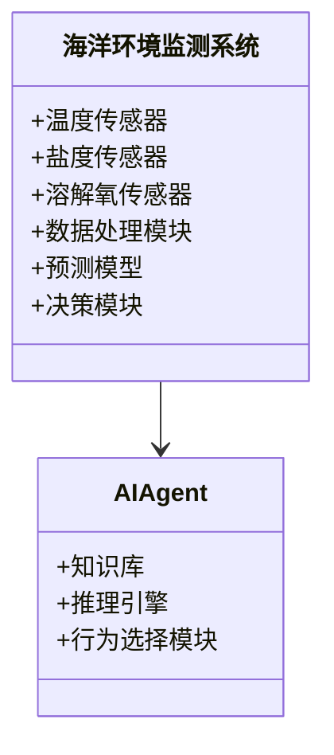
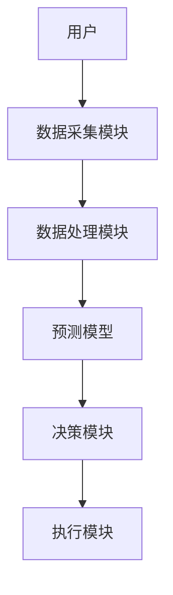
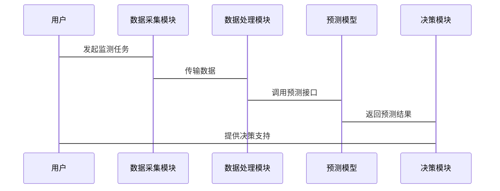

                 


# AI Agent在智能海洋环境监测中的实践

**关键词**：AI Agent, 智能海洋环境监测, 强化学习, 系统架构设计, 海洋数据处理

**摘要**：  
随着海洋环境问题的日益严重，智能海洋环境监测的需求日益迫切。AI Agent作为一种智能体，能够在复杂动态的海洋环境中实现自主感知、决策和行动。本文将从AI Agent的基本概念出发，探讨其在海洋环境监测中的应用场景，并通过具体案例分析，详细讲解AI Agent的核心算法、系统架构设计以及实际项目中的实现细节。文章最后总结了AI Agent在智能海洋环境监测中的优势与未来发展方向。

---

## 第一部分: AI Agent与智能海洋环境监测的背景与概念

### 第1章: AI Agent与智能海洋环境监测的背景

#### 1.1 AI Agent的基本概念与特点

##### 1.1.1 什么是AI Agent
AI Agent（人工智能代理）是一种能够感知环境、自主决策并采取行动的智能系统。与传统的算法不同，AI Agent具有以下特点：

- **自主性**：能够在没有外部干预的情况下独立运作。
- **反应性**：能够实时感知环境并做出反应。
- **目标导向**：基于目标或任务进行决策和行动。
- **学习能力**：通过经验不断优化自身的性能。

##### 1.1.2 AI Agent的核心特点
AI Agent的核心特点可以总结为以下几个方面：
- **知识表示**：通过符号或概率模型表示知识。
- **推理能力**：基于知识进行推理和决策。
- **行为选择**：根据环境状态选择最优行为。
- **自适应性**：能够根据环境变化调整自身行为。

##### 1.1.3 AI Agent与传统算法的区别
| 特性 | AI Agent | 传统算法 |
|------|-----------|-----------|
| 决策方式 | 基于目标和环境反馈 | 基于预设规则或经验 |
| 学习能力 | 具备自主学习能力 | 需人工调整或训练 |
| 适应性 | 高度适应动态环境 | 较低适应性 |

#### 1.2 智能海洋环境监测的背景与挑战

##### 1.2.1 海洋环境监测的重要性
海洋环境监测是保护海洋生态、预防污染、保障海洋资源可持续利用的重要手段。随着海洋经济的快速发展，海洋环境问题日益突出，传统的监测方法已经难以满足需求。

##### 1.2.2 传统海洋环境监测的局限性
- **数据采集效率低**：传统监测依赖人工操作，效率低下。
- **数据处理复杂**：海洋环境数据种类繁多，处理难度大。
- **预测准确性不足**：传统方法难以应对复杂多变的海洋环境。

##### 1.2.3 AI技术在海洋环境监测中的优势
AI技术能够通过高效的数据处理、智能的预测模型和自主的学习能力，显著提升海洋环境监测的效率和准确性。

### 第2章: AI Agent在智能海洋环境监测中的应用

#### 2.1 海洋环境监测的主要问题

##### 2.1.1 数据采集的复杂性
海洋环境监测涉及温度、盐度、溶解氧等多种参数，数据采集过程复杂且容易受到环境干扰。

##### 2.1.2 数据处理的高效性需求
海量的海洋数据需要快速处理和分析，传统的数据处理方法效率不足。

##### 2.1.3 环境预测的准确性要求
海洋环境的变化具有高度不确定性，需要准确的预测模型。

#### 2.2 AI Agent在海洋环境监测中的核心任务

##### 2.2.1 数据采集与处理
AI Agent能够自主采集和处理海洋环境数据，减少人工干预。

##### 2.2.2 环境特征提取
通过机器学习算法，AI Agent能够提取海洋环境的特征，为后续分析提供支持。

##### 2.2.3 环境预测与决策
AI Agent能够基于历史数据和实时数据，预测未来的海洋环境变化，并做出相应的决策。

#### 2.3 AI Agent在智能海洋环境监测中的优势

##### 2.3.1 高效的数据处理能力
AI Agent能够快速处理海量数据，显著提升监测效率。

##### 2.3.2 自适应的环境感知能力
AI Agent能够根据环境变化自适应调整感知策略，提高监测精度。

##### 2.3.3 智能的决策支持能力
AI Agent能够基于实时数据和历史数据，提供智能化的决策支持。

---

## 第二部分: AI Agent的核心原理与算法

### 第3章: AI Agent的核心原理

#### 3.1 AI Agent的基本原理

##### 3.1.1 知识表示与推理
知识表示是AI Agent的核心之一，常见的表示方法包括符号逻辑和概率模型。推理过程基于知识库进行，通过逻辑推理或概率计算得出结论。

##### 3.1.2 行为选择与优化
AI Agent的行为选择基于当前状态和目标，通过强化学习等方法优化行为选择策略。

##### 3.1.3 状态感知与反馈
AI Agent通过传感器或其他数据源感知环境状态，并根据反馈调整自身行为。

#### 3.2 AI Agent的分类与特点

##### 3.2.1 基于规则的AI Agent
基于规则的AI Agent通过预设的规则进行决策，适用于任务简单、规则明确的场景。

##### 3.2.2 基于机器学习的AI Agent
基于机器学习的AI Agent能够通过数据学习，适用于复杂多变的环境。

##### 3.2.3 基于强化学习的AI Agent
基于强化学习的AI Agent通过与环境的交互不断优化行为策略，适用于需要自主决策的任务。

---

### 第4章: AI Agent的核心算法

#### 4.1 强化学习算法

##### 4.1.1 强化学习的基本原理
强化学习是一种通过试错学习的方法，通过与环境的交互获得奖励或惩罚，优化行为策略。

##### 4.1.2 强化学习的数学模型
强化学习的核心是Q-learning算法，其数学模型如下：
$$ Q(s, a) = r + \gamma \max_{a'} Q(s', a') $$
其中，\( Q(s, a) \) 表示状态 \( s \) 下动作 \( a \) 的价值，\( r \) 是奖励，\( \gamma \) 是折扣因子。

##### 4.1.3 强化学习的实现步骤
1. 初始化Q表。
2. 与环境交互，获取状态和奖励。
3. 更新Q表。
4. 重复上述步骤，直到收敛。

##### 4.1.4 强化学习的优缺点
- **优点**：能够处理复杂动态环境，具有良好的自适应性。
- **缺点**：需要大量的训练数据，计算资源消耗较大。

---

## 第三部分: AI Agent在智能海洋环境监测中的应用实践

### 第5章: 系统分析与架构设计

#### 5.1 项目场景介绍
本项目旨在开发一个基于AI Agent的智能海洋环境监测系统，实现对海洋环境的实时监测、预测和决策支持。

#### 5.2 系统功能设计

##### 5.2.1 领域模型设计
以下是系统领域模型的类图：


#### 5.3 系统架构设计

##### 5.3.1 系统架构图
以下是系统的架构图：


#### 5.4 系统接口设计
系统主要接口包括：
- 数据采集接口：与传感器设备通信。
- 数据处理接口：对采集的数据进行预处理和分析。
- 预测接口：调用预测模型进行环境预测。
- 决策接口：根据预测结果生成决策指令。

#### 5.5 系统交互设计

##### 5.5.1 交互流程图
以下是系统的交互流程图：


---

### 第6章: 项目实战

#### 6.1 环境安装

##### 6.1.1 安装Python环境
建议使用Anaconda或Miniconda搭建Python环境，版本为3.8以上。

##### 6.1.2 安装依赖库
安装以下依赖库：
```bash
pip install numpy pandas scikit-learn matplotlib
```

#### 6.2 系统核心实现

##### 6.2.1 数据采集模块
```python
import numpy as np
import pandas as pd

def collect_data():
    # 模拟数据采集
    data = np.random.rand(100, 3)
    df = pd.DataFrame(data, columns=['温度', '盐度', '溶解氧'])
    return df
```

##### 6.2.2 数据处理模块
```python
def preprocess_data(df):
    # 数据清洗和预处理
    df.dropna(inplace=True)
    return df
```

##### 6.2.3 预测模型实现
```python
from sklearn.ensemble import RandomForestRegressor

def train_model(X, y):
    model = RandomForestRegressor(n_estimators=100)
    model.fit(X, y)
    return model
```

##### 6.2.4 决策模块实现
```python
def make_decision(model, new_data):
    # 预测结果
    prediction = model.predict(new_data)
    # 根据预测结果生成决策
    if prediction[0] > 0.9:
        return "采取行动"
    else:
        return "无需行动"
```

#### 6.3 代码应用解读与分析
- 数据采集模块通过随机生成数据模拟海洋环境监测数据。
- 数据处理模块对数据进行清洗和预处理，确保数据质量。
- 预测模型采用随机森林回归算法，对环境参数进行预测。
- 决策模块根据预测结果生成决策指令。

#### 6.4 实际案例分析
假设我们有一个海洋监测站点，每天采集温度、盐度和溶解氧数据。通过上述模块的实现，我们可以对这些数据进行处理和预测，为海洋环境的保护和管理提供决策支持。

---

### 第7章: 最佳实践与总结

#### 7.1 最佳实践

##### 7.1.1 数据预处理的重要性
在实际应用中，数据预处理是影响模型性能的关键因素，建议在项目中投入足够的时间和资源进行数据清洗和特征工程。

##### 7.1.2 模型调优的技巧
通过交叉验证和网格搜索等方法，可以有效地优化模型性能。

##### 7.1.3 团队协作的建议
AI Agent的开发需要多学科团队的协作，建议在团队中明确角色分工，确保项目顺利进行。

#### 7.2 小结
AI Agent在智能海洋环境监测中的应用前景广阔，通过高效的算法和系统设计，可以显著提升海洋环境监测的效率和准确性。

#### 7.3 注意事项
在实际应用中，需要注意数据隐私和安全问题，确保数据的合法合规性。

#### 7.4 拓展阅读
建议读者进一步学习强化学习和分布式系统相关知识，以更好地理解和应用AI Agent技术。

---

**作者：AI天才研究院 & 禅与计算机程序设计艺术**

