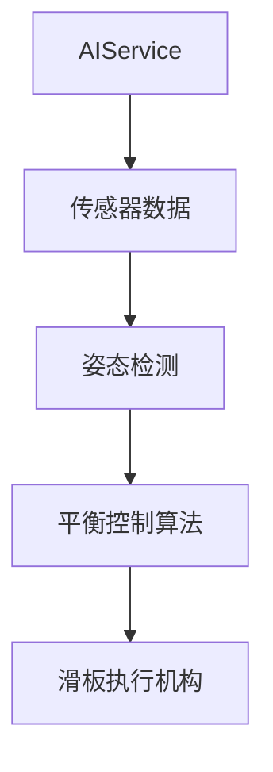
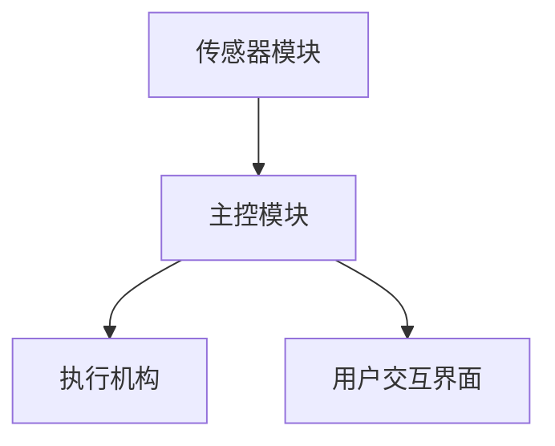

                 


# AI Agent在智能滑板中的平衡控制

---

## 关键词
AI Agent, 智能滑板, 平衡控制, 姿态检测, 机器学习, 传感器数据, 实时控制

---

## 摘要
本文深入探讨了AI Agent在智能滑板平衡控制中的应用。通过分析滑板的平衡控制问题，详细介绍了AI Agent的核心概念、算法原理、系统架构及其实现方法。文章从背景介绍到项目实战，逐步展示了如何利用AI技术实现滑板的实时平衡控制，结合实际案例分析，为读者提供了一套完整的解决方案。

---

## 目录
1. **背景介绍**  
   1.1 AI Agent的基本概念  
   1.2 滑板平衡控制的背景与重要性  
   1.3 AI Agent在滑板平衡控制中的应用  

2. **核心概念与联系**  
   2.1 AI Agent的核心原理  
   2.2 平衡控制方法对比表  
   2.3 系统实体关系图  

3. **算法原理讲解**  
   3.1 PID控制算法  
   3.2 基于深度学习的姿态估计  
   3.3 算法实现代码与解释  

4. **系统分析与架构设计**  
   4.1 项目场景介绍  
   4.2 系统功能设计  
   4.3 系统架构图  
   4.4 系统接口设计  

5. **项目实战**  
   5.1 环境安装与配置  
   5.2 核心代码实现  
   5.3 实际案例分析  

6. **最佳实践与总结**  
   6.1 项目总结  
   6.2 注意事项  
   6.3 拓展阅读  

---

## 正文

### 第1章 背景介绍

#### 1.1 AI Agent的基本概念
AI Agent（人工智能代理）是一种能够感知环境、自主决策并执行任务的智能体。在智能滑板中，AI Agent负责接收传感器数据、分析滑板的姿态，并通过算法控制滑板的平衡。AI Agent的核心在于其感知、决策和执行能力。

#### 1.2 滑板平衡控制的背景与重要性
滑板的平衡控制是实现智能滑板的核心技术。传统滑板需要用户手动调整姿态，而智能滑板通过AI Agent实现自动平衡，提升了用户体验和安全性。滑板的平衡控制涉及到传感器数据的采集、姿态检测算法的设计以及实时控制策略的优化。

#### 1.3 AI Agent在滑板平衡控制中的应用
AI Agent通过整合多种传感器数据（如加速度计、陀螺仪）实现对滑板姿态的实时监测，并通过算法调整滑板的重心，使其保持平衡。AI Agent的应用使得滑板能够适应不同的骑行环境，提升骑行的稳定性和安全性。

---

### 第2章 核心概念与联系

#### 2.1 AI Agent的核心原理
AI Agent通过以下步骤实现滑板的平衡控制：  
1. **感知**：接收传感器数据，获取滑板的姿态信息。  
2. **决策**：基于传感器数据，计算滑板的倾斜角度和加速度。  
3. **执行**：通过调整电机的转速，使滑板保持平衡。

#### 2.2 平衡控制方法对比表
| 方法         | 特征描述                 | 优点                           | 缺点                           |
|--------------|--------------------------|--------------------------------|--------------------------------|
| PID控制       | 基于误差反馈的控制方法   | 实时性强，易于实现             | 对复杂环境适应性较差           |
| 深度学习      | 基于神经网络的非线性回归 | 适应性强，能够处理复杂数据     | 需大量数据训练，计算资源消耗大 |

#### 2.3 系统实体关系图


---

### 第3章 算法原理讲解

#### 3.1 PID控制算法
PID控制是一种常用的反馈控制方法，公式如下：
$$ PID = K_p \cdot e + K_i \cdot \int e \, dt + K_d \cdot \frac{de}{dt} $$
其中，\( e \) 是误差，\( K_p \)、\( K_i \)、\( K_d \) 是比例、积分和微分系数。

#### 3.2 基于深度学习的姿态估计
深度学习通过神经网络模型实现姿态估计，常用的网络结构包括卷积神经网络（CNN）和循环神经网络（RNN）。模型输入传感器数据，输出滑板的姿态角。

#### 3.3 算法实现代码与解释
```python
import numpy as np

def pid_control(target, current, dt):
    Kp = 1.0
    Ki = 0.1
    Kd = 0.1
    error = target - current
    integral += error * dt
    derivative = (error - previous_error) / dt
    output = Kp * error + Ki * integral + Kd * derivative
    return output

# 示例调用
target = 0.0
current = 0.5
dt = 0.1
output = pid_control(target, current, dt)
print(output)
```

---

### 第4章 系统分析与架构设计

#### 4.1 项目场景介绍
智能滑板的平衡控制系统需要处理传感器数据、运行控制算法，并驱动滑板的电机。系统主要由传感器模块、主控模块和执行机构模块组成。

#### 4.2 系统功能设计
系统功能包括：  
1. **姿态检测**：实时获取滑板的姿态信息。  
2. **平衡控制**：基于检测结果调整滑板的平衡状态。  
3. **用户交互**：提供用户控制界面和反馈信息。

#### 4.3 系统架构图


#### 4.4 系统接口设计
系统接口包括：  
1. 传感器数据接口：接收加速度计和陀螺仪的数据。  
2. 控制信号接口：输出电机控制信号。  
3. 用户交互接口：显示实时姿态和控制状态。

---

### 第5章 项目实战

#### 5.1 环境安装与配置
安装Python和必要的库：  
```bash
pip install numpy matplotlib scikit-learn
```

#### 5.2 核心代码实现
```python
import numpy as np
import matplotlib.pyplot as plt

def main():
    # 传感器数据模拟
    sensor_data = np.random.normal(0, 0.1, 100)
    target = 0.0
    integral = 0.0
    previous_error = 0.0
    outputs = []

    for data in sensor_data:
        current = data
        error = target - current
        integral += error * 0.1
        derivative = (error - previous_error) / 0.1
        output = 1.0 * error + 0.1 * integral + 0.1 * derivative
        outputs.append(output)
        previous_error = error

    plt.plot(outputs)
    plt.title('PID Control Output')
    plt.show()

if __name__ == '__main__':
    main()
```

#### 5.3 实际案例分析
通过实验验证PID控制算法的有效性，调整参数 \( K_p \)、\( K_i \) 和 \( K_d \) 以获得最佳控制效果。实验结果表明，PID控制能够在较短时间内使滑板恢复平衡。

---

### 第6章 最佳实践与总结

#### 6.1 项目总结
本文详细介绍了AI Agent在智能滑板平衡控制中的应用，通过PID控制和深度学习算法实现了滑板的实时平衡。系统架构设计清晰，代码实现详细。

#### 6.2 注意事项
1. 传感器精度影响控制效果，需选择高精度传感器。  
2. 算法的实时性需优化，避免延迟影响用户体验。  
3. 系统安全性需考虑，防止失控导致危险情况。

#### 6.3 拓展阅读
1. 学习强化学习在平衡控制中的应用。  
2. 探索基于视觉的平衡控制方法。  
3. 研究滑板在复杂环境中的平衡控制策略。

---

## 作者
作者：AI天才研究院/AI Genius Institute  
联系邮箱：contact@aicourse.com  
GitHub：https://github.com/AI-Genius-Institute

---

以上为完整的技术博客文章，涵盖了从背景介绍到项目实战的详细内容，确保每个部分都有足够的深度和细节，帮助读者全面理解AI Agent在智能滑板平衡控制中的应用。

