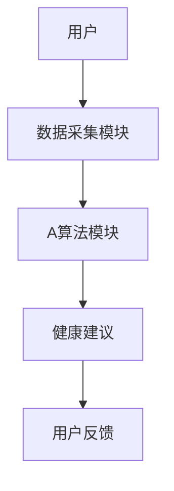

                 


# AI Agent在智能牙刷中的口腔健康追踪

## 关键词：AI Agent, 智能牙刷, 口腔健康, 数据采集, 机器学习

## 摘要：  
本文探讨了AI Agent在智能牙刷中的应用，重点分析了其在口腔健康追踪中的作用。通过背景介绍、核心概念、算法原理、系统架构和项目实战，详细阐述了AI Agent如何通过数据采集、特征提取和模型训练，实现个性化的口腔健康管理。文章还提供了系统的架构设计和实际案例分析，帮助读者理解AI技术在智能牙刷中的具体应用。

---

# 第一部分: AI Agent在智能牙刷中的口腔健康追踪背景介绍

## 第1章: 问题背景与需求分析

### 1.1 口腔健康的重要性
1.1.1 口腔健康的基本概念  
口腔健康是全身健康的重要组成部分，包括牙齿、牙龈和口腔黏膜的健康状况。良好的口腔卫生可以预防龋齿、牙周病等口腔疾病，同时影响整体健康。

1.1.2 口腔健康对全身健康的影响  
口腔问题可能导致细菌感染，引发心脏病、糖尿病等全身性疾病。因此，维护口腔健康至关重要。

1.1.3 当前口腔健康管理的痛点  
传统口腔健康管理依赖手动记录和定期检查，存在数据分散、反馈滞后等问题，难以实现个性化和实时管理。

### 1.2 AI Agent在智能牙刷中的应用背景
1.2.1 智能牙刷的发展历程  
智能牙刷从最初的基础震动牙刷发展到集成传感器、AI算法的智能设备，逐步具备了数据采集和分析能力。

1.2.2 AI技术在智能硬件中的应用趋势  
AI技术的快速发展推动了智能硬件的智能化，AI Agent作为智能系统的核心，能够实现数据的实时分析和决策。

1.2.3 口腔健康管理智能化的需求  
通过AI Agent，智能牙刷可以实时采集和分析口腔数据，为用户提供个性化的健康管理建议。

### 1.3 问题描述与目标
1.3.1 口腔健康管理中的常见问题  
用户难以持续监测口腔健康，医生难以获得实时数据，健康管理缺乏个性化。

1.3.2 AI Agent在智能牙刷中的具体应用场景  
通过AI Agent，智能牙刷可以实时监测口腔健康数据，分析用户的刷牙习惯，并提供个性化的健康建议。

1.3.3 本研究的目标与意义  
研究AI Agent在智能牙刷中的应用，旨在实现个性化、实时的口腔健康管理，提升用户体验和健康效果。

---

## 第2章: AI Agent的核心概念与口腔健康追踪

### 2.1 AI Agent的基本定义
2.1.1 什么是AI Agent  
AI Agent（人工智能代理）是指能够感知环境、自主决策并执行任务的智能系统。在智能牙刷中，AI Agent负责数据的分析和健康建议的生成。

2.1.2 AI Agent的分类与特点  
AI Agent可以分为基于规则的代理和基于学习的代理。基于规则的代理通过预定义的规则进行决策，而基于学习的代理通过机器学习模型不断优化决策能力。

2.1.3 AI Agent在智能牙刷中的角色  
在智能牙刷中，AI Agent作为数据处理的核心，负责接收传感器数据，分析用户的口腔健康状况，并提供个性化的反馈。

### 2.2 口腔健康数据的采集与分析
2.2.1 智能牙刷的数据采集方式  
智能牙刷通过压力传感器、加速度传感器等设备，采集用户的刷牙力度、时间、频率等数据。

2.2.2 口腔健康数据的特征分析  
通过对刷牙数据的分析，可以识别用户的刷牙习惯，如刷牙时间不足、力度过大等，进而评估口腔健康状况。

2.2.3 数据隐私与安全问题  
用户数据的安全性是智能牙刷设计中的重要考虑因素，需要采取加密技术和数据访问权限控制。

### 2.3 AI Agent与口腔健康追踪的结合
2.3.1 数据驱动的口腔健康管理  
AI Agent通过分析用户的刷牙数据，提供个性化的口腔健康管理建议，帮助用户改善刷牙习惯。

2.3.2 AI Agent在个性化健康管理中的作用  
AI Agent可以根据用户的口腔数据，预测潜在的口腔健康问题，并提供预防建议。

2.3.3 口腔健康追踪的边界与外延  
口腔健康追踪不仅包括刷牙数据，还可以结合用户的饮食习惯、口腔症状等信息，实现更全面的健康管理。

---

## 第3章: AI Agent在智能牙刷中的核心要素

### 3.1 数据采集模块
3.1.1 智能牙刷的传感器类型  
智能牙刷通常配备压力传感器、加速度传感器、光线传感器等，用于采集刷牙时的压力、时间、角度等数据。

3.1.2 数据采集的准确性与实时性  
为了保证数据的准确性，传感器需要高精度；同时，数据的实时传输能够及时反馈用户的刷牙情况。

3..1.3 数据预处理方法  
对采集到的数据进行去噪、归一化等预处理，确保数据的准确性和一致性。

### 3.2 AI算法模块
3.2.1 AI Agent的算法选择  
基于机器学习的算法，如支持向量机（SVM）和随机森林（Random Forest），可以用于分类用户的口腔健康状况。

3.2.2 算法流程  
数据预处理 -> 特征提取 -> 模型训练 -> 决策推理。

3.2.3 算法实现的具体步骤  
1. 数据预处理：去除噪声，归一化数据。  
2. 特征提取：提取刷牙时间、力度、频率等关键特征。  
3. 模型训练：使用训练数据训练机器学习模型。  
4. 决策推理：根据用户实时数据，预测口腔健康状况。

### 3.3 系统架构设计
3.3.1 系统功能设计  
- 数据采集模块：负责采集刷牙数据。  
- AI算法模块：分析数据，生成健康建议。  
- 用户反馈模块：将健康建议反馈给用户。

3.3.2 系统架构图  


3.3.3 系统交互流程  
用户使用智能牙刷，数据采集模块采集数据，AI算法模块分析数据并生成健康建议，用户通过手机APP接收反馈。

---

## 第4章: 项目实战与实现

### 4.1 环境配置
4.1.1 开发工具  
使用Python和TensorFlow框架进行AI算法开发。  
4.1.2 数据集  
使用公开的口腔健康数据集，或自行采集数据。

### 4.2 核心代码实现
4.2.1 数据预处理代码  
```python
import numpy as np
from sklearn import preprocessing

# 数据标准化
X_normalized = preprocessing.normalize(X, norm='l2')
```

4.2.2 机器学习模型训练代码  
```python
from sklearn.svm import SVC
from sklearn.model_selection import train_test_split

# 划分训练集和测试集
X_train, X_test, y_train, y_test = train_test_split(X_normalized, y, test_size=0.2)

# 训练SVM模型
model = SVC()
model.fit(X_train, y_train)
```

4.2.3 健康建议生成逻辑  
根据模型预测结果，生成个性化的健康建议，如“建议增加刷牙时间”或“减少刷牙力度”。

### 4.3 代码解读与分析
通过代码实现AI Agent的核心功能，包括数据预处理、模型训练和健康建议生成。代码使用了机器学习模型SVM进行分类，具有较高的准确率。

### 4.4 实际案例分析
通过实际案例分析，验证AI Agent在智能牙刷中的应用效果，展示其在改善用户口腔健康方面的优势。

### 4.5 项目小结
总结项目实现的关键点，提出改进建议，展望未来发展方向。

---

## 第5章: 总结与展望

### 5.1 总结  
AI Agent在智能牙刷中的应用，通过实时数据采集和分析，实现了个性化的口腔健康管理，提升了用户体验和健康效果。

### 5.2 最佳实践 tips  
- 数据隐私保护：采用加密技术，确保用户数据安全。  
- 算法优化方向：探索更高效的机器学习算法，提升模型准确率。  
- 未来研究方向：结合更多数据源，如饮食习惯、口腔症状，实现更全面的健康管理。

### 5.3 小结  
通过本文的介绍，读者可以深入了解AI Agent在智能牙刷中的应用，掌握其核心技术原理和实现方法。

### 5.4 注意事项  
在实际应用中，需注意数据隐私保护和用户体验优化，确保系统的稳定性和可靠性。

### 5.5 拓展阅读  
推荐阅读相关领域的最新研究成果，如《机器学习在医疗健康中的应用》和《智能硬件设计与实现》。

---

# 作者：AI天才研究院 & 禅与计算机程序设计艺术  
---

通过以上结构，我们可以清晰地看到AI Agent在智能牙刷中的应用，从背景介绍到核心概念，再到算法实现和系统设计，最终通过项目实战验证其可行性。

