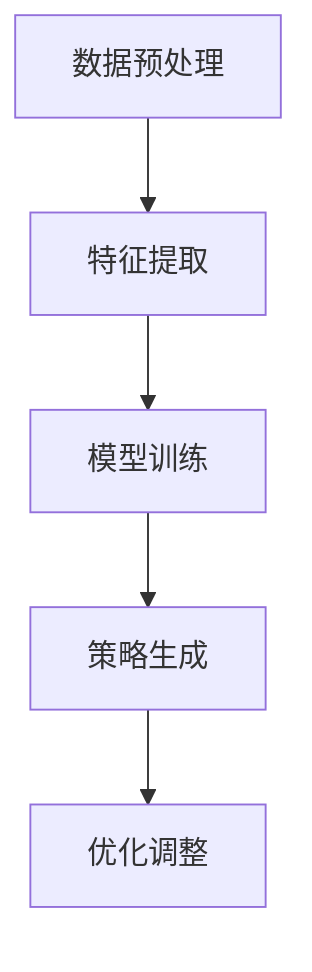
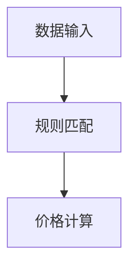
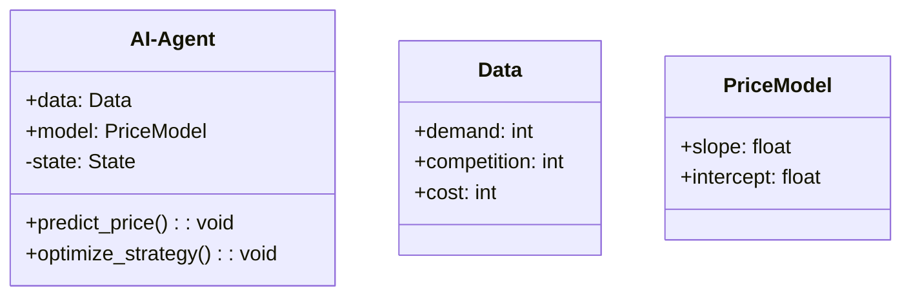
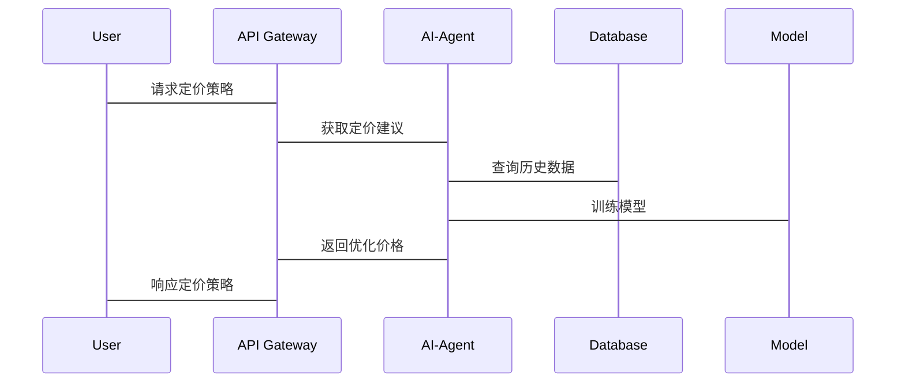

                 


# AI Agent在智能电子商务定价策略中的角色

## 关键词：AI Agent, 智能电子商务, 定价策略, 机器学习, 数据分析

## 摘要：随着电子商务的快速发展，AI Agent在定价策略中的作用日益重要。本文探讨了AI Agent如何通过动态定价、个性化定价和竞争分析优化电子商务定价策略，分析了其实现原理、系统架构，并提供了实战案例。

---

# 第一部分: AI Agent与智能电子商务定价策略背景

## 第1章: AI Agent与智能电子商务定价策略概述

### 1.1 AI Agent的基本概念
#### 1.1.1 AI Agent的定义与特点
AI Agent（人工智能代理）是能够感知环境、自主决策并执行任务的智能实体。其特点包括自主性、反应性、目标导向和社会能力。

#### 1.1.2 AI Agent在电子商务中的应用场景
AI Agent广泛应用于推荐系统、库存管理、客户行为分析和动态定价等领域。

#### 1.1.3 智能电子商务定价策略的背景与意义
动态市场环境要求定价策略实时调整，AI Agent通过数据驱动优化价格，提升竞争力和利润。

### 1.2 智能电子商务定价策略的演进
#### 1.2.1 传统定价策略的局限性
传统定价策略基于固定规则，难以应对市场波动和个性化需求。

#### 1.2.2 数据驱动定价的兴起
大数据和机器学习推动定价策略从经验驱动转向数据驱动。

#### 1.2.3 AI Agent在定价中的角色演变
从辅助决策到自主优化，AI Agent在定价策略中的角色逐步增强。

### 1.3 AI Agent在智能电子商务中的应用现状
#### 1.3.1 典型应用案例分析
例如，亚马逊使用AI Agent动态调整商品价格，实时响应市场需求。

#### 1.3.2 当前技术挑战与未来趋势
挑战包括数据隐私、模型可解释性和计算资源需求，未来趋势是更智能和自适应的定价策略。

---

# 第二部分: AI Agent在定价策略中的核心概念与联系

## 第2章: AI Agent的核心概念与定价策略的关系

### 2.1 AI Agent的核心原理
#### 2.1.1 AI Agent的感知与决策机制
通过数据采集、分析和建模，AI Agent感知市场环境，生成定价策略。

#### 2.1.2 基于数据的定价策略生成过程
数据预处理、特征工程、模型训练和策略优化是生成定价策略的关键步骤。

#### 2.1.3 AI Agent的自适应优化能力
AI Agent通过反馈机制不断优化定价策略，适应市场变化。

### 2.2 定价策略的关键要素
#### 2.2.1 市场需求分析
分析需求弹性、购买意图和价格敏感性，确定价格敏感区间。

#### 2.2.2 竞争对手行为预测
通过市场数据分析竞争对手定价策略，预测其价格变化。

#### 2.2.3 产品生命周期与价格弹性
产品生命周期不同阶段适用不同定价策略，价格弹性影响定价敏感性。

### 2.3 AI Agent与定价策略的实体关系图
```mermaid
er
    actor 用户
    actor 竞争对手
    entity 数据源
    entity AI Agent
    entity 定价策略
    relation 用户 --> 数据源: 提供数据
    relation 数据源 --> AI Agent: 加工数据
    relation AI Agent --> 定价策略: 生成策略
```

---

# 第三部分: AI Agent的定价策略算法原理

## 第3章: AI Agent定价策略的算法原理

### 3.1 基于机器学习的定价算法
#### 3.1.1 算法流程图


#### 3.1.2 Python代码实现
```python
import pandas as pd
from sklearn.linear_model import LinearRegression

# 数据加载与预处理
data = pd.read_csv('pricing_data.csv')
X = data[['demand', 'competition', 'cost']]
y = data['price']

# 模型训练
model = LinearRegression()
model.fit(X, y)

# 预测价格
new_data = pd.DataFrame({'demand': [100], 'competition': [80], 'cost': [20]})
predicted_price = model.predict(new_data)
print(predicted_price)
```

#### 3.1.3 算法原理与数学模型
线性回归模型：
$$ y = \beta_0 + \beta_1x_1 + \beta_2x_2 + ... + \beta_nx_n + \epsilon $$

#### 3.1.4 例子与说明
假设某产品的市场需求为100，竞争产品价格为80，成本为20，模型预测价格为85。

### 3.2 基于规则的定价算法
#### 3.2.1 算法流程图


#### 3.2.2 Python代码实现
```python
def calculate_price(demand, competition, cost):
    if demand > 100 and competition < 80:
        return cost * 2
    else:
        return cost * 1.5

price = calculate_price(120, 70, 50)
print(price)
```

---

# 第四部分: 系统分析与架构设计

## 第4章: AI Agent定价策略的系统分析与架构设计

### 4.1 系统问题场景介绍
电商系统需要实时调整商品价格，以响应市场需求和竞争变化。

### 4.2 系统功能设计
#### 4.2.1 领域模型类图


#### 4.2.2 系统架构图


#### 4.2.3 接口设计与交互
序列图展示API调用流程：


---

# 第五部分: 项目实战

## 第5章: AI Agent定价策略的项目实战

### 5.1 环境安装与数据准备
安装Python、Pandas、Scikit-learn，准备定价数据集。

### 5.2 系统核心实现
#### 5.2.1 数据预处理代码
```python
import pandas as pd

data = pd.read_csv('pricing_data.csv')
data['date'] = pd.to_datetime(data['date'])
data.set_index('date', inplace=True)
print(data.head())
```

#### 5.2.2 训练定价模型代码
```python
from sklearn.model_selection import train_test_split
from sklearn.metrics import mean_squared_error
import numpy as np

X_train, X_test, y_train, y_test = train_test_split(X, y, test_size=0.2)

model = LinearRegression()
model.fit(X_train, y_train)

predicted_price = model.predict(X_test)
rmse = np.sqrt(mean_squared_error(y_test, predicted_price))
print(f'RMSE: {rmse}')
```

#### 5.2.3 模型优化代码
使用网格搜索调整模型参数，提升预测精度。

### 5.3 案例分析与解读
分析实际案例，如某电子产品定价策略优化，展示模型的应用效果和经济效益。

### 5.4 项目小结
总结项目成果，强调AI Agent在动态定价中的优势和未来改进方向。

---

# 第六部分: 最佳实践与未来展望

## 第6章: 最佳实践与未来展望

### 6.1 小结
AI Agent通过实时数据处理和模型优化，显著提升了电子商务的定价效率和效果。

### 6.2 注意事项
数据隐私、模型可解释性和计算资源需求是实际应用中的关键问题。

### 6.3 拓展阅读
建议阅读相关书籍和论文，深入理解AI在定价中的应用。

---

# 作者：AI天才研究院 & 禅与计算机程序设计艺术

---

本文系统地探讨了AI Agent在智能电子商务定价策略中的应用，从理论到实践，为读者提供了全面的指导。

