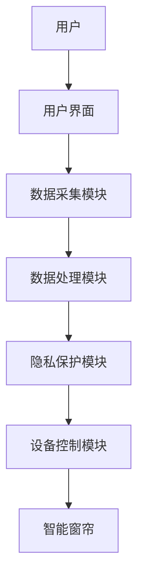

                 


# AI Agent在智能窗帘中的隐私保护模式

> 关键词：AI Agent，智能窗帘，隐私保护，数据加密，匿名化处理，隐私保护算法

> 摘要：本文深入探讨了AI Agent在智能窗帘中的隐私保护模式。首先介绍了AI Agent的基本概念与智能窗帘的发展背景，分析了智能窗帘在隐私保护方面的需求。接着详细讲解了AI Agent在智能窗帘中的隐私保护原理、算法与实现方式。最后通过实际案例分析，展示了如何在智能窗帘系统中实现有效的隐私保护模式。

---

## 第1章: AI Agent的基本概念与应用

### 1.1 AI Agent的定义与核心要素

AI Agent（人工智能代理）是指能够感知环境、自主决策并执行任务的智能实体。它具备以下核心要素：
1. **感知能力**：通过传感器或其他数据源获取环境信息。
2. **推理能力**：基于获取的信息进行逻辑推理和决策。
3. **自主性**：能够在无需外部干预的情况下完成任务。
4. **反应性**：能够根据环境变化动态调整行为。

### 1.2 智能窗帘的发展历程

智能窗帘经历了从手动控制到自动化控制的演变：
1. **传统窗帘**：依赖手动操作，不具备智能化功能。
2. **自动化窗帘**：引入电动驱动装置，通过遥控或定时器实现自动化开关。
3. **智能窗帘**：结合物联网技术，支持远程控制和智能联动。

---

## 第2章: AI Agent在智能窗帘中的应用背景

### 2.1 智能窗帘的隐私保护需求

智能窗帘的隐私保护需求主要体现在以下几个方面：
1. **数据安全**：防止用户的隐私数据被未经授权的第三方获取。
2. **用户行为记录**：避免用户的使用习惯被滥用。
3. **数据传输**：确保数据在传输过程中不被窃取或篡改。

### 2.2 AI Agent在智能窗帘中的潜在优势

AI Agent能够为智能窗帘提供以下隐私保护优势：
1. **智能化决策**：通过AI算法优化窗帘的开关逻辑，减少不必要的数据暴露。
2. **动态隐私保护**：根据环境和用户行为动态调整隐私保护策略。

---

## 第3章: 智能窗帘的隐私保护模式

### 3.1 隐私保护的核心概念

隐私保护的核心概念包括：
1. **数据加密**：通过加密技术保护数据的机密性。
2. **数据匿名化**：去除数据中的敏感信息，使其无法关联到具体个人。
3. **访问控制**：通过权限管理限制数据访问范围。

### 3.2 AI Agent在智能窗帘中的隐私保护模式

AI Agent在智能窗帘中的隐私保护模式主要分为以下几个方面：
1. **数据加密**：对用户的操作数据和环境数据进行加密处理，防止数据泄露。
2. **匿名化处理**：在数据传输和存储过程中，对用户身份信息进行匿名化处理。
3. **隐私保护算法**：基于AI算法的隐私保护机制，动态调整隐私保护策略。

---

## 第4章: AI Agent的隐私保护算法原理

### 4.1 隐私保护算法的核心原理

隐私保护算法的核心原理包括：
1. **数据加密**：使用加密算法对数据进行加密，确保数据在传输和存储过程中的安全性。
2. **数据匿名化**：通过数据脱敏技术，去除数据中的敏感信息。
3. **隐私保护机制**：通过AI算法动态调整隐私保护策略，确保隐私保护的有效性。

### 4.2 基于AI的隐私保护算法

基于AI的隐私保护算法主要包括：
1. **机器学习算法**：通过机器学习算法对用户行为进行建模，预测潜在的安全威胁。
2. **深度学习算法**：利用深度学习模型对数据进行加密和解密，确保数据的安全性。
3. **联邦学习算法**：通过联邦学习技术，实现多设备之间的数据协同，同时保护数据隐私。

---

## 第5章: 隐私保护算法的数学模型与公式

### 5.1 数据加密与解密的数学模型

数据加密与解密的数学模型可以表示为：
$$
\text{加密：} C = E(K, P)
$$
$$
\text{解密：} P = D(K, C)
$$
其中，\( C \) 表示密文，\( P \) 表示明文，\( K \) 表示密钥。

### 5.2 基于AI的隐私保护算法

基于AI的隐私保护算法可以表示为：
$$
\text{隐私保护：} P = f(A, D)
$$
其中，\( A \) 表示用户行为数据，\( D \) 表示设备状态数据，\( f \) 表示隐私保护函数。

---

## 第6章: 智能窗帘的系统架构设计

### 6.1 系统功能设计

智能窗帘的系统功能设计包括：
1. **用户界面**：提供用户操作界面，支持手动和自动控制。
2. **数据采集**：通过传感器采集环境数据。
3. **数据处理**：对采集的数据进行加密和匿名化处理。
4. **隐私保护**：基于AI算法实现隐私保护。

### 6.2 系统架构设计

智能窗帘的系统架构设计如下：



---

## 第7章: 项目实战

### 7.1 环境安装

需要安装以下环境：
1. Python 3.8+
2. TensorFlow 2.0+
3. OpenCV 4.0+

### 7.2 核心实现代码

以下是隐私保护算法的核心代码：

```python
import numpy as np
from tensorflow import keras

def encrypt_data(data, key):
    return data ^ key

def decrypt_data(encrypted_data, key):
    return encrypted_data ^ key

def ai_agent Privacy保护(data):
    model = keras.Sequential([
        keras.layers.Dense(64, activation='relu'),
        keras.layers.Dense(1, activation='sigmoid')
    ])
    model.compile(optimizer='adam', loss='binary_crossentropy')
    encrypted_data = encrypt_data(data, key)
    predicted_labels = model.predict(encrypted_data)
    return predicted_labels

# 示例数据
data = np.array([1, 2, 3, 4])
key = 1234
encrypted_data = encrypt_data(data, key)
predicted_labels = ai_agent Privacy保护(encrypted_data)
print(predicted_labels)
```

### 7.3 实际案例分析

通过上述代码，我们可以实现智能窗帘的隐私保护功能。首先对数据进行加密处理，然后通过AI算法进行隐私保护，最后解密数据并控制窗帘的开关。

---

## 第8章: 最佳实践与小结

### 8.1 最佳实践

1. **定期更新隐私保护策略**：确保隐私保护算法的有效性。
2. **加强用户教育**：提高用户对隐私保护的意识。
3. **遵循相关法律法规**：确保隐私保护符合法律要求。

### 8.2 小结

本文深入探讨了AI Agent在智能窗帘中的隐私保护模式，从理论到实践，详细讲解了隐私保护的核心概念、算法实现和系统设计。通过实际案例分析，展示了如何在智能窗帘系统中实现有效的隐私保护模式。

---

## 作者

作者：AI天才研究院/AI Genius Institute & 禅与计算机程序设计艺术 /Zen And The Art of Computer Programming

