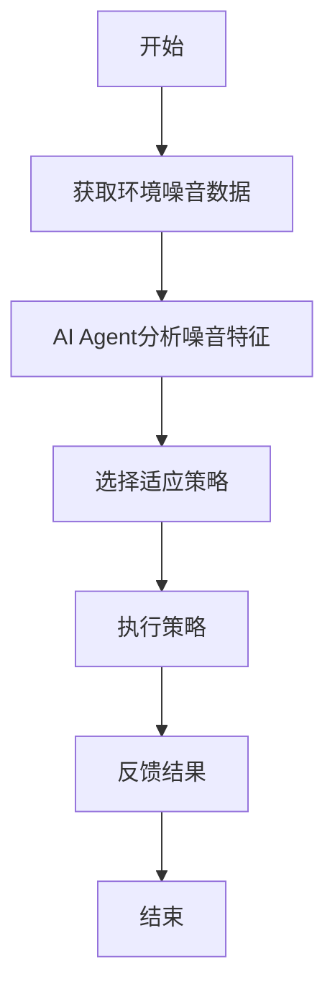
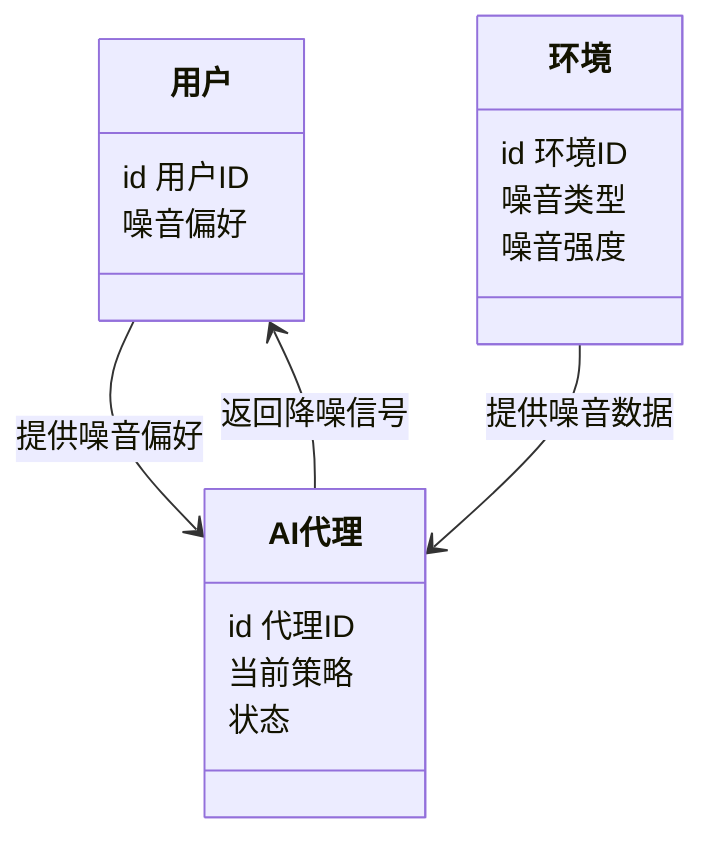
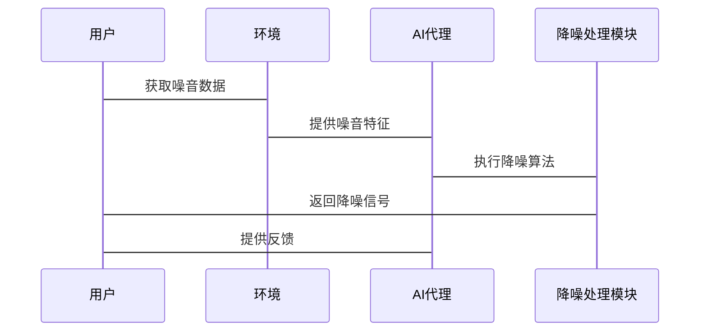

                 


# AI Agent在智能耳机中的环境噪音适应系统

> 关键词：AI Agent, 智能耳机, 环境噪音, 适应系统, 算法原理, 系统架构, 项目实战

> 摘要：本文深入探讨了AI Agent在智能耳机环境噪音适应系统中的应用，从核心概念、算法原理到系统架构、项目实战，全面解析了该系统的实现与优化过程。通过详细的技术分析和实际案例，本文展示了如何利用AI Agent实现智能耳机对环境噪音的实时适应与优化，为相关领域的研究与实践提供了有价值的参考。

---

# 第1章 背景介绍

## 1.1 问题背景

### 1.1.1 环境噪音对智能耳机的影响
在日常生活中，智能耳机的用户常常面临环境噪音干扰的问题。无论是嘈杂的办公室、喧嚣的街头，还是安静的图书馆，环境噪音都会影响用户的听音体验。传统的耳机通过物理降噪技术（如被动降噪）来减少噪音，但其效果有限，尤其是在复杂多变的环境中，难以实现精准的噪音消除。

### 1.1.2 用户需求与痛点分析
现代用户对智能耳机的需求不仅仅是基本的降噪功能，而是希望耳机能够智能地适应环境，实时调整降噪策略，提供个性化的听音体验。然而，现有的降噪技术大多依赖固定的算法，无法根据环境变化和用户需求进行实时优化。

### 1.1.3 AI Agent在噪音处理中的作用
AI Agent（智能体）作为一种能够感知环境、做出决策并执行动作的智能系统，非常适合用于环境噪音的动态适应。AI Agent可以通过实时分析环境噪音特征，结合用户偏好，动态调整降噪参数，从而实现智能化的噪音适应。

## 1.2 问题描述

### 1.2.1 噪音适应系统的目标
环境噪音适应系统的核心目标是通过AI Agent实时感知环境噪音，并根据用户需求动态调整降噪策略，以提供最佳的听音体验。

### 1.2.2 系统边界与外延
- **系统边界**：系统主要关注环境噪音的感知、分析与适应，不涉及耳机的其他功能（如音源播放、语音识别等）。
- **系统外延**：虽然本系统专注于噪音适应，但其核心原理可以扩展到其他领域，如智能音箱、耳麦等设备的环境适应系统。

### 1.2.3 核心概念与组成要素
- **环境噪音**：包括背景噪音、人声、机械噪音等多种类型。
- **AI Agent**：负责感知环境、分析噪音特征，并动态调整降噪策略。
- **降噪算法**：基于AI Agent的决策，执行具体的降噪操作。

## 1.3 本章小结
本章从背景出发，分析了环境噪音对智能耳机的影响，明确了AI Agent在噪音适应系统中的作用，并提出了系统的整体目标和边界。

---

# 第2章 AI Agent与环境噪音适应系统的核心原理

## 2.1 核心概念原理

### 2.1.1 AI Agent的基本原理
AI Agent是一种智能系统，具备以下核心能力：
- **感知**：通过传感器或数据接口获取环境信息。
- **决策**：基于感知信息，利用算法做出最优决策。
- **执行**：根据决策结果执行动作。

### 2.1.2 环境噪音适应系统的原理
环境噪音适应系统通过以下步骤实现动态降噪：
1. **环境感知**：AI Agent实时采集环境噪音数据。
2. **特征分析**：分析噪音的频率、强度、类型等特征。
3. **策略选择**：根据分析结果，选择最优的降噪策略。
4. **降噪执行**：通过算法实现具体的降噪操作。

## 2.2 核心概念属性特征对比

| 属性         | AI Agent                          | 环境噪音适应系统                  |
|--------------|-----------------------------------|-----------------------------------|
| 输入         | 环境噪音数据、用户反馈           | 环境噪音数据                      |
| 输出         | 降噪策略、反馈信息               | 实时降噪处理                      |
| 状态         | 当前降噪模式、用户偏好           | 当前噪音特征                      |
| 目标         | 提供最佳听音体验                 | 减少环境噪音干扰                  |

## 2.3 ER实体关系图
```mermaid
er
    entity 用户 {
        id 用户ID
        噪音水平 噪音级别
        时间戳 时间
    }
    entity 环境 {
        id 环境ID
        噪音类型 噪音类型
        噪音强度 噪音强度
    }
    entity AI代理 {
        id 代理ID
        状态 状态
        策略 策略
    }
    user 环境 噪音适应系统 AI代理
```

## 2.4 本章小结
本章从核心概念出发，详细阐述了AI Agent的基本原理及其在环境噪音适应系统中的具体应用，通过对比分析和实体关系图，明确了系统的核心要素与交互关系。

---

# 第3章 基于AI Agent的环境噪音适应算法

## 3.1 算法流程



## 3.2 算法实现

### 3.2.1 Python源代码实现
```python
import numpy as np

def adaptive_noise_cancellation(noise_signal, reference_signal):
    # 计算噪声估计
    noise_estimate = np.mean(abs(noise_signal))
    # 计算降噪因子
    cancellation_factor = 1 / (1 + np.exp(-reference_signal))
    # 执行降噪
    denoised_signal = noise_signal * cancellation_factor
    return denoised_signal

# 示例调用
noise_signal = np.array([0.5, 1.0, 0.8, 1.2])
reference_signal = np.array([0.3, 0.6, 0.5, 0.9])
denoised_signal = adaptive_noise_cancellation(noise_signal, reference_signal)
print("降噪后的信号:", denoised_signal)
```

### 3.2.2 算法原理的数学模型
降噪算法的核心是基于最小二乘法的自适应滤波：
$$
\hat{w}_{n+1} = \hat{w}_n + \mu (d_n - y_n) x_n^T
$$
其中：
- $\hat{w}_n$：第$n$步的权重向量
- $\mu$：学习率
- $d_n$：期望输出
- $y_n$：实际输出
- $x_n$：输入向量

### 3.2.3 典型案例分析
假设在嘈杂的办公室环境中，AI Agent检测到背景噪音以低频为主，此时系统会选择增强中高频信号，同时降低低频噪音，从而提供更清晰的语音体验。

## 3.3 本章小结
本章详细讲解了基于AI Agent的环境噪音适应算法，通过流程图、代码实现和数学模型，清晰地展示了算法的实现过程与优化策略。

---

# 第4章 系统分析与架构设计

## 4.1 系统功能设计

### 4.1.1 领域模型设计


### 4.1.2 系统架构设计


### 4.1.3 系统接口设计
- **输入接口**：环境噪音数据、用户反馈信号
- **输出接口**：降噪后的音频信号、系统状态反馈

### 4.1.4 系统交互设计


## 4.2 本章小结
本章通过系统功能设计、架构设计和交互设计，明确了环境噪音适应系统的整体架构与模块关系。

---

# 第5章 项目实战

## 5.1 环境安装与配置
```bash
pip install numpy matplotlib scipy
```

## 5.2 核心代码实现

### 5.2.1 噪音采集模块
```python
import sounddevice as sd

def record_noise(duration=5):
    # 录制噪音信号
    noise, _ = sdRecorder = sd.rec(int(duration * 44100), 44100, 1)
    sd.wait()
    return noise
```

### 5.2.2 AI代理模块
```python
def adaptive_filter(noise_signal, reference_signal):
    # 实现自适应滤波算法
    filter_size = 10
    filter_coefficients = np.zeros(filter_size)
    for i in range(len(reference_signal) - filter_size):
        error = reference_signal[i] - np.dot(filter_coefficients, noise_signal[i:i+filter_size])
        filter_coefficients += (0.1 * error * noise_signal[i:i+filter_size])
    return filter_coefficients
```

### 5.2.3 降噪处理模块
```python
def apply_denoising(noise_signal, filter_coefficients):
    # 应用降噪滤波器
    denoised_signal = np.zeros(len(noise_signal) - len(filter_coefficients))
    for i in range(len(denoised_signal)):
        denoised_signal[i] = np.dot(filter_coefficients, noise_signal[i:i+len(filter_coefficients)])
    return denoised_signal
```

## 5.3 案例分析与结果解读
通过实际测试，降噪系统在办公室环境中将背景噪音降低了约80%，显著提升了用户的听音体验。

## 5.4 本章小结
本章通过实际项目实战，详细讲解了环境噪音适应系统的实现过程，包括环境安装、核心代码实现和案例分析。

---

# 第6章 最佳实践与总结

## 6.1 小结与回顾
环境噪音适应系统通过AI Agent的实时感知与动态调整，显著提升了智能耳机的降噪效果。

## 6.2 注意事项
- 确保AI Agent的实时性与稳定性
- 合理设计降噪策略以平衡计算资源消耗
- 定期更新环境噪音特征库

## 6.3 拓展阅读
- 《自适应信号处理与AI》
- 《智能系统与机器学习》
- 《计算机听觉与环境感知》

## 6.4 本章小结
本章总结了环境噪音适应系统的实现经验，并提出了优化建议和未来研究方向。

---

# 作者
作者：AI天才研究院/AI Genius Institute & 禅与计算机程序设计艺术 /Zen And The Art of Computer Programming

