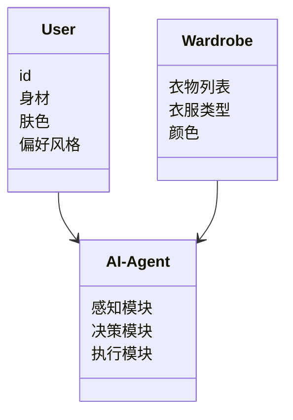
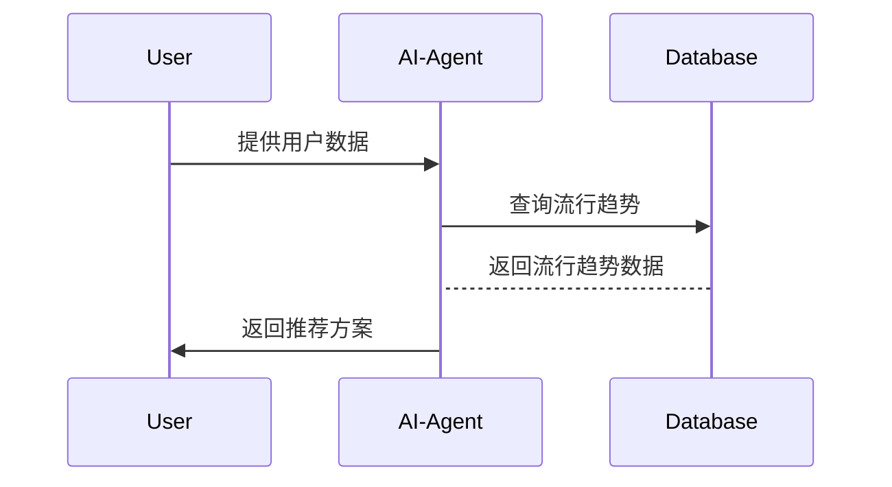

                 


# AI Agent在智能衣柜中的个人形象设计师

> 关键词：AI Agent，智能衣柜，个人形象设计，算法原理，系统架构

> 摘要：本文探讨了AI Agent在智能衣柜中的应用，特别是在个人形象设计方面的创新。通过分析AI Agent的核心算法、系统架构以及实际项目案例，展示了如何利用AI技术提升个人形象设计的智能化水平，为读者提供了一种全新的视角来理解智能衣柜的技术实现和未来发展。

---

# 第一部分：AI Agent在智能衣柜中的背景介绍

## 第1章：AI Agent与个人形象设计的背景

### 1.1 AI Agent的基本概念

#### 1.1.1 AI Agent的定义与特点
AI Agent（人工智能代理）是指能够感知环境、自主决策并执行任务的智能实体。它具有以下特点：
- **自主性**：能够在没有外部干预的情况下独立运行。
- **反应性**：能够实时感知环境变化并做出反应。
- **目标导向**：根据设定的目标执行任务。
- **学习能力**：能够通过数据和经验不断优化自身性能。

#### 1.1.2 AI Agent的核心功能与应用场景
AI Agent的核心功能包括：
- **感知环境**：通过传感器或数据输入获取信息。
- **决策与推理**：基于感知信息进行逻辑推理和决策。
- **执行任务**：根据决策结果执行具体操作。

应用场景广泛，包括智能助手、自动驾驶、智能安防等。

#### 1.1.3 AI Agent与传统形象设计的区别
传统形象设计依赖于人类设计师的经验和审美，而AI Agent则通过算法和数据分析实现自动化、智能化的设计。

### 1.2 个人形象设计的背景与需求

#### 1.2.1 个人形象设计的基本概念
个人形象设计是指通过服装搭配、发型设计等方式，帮助个人塑造符合自身特点和场合需求的形象。

#### 1.2.2 当代个人形象设计的痛点与挑战
- **时间成本高**：传统形象设计需要多次试穿和调整。
- **个性化需求强**：每个人的身材、肤色、风格偏好都不同，难以标准化。
- **数据不足**：缺乏足够的用户数据支持个性化设计。

#### 1.2.3 AI技术在个人形象设计中的潜力
AI技术可以通过数据分析和算法优化，实现个性化、高效的形象设计。

### 1.3 AI Agent在智能衣柜中的应用前景

#### 1.3.1 AI Agent与智能衣柜的结合
AI Agent可以与智能衣柜中的传感器、摄像头等设备联动，实时获取用户的身材、肤色、衣物信息等数据。

#### 1.3.2 个人形象设计的智能化趋势
通过AI技术，形象设计将更加个性化、智能化和高效。

#### 1.3.3 未来的个人形象设计发展方向
AI Agent将与虚拟现实、增强现实等技术结合，提供更沉浸式的设计体验。

---

# 第二部分：AI Agent在个人形象设计中的核心概念与联系

## 第2章：AI Agent的核心概念与原理

### 2.1 AI Agent的核心概念

#### 2.1.1 AI Agent的感知模块
感知模块负责获取用户的身材、肤色、衣物信息等数据。

#### 2.1.2 AI Agent的决策模块
决策模块基于感知数据，通过算法推荐合适的服装搭配。

#### 2.1.3 AI Agent的执行模块
执行模块通过智能衣柜的设备（如灯光、摄像头）展示推荐的搭配方案。

### 2.2 AI Agent在个人形象设计中的属性特征对比

#### 2.2.1 传统形象设计与AI Agent的对比表格
| 属性          | 传统形象设计      | AI Agent辅助设计      |
|---------------|-------------------|-----------------------|
| 设计效率      | 低                | 高                    |
| 个性化        | 有限              | 强                    |
| 数据依赖      | 低                | 高                    |

#### 2.2.2 AI Agent的核心算法与实现方式
AI Agent的核心算法包括基于规则的决策树、强化学习、协同过滤推荐等。

---

# 第三部分：AI Agent的算法原理

## 第3章：基于规则的决策树算法

### 3.1 基于规则的决策树算法原理

#### 3.1.1 算法流程图
```mermaid
graph TD
    A[开始] -> B[获取用户数据]
    B -> C[提取关键特征]
    C -> D[构建决策树]
    D -> E[生成推荐方案]
    E -> F[输出结果]
```

#### 3.1.2 算法实现代码
```python
def build_decision_tree(data):
    # 构建决策树
    pass

def generate_recommendation(data):
    # 基于决策树生成推荐方案
    pass
```

---

## 第4章：强化学习算法

### 4.1 强化学习算法原理

#### 4.1.1 算法流程图
```mermaid
graph TD
    A[开始] -> B[初始化状态]
    B -> C[选择动作]
    C -> D[执行动作]
    D -> E[获取奖励]
    E -> F[更新策略]
    F -> G[结束]
```

#### 4.1.2 算法实现代码
```python
import numpy as np

def get_action(state, policy):
    # 根据策略选择动作
    pass

def update_policy(policy, reward):
    # 更新策略
    pass
```

---

## 第5章：协同过滤推荐算法

### 5.1 协同过滤推荐算法原理

#### 5.1.1 算法流程图
```mermaid
graph TD
    A[开始] -> B[获取用户数据]
    B -> C[构建用户相似度矩阵]
    C -> D[生成推荐列表]
    D -> E[输出结果]
```

#### 5.1.2 算法实现代码
```python
def compute_similarity(user_data):
    # 计算用户相似度
    pass

def generate_recommendation(user_data):
    # 生成推荐列表
    pass
```

---

# 第四部分：系统分析与架构设计

## 第6章：系统分析与架构设计

### 6.1 问题场景介绍

#### 6.1.1 用户需求
用户希望通过AI Agent快速获取个性化的服装搭配建议。

#### 6.1.2 数据来源
包括用户的身材、肤色、衣物信息、流行趋势等。

### 6.2 系统功能设计

#### 6.2.1 领域模型设计


#### 6.2.2 系统架构设计


### 6.3 系统接口设计

#### 6.3.1 接口调用流程图


---

# 第五部分：项目实战

## 第7章：项目实战

### 7.1 环境安装

#### 7.1.1 安装Python和依赖库
```bash
pip install python-mersenne
pip install numpy
pip install matplotlib
```

### 7.2 核心代码实现

#### 7.2.1 数据预处理
```python
import numpy as np

def preprocess_data(data):
    # 数据预处理
    return processed_data
```

#### 7.2.2 AI Agent实现
```python
class AI-Agent:
    def __init__(self):
        self.perception = PerceptionModule()
        self.decision = DecisionModule()
        self.execution = ExecutionModule()

    def recommend_outfit(self, user_data):
        features = self.perception.extract_features(user_data)
        recommendation = self.decision.make_recommendation(features)
        self.execution.display_recommendation(recommendation)
```

#### 7.2.3 推荐系统实现
```python
from sklearn.neighbors import NearestNeighbors

def build_recommendation_system(data):
    model = NearestNeighbors(n_neighbors=5)
    model.fit(data)
    return model
```

### 7.3 实际案例分析

#### 7.3.1 案例分析
用户输入身材、肤色、偏好风格，AI Agent生成推荐的服装搭配方案。

#### 7.3.2 代码解读与分析
通过实际案例分析，解读代码实现细节，分析算法的优缺点。

### 7.4 项目小结

---

# 第六部分：总结与展望

## 第8章：总结与展望

### 8.1 项目总结

#### 8.1.1 优缺点分析
AI Agent在个人形象设计中的优势包括高效、个性化，但也存在数据隐私、模型优化等问题。

### 8.1.2 未来发展方向
未来，AI Agent将与虚拟现实、增强现实等技术结合，提供更智能化的服务。

### 8.2 注意事项

#### 8.2.1 数据隐私问题
在处理用户数据时，必须严格遵守隐私保护法规。

#### 8.2.2 模型优化建议
建议通过不断优化算法和增加数据量来提升推荐准确率。

### 8.3 拓展阅读

#### 8.3.1 推荐书目
- 《人工智能：一种现代的方法》
- 《机器学习实战》

---

作者：AI天才研究院 & 禅与计算机程序设计艺术

