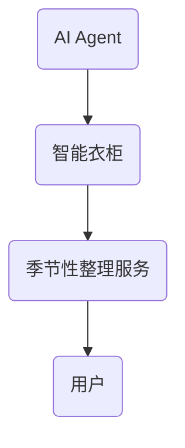
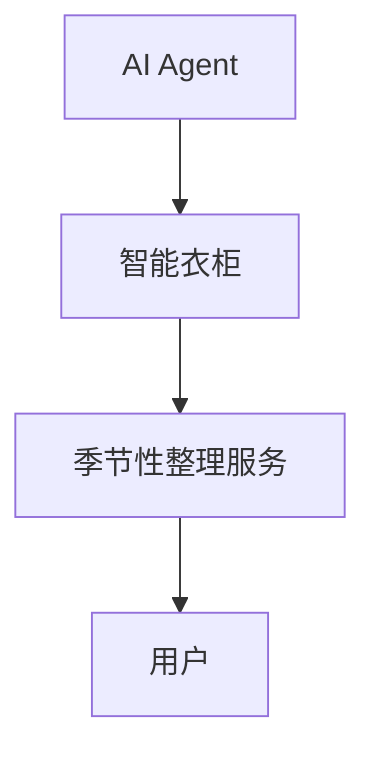
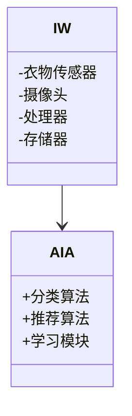
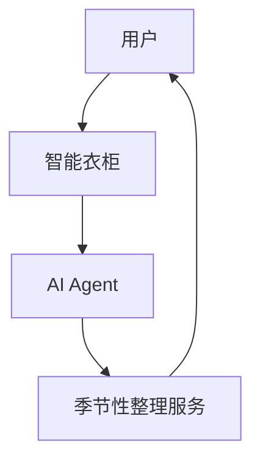

                 


```markdown
# AI Agent在智能衣柜中的季节性整理建议

> 关键词：AI Agent, 智能衣柜, 季节性整理, 衣柜管理, 人工智能

> 摘要：本文深入探讨了AI Agent在智能衣柜中的应用，特别是季节性整理的建议。通过分析用户需求和系统设计，提出了基于AI的解决方案，涵盖了算法原理、系统架构、项目实现等多个方面。

---

# 第一部分: AI Agent在智能衣柜中的背景与概念

## 第1章: AI Agent与智能衣柜的背景介绍

### 1.1 问题背景与描述

#### 1.1.1 衣柜管理的痛点分析
现代人衣柜中通常包含数百件衣物，但缺乏有效的管理方式。用户常面临以下问题：
- 衣物查找困难：难以快速找到需要的衣物。
- 衣物分类混乱：季节性衣物混杂，难以高效整理。
- 衣物利用率低：重复购买衣物，造成资源浪费。

#### 1.1.2 季节性整理的必要性
季节性整理是衣柜管理的重要环节，涉及衣物的分类、收纳和推荐。通过AI Agent的帮助，可以显著提高整理效率和准确性。

#### 1.1.3 AI Agent在衣柜管理中的应用价值
AI Agent可以通过数据分析、自动化分类和个性化推荐，为用户提供高效的衣柜管理解决方案。

### 1.2 核心概念与问题解决

#### 1.2.1 AI Agent的定义与特点
AI Agent是一种能够感知环境、自主决策并执行任务的智能实体。其特点包括：
- **自主性**：无需人工干预，自动完成任务。
- **反应性**：能实时感知环境变化并做出反应。
- **学习能力**：通过数据反馈不断优化自身算法。

#### 1.2.2 智能衣柜的定义与功能
智能衣柜是一种结合物联网技术的智能设备，具有以下功能：
- 自动识别衣物：通过传感器和图像识别技术识别衣物类型。
- 分类与整理：基于AI算法对衣物进行分类和整理。
- 个性化推荐：根据用户习惯推荐合适的衣物组合。

#### 1.2.3 季节性整理的核心问题与解决方案
季节性整理的核心问题是如何高效分类和收纳衣物。AI Agent通过以下方式解决：
- **数据采集**：采集衣物的材质、颜色、品牌等信息。
- **分类算法**：基于数据对衣物进行分类。
- **推荐系统**：根据分类结果推荐适合的衣物组合。

### 1.3 概念结构与核心要素

#### 1.3.1 AI Agent与智能衣柜的关系图


#### 1.3.2 季节性整理的逻辑流程


#### 1.3.3 核心要素对比分析
| 核心要素 | AI Agent | 智能衣柜 | 季节性整理 |
|----------|-----------|----------|------------|
| **功能** | 数据分析、决策支持 | 衣物识别、分类 | 衣物收纳、推荐 |
| **输入** | 用户需求、衣物数据 | 衣物信息 | 季节变化 |
| **输出** | 整理策略 | 整理结果 | 推荐清单 |

---

## 第2章: AI Agent的核心概念与原理

### 2.1 AI Agent的基本原理

#### 2.1.1 AI Agent的定义与分类
AI Agent可以分为以下几类：
- **基于规则的AI Agent**：通过预设规则进行决策。
- **基于机器学习的AI Agent**：利用数据训练模型进行预测。
- **基于深度学习的AI Agent**：使用神经网络进行复杂模式识别。

#### 2.1.2 AI Agent与智能衣柜的结合方式
AI Agent通过以下方式与智能衣柜结合：
- **数据交互**：AI Agent接收衣柜传感器的数据。
- **决策支持**：AI Agent根据数据生成整理策略。
- **用户反馈**：AI Agent根据用户反馈优化算法。

### 2.2 智能衣柜的系统架构

#### 2.2.1 智能衣柜的功能模块
智能衣柜的主要功能模块包括：
- **数据采集模块**：通过传感器采集衣物信息。
- **分类模块**：基于AI算法对衣物进行分类。
- **推荐模块**：根据分类结果推荐衣物组合。

#### 2.2.2 系统的硬件与软件组成


### 2.3 季节性整理的逻辑模型

#### 2.3.1 季节性整理的定义与目标
季节性整理的目标是将衣物按季节分类，提高衣物的利用率和衣柜的整洁度。

#### 2.3.2 整理逻辑的数学模型
整理逻辑可以通过以下公式表示：
$$
分类结果 = f(衣物特征, 学习参数)
$$
其中，$f$是分类算法，$衣物特征$包括材质、颜色、品牌等。

---

## 第3章: AI Agent在智能衣柜中的算法原理

### 3.1 算法原理概述

#### 3.1.1 基于规则的AI Agent
基于规则的AI Agent通过预设规则进行分类。例如：
- 规则1：如果衣物是冬季款，则归类为冬季衣物。
- 规则2：如果衣物是夏季款，则归类为夏季衣物。

#### 3.1.2 基于机器学习的AI Agent
基于机器学习的AI Agent使用分类算法（如决策树）进行分类。例如：
$$
P(类别|特征) = \frac{P(特征|类别)P(类别)}{P(特征)}
$$

#### 3.1.3 基于深度学习的AI Agent
基于深度学习的AI Agent使用神经网络进行分类。例如：
$$
y = f(x) = Wx + b
$$

### 3.2 季节性整理的算法实现

#### 3.2.1 数据预处理与特征提取
数据预处理包括归一化和标准化，特征提取包括颜色、材质等。

#### 3.2.2 分类算法的选择与实现
选择K-近邻算法（KNN）进行分类：
$$
y = \arg\max_{k} \sum_{i=1}^{k} d(x_i, x)
$$

#### 3.2.3 聚类算法的应用与优化
使用K-means算法进行聚类：
$$
\text{损失函数} = \sum_{i=1}^{n} (y_i - \text{中心点})^2
$$

### 3.3 算法流程图

#### 3.3.1 基于规则的AI Agent流程图


#### 3.3.2 基于机器学习的AI Agent流程图


#### 3.3.3 基于深度学习的AI Agent流程图


### 3.4 本章小结

---

## 第4章: 系统分析与架构设计方案

### 4.1 系统功能设计

#### 4.1.1 用户需求分析
用户需求包括：
- 衣物分类与整理
- 季节性衣物推荐
- 衣柜空间优化

#### 4.1.2 系统功能模块设计
系统功能模块包括：
- 数据采集模块
- 分类模块
- 推荐模块

#### 4.1.3 系统功能流程图


### 4.2 系统架构设计

#### 4.2.1 领域模型设计


#### 4.2.2 系统架构图


#### 4.2.3 系统接口设计
系统接口包括：
- 衣物信息接口
- 用户反馈接口
- 系统配置接口

#### 4.2.4 系统交互流程图


### 4.3 本章小结

---

## 第5章: 项目实战与实现

### 5.1 环境安装与配置

#### 5.1.1 安装Python与相关库
安装Python和以下库：
- scikit-learn
- matplotlib
- pandas

#### 5.1.2 安装智能衣柜硬件
安装智能衣柜硬件并配置传感器。

### 5.2 系统核心实现

#### 5.2.1 数据采集与预处理
```python
import pandas as pd
data = pd.read_csv('clothes.csv')
```

#### 5.2.2 分类算法实现
```python
from sklearn.neighbors import KNeighborsClassifier
model = KNeighborsClassifier()
model.fit(X_train, y_train)
```

#### 5.2.3 推荐算法实现
```python
from sklearn.cluster import KMeans
model = KMeans(n_clusters=4)
model.fit(X_train)
```

### 5.3 代码解读与分析

#### 5.3.1 数据采集模块
```python
import pandas as pd
data = pd.read_csv('clothes.csv')
```

#### 5.3.2 分类模块
```python
from sklearn.neighbors import KNeighborsClassifier
model = KNeighborsClassifier()
model.fit(X_train, y_train)
```

#### 5.3.3 推荐模块
```python
from sklearn.cluster import KMeans
model = KMeans(n_clusters=4)
model.fit(X_train)
```

### 5.4 实际案例分析与解读

#### 5.4.1 数据分析
分析用户数据，提取衣物特征。

#### 5.4.2 算法实现
实现分类和推荐算法。

#### 5.4.3 系统测试
测试系统功能，优化算法。

### 5.5 项目小结

---

## 第6章: 最佳实践、小结与拓展

### 6.1 最佳实践Tips
- 定期更新算法模型。
- 保持硬件设备的清洁与维护。

### 6.2 本章小结
总结本文的主要内容，强调AI Agent在智能衣柜中的重要性。

### 6.3 注意事项
- 注意数据隐私保护。
- 定期检查系统性能。

### 6.4 拓展阅读
推荐相关领域的书籍和论文。

---

# 作者

作者：AI天才研究院/AI Genius Institute & 禅与计算机程序设计艺术 /Zen And The Art of Computer Programming
```

