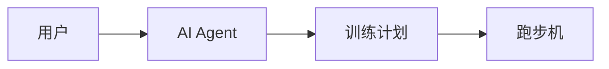
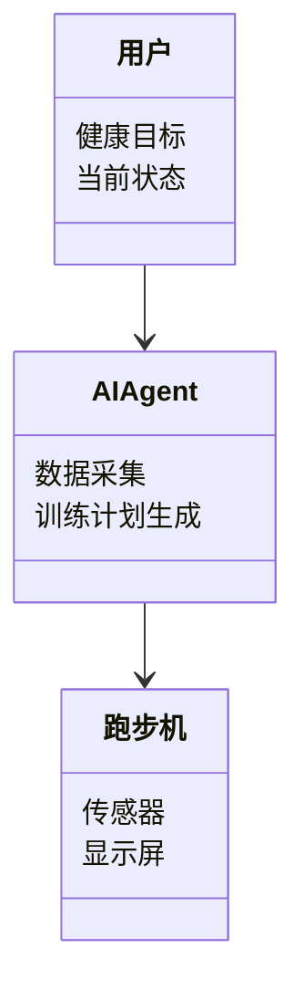
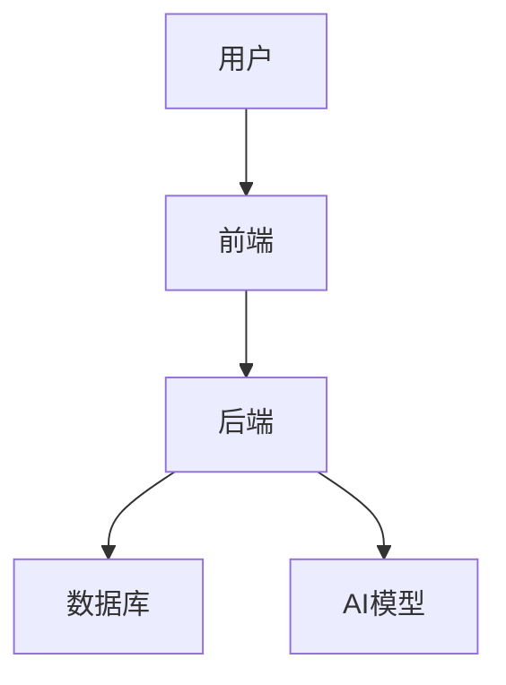
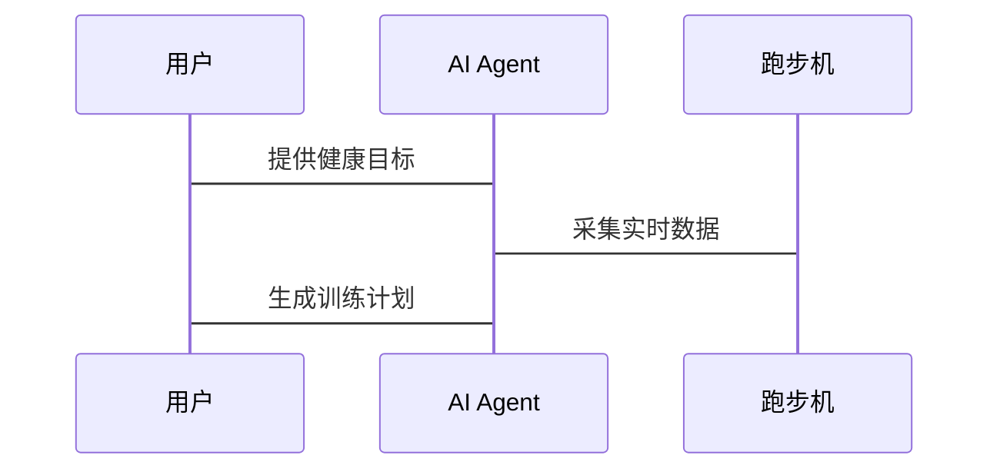

                 


# AI Agent在智能跑步机中的训练计划

## 关键词：
AI Agent, 智能跑步机, 训练计划, 机器学习, 深度学习, 强化学习, 系统架构

## 摘要：
本文探讨了AI Agent在智能跑步机中的应用，详细分析了AI Agent在训练计划生成中的核心算法和系统架构设计。通过背景介绍、核心概念、算法原理、系统分析、项目实战和总结，本文为读者提供了一套完整的解决方案，展示了如何利用AI技术优化用户的跑步训练计划。

---

# 第1章: AI Agent与智能跑步机概述

## 1.1 AI Agent的基本概念

### 1.1.1 AI Agent的定义
AI Agent（人工智能代理）是一种能够感知环境并采取行动以实现目标的智能实体。在智能跑步机中，AI Agent通过收集用户数据、分析需求并生成个性化的训练计划。

### 1.1.2 AI Agent的核心特征
1. **自主性**：AI Agent能够独立运作，无需人工干预。
2. **反应性**：能够实时感知环境变化并调整行为。
3. **目标导向**：根据预设目标（如提升体能、减肥等）制定计划。
4. **学习能力**：通过机器学习不断优化算法。

### 1.1.3 AI Agent与传统跑步机的区别
- **数据处理**：传统跑步机依赖固定程序，AI Agent可根据实时数据动态调整。
- **个性化**：传统设备缺乏个性化，AI Agent可根据用户需求定制计划。
- **反馈机制**：传统设备反馈有限，AI Agent可提供实时反馈和建议。

## 1.2 智能跑步机的背景与现状

### 1.2.1 智能健身设备的发展历程
从手动调节的传统跑步机到连接互联网的智能设备，再到集成AI技术的智能跑步机，健身设备的智能化程度不断提高。

### 1.2.2 当前智能跑步机的功能特点
1. **数据采集**：心率、步频、步长、速度等。
2. **云端同步**：将数据上传至云端，进行长期追踪。
3. **多样化训练模式**：如间歇训练、有氧训练、力量训练等。
4. **社交互动**：与好友比较成绩，增加锻炼动力。

### 1.2.3 AI技术在智能跑步机中的应用趋势
随着AI技术的进步，未来的智能跑步机将更加智能化，能够实时调整训练计划，预防运动损伤，并提供更精准的健康建议。

## 1.3 AI Agent在智能跑步机中的应用背景

### 1.3.1 用户需求分析
- **个性化需求**：不同用户有不同的健康目标和身体状况。
- **实时反馈需求**：用户希望获得即时的反馈和建议。
- **长期追踪需求**：用户希望长期追踪自己的健康状况。

### 1.3.2 市场需求分析
- **市场需求增长**：随着人们对健康生活的重视，智能健身设备的需求量激增。
- **技术驱动市场**：AI技术的成熟推动了智能跑步机的普及。

### 1.3.3 技术可行性分析
- **数据采集技术**：如心率监测、运动追踪等技术已成熟。
- **算法支持**：机器学习和深度学习技术为个性化训练计划提供了技术支持。

## 1.4 AI Agent在智能跑步机中的核心要素

### 1.4.1 数据采集与处理
AI Agent需要采集用户的心率、步频、速度等数据，并进行清洗和预处理。

### 1.4.2 算法模型设计
AI Agent需要基于用户数据，利用算法模型生成个性化的训练计划。

### 1.4.3 系统架构设计
系统架构需要支持数据采集、算法运行和用户交互等功能。

---

# 第2章: AI Agent的核心概念与联系

## 2.1 AI Agent的原理与流程

### 2.1.1 数据采集阶段
AI Agent通过传感器采集用户的数据，如心率、步频、速度等。

### 2.1.2 数据分析阶段
利用机器学习算法分析数据，识别用户的健康状况和运动习惯。

### 2.1.3 训练计划生成阶段
根据分析结果，生成个性化的训练计划，并实时调整。

## 2.2 AI Agent的核心算法与模型

### 2.2.1 机器学习算法
常用的机器学习算法包括线性回归、支持向量机（SVM）和随机森林等。

### 2.2.2 深度学习模型
深度学习模型如卷积神经网络（CNN）和循环神经网络（RNN）在处理复杂数据时表现优异。

### 2.2.3 强化学习的应用
强化学习用于优化训练计划，如动态调整训练强度和时长。

## 2.3 AI Agent与智能跑步机的实体关系



---

# 第3章: AI Agent的算法原理

## 3.1 算法流程

### 3.1.1 数据预处理
```python
# 示例代码：数据预处理
import pandas as pd
data = pd.read_csv('user_data.csv')
data.dropna()  # 删除缺失值
```

### 3.1.2 模型训练
```python
# 示例代码：模型训练
from sklearn.linear_model import LinearRegression
model = LinearRegression()
model.fit(X_train, y_train)
```

### 3.1.3 训练计划生成
```python
# 示例代码：生成训练计划
def generate_plan(user_data):
    # 基于用户数据生成计划
    plan = model.predict(user_data)
    return plan
```

## 3.2 数学模型与公式

### 3.2.1 个性化训练计划生成模型
$$ \text{计划强度} = \alpha \times \text{用户目标} + \beta \times \text{当前状态} $$

### 3.2.2 训练计划调整模型
$$ \text{调整幅度} = \gamma \times (\text{实际进度} - \text{预期进度}) $$

---

# 第4章: 系统分析与架构设计

## 4.1 系统场景介绍
用户通过智能跑步机输入个人健康目标，AI Agent根据实时数据生成训练计划。

## 4.2 系统功能设计

### 4.2.1 领域模型


### 4.2.2 系统架构


## 4.3 接口设计与交互流程

### 4.3.1 API接口
- **输入接口**：用户数据
- **输出接口**：训练计划

### 4.3.2 交互流程


---

# 第5章: 项目实战

## 5.1 环境安装

### 5.1.1 安装Python
```bash
python --version
pip install --upgrade pip
```

### 5.1.2 安装依赖库
```bash
pip install numpy pandas scikit-learn
```

## 5.2 核心代码实现

### 5.2.1 数据预处理
```python
import pandas as pd
data = pd.read_csv('user_data.csv')
data = data.dropna()
```

### 5.2.2 模型训练
```python
from sklearn.linear_model import LinearRegression
model = LinearRegression()
model.fit(X_train, y_train)
```

### 5.2.3 生成训练计划
```python
def generate_plan(user_data):
    plan = model.predict(user_data)
    return plan
```

## 5.3 代码解读与分析
- **数据预处理**：清洗数据，确保模型输入数据的质量。
- **模型训练**：使用机器学习算法训练模型，使其能够准确预测训练计划。
- **生成训练计划**：根据用户数据，利用训练好的模型生成个性化的训练计划。

## 5.4 实际案例分析
- **案例背景**：用户目标是减脂，当前体能水平较低。
- **训练计划**：初始阶段为低强度有氧运动，逐步增加强度。

---

# 第6章: 总结与展望

## 6.1 总结
本文详细介绍了AI Agent在智能跑步机中的应用，从背景、算法、系统架构到项目实战，为读者提供了全面的技术解读。

## 6.2 未来展望
随着AI技术的进一步发展，未来的智能跑步机将更加智能化，能够实时优化训练计划，并与其他健康设备联动。

---

# 作者：AI天才研究院/AI Genius Institute & 禅与计算机程序设计艺术 /Zen And The Art of Computer Programming

