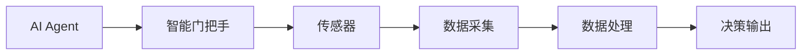
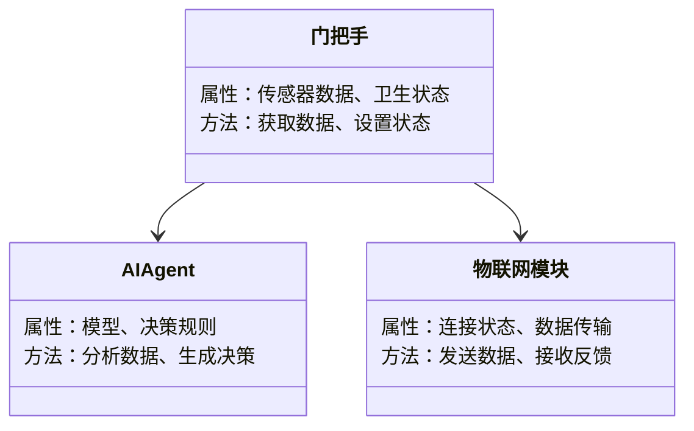
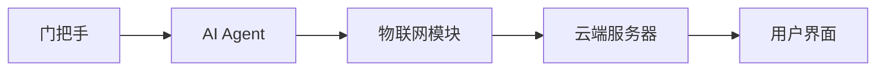

                 


# AI Agent在智能门把手中卫生状况监测

## 关键词：
AI Agent, 智能门把手, 卫生监测, 物联网, 数据分析, 传感器

## 摘要：
本文探讨AI Agent在智能门把手中卫生状况监测的应用，通过传感器数据采集、物联网技术和AI算法的结合，实现门把手卫生状况的实时监测和智能反馈，提升公共环境的卫生管理效率。

---

## 第1章: 背景介绍

### 1.1 问题背景
#### 1.1.1 当前公共卫生问题的挑战
现代社会中，公共卫生问题日益突出，尤其是在公共场所，如医院、学校和办公室，门把手是细菌和病毒传播的主要媒介。

#### 1.1.2 智能门把手在公共环境中的重要性
智能门把手不仅是门禁系统的一部分，还可以集成传感器和AI技术，实时监测环境状况。

#### 1.1.3 卫生状况监测的必要性
及时监测和清洁门把手，可以有效降低疾病传播风险，保障公共健康。

### 1.2 问题描述
#### 1.2.1 卫生状况监测的核心目标
实时监测门把手表面的细菌或病毒污染程度，评估卫生状况。

#### 1.2.2 智能门把手的卫生监测场景
在公共场所安装智能门把手，集成传感器和AI Agent，实时反馈卫生数据。

#### 1.2.3 用户需求与痛点分析
用户需求包括实时卫生数据、清洁提醒和历史数据记录；痛点是传统清洁方式效率低，难以实时监控。

### 1.3 问题解决
#### 1.3.1 AI Agent在卫生监测中的作用
AI Agent通过分析传感器数据，判断卫生状况，提供清洁建议。

#### 1.3.2 智能门把手的卫生监测解决方案
采用紫外线传感器和AI算法，实时监测和反馈卫生数据。

#### 1.3.3 技术实现的可行性分析
结合物联网和AI技术，实现智能监测和反馈，技术上是可行的。

### 1.4 边界与外延
#### 1.4.1 系统边界定义
仅监测门把手的卫生状况，不涉及其他环境参数。

#### 1.4.2 功能的外延与限制
当前仅支持细菌检测，未来可扩展到病毒检测。

#### 1.4.3 与其他系统的接口关系
与门禁系统和清洁设备集成，提供数据接口。

### 1.5 概念结构与核心要素
#### 1.5.1 系统构成要素
传感器、AI Agent、物联网模块、用户界面。

#### 1.5.2 核心概念之间的关系
传感器采集数据，AI Agent处理数据并做出决策，物联网模块传输数据。

#### 1.5.3 概念模型的可视化
通过Mermaid图展示系统构成和数据流。

---

## 第2章: 核心概念与联系

### 2.1 AI Agent的基本原理
#### 2.1.1 AI Agent的定义与特点
AI Agent是能够感知环境并采取行动的智能体，具备自主性和响应性。

#### 2.1.2 AI Agent的核心算法
基于机器学习的分类算法，如随机森林和SVM，用于数据分类。

#### 2.1.3 AI Agent与传统传感器的区别
AI Agent能自主分析数据，提供决策建议，而传统传感器仅采集数据。

### 2.2 物联网技术在智能门把手中的应用
#### 2.2.1 物联网的基本概念
物联网是通过传感器和网络连接，实现设备间的通信和数据共享。

#### 2.2.2 物联网在智能门把手中的实现
传感器采集数据，通过网络传输到云端，进行分析和反馈。

#### 2.2.3 物联网与AI Agent的结合
物联网提供数据，AI Agent进行分析和决策，两者协同工作。

### 2.3 核心概念的对比与联系
#### 2.3.1 AI Agent与物联网的对比分析
AI Agent具备智能性和自主性，物联网具备连接性和数据共享性。

#### 2.3.2 通过Mermaid图展示实体关系


---

## 第3章: 算法原理讲解

### 3.1 AI Agent的算法流程
#### 3.1.1 数据采集与预处理
传感器采集数据，进行去噪和标准化处理。

#### 3.1.2 数据分析与特征提取
使用统计方法提取特征，如平均值和方差。

#### 3.1.3 模型训练与优化
基于机器学习算法训练分类模型，优化参数以提高准确率。

#### 3.1.4 决策输出与反馈
根据模型预测结果，输出清洁建议，并反馈到系统。

### 3.2 算法实现的Python代码示例
```python
import numpy as np
from sklearn.ensemble import RandomForestClassifier

# 数据预处理
def preprocess_data(data):
    return data.dropna().astype(float)

# 特征提取
def extract_features(data):
    features = data[['temp', 'humidity', 'pressure']]
    target = data['status']
    return features, target

# 模型训练
def train_model(features, target):
    model = RandomForestClassifier()
    model.fit(features, target)
    return model

# 决策输出
def decide_clean(model, new_data):
    features, _ = extract_features(new_data)
    prediction = model.predict(features)
    return prediction[0]

# 示例数据
data = {
    'temp': [30, 28, 32, 29],
    'humidity': [60, 58, 65, 62],
    'pressure': [1010, 1005, 1015, 1012],
    'status': [1, 0, 1, 0]
}

model = train_model(*extract_features(preprocess_data(data)))
print(decide_clean(model, data))
```

### 3.3 算法原理的数学模型和公式
分类问题可以使用逻辑回归模型：
$$ P(y=1|x) = \frac{1}{1 + e^{-\beta x}} $$
其中，$\beta$是模型参数，$x$是输入特征。

---

## 第4章: 系统分析与架构设计

### 4.1 系统分析
#### 4.1.1 项目介绍
设计一个智能门把手系统，集成传感器和AI Agent，实时监测卫生状况。

### 4.2 系统功能设计
#### 4.2.1 领域模型


### 4.3 系统架构设计
#### 4.3.1 系统架构


### 4.4 接口设计
#### 4.4.1 传感器接口
与传感器通信，获取数据。

#### 4.4.2 网络接口
通过Wi-Fi或蓝牙连接到物联网模块。

### 4.5 交互设计
#### 4.5.1 用户界面
显示卫生状态和清洁建议。

#### 4.5.2 清洁设备接口
接收清洁指令，启动清洁流程。

---

## 第5章: 项目实战

### 5.1 环境安装
安装必要的库和工具，如Python、传感器库和物联网模块。

### 5.2 核心代码实现
实现数据采集、处理和AI分析的代码。

### 5.3 代码解读与分析
详细解释代码功能，展示如何实现卫生监测。

### 5.4 案例分析
分析实际案例，展示系统的实际应用效果。

### 5.5 项目小结
总结项目实现的关键点和经验教训。

---

## 第6章: 最佳实践、小结、注意事项和拓展阅读

### 6.1 最佳实践 tips
- 定期更新模型，保持高准确率。
- 确保传感器的清洁，避免干扰。

### 6.2 小结
本文详细介绍了AI Agent在智能门把手中卫生监测的应用，展示了技术实现和实际应用。

### 6.3 注意事项
- 确保数据安全和隐私保护。
- 定期维护系统，确保设备正常运行。

### 6.4 拓展阅读
建议读者进一步学习AI和物联网技术，探索更多应用场景。

---

## 作者：AI天才研究院 & 禅与计算机程序设计艺术

