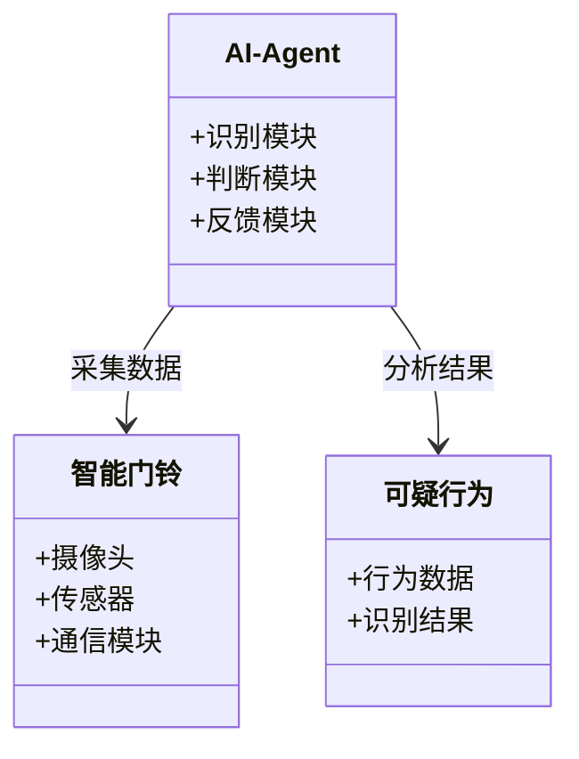

                 


# AI Agent在智能门铃中的可疑行为识别

> 关键词：AI Agent，智能门铃，可疑行为识别，目标检测，行为分析，系统架构，Python实现

> 摘要：本文详细探讨了AI Agent在智能门铃系统中的应用，重点分析了如何通过AI技术实现可疑行为的自动识别。文章从问题背景、核心概念、算法原理、系统架构到项目实战，全面阐述了AI Agent在智能门铃中的技术实现与实际应用。通过本文，读者可以系统地了解AI Agent在智能门铃中的工作原理，掌握相关算法和技术，为后续研究和实践提供参考。

---

# 目录

## 第1部分: AI Agent与智能门铃概述

### 第1章: 问题背景与目标

#### 1.1 问题背景
- 1.1.1 智能门铃的发展现状
  - 智能门铃的定义与功能
  - 当前市场主流产品分析
  - 智能门铃在家庭安全中的作用

- 1.1.2 可疑行为识别的必要性
  - 智能门铃的传统功能局限
  - 可疑行为识别的现实需求
  - AI Agent在提升安全性的关键作用

- 1.1.3 AI Agent在门铃系统中的作用
  - AI Agent的定义与特点
  - AI Agent在智能门铃中的应用场景
  - AI Agent与传统门铃系统的对比

#### 1.2 问题描述
- 1.2.1 可疑行为的定义与分类
  - 可疑行为的定义
  - 可疑行为的分类（如非法入侵、破坏行为等）
  - 可疑行为的特征分析

- 1.2.2 AI Agent在识别中的挑战
  - 数据采集的准确性问题
  - 环境干扰对识别的影响
  - 算法的实时性和准确性的平衡

- 1.2.3 系统边界与外延
  - 系统的输入与输出边界
  - 系统功能的扩展性分析
  - 系统与其他智能设备的协同工作

#### 1.3 问题解决思路
- 1.3.1 AI Agent的核心功能
  - 数据采集与处理
  - 行为分析与识别
  - 反馈与控制

- 1.3.2 系统设计的总体思路
  - 系统模块划分
  - 系统功能的实现路径
  - 系统性能的优化策略

## 第2章: 核心概念与联系

### 2.1 AI Agent的基本原理

#### 2.1.1 AI Agent的定义与特点
- AI Agent的定义
- AI Agent的核心特点（智能性、自主性、反应性等）
- AI Agent与传统算法的区别

#### 2.1.2 AI Agent的行为识别机制
- 行为识别的基本原理
- AI Agent的行为分析模型
- 行为识别的算法框架

#### 2.1.3 AI Agent与智能门铃的结合
- 智能门铃的硬件与AI Agent的结合
- AI Agent在门铃系统中的具体应用
- 系统的整体架构设计

### 2.2 智能门铃系统架构

#### 2.2.1 系统组成与功能模块
- 系统组成分析（摄像头、传感器、通信模块等）
- 各功能模块的定义与作用
- 模块之间的交互关系

#### 2.2.2 智能门铃的硬件与软件架构
- 硬件部分分析（摄像头、传感器等）
- 软件部分分析（AI算法、数据处理等）
- 硬件与软件的协同工作

#### 2.2.3 系统的交互流程
- 用户与系统的交互流程
- AI Agent与门铃硬件的交互流程
- 系统的反馈机制

### 2.3 核心概念对比表

#### 2.3.1 AI Agent与传统门铃的对比
| 对比维度 | AI Agent门铃 | 传统门铃 |
|----------|---------------|-----------|
| 功能     | 实时监控、行为识别 | 基本监控 |
| 智能性   | 高            | 低        |
| 可扩展性 | 高            | 低        |

#### 2.3.2 可疑行为识别的特征分析
| 特征维度 | 具体特征描述       |
|----------|-------------------|
| 行为类型 | 入侵、破坏等       |
| 行为特征 | 动作异常、时间异常等 |

#### 2.3.3 系统性能指标对比
| 性能指标 | AI Agent门铃 | 传统门铃 |
|----------|---------------|-----------|
| 响应时间 | 低            | 高        |
| 准确率   | 高            | 低        |

## 第3章: 系统架构与设计

### 3.1 问题场景分析

#### 3.1.1 可疑行为识别的典型场景
- 入侵检测场景
- 破坏行为识别场景
- 异常行为预警场景

#### 3.1.2 系统的使用环境与限制
- 环境干扰（如光线、噪声等）
- 系统硬件的性能限制
- 用户需求的多样性

#### 3.1.3 用户需求分析
- 用户的核心需求
- 用户的次要需求
- 用户需求的层次分析

### 3.2 系统功能设计

#### 3.2.1 领域模型类图


#### 3.2.2 系统功能模块
- 数据采集模块
- 行为分析模块
- 反馈与控制模块

### 3.3 系统架构设计

#### 3.3.1 系统架构图


#### 3.3.2 接口设计
- API接口设计
- 接口调用流程
- 接口的协议与格式

### 3.4 系统交互设计

#### 3.4.1 系统交互流程
```mermaid
sequenceDiagram
    client -> AI-Agent: 发送数据
    AI-Agent -> 智能门铃: 采集数据
    AI-Agent -> 数据库: 存储结果
    数据库 -> 反馈模块: 提供反馈
    client <- 反馈模块: 反馈结果
```

## 第4章: 项目实战与实现

### 4.1 环境安装

#### 4.1.1 系统环境要求
- 操作系统要求
- 硬件配置要求
- 软件依赖

#### 4.1.2 工具安装
- Python安装与配置
- 开发环境搭建（如Jupyter Notebook）
- 依赖库的安装（如OpenCV、TensorFlow）

### 4.2 系统核心实现

#### 4.2.1 核心代码实现
```python
import cv2
import numpy as np
import tensorflow as tf

def detect_behavior(frame):
    # 图像预处理
    # 模型推理
    # 返回识别结果
    pass

# 主函数
def main():
    # 初始化摄像头
    cap = cv2.VideoCapture(0)
    while cap.isOpened():
        ret, frame = cap.read()
        if not ret:
            break
        result = detect_behavior(frame)
        print(result)
    cap.release()

if __name__ == "__main__":
    main()
```

#### 4.2.2 代码解读与分析
- 代码的功能模块划分
- 各函数的实现细节
- 代码的可扩展性分析

### 4.3 项目实战分析

#### 4.3.1 实际案例分析
- 典型案例的输入与输出
- 算法的处理过程
- 系统的反馈机制

#### 4.3.2 系统性能分析
- 算法的准确率分析
- 系统的响应时间
- 系统的稳定性分析

## 第5章: 最佳实践与展望

### 5.1 小结

#### 5.1.1 核心内容回顾
- AI Agent在智能门铃中的应用
- 可疑行为识别的关键技术
- 系统设计与实现的要点

### 5.2 注意事项

#### 5.2.1 系统部署注意事项
- 硬件环境的选择
- 软件环境的配置
- 系统维护与更新

#### 5.2.2 算法优化建议
- 数据预处理的优化
- 算法模型的优化
- 系统性能的提升

### 5.3 拓展阅读

#### 5.3.1 相关技术领域
- 更高级的AI算法（如深度学习、强化学习）
- 多模态数据的融合分析
- 智能门铃与其他智能家居设备的协同工作

#### 5.3.2 未来研究方向
- 更高精度的行为识别算法
- 更高效的系统架构设计
- 更智能化的系统反馈机制

---

# 作者：AI天才研究院/AI Genius Institute & 禅与计算机程序设计艺术 /Zen And The Art of Computer Programming

