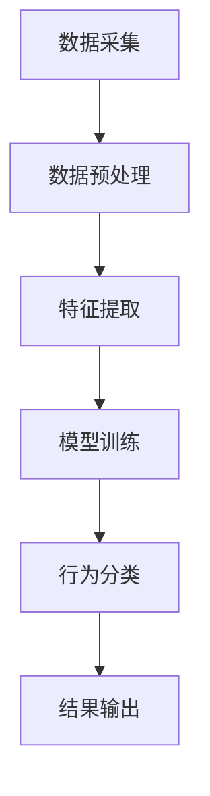
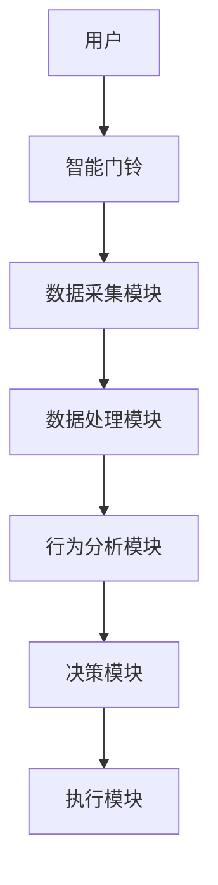

                 


# AI Agent在智能门铃中的可疑行为识别

> 关键词：AI Agent，智能门铃，可疑行为识别，算法原理，系统架构

> 摘要：本文深入探讨了AI Agent在智能门铃中的应用，特别是如何通过AI技术实现可疑行为的识别。文章从背景介绍、核心概念、算法原理、系统架构到项目实战，详细分析了AI Agent在智能门铃中的工作原理及其实现方法。通过理论分析和实践案例，展示了如何利用AI技术提升智能门铃的安全性和智能化水平。

---

## 第一部分: 背景介绍

### 第1章: 问题背景

#### 1.1 智能门铃的发展与现状
智能门铃作为一种智能家居设备，近年来得到了广泛应用。传统的门铃系统仅能提供声音提示功能，而现代智能门铃通过结合物联网（IoT）技术，能够实现视频通话、远程监控、访客识别等功能。然而，随着智能门铃功能的不断增强，其安全性也面临新的挑战。

#### 1.2 可疑行为识别的必要性
智能门铃的主要功能是监测门前的活动，并通过及时的通知帮助用户识别潜在的安全威胁。然而，现有的智能门铃系统在面对复杂的环境时，往往无法准确识别可疑行为，例如陌生人徘徊、非法入侵等。这种情况下，引入AI Agent技术可以显著提升系统的智能化水平和安全性。

#### 1.3 AI Agent在智能门铃中的应用前景
AI Agent（智能体）是一种能够感知环境、自主决策并执行任务的智能系统。通过结合AI Agent技术，智能门铃可以实现更复杂的任务，例如实时监控门前活动、识别可疑行为、主动发出警告或触发安全设备等。这种结合不仅提高了门铃的实用性，还为智能家居的安全性提供了新的解决方案。

### 第2章: 问题描述

#### 2.1 可疑行为的定义与分类
可疑行为是指在智能门铃监控区域内，任何可能威胁用户安全或财产的行为。常见的可疑行为包括：陌生人长时间逗留、非法入侵、破坏设备等。这些行为通常表现出特定的模式和特征，可以通过AI算法进行识别。

#### 2.2 智能门铃中的异常行为特征
在智能门铃系统中，可疑行为通常表现为以下特征：
- **时间异常**：如非正常时间段（深夜、凌晨）门前出现活动。
- **行为异常**：如反复按门铃、长时间徘徊、试图破坏设备等。
- **环境异常**：如异常天气条件下（暴雨、大风）门前出现可疑活动。

#### 2.3 AI Agent在行为识别中的作用
AI Agent通过实时感知环境、分析数据和自主决策，能够在智能门铃系统中实现以下功能：
- 实时监控门前活动。
- 通过机器学习算法识别可疑行为。
- 主动发出警告或触发安全设备。

### 第3章: 问题解决

#### 3.1 AI Agent的核心功能
AI Agent在智能门铃中的核心功能包括：
- 数据采集与处理：通过传感器和摄像头采集门前的环境数据。
- 行为分析：利用机器学习算法对数据进行分析，识别可疑行为。
- 自主决策：根据分析结果，决定是否发出警告或触发安全设备。

#### 3.2 可疑行为识别的实现方法
可疑行为识别的实现方法主要包括以下步骤：
1. 数据采集：通过摄像头和传感器采集门前的视频和图像数据。
2. 数据预处理：对采集的数据进行清洗和标准化处理。
3. 特征提取：从数据中提取有助于识别可疑行为的特征。
4. 模型训练：利用机器学习算法（如支持向量机、随机森林等）训练分类模型。
5. 行为分类：将实时数据输入分类模型，识别是否为可疑行为。

#### 3.3 系统设计的边界与外延
系统设计的边界包括：
- 仅关注门前的活动，不考虑其他区域的监控。
- 仅处理实时数据，不涉及历史数据分析。
- 仅提供警告功能，不与其他安全设备联动。

系统设计的外延包括：
- 扩展到其他智能家居设备，形成完整的家庭安全系统。
- 引入更多的AI技术（如深度学习、自然语言处理）提升系统的智能化水平。

#### 3.4 概念结构与核心要素
概念结构包括：
- **用户**：智能门铃的使用主体。
- **AI Agent**：智能门铃的核心功能模块。
- **可疑行为**：需要识别的目标行为。
- **数据源**：摄像头、传感器等数据采集设备。

核心要素包括：
- 数据采集：实时采集门前的环境数据。
- 数据分析：利用AI算法分析数据，识别可疑行为。
- 决策与反馈：根据分析结果，发出警告或触发安全设备。

---

## 第二部分: 核心概念与联系

### 第4章: AI Agent的定义与原理

#### 4.1 AI Agent的基本定义
AI Agent是一种能够感知环境、自主决策并执行任务的智能系统。它能够根据环境反馈调整自己的行为，以实现预设的目标。

#### 4.2 AI Agent的核心原理
AI Agent的核心原理包括：
1. **感知环境**：通过传感器和摄像头等设备感知环境信息。
2. **数据分析**：利用机器学习算法对数据进行分析和处理。
3. **自主决策**：根据分析结果，自主决定下一步行动。
4. **执行任务**：通过执行机构（如发出警告、触发安全设备）实现任务目标。

#### 4.3 AI Agent与智能门铃的结合
AI Agent与智能门铃的结合主要体现在以下几个方面：
- **实时监控**：AI Agent实时监控门前的活动。
- **智能分析**：AI Agent通过机器学习算法分析数据，识别可疑行为。
- **自主决策**：AI Agent根据分析结果，决定是否发出警告或触发安全设备。

### 第5章: 智能门铃的系统构成

#### 5.1 传感器与数据采集
智能门铃系统主要包括以下传感器：
- **摄像头**：用于采集门前的视频数据。
- **麦克风**：用于采集声音数据。
- **运动传感器**：用于检测门前的人员活动。

#### 5.2 数据传输与处理
数据传输与处理主要包括以下步骤：
1. **数据采集**：通过传感器采集数据。
2. **数据预处理**：对数据进行清洗和标准化处理。
3. **数据存储**：将数据存储在本地或云端。
4. **数据分析**：利用机器学习算法对数据进行分析。

#### 5.3 用户界面与反馈
用户界面与反馈主要包括：
- **用户界面**：用户可以通过手机APP或网页界面查看门前的实时监控画面。
- **反馈机制**：系统通过发出声音、推送通知等方式向用户反馈可疑行为。

### 第6章: 可疑行为识别的实体关系图

```mermaid
er
    actor 用户
    actor 系统管理员
    entity 智能门铃
    entity 可疑行为记录
    entity 用户反馈
    actor 用户 --> entity 智能门铃: 使用
    actor 系统管理员 --> entity 智能门铃: 管理
    entity 智能门铃 --> entity 可疑行为记录: 生成
    entity 可疑行为记录 --> entity 用户反馈: 提供
```

---

## 第三部分: 算法原理讲解

### 第7章: 算法流程与实现

#### 7.1 算法流程


#### 7.2 算法实现代码
```python
import numpy as np
from sklearn import svm

# 数据预处理
def preprocess(data):
    # 数据标准化
    return (data - np.mean(data)) / np.std(data)

# 特征提取
def extract_features(data):
    features = []
    for sample in data:
        # 提取样本特征
        feature = sample.reshape(-1, 1)
        features.append(feature)
    return np.array(features)

# 模型训练
def train_model(X_train, y_train):
    # 创建SVM分类器
    clf = svm.SVC()
    # 训练模型
    clf.fit(X_train, y_train)
    return clf

# 行为分类
def classify_behavior(model, X_test):
    # 预测结果
    y_pred = model.predict(X_test)
    return y_pred
```

#### 7.3 数学模型与公式
- **支持向量机（SVM）**是一种常用的分类算法，其核心思想是通过找到一个超平面，将数据点分成两类。数学模型如下：
  $$ y = sign(w \cdot x + b) $$
  其中，\( w \) 是权重向量，\( b \) 是偏置项，\( x \) 是输入数据，\( y \) 是输出类别。

---

## 第四部分: 系统分析与架构设计

### 第8章: 系统功能设计

#### 8.1 问题场景介绍
智能门铃系统的应用场景主要包括：
- **家庭用户**：用于监控家庭安全。
- **商业用户**：用于监控商业场所的安全。
- **公共场所**：用于监控公共区域的安全。

#### 8.2 系统功能设计
系统功能设计主要包括：
- **实时监控**：实时采集门前的视频和图像数据。
- **行为分析**：通过AI算法识别可疑行为。
- **智能决策**：根据分析结果，决定是否发出警告或触发安全设备。

#### 8.3 系统架构设计



#### 8.4 系统交互设计

```mermaid
sequenceDiagram
    actor 用户
    actor 系统管理员
    entity 智能门铃
    用户->智能门铃: 使用门铃
    智能门铃->数据采集模块: 采集数据
    数据采集模块->数据处理模块: 处理数据
    数据处理模块->行为分析模块: 分析行为
    行为分析模块->决策模块: 决策
    决策模块->执行模块: 执行
    执行模块->用户或系统管理员: 反馈结果
```

---

## 第五部分: 项目实战

### 第9章: 环境安装与核心代码实现

#### 9.1 环境安装
安装所需的库：
```bash
pip install numpy
pip install scikit-learn
pip install opencv-python
```

#### 9.2 核心代码实现
```python
import numpy as np
from sklearn import svm
import cv2

# 数据预处理
def preprocess(data):
    return (data - np.mean(data)) / np.std(data)

# 特征提取
def extract_features(data):
    features = []
    for sample in data:
        feature = cv2.cvtColor(sample, cv2.COLOR_BGR2GRAY)
        features.append(feature.reshape(-1))
    return np.array(features)

# 模型训练
def train_model(X_train, y_train):
    clf = svm.SVC()
    clf.fit(X_train, y_train)
    return clf

# 行为分类
def classify_behavior(model, X_test):
    y_pred = model.predict(X_test)
    return y_pred
```

#### 9.3 代码解读与分析
- **数据预处理**：对数据进行标准化处理，使其符合机器学习算法的要求。
- **特征提取**：将图像数据转换为灰度图像，并提取特征向量。
- **模型训练**：使用支持向量机（SVM）算法对模型进行训练。
- **行为分类**：将测试数据输入训练好的模型，进行行为分类。

#### 9.4 实际案例分析
通过实际案例分析，验证系统的可行性和有效性。例如：
- **案例一**：识别陌生人长时间逗留。
- **案例二**：识别非法入侵行为。

---

## 第六部分: 最佳实践

### 第10章: 小结与注意事项

#### 10.1 小结
本文详细介绍了AI Agent在智能门铃中的应用，重点讲解了可疑行为识别的实现方法和系统架构设计。通过理论分析和实践案例，展示了如何利用AI技术提升智能门铃的安全性和智能化水平。

#### 10.2 注意事项
- **数据隐私**：在实际应用中，需要注意数据隐私问题，确保用户数据的安全。
- **模型更新**：定期更新AI模型，以应对新的威胁和挑战。
- **系统维护**：定期维护系统，确保设备的正常运行。

### 第11章: 拓展阅读

#### 11.1 推荐书籍
- 《机器学习实战》
- 《深度学习入门：基于Python的理论与实现》

#### 11.2 相关论文
- "Real-time Anomaly Detection in Smart Doorbells Using AI Agents"
- "AI-Powered Security Systems: A Comprehensive Review"

---

## 作者信息

作者：AI天才研究院/AI Genius Institute & 禅与计算机程序设计艺术 /Zen And The Art of Computer Programming

