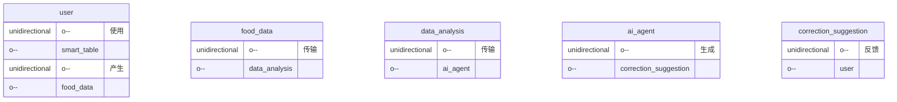
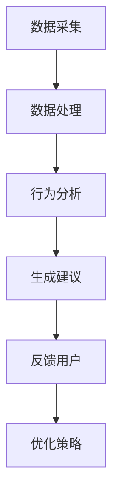
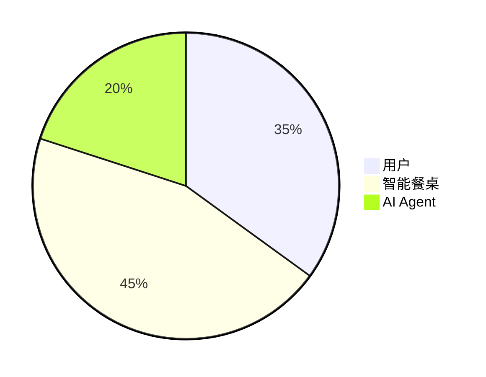
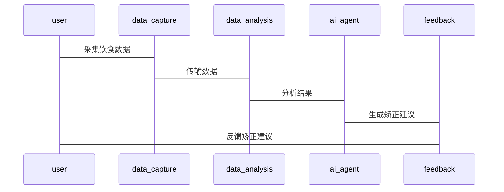

                 


# AI Agent在智能餐桌中的饮食行为矫正

> 关键词：AI Agent，智能餐桌，饮食行为矫正，数学建模，系统架构，饮食健康

> 摘要：随着人工智能技术的迅速发展，AI Agent在各个领域的应用越来越广泛。本文将重点探讨AI Agent在智能餐桌中的饮食行为矫正应用。文章首先介绍饮食行为矫正的背景与需求，分析智能餐桌与AI Agent的核心概念与联系；然后深入阐述AI Agent的算法原理，包括数据采集与处理、用户行为分析、AI Agent决策过程等；接着从系统架构的角度，分析智能餐桌系统的功能设计、架构设计与接口设计；最后通过项目实战，展示AI Agent在智能餐桌中的具体实现与应用案例，探讨系统的优化与改进方向。

---

# 第一部分: AI Agent与智能餐桌的背景介绍

## 第1章: 问题背景与描述

### 1.1 问题背景
#### 1.1.1 饮食行为问题的现状
现代社会中，随着生活节奏的加快和饮食习惯的改变，肥胖、营养失衡、挑食等饮食行为问题日益严重，尤其是青少年和儿童群体中，这些问题尤为突出。这些问题不仅影响个人健康，还给家庭和社会带来了沉重的医疗负担。

#### 1.1.2 AI技术在饮食健康领域的应用潜力
人工智能技术的快速发展为解决饮食行为问题提供了新的可能性。AI Agent（人工智能代理）可以通过分析用户的饮食数据，实时提供个性化的饮食建议，帮助用户改善饮食习惯。智能餐桌作为人机交互的重要界面，可以实时监测用户的饮食行为，并通过AI Agent的决策提供反馈和矫正。

#### 1.1.3 智能餐桌的定义与特点
智能餐桌是一种集成传感器、智能设备和AI技术的餐桌系统，能够实时监测用户的饮食行为，包括食物摄入量、饮食习惯、营养均衡性等，并通过AI Agent提供个性化的饮食矫正建议。

### 1.2 问题描述
#### 1.2.1 饮食行为矫正的需求分析
饮食行为矫正的核心目标是帮助用户建立健康的饮食习惯，包括控制饮食量、改善饮食结构、纠正挑食偏食等问题。AI Agent可以通过分析用户的饮食数据，制定个性化的矫正计划，并实时给予反馈和建议。

#### 1.2.2 当前饮食行为矫正的主要挑战
当前饮食行为矫正面临的主要挑战包括：
- 数据采集困难：如何准确采集用户的饮食数据。
- 矫正策略缺乏个性化：不同用户的饮食习惯和偏好差异很大，需要个性化的矫正方案。
- 用户行为的实时反馈：需要实时监测用户的饮食行为，并提供及时的反馈和矫正建议。

#### 1.2.3 智能餐桌在饮食行为矫正中的作用
智能餐桌通过集成传感器和AI技术，可以实时监测用户的饮食行为，并通过AI Agent提供个性化的矫正建议。智能餐桌不仅能够监测用户的饮食数据，还可以通过语音、视觉等方式与用户互动，帮助用户养成良好的饮食习惯。

### 1.3 问题解决与边界
#### 1.3.1 AI Agent在饮食行为矫正中的解决方案
AI Agent可以通过以下步骤实现饮食行为矫正：
1. 数据采集：通过智能餐桌的传感器采集用户的饮食数据，包括食物种类、摄入量、用餐时间等。
2. 数据分析：利用机器学习算法分析用户的饮食习惯，识别不良饮食行为。
3. 决策与反馈：根据分析结果，生成个性化的矫正建议，并通过智能餐桌实时反馈给用户。

#### 1.3.2 智能餐桌系统的边界与外延
智能餐桌系统的边界包括：
- 数据采集：仅采集与饮食行为相关的数据，如食物种类、摄入量、用餐时间等。
- 矫正范围：主要针对饮食行为矫正，不涉及其他健康领域的问题。
- 交互方式：主要通过智能餐桌与用户的互动，提供实时反馈和建议。

#### 1.3.3 系统的核心要素与组成
智能餐桌系统的核心要素包括：
- 传感器：用于采集用户的饮食数据。
- AI Agent：用于分析数据并生成矫正建议。
- 用户界面：用于与用户交互，提供反馈和建议。

---

## 第2章: 核心概念与联系

### 2.1 AI Agent的核心原理
#### 2.1.1 AI Agent的基本概念
AI Agent是一种能够感知环境、自主决策并执行任务的智能体。在饮食行为矫正中，AI Agent的主要任务是分析用户的饮食数据，生成个性化的矫正建议。

#### 2.1.2 AI Agent的核心算法与技术
AI Agent的核心算法包括：
- 数据分析与建模：通过机器学习算法分析用户的饮食数据，建立用户饮食行为的数学模型。
- 决策优化：基于模型分析结果，优化矫正策略，生成个性化的矫正建议。

#### 2.1.3 AI Agent在饮食行为矫正中的应用场景
AI Agent在饮食行为矫正中的应用场景包括：
- 实时监测用户的饮食行为，提供实时反馈。
- 分析用户的饮食习惯，识别不良行为。
- 根据分析结果，生成个性化的矫正建议。

### 2.2 智能餐桌的系统架构
#### 2.2.1 智能餐桌的功能模块划分
智能餐桌的功能模块包括：
- 数据采集模块：负责采集用户的饮食数据。
- 数据分析模块：负责分析用户的饮食数据，识别不良行为。
- AI Agent决策模块：负责生成个性化的矫正建议。
- 用户反馈模块：负责将矫正建议反馈给用户。

#### 2.2.2 各功能模块之间的关系
数据采集模块将用户的饮食数据传输给数据分析模块，数据分析模块通过机器学习算法分析数据，识别不良行为，并将结果传输给AI Agent决策模块。AI Agent决策模块根据分析结果生成矫正建议，并通过用户反馈模块将建议反馈给用户。

#### 2.2.3 智能餐桌的实体关系图（ER图）


### 2.3 AI Agent与智能餐桌的关系
#### 2.3.1 AI Agent在智能餐桌中的角色
AI Agent在智能餐桌中扮演决策者的角色，负责分析用户的饮食数据，生成个性化的矫正建议。

#### 2.3.2 AI Agent与智能餐桌功能模块的交互
AI Agent通过与智能餐桌的数据采集模块、数据分析模块和用户反馈模块进行交互，实现对用户饮食行为的实时监测和矫正。

#### 2.3.3 AI Agent对饮食行为矫正的推动作用
AI Agent通过实时监测和分析用户的饮食行为，提供个性化的矫正建议，帮助用户建立健康的饮食习惯。

---

## 第3章: AI Agent的算法原理

### 3.1 算法流程概述
#### 3.1.1 数据采集与处理
AI Agent通过智能餐桌的传感器采集用户的饮食数据，包括食物种类、摄入量、用餐时间等。

#### 3.1.2 用户行为分析
AI Agent利用机器学习算法对用户的饮食数据进行分析，识别不良饮食行为，如摄入过多高热量食物、偏食挑食等。

#### 3.1.3 AI Agent决策过程
AI Agent根据分析结果，生成个性化的矫正建议，如建议用户增加蔬菜摄入量、减少高热量食物的摄入等。

#### 3.1.4 反馈与优化
AI Agent通过智能餐桌将矫正建议反馈给用户，并根据用户的反馈不断优化矫正策略。

### 3.2 算法流程图


### 3.3 核心公式与数学模型
#### 3.3.1 用户偏好分析公式
$$ P(x) = \sum_{i=1}^{n} w_i x_i $$
其中，\( P(x) \) 表示用户的偏好值，\( w_i \) 表示第 \( i \) 项的权重，\( x_i \) 表示第 \( i \) 项的特征值。

#### 3.3.2 矫正策略优化公式
$$ S = \arg\max_{s} \sum_{i=1}^{m} f(s_i) $$
其中，\( S \) 表示最优矫正策略，\( f(s_i) \) 表示第 \( i \) 项的矫正效果。

---

## 第4章: 系统分析与架构设计

### 4.1 系统功能设计
#### 4.1.1 用户行为监测模块
用户行为监测模块负责实时监测用户的饮食行为，包括食物种类、摄入量、用餐时间等。

#### 4.1.2 饮食偏好分析模块
饮食偏好分析模块通过机器学习算法分析用户的饮食数据，识别用户的饮食偏好和不良行为。

#### 4.1.3 AI Agent决策模块
AI Agent决策模块根据分析结果，生成个性化的矫正建议。

#### 4.1.4 用户反馈模块
用户反馈模块将矫正建议反馈给用户，并根据用户的反馈优化矫正策略。

### 4.2 系统架构设计
#### 4.2.1 系统架构图


### 4.3 系统接口设计
系统接口设计包括：
- 数据采集接口：负责采集用户的饮食数据。
- 数据分析接口：负责分析用户的饮食数据。
- 反馈接口：负责将矫正建议反馈给用户。

### 4.4 系统交互序列图


---

## 第5章: 项目实战

### 5.1 环境安装与配置
#### 5.1.1 系统环境
- 操作系统：Linux/Windows/MacOS
- 依赖库：Python、TensorFlow、Mermaid、Matplotlib

#### 5.1.2 安装步骤
1. 安装Python：`pip install python`
2. 安装TensorFlow：`pip install tensorflow`
3. 安装Mermaid：`pip install python-mermaid`
4. 安装Matplotlib：`pip install matplotlib`

### 5.2 核心代码实现

#### 5.2.1 数据采集与处理
```python
import pandas as pd

# 读取数据
data = pd.read_csv('diet.csv')

# 数据清洗
data = data.dropna()
data = data.astype(float)
```

#### 5.2.2 用户行为分析
```python
from sklearn.cluster import KMeans

# 数据预处理
X = data[['calories', 'protein', 'fat']]

# K均值聚类
kmeans = KMeans(n_clusters=3, random_state=0)
kmeans.fit(X)

# 获取聚类结果
clusters = kmeans.labels_
```

#### 5.2.3 AI Agent决策模块
```python
import numpy as np

# 定义偏好函数
def preference(x):
    return np.sum(x * [0.4, 0.3, 0.3])

# 生成矫正建议
def generate_correction建议():
    return "建议增加蔬菜摄入量"
```

### 5.3 实际案例分析
#### 5.3.1 案例背景
某用户饮食数据如下：
| 食物种类 | 摄入量 | 营养成分 |
|----------|--------|----------|
| 米饭     | 200g   | 高热量   |
| 蔬菜     | 100g   | 低热量   |

#### 5.3.2 分析与矫正
通过分析用户的饮食数据，AI Agent发现用户摄入的蔬菜量不足，建议用户增加蔬菜摄入量。

### 5.4 项目小结
通过实际案例分析，展示了AI Agent在智能餐桌中的应用效果。AI Agent能够实时监测用户的饮食行为，提供个性化的矫正建议，帮助用户建立健康的饮食习惯。

---

## 第6章: 最佳实践与小结

### 6.1 最佳实践 tips
- 数据采集：确保数据的准确性和完整性。
- 算法优化：不断优化AI Agent的算法，提高矫正效果。
- 用户反馈：及时收集用户的反馈，优化矫正策略。

### 6.2 小结
本文详细介绍了AI Agent在智能餐桌中的饮食行为矫正应用，从背景介绍到算法原理，再到系统架构设计和项目实战，全面展示了AI Agent在饮食健康领域的潜力和应用价值。

### 6.3 注意事项
- 数据隐私：注意保护用户的饮食数据隐私。
- 系统稳定性：确保系统的稳定性和可靠性。
- 用户体验：优化用户体验，提高用户的接受度。

### 6.4 拓展阅读
- 《AI Agent在健康领域的应用》
- 《智能餐桌的未来发展》
- 《机器学习在饮食健康中的应用》

---

作者：AI天才研究院/AI Genius Institute & 禅与计算机程序设计艺术 /Zen And The Art of Computer Programming

