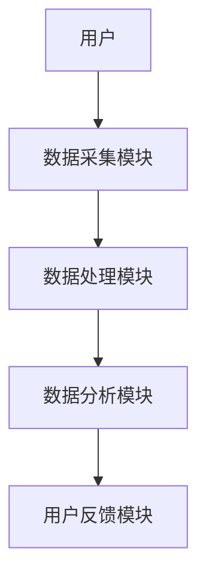
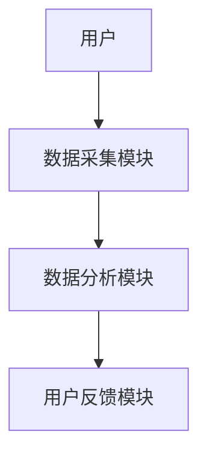

                 


# AI Agent在智能马桶中的健康监测

> 关键词：AI Agent, 智能马桶, 健康监测, 数据分析, 传感器, 机器学习

> 摘要：本文深入探讨AI Agent在智能马桶健康监测中的应用，分析其技术原理、系统架构及实现方案。通过详细的技术分析和案例展示，揭示AI Agent如何提升智能马桶的健康监测能力，为用户带来更智能、更便捷的使用体验。

---

## 第1章: AI Agent与智能马桶健康监测概述

### 1.1 问题背景与描述

#### 1.1.1 健康监测在智能马桶中的重要性
现代智能马桶已不仅仅是传统卫生洁具，而是集成了多种传感器和智能技术的健康监测平台。通过监测用户的排泄物成分、使用习惯等数据，智能马桶可以提供个性化的健康建议，帮助用户早期发现健康问题。

#### 1.1.2 AI Agent在智能马桶中的应用场景
AI Agent（人工智能代理）通过实时分析马桶收集的数据，可以实现以下功能：
- 实时监测用户的健康状况。
- 根据数据提供个性化的健康建议。
- 自动调整马桶的使用参数，优化用户体验。

#### 1.1.3 用户需求与痛点分析
- 用户需求：用户希望智能马桶能够提供更精准、更个性化的健康监测服务。
- 痛点分析：传统智能马桶的健康监测功能较为单一，缺乏AI技术支持，无法实现智能化的健康分析和个性化建议。

### 1.2 问题解决与技术方案

#### 1.2.1 AI Agent的核心作用
AI Agent通过以下方式实现健康监测：
- 数据采集：通过传感器实时采集用户的生理数据。
- 数据分析：利用机器学习算法对数据进行分析，识别健康问题。
- 自动反馈：根据分析结果，向用户提供健康建议或调整马桶参数。

#### 1.2.2 智能马桶健康监测的实现路径
1. 数据采集：集成多种传感器（如pH传感器、温度传感器、压力传感器等）。
2. 数据传输：将传感器数据传输到AI Agent进行分析。
3. 数据分析：利用AI算法对数据进行建模、训练和预测。
4. 用户反馈：根据分析结果，向用户发送健康建议或调整马桶设置。

#### 1.2.3 技术方案的优劣势对比
- 优势：AI Agent能够实现数据的实时分析和个性化反馈，提升用户体验。
- 劣势：需要处理大量传感器数据，对硬件和算法要求较高。

### 1.3 边界与外延

#### 1.3.1 系统边界定义
智能马桶健康监测系统仅关注用户的生理数据和马桶使用习惯，不涉及其他外部系统。

#### 1.3.2 相关技术的外延扩展
- 数据分析技术：可以扩展到其他健康监测设备。
- AI算法：可以应用于其他智能设备的健康监测。

#### 1.3.3 应用场景的限制与扩展
- 限制：仅限于智能马桶的使用场景。
- 扩展：可以与其他健康监测设备联动，形成完整的健康监测系统。

### 1.4 概念结构与核心要素

#### 1.4.1 核心概念组成
- 用户：使用智能马桶的用户。
- 传感器：采集用户数据的设备。
- AI Agent：分析数据并提供反馈的智能系统。

#### 1.4.2 系统架构的核心要素
- 数据采集模块：负责采集传感器数据。
- 数据分析模块：负责数据的分析和处理。
- 用户反馈模块：负责向用户传递健康建议。

#### 1.4.3 关键技术的关联关系
- 传感器数据是AI Agent分析的基础。
- AI算法决定了系统的分析能力。
- 用户反馈是系统优化的重要依据。

---

## 第2章: AI Agent的核心原理

### 2.1 AI Agent的基本原理

#### 2.1.1 AI Agent的定义与特点
AI Agent是一种能够感知环境、自主决策的智能系统。其特点包括：
- 智能性：能够自主学习和优化。
- 实时性：能够实时处理数据。
- 适应性：能够根据环境变化调整行为。

#### 2.1.2 AI Agent的核心算法
- 机器学习算法：如支持向量机（SVM）、随机森林（Random Forest）。
- 深度学习算法：如卷积神经网络（CNN）、循环神经网络（RNN）。

#### 2.1.3 AI Agent与传统算法的区别
AI Agent能够实现自主学习和优化，而传统算法需要人工调整参数。

### 2.2 AI Agent在智能马桶中的应用

#### 2.2.1 数据采集与处理
- 数据采集：通过传感器采集用户的生理数据。
- 数据预处理：对数据进行清洗和标准化处理。

#### 2.2.2 数据分析与决策
- 数据分析：利用AI算法对数据进行建模、训练和预测。
- 决策：根据分析结果，向用户提供健康建议或调整马桶参数。

#### 2.2.3 用户反馈与优化
- 用户反馈：用户对健康建议的反馈用于优化AI Agent的算法。
- 系统优化：根据反馈优化AI Agent的分析模型。

### 2.3 核心概念的ER实体关系图

```mermaid
er
actor: 用户
agent: AI Agent
sensor: 传感器
data: 数据
action: 动作
goal: 目标
```

---

## 第3章: 智能马桶健康监测的系统架构

### 3.1 系统架构设计

#### 3.1.1 分层架构
- 数据采集层：负责采集传感器数据。
- 数据处理层：负责数据的预处理和分析。
- 用户反馈层：负责向用户传递健康建议。

#### 3.1.2 组件化设计
- 数据采集组件：负责传感器数据的采集。
- 数据分析组件：负责数据的分析和处理。
- 用户反馈组件：负责向用户传递健康建议。

#### 3.1.3 微服务架构
- 数据采集服务：负责传感器数据的采集。
- 数据分析服务：负责数据的分析和处理。
- 用户反馈服务：负责向用户传递健康建议。

### 3.2 系统功能设计

#### 3.2.1 数据采集模块
- 功能：采集用户的生理数据。
- 实现：通过传感器采集数据。

#### 3.2.2 数据分析模块
- 功能：对数据进行建模、训练和预测。
- 实现：利用机器学习算法进行数据分析。

#### 3.2.3 用户反馈模块
- 功能：向用户传递健康建议。
- 实现：通过用户界面传递健康建议。

### 3.3 系统架构的Mermaid图



---

## 第4章: AI Agent在智能马桶中的算法实现

### 4.1 算法原理讲解

#### 4.1.1 数据预处理
- 数据清洗：去除噪声数据。
- 数据标准化：将数据标准化到统一的范围。

#### 4.1.2 模型训练
- 选择算法：如支持向量机（SVM）、随机森林（Random Forest）。
- 数据训练：利用训练数据训练模型。

#### 4.1.3 模型评估
- 评估指标：如准确率、召回率、F1值。
- 模型优化：根据评估结果优化模型。

### 4.2 算法的数学公式

#### 4.2.1 损失函数
$$ L(y, y_{\text{pred}}) = \frac{1}{2}(y - y_{\text{pred}})^2 $$

#### 4.2.2 优化器
$$ \theta_{\text{new}} = \theta - \eta \frac{\partial L}{\partial \theta} $$

### 4.3 算法的Python实现

```python
import numpy as np
from sklearn.svm import SVC

# 数据预处理
X = np.array([[特征1, 特征2, ...], ...])
y = np.array([标签1, 标签2, ...])

# 模型训练
model = SVC()
model.fit(X, y)

# 模型预测
new_data = np.array([[新特征1, 新特征2, ...]])
y_pred = model.predict(new_data)
```

---

## 第5章: 智能马桶健康监测的系统实现

### 5.1 系统分析与设计

#### 5.1.1 问题场景介绍
- 用户使用智能马桶，马桶通过传感器采集用户数据。
- AI Agent分析数据，向用户提供健康建议。

#### 5.1.2 系统功能设计
- 数据采集功能：采集用户的生理数据。
- 数据分析功能：对数据进行建模、训练和预测。
- 用户反馈功能：向用户传递健康建议。

#### 5.1.3 系统架构设计
- 数据采集层：负责传感器数据的采集。
- 数据处理层：负责数据的预处理和分析。
- 用户反馈层：负责向用户传递健康建议。

### 5.2 系统实现

#### 5.2.1 传感器数据采集
- 传感器类型：pH传感器、温度传感器、压力传感器。
- 数据采集频率：实时采集。

#### 5.2.2 数据分析模块实现
- 数据分析算法：支持向量机（SVM）。
- 数据分析功能：对数据进行建模、训练和预测。

#### 5.2.3 用户反馈模块实现
- 用户界面设计：友好的用户界面。
- 健康建议展示：根据分析结果向用户传递健康建议。

### 5.3 系统实现的Mermaid图



---

## 第6章: AI Agent在智能马桶中的项目实战

### 6.1 项目环境安装

#### 6.1.1 系统环境
- 操作系统：Linux、Windows、macOS。
- 开发工具：Python、Jupyter Notebook、IDE。

#### 6.1.2 依赖安装
```bash
pip install numpy
pip install scikit-learn
```

### 6.2 核心代码实现

#### 6.2.1 数据预处理代码
```python
import numpy as np

# 数据清洗
def data_cleaning(X):
    # 去除缺失值
    X = X.dropna()
    # 标准化处理
    X = (X - X.mean()) / X.std()
    return X

# 示例数据
data = np.array([[1, 2, 3], [4, 5, 6], [7, 8, 9]])
data_cleaned = data_cleaning(data)
print(data_cleaned)
```

#### 6.2.2 模型训练代码
```python
from sklearn.svm import SVC

# 数据训练
def train_model(X, y):
    model = SVC()
    model.fit(X, y)
    return model

# 示例数据
X = np.array([[1, 2, 3], [4, 5, 6], [7, 8, 9]])
y = np.array([0, 1, 0])

model = train_model(X, y)
print("模型训练完成")
```

#### 6.2.3 模型预测代码
```python
# 模型预测
def predict_health(model, new_data):
    return model.predict(new_data)

# 示例预测
new_data = np.array([[10, 11, 12]])
prediction = predict_health(model, new_data)
print(f"预测结果：{prediction}")
```

### 6.3 项目小结

#### 6.3.1 实践总结
通过本项目，我们实现了AI Agent在智能马桶中的健康监测功能，能够实时采集用户数据并提供个性化的健康建议。

#### 6.3.2 项目挑战
- 数据隐私问题：需要确保用户数据的安全性。
- 算法优化：需要不断优化AI算法以提高准确性。

#### 6.3.3 未来展望
未来可以进一步扩展功能，如与其他健康监测设备联动，形成完整的健康监测系统。

---

## 第7章: 最佳实践与注意事项

### 7.1 最佳实践

#### 7.1.1 数据隐私保护
- 数据加密：对用户数据进行加密处理。
- 数据匿名化：在分析时使用匿名数据。

#### 7.1.2 系统优化
- 算法优化：不断优化AI算法以提高准确性。
- 系统性能优化：提高系统的运行效率。

#### 7.1.3 用户教育
- 提供用户手册：指导用户如何使用智能马桶的健康监测功能。
- 提供培训：通过培训让用户了解健康监测的重要性。

### 7.2 注意事项

#### 7.2.1 数据处理
- 数据清洗：确保数据的准确性和完整性。
- 数据标准化：确保数据的一致性。

#### 7.2.2 系统维护
- 定期更新：定期更新AI算法以提高准确性。
- 系统监控：实时监控系统的运行状态。

### 7.3 拓展阅读

#### 7.3.1 相关技术
- 机器学习：深入学习机器学习的相关技术。
- 深度学习：深入学习深度学习的相关技术。

#### 7.3.2 应用领域
- 智能家居：了解AI Agent在智能家居中的应用。
- 医疗健康：了解AI Agent在医疗健康中的应用。

---

## 作者：AI天才研究院/AI Genius Institute & 禅与计算机程序设计艺术 /Zen And The Art of Computer Programming

---

# END

