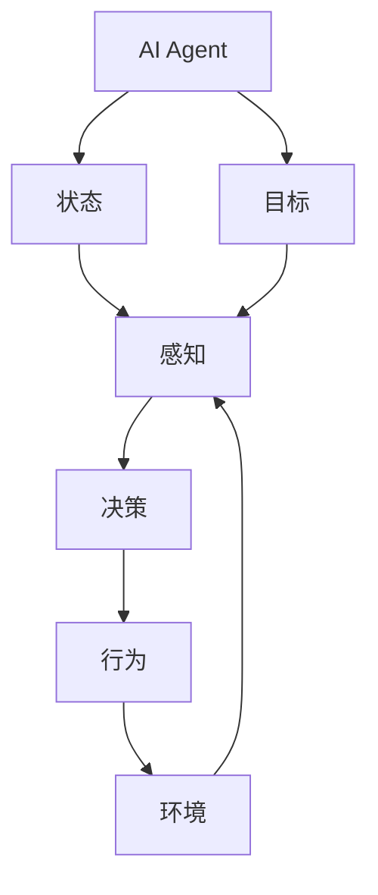
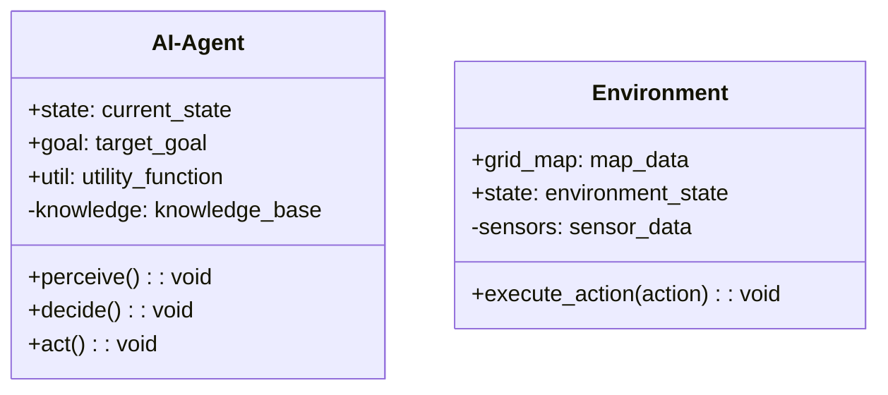
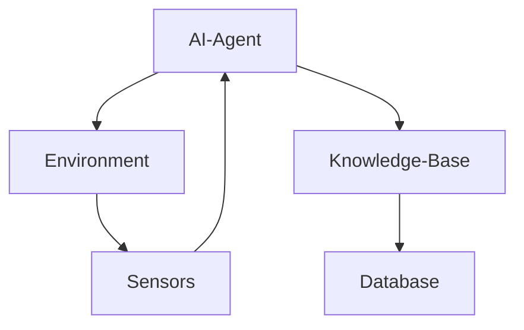

                 


# AI Agent基础概念：理解智能代理的核心

> 关键词：AI Agent, 智能代理, 人工智能, 算法原理, 系统架构

> 摘要：本文将深入探讨AI Agent的核心概念、算法原理、系统架构和应用场景，通过详细的技术分析和实际案例，帮助读者全面理解智能代理的本质与应用。

---

## 第1章: AI Agent的定义与背景

### 1.1 AI Agent的基本概念
#### 1.1.1 什么是AI Agent
AI Agent（智能代理）是指能够感知环境、自主决策并执行任务的智能系统。它通过传感器获取信息，利用推理机制进行决策，并通过执行器与环境交互。

#### 1.1.2 AI Agent的历史发展
AI Agent的概念起源于20世纪60年代的知识表示与推理研究，随着机器学习和自然语言处理的进步，AI Agent逐渐从理论走向实际应用。

#### 1.1.3 AI Agent的分类与特点
AI Agent可以分为简单反射型、基于模型的反射型、目标驱动型和效用驱动型。其特点包括自主性、反应性、目标导向和情境适应性。

### 1.2 AI Agent的应用场景
#### 1.2.1 智能助手
AI Agent广泛应用于智能助手（如Siri、Alexa），通过自然语言处理和任务执行为用户提供服务。

#### 1.2.2 自动交易系统
在金融领域，AI Agent可以自动执行交易策略，优化投资组合。

#### 1.2.3 游戏AI
在游戏开发中，AI Agent用于实现智能NPC的行为决策。

#### 1.2.4 智能推荐系统
通过用户行为分析和推荐算法，AI Agent为用户提供个性化的内容推荐。

### 1.3 AI Agent的边界与外延
#### 1.3.1 AI Agent与传统程序的区别
AI Agent具有自主性、反应性和目标导向性，而传统程序依赖外部输入和固定的执行逻辑。

#### 1.3.2 AI Agent与其他智能系统的关系
AI Agent可以与机器人、自动驾驶等智能系统协同工作，共同完成复杂任务。

#### 1.3.3 AI Agent的局限性
AI Agent依赖于数据质量和环境模型，可能面临动态环境和不确定性问题。

---

## 第2章: AI Agent的核心概念与联系

### 2.1 AI Agent的核心原理
#### 2.1.1 状态、目标与效用
AI Agent通过感知环境状态，利用目标和效用函数进行决策。

#### 2.1.2 行为与决策
AI Agent根据当前状态和目标，选择最优行为并执行。

#### 2.1.3 知识表示与推理
AI Agent通过知识表示和推理机制，理解和处理复杂问题。

### 2.2 AI Agent的核心概念对比
#### 2.2.1 概念属性对比表
| 概念     | 定义                              | 特性           |
|----------|-----------------------------------|----------------|
| 状态     | 环境的当前情况                   | 可感知、可变化 |
| 目标     | AI Agent希望达成的结果           | 明确性         |
| 行为     | AI Agent执行的动作               | 可观测性       |
| 效用     | 行为的结果价值                   | 可量化         |

#### 2.2.2 ER实体关系图
```mermaid
erd
    状态 <--( 属于 )-- AI Agent
    行为 <--( 执行 )-- AI Agent
    目标 <--( 追求 )-- AI Agent
    效用 <--( 评估 )-- AI Agent
```

### 2.3 AI Agent的核心概念图


---

## 第3章: AI Agent的算法原理

### 3.1 AI Agent的核心算法
#### 3.1.1 搜索算法
AI Agent通过广度优先搜索或深度优先搜索，找到最优路径。

#### 3.1.2 启发式算法
AI Agent利用启发函数（如A*算法）优化搜索路径。

#### 3.1.3 强化学习算法
AI Agent通过强化学习（如Q-Learning）在动态环境中自主决策。

### 3.2 AI Agent算法的数学模型
#### 3.2.1 搜索算法的数学模型
广度优先搜索的队列操作可以用数学模型描述：
$$
\text{队列} = \text{先进先出} \Rightarrow \text{状态} \rightarrow \text{访问} \rightarrow \text{扩展}
$$

#### 3.2.2 启发式算法的数学模型
A*算法的启发函数：
$$
f(n) = g(n) + h(n)
$$
其中，$g(n)$是当前路径的成本，$h(n)$是估计到目标的剩余成本。

#### 3.2.3 强化学习算法的数学模型
Q-Learning的更新公式：
$$
Q(s, a) = Q(s, a) + \alpha (r + \gamma \max Q(s', a') - Q(s, a))
$$
其中，$\alpha$是学习率，$\gamma$是折扣因子。

### 3.3 AI Agent算法的代码实现
```python
def a_star_search(start, goal, h):
    open_set = {start}
    came_from = {}
    g_score = {start: 0}
    f_score = {start: h(start, goal)}
    visited = set()

    while open_set:
        current = pop(open_set, f_score)
        visited.add(current)
        if current == goal:
            return reconstruct_path(came_from, current)
        for neighbor in neighbors(current):
            tentative_g_score = g_score[current] + cost(current, neighbor)
            if neighbor not in g_score or tentative_g_score < g_score[neighbor]:
                came_from[neighbor] = current
                g_score[neighbor] = tentative_g_score
                f_score[neighbor] = g_score[neighbor] + h(neighbor, goal)
                if neighbor not in open_set:
                    heappush(open_set, (f_score[neighbor], neighbor))
    return None
```

---

## 第4章: AI Agent的系统分析与架构设计

### 4.1 问题场景介绍
#### 4.1.1 问题背景
在一个动态的多智能体环境中，AI Agent需要实时感知环境并做出决策。

#### 4.1.2 项目目标
设计一个AI Agent，实现路径规划和任务执行。

#### 4.1.3 项目范围
在网格环境中实现A*算法，优化路径搜索效率。

### 4.2 系统功能设计
#### 4.2.1 领域模型类图


#### 4.2.2 系统架构设计


---

## 第5章: AI Agent的项目实战

### 5.1 环境安装与配置
#### 5.1.1 开发环境搭建
安装Python、NumPy、Matplotlib和Scikit-learn。

#### 5.1.2 依赖库安装
```bash
pip install numpy matplotlib scikit-learn
```

### 5.2 系统核心实现
#### 5.2.1 核心算法实现
```python
import heapq

def a_star(start, goal, grid):
    open_heap = []
    visited = set()
    heapq.heappush(open_heap, (0, start))
    g_score = {start: 0}
    f_score = {start: 0}
    
    while open_heap:
        current = heapq.heappop(open_heap)
        if current[1] == goal:
            return reconstruct_path(g_score, start, goal)
        if current[1] in visited:
            continue
        visited.add(current[1])
        for neighbor in grid[current[1]]:
            tentative_g = g_score[current[1]] + 1
            if tentative_g < g_score.get(neighbor, float('inf')):
                g_score[neighbor] = tentative_g
                f_score[neighbor] = g_score[neighbor] + heuristic(neighbor, goal)
                heapq.heappush(open_heap, (f_score[neighbor], neighbor))
    return None

def reconstruct_path(came_from, start, goal):
    current = goal
    path = [current]
    while current != start:
        current = came_from.get(current, start)
        path.append(current)
    return path[::-1]
```

### 5.3 项目小结
通过实际案例，我们深入理解了AI Agent的核心算法和系统架构设计。未来可以进一步优化算法性能，探索多智能体协作。

---

## 第6章: AI Agent的最佳实践与总结

### 6.1 最佳实践Tips
#### 6.1.1 开发规范
确保代码可读性和可维护性，遵循PEP8规范。

#### 6.1.2 测试方法
使用单元测试和集成测试，确保算法的正确性和性能。

#### 6.1.3 部署建议
使用容器化技术（如Docker）进行部署，便于管理和扩展。

### 6.2 项目小结
#### 6.2.1 项目成果
完成了AI Agent的路径规划和任务执行功能。

#### 6.2.2 经验总结
通过实际项目，我们学会了如何将理论应用于实践，并优化系统的性能和可扩展性。

#### 6.2.3 未来展望
未来可以研究更复杂的多智能体协作问题，探索强化学习在AI Agent中的应用。

### 6.3 注意事项
AI Agent的设计需要考虑动态性和不确定性，建议在实际应用中结合实时数据进行优化。

---

作者：AI天才研究院/AI Genius Institute & 禅与计算机程序设计艺术 /Zen And The Art of Computer Programming

