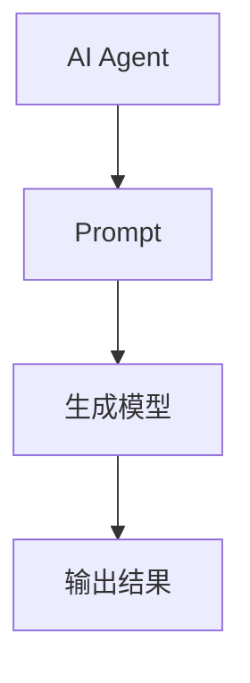
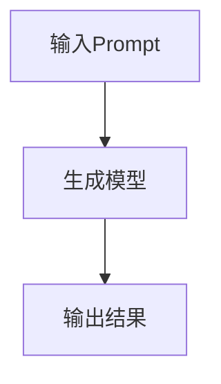
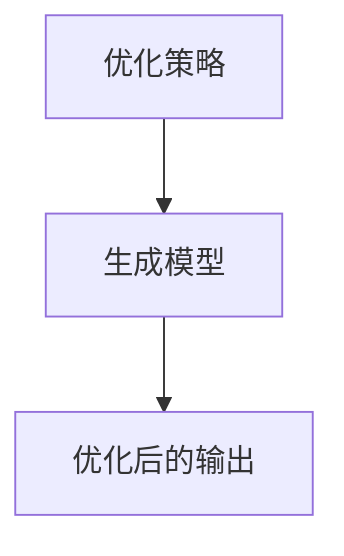
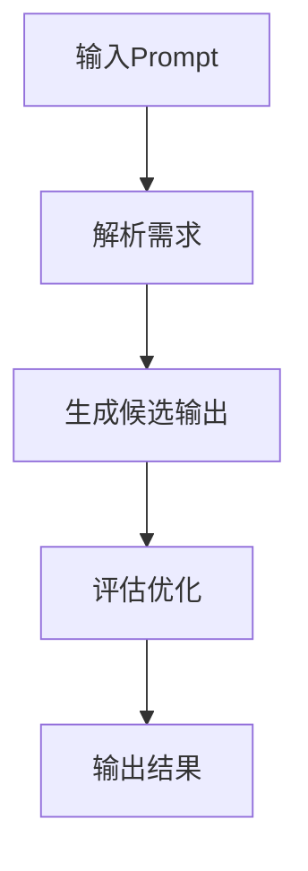
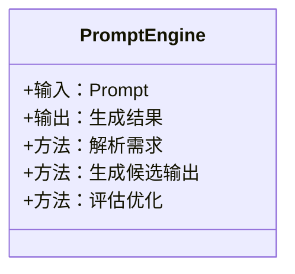
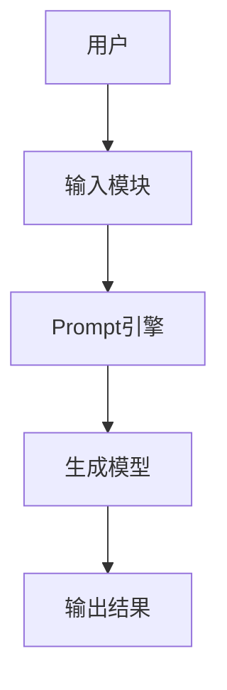
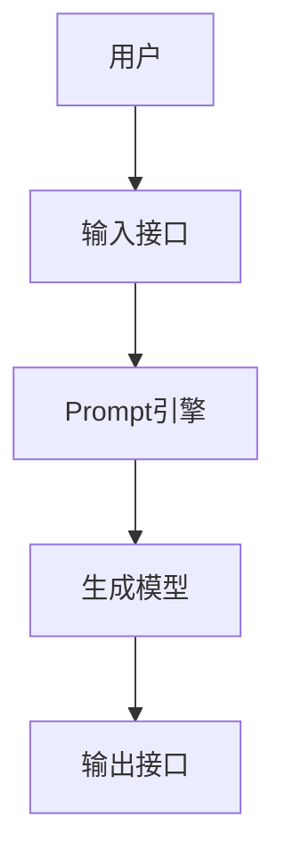

                 


# AI Agent的Prompt工程：优化输入以获得更好的输出

## 关键词：AI Agent, Prompt工程, 输入优化, 输出优化, 生成模型, 算法原理, 系统架构

## 摘要：本文系统地探讨了AI Agent的Prompt工程，从背景、核心概念、算法原理到系统架构、项目实战，全面解析了如何通过优化输入（Prompt）来提升AI Agent的输出质量。文章结合理论与实践，通过数学模型、系统架构图和实际案例，详细阐述了Prompt工程的优化方法，并给出了最佳实践和注意事项。

---

# 第1章: AI Agent与Prompt工程的背景介绍

## 1.1 问题背景

### 1.1.1 AI Agent的定义与特点
AI Agent（人工智能代理）是指能够感知环境、自主决策并执行任务的智能实体。其特点包括：
- **自主性**：无需外部干预，自主完成任务。
- **反应性**：能够实时感知环境并做出反应。
- **目标导向**：基于目标驱动行为。

### 1.1.2 Prompt工程的核心概念
Prompt工程是通过设计和优化输入（Prompt）来提升AI Agent输出质量的方法。其核心在于：
- **输入设计**：Prompt是AI Agent的输入指令，决定了模型的输出方向。
- **输出优化**：通过优化Prompt，可以引导AI生成更准确、更符合预期的结果。

### 1.1.3 问题描述与目标设定
AI Agent的输出质量往往依赖于输入的准确性。如何设计有效的Prompt，使其能够清晰传达需求，同时激发模型的创造力，是Prompt工程的核心问题。目标是通过优化Prompt，提升AI Agent的输出质量、准确性和效率。

## 1.2 问题解决与优化

### 1.2.1 Prompt工程的优化目标
- 提高生成内容的相关性和准确性。
- 降低生成结果的冗余和偏差。
- 提升生成效率，减少不必要的计算。

### 1.2.2 优化方法与策略
- **明确需求**：确保Prompt清晰表达目标。
- **细化指令**：通过具体化Prompt，引导模型生成更精确的结果。
- **动态调整**：根据生成结果反馈，实时优化Prompt。

### 1.2.3 边界与外延
- **边界**：Prompt工程主要关注输入设计，不涉及AI模型的内部机制。
- **外延**：优化Prompt可以应用于多种AI任务，如文本生成、图像生成等。

## 1.3 核心要素与结构

### 1.3.1 Prompt的组成要素
Prompt通常包括：
- **目标**：明确生成的目标。
- **上下文**：提供必要的背景信息。
- **风格**：指定生成的语气或格式。

### 1.3.2 输入输出关系的结构化分析
输入Prompt与输出的关系可以通过以下步骤分析：
1. **解析需求**：识别生成的目标。
2. **生成响应**：基于Prompt生成候选输出。
3. **评估优化**：根据生成结果反馈，调整Prompt。

### 1.3.3 核心概念的属性对比表
以下是一个对比表，展示不同Prompt策略的优缺点：

| 属性       | 明确指令型 | 创意激发型 | 细节优化型 |
|------------|------------|------------|------------|
| 优点       | 高效准确 | 创新性强 | 结果优化 |
| 缺点       | 创造性不足 | �易偏离目标 | 实施复杂 |

---

# 第2章: Prompt工程的核心概念与联系

## 2.1 核心概念原理

### 2.1.1 Prompt的语义解析
Prompt的语义解析是理解其核心内容的关键。例如：
- **明确指令型**：直接给出任务目标。
- **创意激发型**：鼓励生成创新内容。
- **细节优化型**：关注生成内容的细节。

### 2.1.2 输入与输出的映射关系
输入Prompt与输出的关系可以通过以下公式表示：
$$
\text{Output} = f(\text{Prompt})
$$
其中，\( f \) 表示生成模型的函数。

### 2.1.3 模型的上下文理解机制
AI模型需要理解Prompt的上下文，才能生成相关的内容。例如：
- **上下文理解**：模型通过上下文信息生成连贯的文本。
- **意图识别**：识别用户的意图，生成相应的回应。

## 2.2 核心概念属性对比

### 2.2.1 不同Prompt策略的对比分析
以下是三种常见Prompt策略的对比：

| 策略类型       | 示例Prompt                     | 优点                           | 缺点                           |
|----------------|--------------------------------|--------------------------------|--------------------------------|
| 明确指令型     | "生成一篇关于AI的介绍文章"      | 高效准确                     | 创造性不足                   |
| 创意激发型     | "想象一下未来的智能城市是怎样的" | 创新性强                     | 易偏离目标                   |
| 细节优化型     | "详细描述如何优化AI Agent的Prompt" | 结果优化                     | 实施复杂                   |

### 2.2.2 输入特征与输出结果的关联性分析
输入特征与输出结果之间的关联可以通过以下方式分析：
1. **特征提取**：识别Prompt中的关键特征。
2. **特征映射**：将特征映射到生成模型中。
3. **结果评估**：评估生成结果是否符合预期。

### 2.2.3 优化策略的优缺点对比
以下是优化策略的优缺点对比：

| 优化策略       | 优点                           | 缺点                           |
|----------------|--------------------------------|--------------------------------|
| 动态调整Prompt | 提高生成结果的相关性         | 实施复杂，需要实时反馈       |
| 细化指令        | 提高生成结果的准确性         | 可能导致生成内容过于局限     |
| 反馈机制        | 通过反馈优化生成结果         | 反馈收集和处理成本较高       |

## 2.3 实体关系图

### 2.3.1 Prompt工程的实体关系图
以下是Prompt工程的实体关系图：



### 2.3.2 输入输出的实体关系图
以下是输入输出的实体关系图：



### 2.3.3 优化策略的实体关系图
以下是优化策略的实体关系图：



---

# 第3章: Prompt工程的算法原理

## 3.1 算法原理讲解

### 3.1.1 Prompt到输出的转换过程

以下是Prompt到输出的转换过程的算法流程图：



### 3.1.2 Prompt的作用机制

Prompt的作用机制可以通过以下公式表示：
$$
\text{Output} = f(\text{Prompt})
$$

其中，\( f \) 表示生成模型的函数。

### 3.1.3 数学模型和公式

以下是一个简单的生成模型公式：
$$
P(\text{Output} | \text{Prompt}) = \prod_{i=1}^{n} P(y_i | y_{i-1}, \text{Prompt})
$$

---

# 第4章: 系统分析与架构设计方案

## 4.1 问题场景介绍

### 4.1.1 系统功能设计

以下是系统功能设计的领域模型图：



### 4.1.2 系统架构设计

以下是系统架构设计的架构图：



### 4.1.3 系统接口设计

以下是系统接口设计的接口图：



### 4.1.4 系统交互设计

以下是系统交互设计的交互图：

```mermaid
sequenceDiagram
用户->>+输入模块：输入Prompt
输入模块->>Prompt引擎：传递Prompt
Prompt引擎->>生成模型：生成候选输出
生成模型->>Prompt引擎：返回候选输出
Prompt引擎->>评估模块：评估优化
评估模块->>Prompt引擎：返回优化结果
Prompt引擎->>输出模块：输出结果
输出模块->>用户：返回最终结果
```

---

# 第5章: 项目实战

## 5.1 项目背景与目标

### 5.1.1 项目背景

本项目旨在通过优化Prompt，提升AI Agent的生成质量。例如，优化客服对话的Prompt，以提高客户满意度。

## 5.2 核心实现

### 5.2.1 环境安装

以下是项目所需的环境和工具：

- Python 3.8+
- PyTorch库
- Hugging Face Transformers库

### 5.2.2 核心代码实现

以下是优化Prompt的核心代码实现：

```python
from transformers import GPT2Tokenizer, GPT2ModelWithLMHead

def optimize_prompt(prompt, model, tokenizer):
    inputs = tokenizer(prompt, return_tensors="pt")
    outputs = model.generate(**inputs, max_length=50)
    return outputs

# 示例使用
model = GPT2ModelWithLMHead.from_pretrained('gpt2')
tokenizer = GPT2Tokenizer.from_pretrained('gpt2')
optimized_output = optimize_prompt("生成一段关于AI Agent的介绍", model, tokenizer)
print(tokenizer.decode(optimized_output[0], skip_special_tokens=True))
```

### 5.2.3 代码解读与分析

1. **环境安装**：安装必要的库，包括PyTorch和Hugging Face Transformers。
2. **核心代码实现**：定义优化Prompt的函数，并使用GPT-2模型生成优化的输出。
3. **代码应用**：通过示例展示如何优化Prompt，并生成高质量的内容。

## 5.3 实际案例分析

### 5.3.1 案例背景

以客服对话为例，优化Prompt以提高生成的准确性。

### 5.3.2 实施方案

通过优化Prompt，生成更符合客户需求的回复。

### 5.3.3 优化效果对比

优化前：
```
你好，欢迎咨询我们的产品。
```

优化后：
```
您好，很高兴为您介绍我们的产品。请问您对哪方面感兴趣？
```

---

# 第6章: 总结与展望

## 6.1 最佳实践 tips

- 明确需求，设计清晰的Prompt。
- 根据生成结果反馈，动态调整Prompt。
- 使用适当的工具和库优化Prompt。

## 6.2 小结

本文系统地探讨了AI Agent的Prompt工程，从背景、核心概念、算法原理到系统架构、项目实战，全面解析了如何通过优化输入（Prompt）来提升AI Agent的输出质量。通过理论与实践相结合，展示了Prompt工程在实际应用中的巨大潜力。

## 6.3 注意事项

- 避免过于复杂的Prompt设计，以免影响生成效率。
- 及时收集反馈，优化Prompt。
- 定期更新模型和工具，保持生成结果的先进性。

## 6.4 拓展阅读

- 建议深入研究生成模型的内部机制。
- 探索更多优化Prompt的方法和策略。

---

# 作者：AI天才研究院/AI Genius Institute & 禅与计算机程序设计艺术 /Zen And The Art of Computer Programming

---

**摘要**：本文系统地探讨了AI Agent的Prompt工程，从背景、核心概念、算法原理到系统架构、项目实战，全面解析了如何通过优化输入（Prompt）来提升AI Agent的输出质量。文章结合理论与实践，通过数学模型、系统架构图和实际案例，详细阐述了Prompt工程的优化方法，并给出了最佳实践和注意事项。

