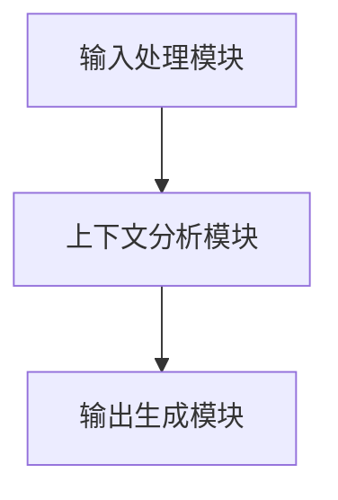
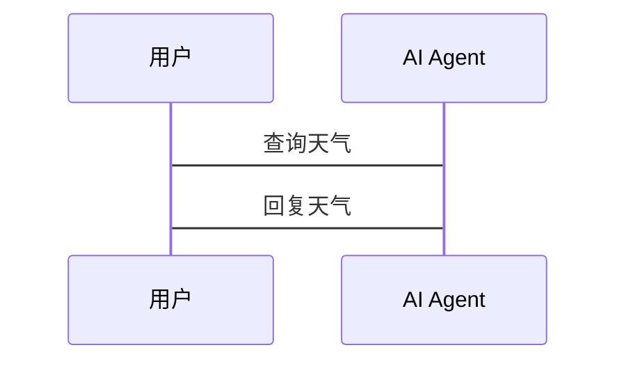

                 


# AI Agent的上下文理解：增强LLM的长期记忆

## 关键词：AI Agent，上下文理解，LLM，长期记忆，增强技术，系统架构，数学模型

## 摘要：本文深入探讨AI Agent如何通过上下文理解增强大型语言模型（LLM）的长期记忆能力。从问题背景到解决方案，从算法原理到系统架构，再到实际项目案例，全面分析上下文理解在AI Agent中的应用，为技术实践者提供理论和实践指导。

---

# 第1章: 背景介绍

## 1.1 问题背景

### 1.1.1 上下文理解的重要性
上下文理解是AI Agent实现智能交互的核心能力。通过理解和记忆上下文，AI Agent能够保持对话的连贯性，提供更智能的服务。

### 1.1.2 LLM的局限性
- **短期记忆**：LLM在处理长文本时容易遗忘先前的信息。
- **上下文断联**：在多轮对话中，LLM难以保持上下文的一致性。

### 1.1.3 AI Agent的解决方案
AI Agent通过引入外部记忆机制，帮助LLM克服短期记忆的限制。

## 1.2 问题描述

### 1.2.1 LLM的短期记忆问题
LLM在处理多轮对话时，无法有效保持和更新记忆。

### 1.2.2 上下文理解的挑战
- **信息丢失**：长对话中，关键信息容易被遗忘。
- **语境关联**：需要准确识别和关联上下文中的信息。

### 1.2.3 AI Agent的解决方案
通过引入外部记忆存储和管理机制，AI Agent能够增强LLM的上下文理解能力。

## 1.3 问题解决

### 1.3.1 增强LLM长期记忆的方法
- **外部存储**：使用数据库或缓存存储上下文信息。
- **记忆网络**：构建记忆网络来表示和关联信息。
- **混合记忆机制**：结合短期和长期记忆。

### 1.3.2 AI Agent的上下文管理机制
- **输入处理**：解析用户输入，提取上下文信息。
- **记忆存储**：将相关信息存储到外部存储中。
- **上下文关联**：根据当前输入关联历史信息。

### 1.3.3 实际应用场景分析
- **智能客服**：通过上下文理解提供更精准的服务。
- **对话机器人**：保持对话的连贯性。

## 1.4 边界与外延

### 1.4.1 AI Agent的定义与范围
AI Agent是一个能够理解上下文、执行任务的智能实体。

### 1.4.2 上下文理解的边界条件
- **信息范围**：仅处理与任务相关的上下文。
- **时间范围**：记忆的保存时间和范围。

### 1.4.3 相关技术的外延关系
- **自然语言处理**：支持上下文的理解。
- **知识图谱**：提供背景知识支持。

## 1.5 概念结构与核心要素

### 1.5.1 核心概念的组成
- **输入**：用户查询或指令。
- **上下文**：与输入相关的背景信息。
- **记忆存储**：存储上下文信息的结构。

### 1.5.2 关键要素的相互关系
- **输入与上下文**：输入触发上下文的提取。
- **上下文与记忆存储**：上下文信息存储在记忆中。

### 1.5.3 案例分析
- **案例**：用户在智能音箱中询问天气，随后询问明天的天气。AI Agent需要记住前一天的天气查询。

---

# 第2章: 核心概念与联系

## 2.1 AI Agent与LLM的关系

### 2.1.1 AI Agent的定义
AI Agent是一个能够感知环境、执行任务的智能实体。

### 2.1.2 LLM的定义
LLM是一种基于大规模数据训练的自然语言处理模型。

### 2.1.3 两者的关系与区别
- **关系**：AI Agent利用LLM进行理解和生成。
- **区别**：AI Agent具有上下文理解和记忆能力，而LLM本身不具备。

## 2.2 核心概念的属性对比

### 2.2.1 AI Agent的属性
- **智能性**：能够理解和执行任务。
- **适应性**：能够根据上下文调整行为。

### 2.2.2 LLM的属性
- **生成能力**：能够生成自然语言文本。
- **理解能力**：能够理解输入文本。

### 2.2.3 属性对比分析
| 属性       | AI Agent               | LLM                 |
|------------|------------------------|----------------------|
| **智能性**  | 高                     | 低                   |
| **记忆能力** | 强                     | 弱                   |
| **适应性**  | 高                     | 低                   |

## 2.3 ER实体关系图

### 2.3.1 实体定义
- **用户**：发起查询或指令的主体。
- **上下文**：与用户输入相关的背景信息。
- **记忆存储**：存储上下文信息的结构。

### 2.3.2 关系分析
- **用户-上下文**：用户输入触发上下文提取。
- **上下文-记忆存储**：上下文信息存储在记忆中。

### 2.3.3 图表展示
```mermaid
erDiagram
    user {
        用户
    }
    context {
        上下文
    }
    memory {
        记忆存储
    }
    user --> context : 触发
    context --> memory : 存储
```

---

# 第3章: 算法原理讲解

## 3.1 上下文理解的流程

### 3.1.1 输入处理
1. 接收用户输入。
2. 解析输入，提取关键信息。

### 3.1.2 上下文分析
1. 从记忆存储中检索相关信息。
2. 分析当前输入与历史信息的关联。

### 3.1.3 输出生成
1. 根据上下文信息生成回复。
2. 输出回复给用户。

## 3.2 记忆机制

### 3.2.1 短期记忆
- **定义**：临时存储当前对话中的信息。
- **特点**：易于访问，容量有限。

### 3.2.2 长期记忆
- **定义**：长期存储关键信息。
- **特点**：容量大，访问速度较慢。

### 3.2.3 记忆整合
- **策略**：根据上下文的相关性，选择性地整合短期和长期记忆。

## 3.3 概率计算

### 3.3.1 条件概率公式
$$ P(A|B) = \frac{P(B|A) \cdot P(A)}{P(B)} $$

### 3.3.2 贝叶斯定理
$$ P(A|B) = \frac{P(B|A) \cdot P(A)}{P(B)} $$

### 3.3.3 应用案例
- **案例**：用户在智能音箱中询问天气，AI Agent根据历史记录判断用户可能关注天气变化。

---

# 第4章: 系统分析与架构设计

## 4.1 问题场景介绍

### 4.1.1 场景描述
用户与AI Agent进行多轮对话，AI Agent需要保持上下文的一致性。

### 4.1.2 系统目标
实现AI Agent的上下文理解和记忆功能。

### 4.1.3 用户需求
- **需求1**：保持对话的连贯性。
- **需求2**：支持多轮对话中的信息关联。

## 4.2 功能设计

### 4.2.1 领域模型
- **领域**：多轮对话。
- **目标**：保持上下文一致性。

### 4.2.2 功能模块划分
1. **输入处理模块**：解析用户输入。
2. **上下文分析模块**：检索和关联历史信息。
3. **输出生成模块**：生成回复。

### 4.2.3 模块交互关系
- **输入处理** --> **上下文分析**：提取关键信息。
- **上下文分析** --> **输出生成**：生成回复。

## 4.3 系统架构设计

### 4.3.1 系统架构图


### 4.3.2 系统组件
- **输入处理模块**：解析用户输入。
- **上下文分析模块**：检索和关联历史信息。
- **输出生成模块**：生成回复。

## 4.4 接口设计

### 4.4.1 接口定义
- **输入接口**：接收用户输入。
- **输出接口**：输出生成的回复。

### 4.4.2 接口交互
- **输入处理模块**接收输入，调用**上下文分析模块**。
- **上下文分析模块**检索历史信息，调用**输出生成模块**。

## 4.5 交互流程图

### 4.5.1 交互流程


---

# 第5章: 项目实战

## 5.1 环境安装

### 5.1.1 系统要求
- **Python**：3.8+
- **依赖库**：`transformers`, `numpy`

### 5.1.2 安装步骤
```bash
pip install transformers numpy
```

## 5.2 系统核心实现源代码

### 5.2.1 输入处理模块
```python
def process_input(user_input):
    # 解析用户输入
    return parsed_context
```

### 5.2.2 上下文分析模块
```python
def analyze_context(parsed_context, memory):
    # 检索历史信息
    return related_context
```

### 5.2.3 输出生成模块
```python
def generate_output(related_context):
    # 生成回复
    return response
```

## 5.3 案例分析

### 5.3.1 应用场景
- **场景**：用户与AI Agent进行多轮对话。

### 5.3.2 实施步骤
1. **输入处理**：解析用户的输入。
2. **上下文分析**：检索和关联历史信息。
3. **输出生成**：生成回复。

## 5.4 项目小结

### 5.4.1 项目总结
通过实现上下文理解，AI Agent能够增强LLM的长期记忆能力。

### 5.4.2 经验分享
- **经验1**：合理设计记忆存储结构。
- **经验2**：优化模块之间的交互效率。

---

# 第6章: 最佳实践与总结

## 6.1 最佳实践 tips

### 6.1.1 设计建议
- **建议1**：合理设计记忆存储结构。
- **建议2**：优化模块之间的交互效率。

### 6.1.2 技术选型
- **工具**：选择合适的NLP库和框架。

## 6.2 小结

### 6.2.1 核心观点回顾
AI Agent通过上下文理解增强LLM的长期记忆能力。

### 6.2.2 实际应用意义
提升AI Agent的智能性和用户体验。

## 6.3 注意事项

### 6.3.1 实施中的常见问题
- **问题1**：上下文信息丢失。
- **问题2**：模块间通信延迟。

### 6.3.2 解决方案
- **方案1**：引入中间件优化通信。
- **方案2**：优化记忆存储结构。

## 6.4 拓展阅读

### 6.4.1 推荐书籍
- 《深度学习》
- 《自然语言处理入门》

### 6.4.2 相关论文
- "Attention Is All You Need"

---

# 作者：AI天才研究院/AI Genius Institute & 禅与计算机程序设计艺术 /Zen And The Art of Computer Programming

